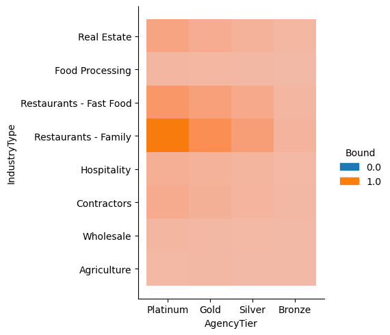

# 'Bound' Prediction Project
### by Frederic Suares

-----
## Abstract

The goal here was a thorough initial analysis of an insurance company's sample policyholders' dataset. The binary outcome variable was called 'Bound' , i.e. whether or not a policy was purchased. I cleaned the dataset and dealt with missing/redudant values, which was a relatively minor issue after looking at the data. It is a very clean dataset. 

The bulk of the analysis focused on the feature variables, which were comprised of zipcode, categorical, geographic, and numeric policy values. I was unable to obtain a zip code analysis, so the most meaningful variables that remained were categorical. The policy values were suprisingly uncorrelated with the outcome.

I completed an EDA with several interesting findings:
* When the outcome variable was Bound = 1, the data stops approximately a quarter before (04-2021) compared to when the outcome variable = 0 (07-2021) (see line graph in section 2). 

* I also noticed out of the ordinary results with regard to the Written Premium's correlation. This was analysed with dependent on AgencyTier and the Bound outcome variable. (see boxplot at end of section 2):

    * A better agency tier does not always correspond to a higher median written premium when the policy is bound. 
    
    * Also, when it comes to policies that were not bound, the written premium distribution is the same no matter the agency tier!
    
    * Both of these require further examination to determine the reasons for these patterns in the data.

I also built out a time-based variable using the original time-based features that is more helpful (meaning, has a higher correlation to the outcome variable) than the original two. My inspiration came from previous experience in real estate price prediction, where I looked at sales premium over list price, as a percentage. That ended up being predictor in the final model. Here I did something similar: I took the difference between these 'Submission Date' and 'Effective Date' features, creating an intuitive and powerful 'time until policy goes into effect' feature. See the heatmap in section 2.

With some further analysis and problem specific feedback/knowledge, I will build out a full predictive pipeline that could be used for finding new clients that are most likely to purchase a policy after being quoted.

-----

### Table of Contents
1. [Essentials](#1)
2. [Feature Cleaning](#2)
3. [Zip Code analysis](#3)
4. [Categorical analysis](#4)
5. [Geographical analysis](#5)
6. [Modeling & next steps](#6)


```python
import sqlite3 
import numpy as py
import pandas as pd
import matplotlib.pyplot as plt
import seaborn as sns
import matplotlib as mpl
%matplotlib inline
mpl.rcParams.update(mpl.rcParamsDefault)
```


```python
# create a connection
con = sqlite3.connect("/home/frederic/insuranceProject/FredericS2021.github.io/insurance_ds_20211025.db")
```


```python
cur = con.cursor()
```


```python
# read data from SQL to pd.df
dates = pd.read_sql('Select * from dates', con);
primary = pd.read_sql('SELECT * FROM "primary"', con);
status = pd.read_sql('Select * from status', con);
```


```python
#join via uid with SQL to save memory
policies = pd.read_sql('SELECT * from dates LEFT OUTER JOIN "primary" using (uid)\
                        LEFT OUTER JOIN "status" using (uid)', con)
```


```python
policies.head()
```


<div>
<style scoped>
    .dataframe tbody tr th:only-of-type {
        vertical-align: middle;
    }

    .dataframe tbody tr th {
        vertical-align: top;
    }

    .dataframe thead th {
        text-align: right;
    }
</style>
<table border="1" class="dataframe">
  <thead>
    <tr style="text-align: right;">
      <th></th>
      <th>uid</th>
      <th>SubmissionDate</th>
      <th>EffectiveDate</th>
      <th>AccountNumber</th>
      <th>AgencyZipCode</th>
      <th>InsuredZipCode</th>
      <th>AgencyCity</th>
      <th>AgencyState</th>
      <th>InsuredyCity</th>
      <th>InsuredState</th>
      <th>AgencyTier</th>
      <th>IndustryType</th>
      <th>WrittenPremium</th>
      <th>Quoted</th>
      <th>Bound</th>
    </tr>
  </thead>
  <tbody>
    <tr>
      <th>0</th>
      <td>1</td>
      <td>2020-02-09</td>
      <td>2020-04-10</td>
      <td>498635-330</td>
      <td>28367</td>
      <td>99630</td>
      <td>Norman</td>
      <td>NC</td>
      <td>Mekoryuk</td>
      <td>AK</td>
      <td>Platinum</td>
      <td>Real Estate</td>
      <td>5056.0</td>
      <td>1.0</td>
      <td>0.0</td>
    </tr>
    <tr>
      <th>1</th>
      <td>2</td>
      <td>2020-09-10</td>
      <td>2021-03-04</td>
      <td>169285-143</td>
      <td>71235</td>
      <td>48864</td>
      <td>Dubach</td>
      <td>LA</td>
      <td>Okemos</td>
      <td>MI</td>
      <td>Gold</td>
      <td>Real Estate</td>
      <td>16549.0</td>
      <td>0.0</td>
      <td>0.0</td>
    </tr>
    <tr>
      <th>2</th>
      <td>3</td>
      <td>2020-06-16</td>
      <td>2020-09-15</td>
      <td>215075-889</td>
      <td>78358</td>
      <td>92868</td>
      <td>Fulton</td>
      <td>TX</td>
      <td>Orange</td>
      <td>CA</td>
      <td>Bronze</td>
      <td>None</td>
      <td>3566.0</td>
      <td>0.0</td>
      <td>0.0</td>
    </tr>
    <tr>
      <th>3</th>
      <td>4</td>
      <td>2020-03-16</td>
      <td>2020-09-10</td>
      <td>207085-143</td>
      <td>65084</td>
      <td>26452</td>
      <td>Versailles</td>
      <td>MO</td>
      <td>Weston</td>
      <td>WV</td>
      <td>Platinum</td>
      <td>Real Estate</td>
      <td>3431.0</td>
      <td>0.0</td>
      <td>0.0</td>
    </tr>
    <tr>
      <th>4</th>
      <td>5</td>
      <td>2020-02-13</td>
      <td>2020-05-04</td>
      <td>391712-274</td>
      <td>44721</td>
      <td>80820</td>
      <td>Canton</td>
      <td>OH</td>
      <td>Guffey</td>
      <td>CO</td>
      <td>Gold</td>
      <td>Food Processing</td>
      <td>11942.0</td>
      <td>1.0</td>
      <td>0.0</td>
    </tr>
  </tbody>
</table>
</div>


```python
policies = policies.drop(['uid'],axis=1)
```


```python
policies.describe()
```


<div>
<style scoped>
    .dataframe tbody tr th:only-of-type {
        vertical-align: middle;
    }

    .dataframe tbody tr th {
        vertical-align: top;
    }

    .dataframe thead th {
        text-align: right;
    }
</style>
<table border="1" class="dataframe">
  <thead>
    <tr style="text-align: right;">
      <th></th>
      <th>WrittenPremium</th>
      <th>Quoted</th>
      <th>Bound</th>
    </tr>
  </thead>
  <tbody>
    <tr>
      <th>count</th>
      <td>14892.000000</td>
      <td>15073.000000</td>
      <td>15073.000000</td>
    </tr>
    <tr>
      <th>mean</th>
      <td>11975.768869</td>
      <td>0.550056</td>
      <td>0.140981</td>
    </tr>
    <tr>
      <th>std</th>
      <td>7889.323407</td>
      <td>0.497505</td>
      <td>0.348013</td>
    </tr>
    <tr>
      <th>min</th>
      <td>1121.000000</td>
      <td>0.000000</td>
      <td>0.000000</td>
    </tr>
    <tr>
      <th>25%</th>
      <td>4715.500000</td>
      <td>0.000000</td>
      <td>0.000000</td>
    </tr>
    <tr>
      <th>50%</th>
      <td>11762.000000</td>
      <td>1.000000</td>
      <td>0.000000</td>
    </tr>
    <tr>
      <th>75%</th>
      <td>18407.250000</td>
      <td>1.000000</td>
      <td>0.000000</td>
    </tr>
    <tr>
      <th>max</th>
      <td>52258.000000</td>
      <td>1.000000</td>
      <td>1.000000</td>
    </tr>
  </tbody>
</table>
</div>


```python
policies.dtypes
```


    SubmissionDate     object
    EffectiveDate      object
    AccountNumber      object
    AgencyZipCode      object
    InsuredZipCode     object
    AgencyCity         object
    AgencyState        object
    InsuredyCity       object
    InsuredState       object
    AgencyTier         object
    IndustryType       object
    WrittenPremium    float64
    Quoted            float64
    Bound             float64
    dtype: object


Let's make the date features DateTime variables right now.


```python
# Convert date columns to YYYY-MM
policies['EffectiveDate'] = pd.to_datetime(policies['EffectiveDate'], format = "%Y/%m/%d")#.dt.to_period('m')
policies['SubmissionDate'] = pd.to_datetime(policies['SubmissionDate'], format = "%Y/%m/%d")#.dt.to_period('m')
```

<a class="anchor" id="1"></a>
# 1. Essentials 
Let's start with missing/incorrect values of features


```python
nulls = policies.isnull().sum()

#show features with non-zero amount of missing values only
nulls[nulls!=0]
```


    AgencyZipCode     272
    InsuredZipCode    196
    AgencyTier         76
    IndustryType      121
    WrittenPremium    181
    dtype: int64


```python
#Now as a %
nulls_percent = nulls[nulls!=0]/policies.shape[0]*100
print('The % of null values per feature:\n')
print(round(nulls_percent,2))
```

    The % of null values per feature:
    
    AgencyZipCode     1.8
    InsuredZipCode    1.3
    AgencyTier        0.5
    IndustryType      0.8
    WrittenPremium    1.2
    dtype: float64


```python
#let's look at Quoted/Bound
print(py.array([policies['Bound'] - policies['Quoted'] == 1]).sum())
policies[policies['Bound'] - policies['Quoted'] == 1].iloc[:]

```

    8


<div>
<style scoped>
    .dataframe tbody tr th:only-of-type {
        vertical-align: middle;
    }

    .dataframe tbody tr th {
        vertical-align: top;
    }

    .dataframe thead th {
        text-align: right;
    }
</style>
<table border="1" class="dataframe">
  <thead>
    <tr style="text-align: right;">
      <th></th>
      <th>SubmissionDate</th>
      <th>EffectiveDate</th>
      <th>AccountNumber</th>
      <th>AgencyZipCode</th>
      <th>InsuredZipCode</th>
      <th>AgencyCity</th>
      <th>AgencyState</th>
      <th>InsuredyCity</th>
      <th>InsuredState</th>
      <th>AgencyTier</th>
      <th>IndustryType</th>
      <th>WrittenPremium</th>
      <th>Quoted</th>
      <th>Bound</th>
    </tr>
  </thead>
  <tbody>
    <tr>
      <th>1411</th>
      <td>2020-06-26</td>
      <td>2020-10-03</td>
      <td>442262-382</td>
      <td>82935</td>
      <td>12811</td>
      <td>Green River</td>
      <td>WY</td>
      <td>Bakers Mills</td>
      <td>NY</td>
      <td>Gold</td>
      <td>Real Estate</td>
      <td>25931.0</td>
      <td>0.0</td>
      <td>1.0</td>
    </tr>
    <tr>
      <th>6506</th>
      <td>2020-12-09</td>
      <td>2021-01-04</td>
      <td>320109-274</td>
      <td>97528</td>
      <td>72930</td>
      <td>Grants Pass</td>
      <td>OR</td>
      <td>Cecil</td>
      <td>AR</td>
      <td>Platinum</td>
      <td>Real Estate</td>
      <td>5741.0</td>
      <td>0.0</td>
      <td>1.0</td>
    </tr>
    <tr>
      <th>7019</th>
      <td>2020-03-27</td>
      <td>2020-05-19</td>
      <td>245494-324</td>
      <td>94542</td>
      <td>63766</td>
      <td>Hayward</td>
      <td>CA</td>
      <td>Millersville</td>
      <td>MO</td>
      <td>Silver</td>
      <td>Restaurants - Fast Food</td>
      <td>3669.0</td>
      <td>0.0</td>
      <td>1.0</td>
    </tr>
    <tr>
      <th>8624</th>
      <td>2020-12-12</td>
      <td>2021-01-05</td>
      <td>109749-143</td>
      <td>61744</td>
      <td>93429</td>
      <td>Gridley</td>
      <td>IL</td>
      <td>Casmalia</td>
      <td>CA</td>
      <td>Gold</td>
      <td>Wholesale</td>
      <td>3885.0</td>
      <td>0.0</td>
      <td>1.0</td>
    </tr>
    <tr>
      <th>10088</th>
      <td>2020-05-20</td>
      <td>2020-07-06</td>
      <td>432893-502</td>
      <td>46035</td>
      <td>52660</td>
      <td>Colfax</td>
      <td>IN</td>
      <td>Yarmouth</td>
      <td>IA</td>
      <td>Platinum</td>
      <td>Hospitality</td>
      <td>26049.0</td>
      <td>0.0</td>
      <td>1.0</td>
    </tr>
    <tr>
      <th>13454</th>
      <td>2020-07-29</td>
      <td>2020-09-15</td>
      <td>253138-592</td>
      <td>53942</td>
      <td>16627</td>
      <td>Lime Ridge</td>
      <td>WI</td>
      <td>Coalport</td>
      <td>PA</td>
      <td>Gold</td>
      <td>Hospitality</td>
      <td>2297.0</td>
      <td>0.0</td>
      <td>1.0</td>
    </tr>
    <tr>
      <th>14714</th>
      <td>2020-07-13</td>
      <td>2020-08-20</td>
      <td>343972-274</td>
      <td>61068</td>
      <td>10607</td>
      <td>Rochelle</td>
      <td>IL</td>
      <td>White Plains</td>
      <td>NY</td>
      <td>Gold</td>
      <td>Hospitality</td>
      <td>1693.0</td>
      <td>0.0</td>
      <td>1.0</td>
    </tr>
    <tr>
      <th>14982</th>
      <td>2020-12-15</td>
      <td>2021-01-29</td>
      <td>154411-850</td>
      <td>13659</td>
      <td>53536</td>
      <td>Lorraine</td>
      <td>NY</td>
      <td>Evansville</td>
      <td>WI</td>
      <td>Platinum</td>
      <td>Real Estate</td>
      <td>5055.0</td>
      <td>0.0</td>
      <td>1.0</td>
    </tr>
  </tbody>
</table>
</div>


Some observations: 
- A fairly small amount of missing features. 
- 'Bound' output variable is not missing any values, great!
- ~14.1% of policies in the dataset are bound. This is not too imbalanced
- Only 8 of 15000+ policies were entered incorrectly for Quoted vs. Bound. I don't see any pattern in the features among these 8 that would explain this error.

<a class="anchor" id="2"></a>
## 2. Feature cleaning


```python
uniques = policies.nunique()
print(uniques)
```

    SubmissionDate      366
    EffectiveDate       566
    AccountNumber     15036
    AgencyZipCode     11776
    InsuredZipCode    11945
    AgencyCity         7141
    AgencyState          44
    InsuredyCity       7182
    InsuredState         44
    AgencyTier            4
    IndustryType          8
    WrittenPremium    10280
    Quoted                2
    Bound                 2
    dtype: int64


Where we're headed:

- I'll drop the AccountNumber and city variables.

- I'd like to build one more variable based on time.

- Fixing sparsity in geographic variables


```python
policies = policies.drop(['AgencyCity', 'InsuredyCity', 'AccountNumber'],axis=1)
```


```python
#checking back to see what happened...
policies.nunique()
```


    SubmissionDate      366
    EffectiveDate       566
    AgencyZipCode     11776
    InsuredZipCode    11945
    AgencyState          44
    InsuredState         44
    AgencyTier            4
    IndustryType          8
    WrittenPremium    10280
    Quoted                2
    Bound                 2
    dtype: int64


Next, let's build that time to policy effective date variable.

The idea for this variable came from a past real estate project of mine.


```python
policies['Time_To_Effective_Date'] = policies['EffectiveDate'] - policies['SubmissionDate']
policies['Time_To_Effective_Date'].describe()
```


    count                         15073
    mean     84 days 06:54:20.134014463
    std      55 days 18:32:37.340829886
    min                 1 days 00:00:00
    25%                36 days 00:00:00
    50%                77 days 00:00:00
    75%               131 days 00:00:00
    max               280 days 00:00:00
    Name: Time_To_Effective_Date, dtype: object


I don't see any negative values, great!


```python
policies['Time_To_Effective_Date'].nunique()
```


    226


Let's look at the distribution of dates with a simple histogram:


```python
policies['Time_To_Effective_Date_numeric'] = policies['Time_To_Effective_Date'].astype(int)
policies['Time_To_Effective_Date_numeric'].describe()
```


    count    1.507300e+04
    mean     7.282460e+15
    std      4.818757e+15
    min      8.640000e+13
    25%      3.110400e+15
    50%      6.652800e+15
    75%      1.131840e+16
    max      2.419200e+16
    Name: Time_To_Effective_Date_numeric, dtype: float64


```python
sns.displot(
  data=policies,
  x="Time_To_Effective_Date_numeric",
  col="Bound",
  kind="hist",
  #hue="Bound",
  #kde="true",
  aspect=1.4,
  log_scale=10,
  bins=20
)
plt.show()
```


Similar (bound vs. not bound) distributions with left-tail skew; this makes sense.


```python
# Time to effective date by bound over time
sns.relplot(
    data=policies, 
    x="EffectiveDate", 
    y="Time_To_Effective_Date_numeric",
    col="Bound", 
    kind="line",
    aspect=1.5,
)
plt.show()
```


Similar but different. 
- Not bound means time to effective date was consistently increasing (minus covid months?)
- Bound increased at first but was mostly steady until recently
- More recent behavior is difficult to know (i.e. why Bound = 0 data goes to present time but Bound = 1 stops at May 2021)


```python
# Create numeric values for date variables for heatmap & showing my new variable gives a better signal
policies['SubmissionDateNumeric'] = policies['SubmissionDate'].astype(int)
policies['EffectiveDateNumeric'] = policies['EffectiveDate'].astype(int)
# ZipCode to numeric isn't correlated in heatmap below
#policies['AgencyZipCode'] = policies['AgencyZipCode'].astype(int)
```


```python
sns.heatmap(policies.corr(),cmap='RdBu',center=0)
plt.show()
```


```python
policies = policies.drop(['SubmissionDateNumeric', 'EffectiveDateNumeric'],axis=1)
```

- My new variable has fewer categories (226 vs. 366 or 566) and is more strongly correlated to the 'Bound' outcome variable than either SubmissionDate or EffectiveDate were. 

- The writtenPremium variable doesn't seem to be correlated with the Bound variable interestingly. 

- Quoted has the highest correlation with output variable (bound). This isn't helpful though. 

Next, let's learn more about the AgencyTiers


```python
sns.catplot(x="AgencyTier", 
            #y="WrittenPremium", 
            hue="Bound", 
            aspect=.7, 
            kind="count",
            order=["None", "Bronze", "Silver", "Gold", "Platinum"],
            data=policies)
plt.show()
```


The # of bound policies increases by Tier while unbound policies do not. 

What about the overall distribution of policies by WrittenPremium?


```python
sns.displot(
  data=policies,
  x="WrittenPremium",
  col="Bound",
  kind="hist",
  hue="Bound",
  kde="true",
  aspect=1.4,
  log_scale=10,
  #bins=20
)
plt.show()
```


WrittenPremium is very differently distributed in tail, skew, uniformity, and mode(s) based on bound. 

I also tried small, per-Agency Tier plots and the distribution for the written premium was the same. I.e. the tiering does not affect how the premiums are distributed (!) 

We can get a better idea for this with boxplots...


```python
g = sns.catplot(x="WrittenPremium", 
                y="Bound", 
                row="AgencyTier",
                kind="box", 
                orient="h", 
                height=1.5, 
                aspect=4, 
                #order=["Bronze", "Silver", "Gold", "Platinum"],
                data=policies)
g.set(xscale="log")
plt.show()
```


When we break up WrittenPremium by category, we see the effect in AgencyTier only when the Bound = 1!

Also interesting to note and worth more investigation: silver has the highest median bound writtenPremium!

<a class="anchor" id="3"></a>
### 3. Zip Code analysis
I tried aggregating zipcodes on 4 and 3 digits to make them more dense, but settled on 1-hot encoding in the end; it's a different technique that keeps all the data intact, and the heatmaps didn't show correlation between aggregated zipcodes and the bound variable anyways.


```python
AgencyZipCode1 = []

for i in policies['AgencyZipCode']:
    #print(i[:4])
    if i != None:
        AgencyZipCode1.append(i[:4])
    else:
        AgencyZipCode1.append("")
        
policies['AgencyZipCode1'] = AgencyZipCode1

#print(policies['AgencyZipCode1'].head())
policies['AgencyZipCode1'].describe()
```


    count     15073
    unique     5107
    top            
    freq        272
    Name: AgencyZipCode1, dtype: object


policies['AgencyZipCode1'] = policies['AgencyZipCode1'].astype(int)
sns.heatmap(policies.corr(),cmap='RdBu',center=0)

```python
policies.drop(['AgencyZipCode1'], axis=1, inplace=True)
```


```python
AgencyZipCode1 = []

for i in policies['AgencyZipCode']:
    #print(i[:4])
    if i != None:
        AgencyZipCode1.append(i[:3])
    else:
        AgencyZipCode1.append("")
        
policies['AgencyZipCode1'] = AgencyZipCode1

#print(policies['AgencyZipCode1'].head())
policies['AgencyZipCode1'].describe()
```


    count     15073
    unique      820
    top            
    freq        272
    Name: AgencyZipCode1, dtype: object


policies['AgencyZipCode1'] = policies['AgencyZipCode1'].astype(int)
sns.heatmap(policies.corr(),cmap='RdBu',center=0)

```python
policies.drop(['AgencyZipCode1'], axis=1, inplace=True)
```

Using 4 digits of an area code seems pretty sparse, using 3 might work, but is going to cost us some granularity. The heatmaps don't seem to show any difference using 3, 4 or 5 digits of a zipcode; odd. Let's try encoding...

Because I know NaN are < 2% of the dataset, I'm going to drop them. A simple alternative would be SimpleEncoder or replacing missing zipcodes with 0.


```python
policies.dropna(inplace=True)#,subset=['InsuredZipCode']
```

In the end, I chose to first try to one-hot encode zipcodes, rather than aggregate by 3 or 4 digits. 2 reasons for this:

1. Loss of granularity if aggregating
2. Lack of correlation with Bound anyways


```python
from sklearn import preprocessing
enc = preprocessing.OneHotEncoder()
policies_OH_cols = enc.fit_transform(policies[['AgencyState', 'InsuredState', 'IndustryType', 'AgencyZipCode', 'InsuredZipCode', 'AgencyTier']]).toarray()
#enc.categories_
policies_OH_cols = pd.DataFrame(policies_OH_cols)
```


    ---------------------------------------------------------------------------

    MemoryError                               Traceback (most recent call last)

    <ipython-input-37-2e21f2cb43b9> in <module>
          1 from sklearn import preprocessing
          2 enc = preprocessing.OneHotEncoder()
    ----> 3 policies_OH_cols = enc.fit_transform(policies[['AgencyState', 'InsuredState', 'IndustryType', 'AgencyZipCode', 'InsuredZipCode', 'AgencyTier']]).toarray()
          4 #enc.categories_
          5 policies_OH_cols = pd.DataFrame(policies_OH_cols)


    ~/anaconda3/lib/python3.6/site-packages/scipy/sparse/compressed.py in toarray(self, order, out)
       1023         if out is None and order is None:
       1024             order = self._swap('cf')[0]
    -> 1025         out = self._process_toarray_args(order, out)
       1026         if not (out.flags.c_contiguous or out.flags.f_contiguous):
       1027             raise ValueError('Output array must be C or F contiguous')


    ~/anaconda3/lib/python3.6/site-packages/scipy/sparse/base.py in _process_toarray_args(self, order, out)
       1183             return out
       1184         else:
    -> 1185             return np.zeros(self.shape, dtype=self.dtype, order=order)
       1186 
       1187 


    MemoryError: Unable to allocate 2.45 GiB for an array with shape (14254, 23077) and data type float64


One Hot encoding blows up the feature space, and the previous cell doesn't run on my local machine. Anyways, the code is sound and should run well with a bit more memory. I use incremental PCA below as well to help with the issue.
policies_2 = policies_OH_cols.merge(policies_normalized, how="left")policies_2from sklearn.decomposition import IncrementalPCA

n = policies_2.shape[0] # how many rows we have in the dataset
chunk_size = 1000 # how many rows we feed to IPCA at a time, the divisor of n
ipca = IncrementalPCA(n_components=2, batch_size=16)

for i in range(0, n//chunk_size):
    ipca.partial_fit(policies_2[i*chunk_size : (i+1)*chunk_size])# Following Incremental PCA reduction I have 2 features
policies_transformed = ipca.transform(policies_2)
print(policies_2.shape)
print(policies_transformed.shape)plt.figure(figsize=(8,6))
plt.scatter(policies_transformed[:,0],policies_transformed[:,1],c=policies['Bound'])#,cmap='plasma')
plt.xlabel('First principal component')
plt.ylabel('Second Principal Component')
plt.show()df_comp = pd.DataFrame(ipca.components_)#,columns=policies.columns)
plt.figure(figsize=(12,6))
sns.heatmap(df_comp,cmap='plasma',)
plt.show()
I'll also use OrdinalEncoder for AgencyTier... (Code here needs a little work to get the shape right.)
enc2 = preprocessing.OrdinalEncoder(categories=py.asarray(['None', 'Bronze','Silver','Gold','Platinum']))
policies_Agency_Tier = enc2.fit_transform(policies['AgencyTier'])
#enc.categories_#let's scale 
from sklearn.preprocessing import StandardScaler
scaler = StandardScaler()
policiesScaled = scaler.fit_transform(policies[['WrittenPremium', 'Time_To_Effective_Date']])
print('Scaled WP/TimeToDate information: \n', scaler.transform(policies[['WrittenPremium', 'Time_To_Effective_Date']]))
policiesScaled = pd.DataFrame(policiesScaled)
# Mean / Std Dev sanity check:
#policiesScaled.std(axis=0)
#policiesScaled.mean(axis=0)
Since my one-hot encoding did not render meaningful results, I would try aggregating zipcodes, or using LDA with the bound outcome variable.

Other feature encoding to avoid blowing up the feature space would be using hashing. 

Feature hashing has two drawbacks: 
1. It's very hard to get back features we hashed, and 
2. Collisions. 

These may or may not be problematic for us.

<a class="anchor" id="4"></a>
## 4. Categorical Feature Analysis


```python
policies[['AgencyState', 'InsuredState', 'IndustryType', 'AgencyTier']] = policies[['AgencyState', 'InsuredState', 'IndustryType', 'AgencyTier']].astype('str')
```


```python
sns.displot(policies[['Bound','IndustryType', 'AgencyTier']],x='AgencyTier', y='IndustryType', hue='Bound')
plt.show()
```





Restaurants in general seem to be Bound more often, especially family restaurants. Also, higher AgencyTier corresponds to better binding. 


```python
sns.displot(policies[['Bound','AgencyState', 'InsuredState','IndustryType', 'AgencyTier']],
            x='AgencyState', y='AgencyTier', hue='Bound', aspect = 3)
plt.show()
```


Last, let's look at Insured State and see if there's some differences with Agency State.


```python
sns.displot(policies[['Bound','AgencyState', 'InsuredState','IndustryType', 'AgencyTier']],
            x='InsuredState', y='AgencyTier', hue='Bound', aspect = 3)
plt.show()
```


There are for sure some differences that are of note; it's too many too list individually. Knowing the data/business better would help.

<a class="anchor" id="5"></a>
### 5. Geographic analysis


```python
import folium
from folium import plugins
import geopandas as gpd
```

Reference: https://towardsdatascience.com/how-to-step-up-your-folium-choropleth-map-skills-17cf6de7c6fe


```python
# We import the geoJSON file. 
url = ("https://raw.githubusercontent.com/python-visualization/folium/master/examples/data")
state_geo = f"{url}/us-states.json"

# We read the file and print it.
geoJSON_df = gpd.read_file(state_geo)
#geoJSON_df.head()
```


```python
# Next we grab the states and put them in a list and check the length.
geoJSON_states = list(geoJSON_df.id.values)
len(geoJSON_states)
```


    50


```python
# Let's check which states are missing.
missing_states = py.setdiff1d(geoJSON_states,list(policies['InsuredState']))
missing_states
```


    array(['CT', 'MA', 'ME', 'NH', 'NJ', 'RI', 'VT'], dtype='<U2')


```python
# we rename the column from id to state in the geoJSON_df so we can merge the two data frames.
geoJSON_df = geoJSON_df.rename(columns = {"id":"state"})
# similar for our policies DF, although first we will reduce it to just the relevant columns
policies_geo = policies[['InsuredState', 'Bound']]
policies_geo = policies_geo.rename(columns = {"InsuredState":"state"})
# Next we merge our sample data (df) and the geoJSON data frame on the key id.
final_df = geoJSON_df.merge(policies_geo, on = "state")
#final_df.head()
```


```python
# Last, we take the mean of the bound variable 
state_bound_means = final_df.groupby(['state'], as_index=False).mean()
state_bound_means2 = geoJSON_df.merge(state_bound_means, on = "state")
state_bound_means2.head()
```


<div>
<style scoped>
    .dataframe tbody tr th:only-of-type {
        vertical-align: middle;
    }

    .dataframe tbody tr th {
        vertical-align: top;
    }

    .dataframe thead th {
        text-align: right;
    }
</style>
<table border="1" class="dataframe">
  <thead>
    <tr style="text-align: right;">
      <th></th>
      <th>state</th>
      <th>name</th>
      <th>geometry</th>
      <th>Bound</th>
    </tr>
  </thead>
  <tbody>
    <tr>
      <th>0</th>
      <td>AL</td>
      <td>Alabama</td>
      <td>POLYGON ((-87.35930 35.00118, -85.60667 34.984...</td>
      <td>0.109489</td>
    </tr>
    <tr>
      <th>1</th>
      <td>AK</td>
      <td>Alaska</td>
      <td>MULTIPOLYGON (((-131.60202 55.11798, -131.5691...</td>
      <td>0.096154</td>
    </tr>
    <tr>
      <th>2</th>
      <td>AZ</td>
      <td>Arizona</td>
      <td>POLYGON ((-109.04250 37.00026, -109.04798 31.3...</td>
      <td>0.141414</td>
    </tr>
    <tr>
      <th>3</th>
      <td>AR</td>
      <td>Arkansas</td>
      <td>POLYGON ((-94.47384 36.50186, -90.15254 36.496...</td>
      <td>0.175182</td>
    </tr>
    <tr>
      <th>4</th>
      <td>CA</td>
      <td>California</td>
      <td>POLYGON ((-123.23326 42.00619, -122.37885 42.0...</td>
      <td>0.121622</td>
    </tr>
  </tbody>
</table>
</div>


```python
# Initialize folium map.
sample_map = folium.Map(location=[48, -102], zoom_start=3)
#sample_map
```


```python
# Set up Choropleth map
folium.Choropleth(
geo_data=state_bound_means2,
data=state_bound_means2,
columns=['state',"Bound"],
key_on="feature.properties.state",
fill_color='YlGnBu',
fill_opacity=1,
line_opacity=0.2,
legend_name="Bound",
smooth_factor=0,
Highlight= True,
line_color = "#0000",
name = "Bound",
#show=False,
overlay=True,
nan_fill_color = "White"
).add_to(sample_map)

sample_map
```


<div style="width:100%;"><div style="position:relative;width:100%;height:0;padding-bottom:60%;"><iframe src="data:text/html;charset=utf-8;base64,PCFET0NUWVBFIGh0bWw+CjxoZWFkPiAgICAKICAgIDxtZXRhIGh0dHAtZXF1aXY9ImNvbnRlbnQtdHlwZSIgY29udGVudD0idGV4dC9odG1sOyBjaGFyc2V0PVVURi04IiAvPgogICAgPHNjcmlwdD5MX1BSRUZFUl9DQU5WQVM9ZmFsc2U7IExfTk9fVE9VQ0g9ZmFsc2U7IExfRElTQUJMRV8zRD1mYWxzZTs8L3NjcmlwdD4KICAgIDxzY3JpcHQgc3JjPSJodHRwczovL2Nkbi5qc2RlbGl2ci5uZXQvbnBtL2xlYWZsZXRAMS40LjAvZGlzdC9sZWFmbGV0LmpzIj48L3NjcmlwdD4KICAgIDxzY3JpcHQgc3JjPSJodHRwczovL2NvZGUuanF1ZXJ5LmNvbS9qcXVlcnktMS4xMi40Lm1pbi5qcyI+PC9zY3JpcHQ+CiAgICA8c2NyaXB0IHNyYz0iaHR0cHM6Ly9tYXhjZG4uYm9vdHN0cmFwY2RuLmNvbS9ib290c3RyYXAvMy4yLjAvanMvYm9vdHN0cmFwLm1pbi5qcyI+PC9zY3JpcHQ+CiAgICA8c2NyaXB0IHNyYz0iaHR0cHM6Ly9jZG5qcy5jbG91ZGZsYXJlLmNvbS9hamF4L2xpYnMvTGVhZmxldC5hd2Vzb21lLW1hcmtlcnMvMi4wLjIvbGVhZmxldC5hd2Vzb21lLW1hcmtlcnMuanMiPjwvc2NyaXB0PgogICAgPGxpbmsgcmVsPSJzdHlsZXNoZWV0IiBocmVmPSJodHRwczovL2Nkbi5qc2RlbGl2ci5uZXQvbnBtL2xlYWZsZXRAMS40LjAvZGlzdC9sZWFmbGV0LmNzcyIvPgogICAgPGxpbmsgcmVsPSJzdHlsZXNoZWV0IiBocmVmPSJodHRwczovL21heGNkbi5ib290c3RyYXBjZG4uY29tL2Jvb3RzdHJhcC8zLjIuMC9jc3MvYm9vdHN0cmFwLm1pbi5jc3MiLz4KICAgIDxsaW5rIHJlbD0ic3R5bGVzaGVldCIgaHJlZj0iaHR0cHM6Ly9tYXhjZG4uYm9vdHN0cmFwY2RuLmNvbS9ib290c3RyYXAvMy4yLjAvY3NzL2Jvb3RzdHJhcC10aGVtZS5taW4uY3NzIi8+CiAgICA8bGluayByZWw9InN0eWxlc2hlZXQiIGhyZWY9Imh0dHBzOi8vbWF4Y2RuLmJvb3RzdHJhcGNkbi5jb20vZm9udC1hd2Vzb21lLzQuNi4zL2Nzcy9mb250LWF3ZXNvbWUubWluLmNzcyIvPgogICAgPGxpbmsgcmVsPSJzdHlsZXNoZWV0IiBocmVmPSJodHRwczovL2NkbmpzLmNsb3VkZmxhcmUuY29tL2FqYXgvbGlicy9MZWFmbGV0LmF3ZXNvbWUtbWFya2Vycy8yLjAuMi9sZWFmbGV0LmF3ZXNvbWUtbWFya2Vycy5jc3MiLz4KICAgIDxsaW5rIHJlbD0ic3R5bGVzaGVldCIgaHJlZj0iaHR0cHM6Ly9yYXdjZG4uZ2l0aGFjay5jb20vcHl0aG9uLXZpc3VhbGl6YXRpb24vZm9saXVtL21hc3Rlci9mb2xpdW0vdGVtcGxhdGVzL2xlYWZsZXQuYXdlc29tZS5yb3RhdGUuY3NzIi8+CiAgICA8c3R5bGU+aHRtbCwgYm9keSB7d2lkdGg6IDEwMCU7aGVpZ2h0OiAxMDAlO21hcmdpbjogMDtwYWRkaW5nOiAwO308L3N0eWxlPgogICAgPHN0eWxlPiNtYXAge3Bvc2l0aW9uOmFic29sdXRlO3RvcDowO2JvdHRvbTowO3JpZ2h0OjA7bGVmdDowO308L3N0eWxlPgogICAgCiAgICA8bWV0YSBuYW1lPSJ2aWV3cG9ydCIgY29udGVudD0id2lkdGg9ZGV2aWNlLXdpZHRoLAogICAgICAgIGluaXRpYWwtc2NhbGU9MS4wLCBtYXhpbXVtLXNjYWxlPTEuMCwgdXNlci1zY2FsYWJsZT1ubyIgLz4KICAgIDxzdHlsZT4jbWFwXzdlMjU3Y2NmYzIwMTQ4MTI5OTMyZmRlZDQ1MzUwZGJlIHsKICAgICAgICBwb3NpdGlvbjogcmVsYXRpdmU7CiAgICAgICAgd2lkdGg6IDEwMC4wJTsKICAgICAgICBoZWlnaHQ6IDEwMC4wJTsKICAgICAgICBsZWZ0OiAwLjAlOwogICAgICAgIHRvcDogMC4wJTsKICAgICAgICB9CiAgICA8L3N0eWxlPgogICAgPHNjcmlwdCBzcmM9Imh0dHBzOi8vY2RuanMuY2xvdWRmbGFyZS5jb20vYWpheC9saWJzL2QzLzMuNS41L2QzLm1pbi5qcyI+PC9zY3JpcHQ+CjwvaGVhZD4KPGJvZHk+ICAgIAogICAgCiAgICA8ZGl2IGNsYXNzPSJmb2xpdW0tbWFwIiBpZD0ibWFwXzdlMjU3Y2NmYzIwMTQ4MTI5OTMyZmRlZDQ1MzUwZGJlIiA+PC9kaXY+CjwvYm9keT4KPHNjcmlwdD4gICAgCiAgICAKICAgIAogICAgICAgIHZhciBib3VuZHMgPSBudWxsOwogICAgCgogICAgdmFyIG1hcF83ZTI1N2NjZmMyMDE0ODEyOTkzMmZkZWQ0NTM1MGRiZSA9IEwubWFwKAogICAgICAgICdtYXBfN2UyNTdjY2ZjMjAxNDgxMjk5MzJmZGVkNDUzNTBkYmUnLCB7CiAgICAgICAgY2VudGVyOiBbNDgsIC0xMDJdLAogICAgICAgIHpvb206IDMsCiAgICAgICAgbWF4Qm91bmRzOiBib3VuZHMsCiAgICAgICAgbGF5ZXJzOiBbXSwKICAgICAgICB3b3JsZENvcHlKdW1wOiBmYWxzZSwKICAgICAgICBjcnM6IEwuQ1JTLkVQU0czODU3LAogICAgICAgIHpvb21Db250cm9sOiB0cnVlLAogICAgICAgIH0pOwoKCiAgICAKICAgIHZhciB0aWxlX2xheWVyXzMzMmUyZmU0ZWE5ZjRlNjJhMGM0YzZiYjI1NDI4ZDJjID0gTC50aWxlTGF5ZXIoCiAgICAgICAgJ2h0dHBzOi8ve3N9LnRpbGUub3BlbnN0cmVldG1hcC5vcmcve3p9L3t4fS97eX0ucG5nJywKICAgICAgICB7CiAgICAgICAgImF0dHJpYnV0aW9uIjogbnVsbCwKICAgICAgICAiZGV0ZWN0UmV0aW5hIjogZmFsc2UsCiAgICAgICAgIm1heE5hdGl2ZVpvb20iOiAxOCwKICAgICAgICAibWF4Wm9vbSI6IDE4LAogICAgICAgICJtaW5ab29tIjogMCwKICAgICAgICAibm9XcmFwIjogZmFsc2UsCiAgICAgICAgIm9wYWNpdHkiOiAxLAogICAgICAgICJzdWJkb21haW5zIjogImFiYyIsCiAgICAgICAgInRtcyI6IGZhbHNlCn0pLmFkZFRvKG1hcF83ZTI1N2NjZmMyMDE0ODEyOTkzMmZkZWQ0NTM1MGRiZSk7CiAgICAKICAgICAgICAgICAgdmFyIGNob3JvcGxldGhfOTY0ODM5NGYzYmI0NGRiODhkOGNjNGQwYWYwM2YxYTIgPSBMLmZlYXR1cmVHcm91cCgKICAgICAgICAgICAgICAgICkuYWRkVG8obWFwXzdlMjU3Y2NmYzIwMTQ4MTI5OTMyZmRlZDQ1MzUwZGJlKTsKICAgICAgICAKICAgIAogICAgICAgIHZhciBnZW9fanNvbl8zZGQ5ZTBkNTA4ZTA0NGQ3ODhiOTAwY2E3YWIzMTc0NSA9IEwuZ2VvSnNvbigKICAgICAgICAgICAgeyJiYm94IjogWy0xNzguMTIzMTUyLCAxOC45NDgyNjcsIDE3My4zMDQ3MjYsIDcxLjM1MTYzM10sICJmZWF0dXJlcyI6IFt7ImJib3giOiBbLTg4LjQ3MTExNSwgMzAuMjQ3MTk1LCAtODQuODg5MTk2LCAzNS4wMDExOF0sICJnZW9tZXRyeSI6IHsiY29vcmRpbmF0ZXMiOiBbW1stODcuMzU5Mjk2LCAzNS4wMDExOF0sIFstODUuNjA2Njc1LCAzNC45ODQ3NDldLCBbLTg1LjQzMTQxMywgMzQuMTI0ODY5XSwgWy04NS4xODQ5NTEsIDMyLjg1OTY5Nl0sIFstODUuMDY5OTM1LCAzMi41ODAzNzJdLCBbLTg0Ljk2MDM5NywgMzIuNDIxNTQxXSwgWy04NS4wMDQyMTIsIDMyLjMyMjk1Nl0sIFstODQuODg5MTk2LCAzMi4yNjI3MDldLCBbLTg1LjA1ODk4MSwgMzIuMTM2NzRdLCBbLTg1LjA1MzUwNCwgMzIuMDEwNzddLCBbLTg1LjE0MTEzNiwgMzEuODQwOTg1XSwgWy04NS4wNDI1NTEsIDMxLjUzOTc1M10sIFstODUuMTEzNzUxLCAzMS4yNzY4Nl0sIFstODUuMDA0MjEyLCAzMS4wMDMwMTNdLCBbLTg1LjQ5NzEzNywgMzAuOTk3NTM2XSwgWy04Ny42MDAyODIsIDMwLjk5NzUzNl0sIFstODcuNjMzMTQzLCAzMC44NjYwOV0sIFstODcuNDA4NTg5LCAzMC42NzQzOTddLCBbLTg3LjQ0NjkyNywgMzAuNTEwMDg4XSwgWy04Ny4zNzAyNSwgMzAuNDI3OTM0XSwgWy04Ny41MTgxMjgsIDMwLjI4MDA1N10sIFstODcuNjU1MDUxLCAzMC4yNDcxOTVdLCBbLTg3LjkwNjk5LCAzMC40MTE1MDRdLCBbLTg3LjkzNDM3NSwgMzAuNjU3OTY2XSwgWy04OC4wMTEwNTIsIDMwLjY4NTM1MV0sIFstODguMTA0MTYsIDMwLjQ5OTEzNV0sIFstODguMTM3MDIyLCAzMC4zMTgzOTZdLCBbLTg4LjM5NDQzOCwgMzAuMzY3Njg4XSwgWy04OC40NzExMTUsIDMxLjg5NTc1NF0sIFstODguMjQxMDg0LCAzMy43OTYyNTNdLCBbLTg4LjA5ODY4MywgMzQuODkxNjQxXSwgWy04OC4yMDI3NDUsIDM0Ljk5NTcwM10sIFstODcuMzU5Mjk2LCAzNS4wMDExOF1dXSwgInR5cGUiOiAiUG9seWdvbiJ9LCAiaWQiOiAiMCIsICJwcm9wZXJ0aWVzIjogeyJCb3VuZCI6IDAuMTA5NDg5MDUxMDk0ODkwNTIsICJoaWdobGlnaHQiOiB7fSwgIm5hbWUiOiAiQWxhYmFtYSIsICJzdGF0ZSI6ICJBTCIsICJzdHlsZSI6IHsiY29sb3IiOiAiIzAwMDAiLCAiZmlsbENvbG9yIjogIiM3ZmNkYmIiLCAiZmlsbE9wYWNpdHkiOiAxLCAib3BhY2l0eSI6IDAuMiwgIndlaWdodCI6IDF9fSwgInR5cGUiOiAiRmVhdHVyZSJ9LCB7ImJib3giOiBbLTE3OC4xMjMxNTIsIDUxLjYxMjc0LCAxNzMuMzA0NzI2LCA3MS4zNTE2MzNdLCAiZ2VvbWV0cnkiOiB7ImNvb3JkaW5hdGVzIjogW1tbWy0xMzEuNjAyMDIxLCA1NS4xMTc5ODJdLCBbLTEzMS41NjkxNTksIDU1LjI4MjI5XSwgWy0xMzEuMzU1NTU4LCA1NS4xODM3MDVdLCBbLTEzMS4zODg0MiwgNTUuMDEzOTJdLCBbLTEzMS42NDU4MzYsIDU1LjAzNTgyN10sIFstMTMxLjYwMjAyMSwgNTUuMTE3OTgyXV1dLCBbW1stMTMxLjgzMjA1MiwgNTUuNDI0NjldLCBbLTEzMS42NDU4MzYsIDU1LjMwNDE5N10sIFstMTMxLjc0OTg5OCwgNTUuMTI4OTM1XSwgWy0xMzEuODMyMDUyLCA1NS4xODkxODJdLCBbLTEzMS44MzIwNTIsIDU1LjQyNDY5XV1dLCBbW1stMTMyLjk3NjczMywgNTYuNDM3OTI0XSwgWy0xMzIuNzM1NzQ3LCA1Ni40NTk4MzJdLCBbLTEzMi42MzE2ODUsIDU2LjQyMTQ5M10sIFstMTMyLjY2NDU0NywgNTYuMjczNjE2XSwgWy0xMzIuODc4MTQ4LCA1Ni4yNDA3NTRdLCBbLTEzMy4wNjk4NDEsIDU2LjMzMzg2Ml0sIFstMTMyLjk3NjczMywgNTYuNDM3OTI0XV1dLCBbW1stMTMzLjU5NTYyNywgNTYuMzUwMjkzXSwgWy0xMzMuMTYyOTQ5LCA1Ni4zMTc0MzFdLCBbLTEzMy4wNTM0MSwgNTYuMTI1NzM5XSwgWy0xMzIuNjIwNzMyLCA1NS45MTIxMzhdLCBbLTEzMi40NzI4NTQsIDU1Ljc4MDY5MV0sIFstMTMyLjQ2MTksIDU1LjY3MTE1Ml0sIFstMTMyLjM1NzgzOCwgNTUuNjQ5MjQ1XSwgWy0xMzIuMzQxNDA4LCA1NS41MDY4NDRdLCBbLTEzMi4xNjYxNDYsIDU1LjM2NDQ0NF0sIFstMTMyLjE0NDIzOCwgNTUuMjM4NDc0XSwgWy0xMzIuMDI5MjIyLCA1NS4yNzY4MTNdLCBbLTEzMS45Nzk5MywgNTUuMTc4MjI4XSwgWy0xMzEuOTU4MDIyLCA1NC43ODkzNjVdLCBbLTEzMi4wMjkyMjIsIDU0LjcwMTczNF0sIFstMTMyLjMwODU0NiwgNTQuNzE4MTY1XSwgWy0xMzIuMzg1MjIzLCA1NC45MTUzMzVdLCBbLTEzMi40ODM4MDgsIDU0Ljg5ODkwNF0sIFstMTMyLjY4NjQ1NSwgNTUuMDQ2NzgxXSwgWy0xMzIuNzQ2NzAxLCA1NC45OTc0ODldLCBbLTEzMi45MTY0ODYsIDU1LjA0Njc4MV0sIFstMTMyLjg4OTEwMiwgNTQuODk4OTA0XSwgWy0xMzIuNzMwMjcsIDU0LjkzNzI0Ml0sIFstMTMyLjYyNjIwOSwgNTQuODgyNDczXSwgWy0xMzIuNjc1NTAxLCA1NC42Nzk4MjZdLCBbLTEzMi44NjcxOTQsIDU0LjcwMTczNF0sIFstMTMzLjE1NzQ3MiwgNTQuOTU5MTVdLCBbLTEzMy4yMzk2MjYsIDU1LjA5MDU5N10sIFstMTMzLjIyMzE5NSwgNTUuMjI3NTJdLCBbLTEzMy40NTMyMjcsIDU1LjIxNjU2Nl0sIFstMTMzLjQ1MzIyNywgNTUuMzIwNjI4XSwgWy0xMzMuMjc3OTY0LCA1NS4zMzE1ODJdLCBbLTEzMy4xMDI3MDIsIDU1LjQyNDY5XSwgWy0xMzMuMTc5MzgsIDU1LjU4ODk5OF0sIFstMTMzLjM4NzUwMywgNTUuNjIxODZdLCBbLTEzMy40MjAzNjUsIDU1Ljg4NDc1M10sIFstMTMzLjQ5NzA0MiwgNTYuMDE2Ml0sIFstMTMzLjYzOTQ0MiwgNTUuOTIzMDkyXSwgWy0xMzMuNjk0MjEyLCA1Ni4wNzA5NjldLCBbLTEzMy41NDYzMzUsIDU2LjE0MjE2OV0sIFstMTMzLjY2NjgyNywgNTYuMzExOTU1XSwgWy0xMzMuNTk1NjI3LCA1Ni4zNTAyOTNdXV0sIFtbWy0xMzMuNzM4MDI3LCA1NS41NTYxMzddLCBbLTEzMy41NDYzMzUsIDU1LjQ5MDQxM10sIFstMTMzLjQxNDg4OCwgNTUuNTcyNTY4XSwgWy0xMzMuMjgzNDQxLCA1NS41MzQyMjldLCBbLTEzMy40MjAzNjUsIDU1LjM4NjM1Ml0sIFstMTMzLjYzMzk2NiwgNTUuNDMwMTY3XSwgWy0xMzMuNzM4MDI3LCA1NS41NTYxMzddXV0sIFtbWy0xMzMuOTA3ODEzLCA1Ni45MzA4NDldLCBbLTEzNC4wNTAyMTMsIDU3LjAyOTQzNF0sIFstMTMzLjg4NTkwNSwgNTcuMDk1MTU3XSwgWy0xMzMuMzQzNjg4LCA1Ny4wMDIwNDldLCBbLTEzMy4xMDI3MDIsIDU3LjAwNzUyNl0sIFstMTMyLjkzMjkxNywgNTYuODIxMzFdLCBbLTEzMi42MjA3MzIsIDU2LjY2Nzk1Nl0sIFstMTMyLjY1MzU5MywgNTYuNTUyOTRdLCBbLTEzMi44MTc5MDEsIDU2LjQ5MjY5NF0sIFstMTMzLjA0MjQ1NiwgNTYuNTIwMDc4XSwgWy0xMzMuMjAxMjg3LCA1Ni40NDg4NzhdLCBbLTEzMy40MjAzNjUsIDU2LjQ5MjY5NF0sIFstMTMzLjY2MTM1LCA1Ni40NDg4NzhdLCBbLTEzMy43MTA2NDMsIDU2LjY4NDM4Nl0sIFstMTMzLjY4ODczNSwgNTYuODM3NzQxXSwgWy0xMzMuODY5NDc0LCA1Ni44NDMyMThdLCBbLTEzMy45MDc4MTMsIDU2LjkzMDg0OV1dXSwgW1tbLTEzNC4xMTU5MzYsIDU2LjQ4MTc0XSwgWy0xMzQuMjUyODYsIDU2LjU1ODQxN10sIFstMTM0LjQwMDczNywgNTYuNzIyNzI1XSwgWy0xMzQuNDE3MTY4LCA1Ni44NDg2OTVdLCBbLTEzNC4yOTY2NzUsIDU2LjkwODk0MV0sIFstMTM0LjE3MDcwNiwgNTYuODQ4Njk1XSwgWy0xMzQuMTQzMzIxLCA1Ni45NTI3NTddLCBbLTEzMy43NDg5ODEsIDU2Ljc3MjAxN10sIFstMTMzLjcxMDY0MywgNTYuNTk2NzU1XSwgWy0xMzMuODQ3NTY2LCA1Ni41NzQ4NDhdLCBbLTEzMy45MzUxOTcsIDU2LjM3NzY3OF0sIFstMTMzLjgzNjYxMiwgNTYuMzIyOTA4XSwgWy0xMzMuOTU3MTA1LCA1Ni4wOTI4NzddLCBbLTEzNC4xMTA0NTksIDU2LjE0MjE2OV0sIFstMTM0LjEzMjM2NywgNTUuOTk5NzY5XSwgWy0xMzQuMjMwOTUyLCA1Ni4wNzA5NjldLCBbLTEzNC4yOTExOTgsIDU2LjM1MDI5M10sIFstMTM0LjExNTkzNiwgNTYuNDgxNzRdXV0sIFtbWy0xMzQuNjM2MjQ2LCA1Ni4yODQ1N10sIFstMTM0LjY2OTEwNywgNTYuMTY5NTU0XSwgWy0xMzQuODA2MDMxLCA1Ni4yMzUyNzddLCBbLTEzNS4xNzg0NjMsIDU2LjY3ODkxXSwgWy0xMzUuNDEzOTcxLCA1Ni44MTAzNTZdLCBbLTEzNS4zMzE4MTcsIDU2LjkxNDQxOF0sIFstMTM1LjQyNDkyNSwgNTcuMTY2MzU3XSwgWy0xMzUuNjg3ODE4LCA1Ny4zNjkwMDRdLCBbLTEzNS40MTk0NDgsIDU3LjU2NjE3NF0sIFstMTM1LjI5ODk1NSwgNTcuNDg0MDJdLCBbLTEzNS4wNjM0NDcsIDU3LjQxODI5Nl0sIFstMTM0Ljg0OTg0NiwgNTcuNDA3MzQzXSwgWy0xMzQuODQ0MzY5LCA1Ny4yNDg1MTFdLCBbLTEzNC42MzYyNDYsIDU2LjcyODIwMl0sIFstMTM0LjYzNjI0NiwgNTYuMjg0NTddXV0sIFtbWy0xMzQuNzEyOTIzLCA1OC4yMjM0MDddLCBbLTEzNC4zNzMzNTMsIDU4LjE0NjczXSwgWy0xMzQuMTc2MTgzLCA1OC4xNTc2ODNdLCBbLTEzNC4xODcxMzcsIDU4LjA4MTAwNl0sIFstMTMzLjkwMjMzNiwgNTcuODA3MTU5XSwgWy0xMzQuMDk5NTA1LCA1Ny44NTA5NzVdLCBbLTEzNC4xNDg3OTgsIDU3Ljc1Nzg2N10sIFstMTMzLjkzNTE5NywgNTcuNjE1NDY2XSwgWy0xMzMuODY5NDc0LCA1Ny4zNjM1MjddLCBbLTEzNC4wODMwNzUsIDU3LjI5NzgwNF0sIFstMTM0LjE1NDI3NSwgNTcuMjEwMTczXSwgWy0xMzQuNDk5MzIyLCA1Ny4wMjk0MzRdLCBbLTEzNC42MDMzODQsIDU3LjAzNDkxMV0sIFstMTM0LjY0NzIsIDU3LjIyNjYwNF0sIFstMTM0LjU3NTk5OSwgNTcuMzQxNjE5XSwgWy0xMzQuNjA4ODYxLCA1Ny41MTE0MDRdLCBbLTEzNC43MjkzNTQsIDU3LjcxOTUyOF0sIFstMTM0LjcwNzQ0NiwgNTcuODI5MDY3XSwgWy0xMzQuNzg0MTIzLCA1OC4wOTc0MzddLCBbLTEzNC45MTU1NywgNTguMjEyNDUzXSwgWy0xMzQuOTUzOTA4LCA1OC40MDk2MjNdLCBbLTEzNC43MTI5MjMsIDU4LjIyMzQwN11dXSwgW1tbLTEzNS44NTc2MDMsIDU3LjMzMDY2NV0sIFstMTM1LjcxNTIwMywgNTcuMzMwNjY1XSwgWy0xMzUuNTY3MzI2LCA1Ny4xNDk5MjZdLCBbLTEzNS42MzMwNDksIDU3LjAyMzk1N10sIFstMTM1Ljg1NzYwMywgNTYuOTk2NTcyXSwgWy0xMzUuODI0NzQyLCA1Ny4xOTM3NDJdLCBbLTEzNS44NTc2MDMsIDU3LjMzMDY2NV1dXSwgW1tbLTEzNi4yNzkzMjgsIDU4LjIwNjk3Nl0sIFstMTM1Ljk3ODA5NiwgNTguMjAxNDk5XSwgWy0xMzUuNzgwOTI2LCA1OC4yODkxM10sIFstMTM1LjQ5NjEyNSwgNTguMTY4NjM3XSwgWy0xMzUuNjQ5NDgsIDU4LjAzNzE5MV0sIFstMTM1LjU5NDcxLCA1Ny45ODc4OThdLCBbLTEzNS40NTIzMSwgNTguMTM1Nzc2XSwgWy0xMzUuMTA3MjYzLCA1OC4wODY0ODNdLCBbLTEzNC45MTU1NywgNTcuOTc2OTQ0XSwgWy0xMzUuMDI1MTA4LCA1Ny43Nzk3NzVdLCBbLTEzNC45Mzc0NzcsIDU3Ljc2MzM0NF0sIFstMTM0LjgyMjQ2MiwgNTcuNTAwNDUxXSwgWy0xMzUuMDg1MzU1LCA1Ny40NjIxMTJdLCBbLTEzNS41NzI4MDIsIDU3LjY3NTcxM10sIFstMTM1LjU1NjM3MiwgNTcuNDU2NjM1XSwgWy0xMzUuNzA5NzI2LCA1Ny4zNjkwMDRdLCBbLTEzNS44OTA0NjUsIDU3LjQwNzM0M10sIFstMTM2LjAwMDAwNCwgNTcuNTQ0MjY2XSwgWy0xMzYuMjA4MTI4LCA1Ny42MzczNzRdLCBbLTEzNi4zNjY5NTksIDU3LjgyOTA2N10sIFstMTM2LjU2OTYwNiwgNTcuOTE2Njk4XSwgWy0xMzYuNTU4NjUyLCA1OC4wNzU1MjldLCBbLTEzNi40MjE3MjgsIDU4LjEzMDI5OV0sIFstMTM2LjM3NzkxMywgNTguMjY3MjIyXSwgWy0xMzYuMjc5MzI4LCA1OC4yMDY5NzZdXV0sIFtbWy0xNDcuMDc5ODU0LCA2MC4yMDA1ODJdLCBbLTE0Ny41MDE1NzksIDU5Ljk0ODY0M10sIFstMTQ3LjUzNDQ0LCA1OS44NTAwNThdLCBbLTE0Ny44NzQwMTEsIDU5Ljc4NDMzNV0sIFstMTQ3LjgwMjgxLCA1OS45Mzc2ODldLCBbLTE0Ny40MzU4NTUsIDYwLjA5NjUyXSwgWy0xNDcuMjA1ODI0LCA2MC4yNzE3ODJdLCBbLTE0Ny4wNzk4NTQsIDYwLjIwMDU4Ml1dXSwgW1tbLTE0Ny41NjE4MjUsIDYwLjU3ODQ5MV0sIFstMTQ3LjYxNjU5NCwgNjAuMzcwMzY3XSwgWy0xNDcuNzU4OTk1LCA2MC4xNTY3NjddLCBbLTE0Ny45NTYxNjUsIDYwLjIyNzk2N10sIFstMTQ3Ljc5MTg1NiwgNjAuNDc0NDI5XSwgWy0xNDcuNTYxODI1LCA2MC41Nzg0OTFdXV0sIFtbWy0xNDcuNzg2Mzc5LCA3MC4yNDUyOTFdLCBbLTE0Ny42ODIzMTgsIDcwLjIwMTQ3NV0sIFstMTQ3LjE2MjAwOCwgNzAuMTU3NjZdLCBbLTE0Ni44ODgxNjEsIDcwLjE4NTA0NF0sIFstMTQ2LjUxMDI1MiwgNzAuMTg1MDQ0XSwgWy0xNDYuMDk5NDgyLCA3MC4xNDY3MDZdLCBbLTE0NS44NTg0OTYsIDcwLjE2ODYxNF0sIFstMTQ1LjYyMjk4OCwgNzAuMDg2NDZdLCBbLTE0NS4xOTU3ODcsIDY5Ljk5MzM1Ml0sIFstMTQ0LjYyMDcwOCwgNjkuOTcxNDQ0XSwgWy0xNDQuNDYxODc3LCA3MC4wMjYyMTNdLCBbLTE0NC4wNzg0OTEsIDcwLjA1OTA3NV0sIFstMTQzLjkxNDE4MywgNzAuMTMwMjc1XSwgWy0xNDMuNDk3OTM1LCA3MC4xNDEyMjldLCBbLTE0My41MDM0MTIsIDcwLjA5MTkzNl0sIFstMTQzLjI1Njk1LCA3MC4xMTkzMjFdLCBbLTE0Mi43NDc1OTQsIDcwLjA0MjY0NF0sIFstMTQyLjQwMjU0NywgNjkuOTE2Njc0XSwgWy0xNDIuMDc5NDA4LCA2OS44NTY0MjhdLCBbLTE0Mi4wMDgyMDcsIDY5LjgwMTY1OV0sIFstMTQxLjcxMjQ1MywgNjkuNzkwNzA1XSwgWy0xNDEuNDMzMTI5LCA2OS42OTc1OTddLCBbLTE0MS4zNzgzNTksIDY5LjYzNzM1XSwgWy0xNDEuMjA4NTc0LCA2OS42ODY2NDNdLCBbLTE0MS4wMDA0NSwgNjkuNjQ4MzA0XSwgWy0xNDEuMDAwNDUsIDYwLjMwNDY0NF0sIFstMTQwLjUzNDkxLCA2MC4yMjI0OV0sIFstMTQwLjQ3NDY2NCwgNjAuMzEwMTIxXSwgWy0xMzkuOTg3MjE2LCA2MC4xODQxNTFdLCBbLTEzOS42OTY5MzksIDYwLjM0Mjk4M10sIFstMTM5LjA4ODk5OCwgNjAuMzU5NDEzXSwgWy0xMzkuMTk4NTM3LCA2MC4wOTEwNDNdLCBbLTEzOS4wNDUxODMsIDU5Ljk5NzkzNV0sIFstMTM4LjcwMDEzNSwgNTkuOTEwMzA0XSwgWy0xMzguNjIzNDU4LCA1OS43Njc5MDRdLCBbLTEzNy42MDQ3NDcsIDU5LjI0MjExOF0sIFstMTM3LjQ0NTkxNiwgNTguOTA4MDI0XSwgWy0xMzcuMjY1MTc3LCA1OS4wMDExMzJdLCBbLTEzNi44MjcwMjIsIDU5LjE1OTk2M10sIFstMTM2LjU4MDU1OSwgNTkuMTY1NDRdLCBbLTEzNi40NjU1NDQsIDU5LjI4NTkzM10sIFstMTM2LjQ3NjQ5OCwgNTkuNDY2NjcyXSwgWy0xMzYuMzAxMjM2LCA1OS40NjY2NzJdLCBbLTEzNi4yNTc0MiwgNTkuNjI1NTAzXSwgWy0xMzUuOTQ1MjM0LCA1OS42NjM4NDJdLCBbLTEzNS40Nzk2OTQsIDU5LjgwMDc2Nl0sIFstMTM1LjAyNTEwOCwgNTkuNTY1MjU3XSwgWy0xMzUuMDY4OTI0LCA1OS40MjI4NTddLCBbLTEzNC45NTkzODUsIDU5LjI4MDQ1Nl0sIFstMTM0LjcwMTk2OSwgNTkuMjQ3NTk1XSwgWy0xMzQuMzc4ODI5LCA1OS4wMzM5OTRdLCBbLTEzNC40MDA3MzcsIDU4Ljk3Mzc0OF0sIFstMTM0LjI1Mjg2LCA1OC44NTg3MzJdLCBbLTEzMy44NDIwODksIDU4LjcyNzI4NV0sIFstMTMzLjE3MzkwMywgNTguMTUyMjA2XSwgWy0xMzMuMDc1MzE4LCA1Ny45OTg4NTJdLCBbLTEzMi44NjcxOTQsIDU3Ljg0NTQ5OF0sIFstMTMyLjU2MDQ4NSwgNTcuNTA1OTI4XSwgWy0xMzIuMjUzNzc3LCA1Ny4yMTU2NV0sIFstMTMyLjM2ODc5MiwgNTcuMDk1MTU3XSwgWy0xMzIuMDUxMTMsIDU3LjA1MTM0MV0sIFstMTMyLjEyNzgwNywgNTYuODc2MDc5XSwgWy0xMzEuODcwMzkxLCA1Ni44MDQ4NzldLCBbLTEzMS44Mzc1MjksIDU2LjYwMjIzMl0sIFstMTMxLjU4MDExMywgNTYuNjEzMTg2XSwgWy0xMzEuMDg3MTg4LCA1Ni40MDUwNjJdLCBbLTEzMC43ODA0OCwgNTYuMzY2NzI0XSwgWy0xMzAuNjIxNjQ4LCA1Ni4yNjgxMzldLCBbLTEzMC40NjgyOTQsIDU2LjI0MDc1NF0sIFstMTMwLjQyNDQ3OCwgNTYuMTQyMTY5XSwgWy0xMzAuMTAxMzM5LCA1Ni4xMTQ3ODVdLCBbLTEzMC4wMDI3NTQsIDU1Ljk5NDI5Ml0sIFstMTMwLjE1MDYzMSwgNTUuNzY5NzM3XSwgWy0xMzAuMTI4NzI0LCA1NS41ODM1MjFdLCBbLTEyOS45ODYzMjMsIDU1LjI3NjgxM10sIFstMTMwLjA5NTg2MiwgNTUuMjAwMTM2XSwgWy0xMzAuMzM2ODQ3LCA1NC45MjA4MTJdLCBbLTEzMC42ODczNzIsIDU0LjcxODE2NV0sIFstMTMwLjc4NTk1NywgNTQuODIyMjI3XSwgWy0xMzAuOTE3NDAzLCA1NC43ODkzNjVdLCBbLTEzMS4wMTA1MTEsIDU0Ljk5NzQ4OV0sIFstMTMwLjk4MzEyNiwgNTUuMDg1MTJdLCBbLTEzMS4wOTI2NjUsIDU1LjE4OTE4Ml0sIFstMTMwLjg2MjYzNCwgNTUuMjk4NzIxXSwgWy0xMzAuOTI4MzU3LCA1NS4zMzcwNTldLCBbLTEzMS4xNTgzODksIDU1LjIwMDEzNl0sIFstMTMxLjI4NDM1OCwgNTUuMjg3NzY3XSwgWy0xMzEuNDI2NzU5LCA1NS4yMzg0NzRdLCBbLTEzMS44NDMwMDYsIDU1LjQ1NzU1Ml0sIFstMTMxLjcwMDYwNiwgNTUuNjk4NTM3XSwgWy0xMzEuOTYzNDk5LCA1NS42MTYzODNdLCBbLTEzMS45NzQ0NTMsIDU1LjQ5NTg5XSwgWy0xMzIuMTgyNTc2LCA1NS41ODg5OThdLCBbLTEzMi4yMjYzOTIsIDU1LjcwNDAxNF0sIFstMTMyLjA4Mzk5MSwgNTUuODI5OTg0XSwgWy0xMzIuMTI3ODA3LCA1NS45NTU5NTNdLCBbLTEzMi4zMjQ5NzcsIDU1Ljg1MTg5Ml0sIFstMTMyLjUyMjE0NywgNTYuMDc2NDQ2XSwgWy0xMzIuNjQyNjM5LCA1Ni4wMzI2MzFdLCBbLTEzMi43MTkzMTcsIDU2LjIxODg0N10sIFstMTMyLjUyNzYyNCwgNTYuMzM5MzM5XSwgWy0xMzIuMzQxNDA4LCA1Ni4zMzkzMzldLCBbLTEzMi4zOTYxNzcsIDU2LjQ4NzIxN10sIFstMTMyLjI5NzU5MiwgNTYuNjc4OTFdLCBbLTEzMi40NTA5NDYsIDU2LjY3MzQzM10sIFstMTMyLjc2ODYwOSwgNTYuODM3NzQxXSwgWy0xMzIuOTkzMTY0LCA1Ny4wMzQ5MTFdLCBbLTEzMy41MTg5NSwgNTcuMTc3MzExXSwgWy0xMzMuNTA3OTk2LCA1Ny41NzcxMjhdLCBbLTEzMy42Nzc3ODEsIDU3LjYyNjQyXSwgWy0xMzMuNjM5NDQyLCA1Ny43OTA3MjhdLCBbLTEzMy44MTQ3MDUsIDU3LjgzNDU0NF0sIFstMTM0LjA3MjEyMSwgNTguMDUzNjIyXSwgWy0xMzQuMTQzMzIxLCA1OC4xNjg2MzddLCBbLTEzNC41ODY5NTMsIDU4LjIwNjk3Nl0sIFstMTM1LjA3NDQwMSwgNTguNTAyNzMxXSwgWy0xMzUuMjgyNTI1LCA1OS4xOTI4MjVdLCBbLTEzNS4zODExMSwgNTkuMDMzOTk0XSwgWy0xMzUuMzM3Mjk0LCA1OC44OTE1OTNdLCBbLTEzNS4xNDAxMjQsIDU4LjYxNzc0Nl0sIFstMTM1LjE4OTQxNywgNTguNTczOTMxXSwgWy0xMzUuMDU3OTcsIDU4LjM0OTM3Nl0sIFstMTM1LjA4NTM1NSwgNTguMjAxNDk5XSwgWy0xMzUuMjc3MDQ4LCA1OC4yMzQzNjFdLCBbLTEzNS40MzA0MDIsIDU4LjM5ODY2OV0sIFstMTM1LjYzMzA0OSwgNTguNDI2MDUzXSwgWy0xMzUuOTE3ODUsIDU4LjM4MjIzOF0sIFstMTM1LjkxMjM3MywgNTguNjE3NzQ2XSwgWy0xMzYuMDg3NjM1LCA1OC44MTQ5MTZdLCBbLTEzNi4yNDY0NjYsIDU4Ljc1NDY3XSwgWy0xMzYuODc2MzE0LCA1OC45NjI3OTRdLCBbLTEzNi45MzEwODQsIDU4LjkwMjU0N10sIFstMTM2LjU4NjAzNiwgNTguODM2ODI0XSwgWy0xMzYuMzE3NjY2LCA1OC42NzI1MTZdLCBbLTEzNi4yMTM2MDQsIDU4LjY2NzAzOV0sIFstMTM2LjE4MDc0MywgNTguNTM1NTkyXSwgWy0xMzYuMDQzODE5LCA1OC4zODIyMzhdLCBbLTEzNi4zODg4NjcsIDU4LjI5NDYwN10sIFstMTM2LjU5MTUxMywgNTguMzQ5Mzc2XSwgWy0xMzYuNTk2OTksIDU4LjIxMjQ1M10sIFstMTM2Ljg1OTg4MywgNTguMzE2NTE1XSwgWy0xMzYuOTQ3NTE0LCA1OC4zOTMxOTJdLCBbLTEzNy4xMTE4MjMsIDU4LjM5MzE5Ml0sIFstMTM3LjU2NjQwOSwgNTguNTkwMzYyXSwgWy0xMzcuOTAwNTAyLCA1OC43NjU2MjRdLCBbLTEzNy45MzMzNjQsIDU4Ljg2OTY4Nl0sIFstMTM4LjExOTU4LCA1OS4wMjMwNF0sIFstMTM4LjYzNDQxMiwgNTkuMTMyNTc5XSwgWy0xMzguOTE5MjEzLCA1OS4yNDc1OTVdLCBbLTEzOS40MTc2MTUsIDU5LjM3OTA0MV0sIFstMTM5Ljc0NjIzMSwgNTkuNTA1MDExXSwgWy0xMzkuNzE4ODQ2LCA1OS42NDE5MzRdLCBbLTEzOS42MjU3MzgsIDU5LjU5ODExOV0sIFstMTM5LjUxNjIsIDU5LjY4NTc1XSwgWy0xMzkuNjI1NzM4LCA1OS44ODI5Ml0sIFstMTM5LjQ4ODgxNSwgNTkuOTkyNDU4XSwgWy0xMzkuNTU0NTM4LCA2MC4wNDE3NTFdLCBbLTEzOS44MDEsIDU5LjgzMzYyN10sIFstMTQwLjMxNTgzMywgNTkuNjk2NzA0XSwgWy0xNDAuOTI5MjUsIDU5Ljc0NTk5Nl0sIFstMTQxLjQ0NDA4MywgNTkuODcxOTY2XSwgWy0xNDEuNDY1OTksIDU5Ljk3MDU1MV0sIFstMTQxLjcwNjk3NiwgNTkuOTQ4NjQzXSwgWy0xNDEuOTY0MzkyLCA2MC4wMTk4NDNdLCBbLTE0Mi41Mzk0NzEsIDYwLjA4NTU2Nl0sIFstMTQyLjg3MzU2NCwgNjAuMDkxMDQzXSwgWy0xNDMuNjIzOTA1LCA2MC4wMzYyNzRdLCBbLTE0My44OTIyNzUsIDU5Ljk5NzkzNV0sIFstMTQ0LjIzMTg0NSwgNjAuMTQwMzM2XSwgWy0xNDQuNjUzNTcsIDYwLjIwNjA1OV0sIFstMTQ0Ljc4NTAxNiwgNjAuMjkzNjldLCBbLTE0NC44MzQzMDksIDYwLjQ0MTU2OF0sIFstMTQ1LjEyNDU4NiwgNjAuNDMwNjE0XSwgWy0xNDUuMjIzMTcxLCA2MC4yOTkxNjddLCBbLTE0NS43MzgwMDQsIDYwLjQ3NDQyOV0sIFstMTQ1LjgyMDE1OCwgNjAuNTUxMTA2XSwgWy0xNDYuMzUxNDIxLCA2MC40MDg3MDZdLCBbLTE0Ni42MDg4MzcsIDYwLjIzODkyMV0sIFstMTQ2LjcxODM3NiwgNjAuMzk3NzUyXSwgWy0xNDYuNjA4ODM3LCA2MC40ODUzODNdLCBbLTE0Ni40NTU0ODMsIDYwLjQ2MzQ3NV0sIFstMTQ1Ljk1MTYwNCwgNjAuNTc4NDkxXSwgWy0xNDYuMDE3MzI4LCA2MC42NjYxMjJdLCBbLTE0Ni4yNTI4MzYsIDYwLjYyMjMwN10sIFstMTQ2LjM0NTk0NCwgNjAuNzM3MzIyXSwgWy0xNDYuNTY1MDIyLCA2MC43NTM3NTNdLCBbLTE0Ni43ODQwOTksIDYxLjA0NDAzMV0sIFstMTQ2Ljg2NjI1MywgNjAuOTcyODMxXSwgWy0xNDcuMTcyOTYyLCA2MC45MzQ0OTJdLCBbLTE0Ny4yNzE1NDcsIDYwLjk3MjgzMV0sIFstMTQ3LjM3NTYwOSwgNjAuODc5NzIzXSwgWy0xNDcuNzU4OTk1LCA2MC45MTI1ODRdLCBbLTE0Ny43NzU0MjYsIDYwLjgwODUyM10sIFstMTQ4LjAzMjg0MiwgNjAuNzgxMTM4XSwgWy0xNDguMTUzMzM0LCA2MC44MTk0NzZdLCBbLTE0OC4wNjU3MDMsIDYxLjAwNTY5Ml0sIFstMTQ4LjE3NTI0MiwgNjEuMDAwMjE1XSwgWy0xNDguMzUwNTA0LCA2MC44MDMwNDZdLCBbLTE0OC4xMDk1MTksIDYwLjczNzMyMl0sIFstMTQ4LjA4NzYxMSwgNjAuNTk0OTIyXSwgWy0xNDcuOTM5NzM0LCA2MC40NDE1NjhdLCBbLTE0OC4wMjczNjUsIDYwLjI3NzI1OV0sIFstMTQ4LjIxOTA1OCwgNjAuMzMyMDI5XSwgWy0xNDguMjczODI3LCA2MC4yNDk4NzVdLCBbLTE0OC4wODc2MTEsIDYwLjIxNzAxM10sIFstMTQ3Ljk4MzU0OSwgNTkuOTk3OTM1XSwgWy0xNDguMjUxOTE5LCA1OS45NTQxMl0sIFstMTQ4LjM5OTc5NywgNTkuOTk3OTM1XSwgWy0xNDguNjM1MzA1LCA1OS45Mzc2ODldLCBbLTE0OC43NTU3OTgsIDU5Ljk4Njk4MV0sIFstMTQ5LjA2Nzk4NCwgNTkuOTgxNTA1XSwgWy0xNDkuMDU3MDMsIDYwLjA2MzY1OV0sIFstMTQ5LjIwNDkwNywgNjAuMDA4ODg5XSwgWy0xNDkuMjg3MDYxLCA1OS45MDQ4MjddLCBbLTE0OS40MTg1MDgsIDU5Ljk5NzkzNV0sIFstMTQ5LjU4MjgxNiwgNTkuODY2NDg5XSwgWy0xNDkuNTExNjE2LCA1OS44MDYyNDJdLCBbLTE0OS43NDE2NDcsIDU5LjcyOTU2NV0sIFstMTQ5Ljk0OTc3MSwgNTkuNzE4NjExXSwgWy0xNTAuMDMxOTI1LCA1OS42MTQ1NV0sIFstMTUwLjI1NjQ4LCA1OS41MjE0NDJdLCBbLTE1MC40MDk4MzQsIDU5LjU1NDMwM10sIFstMTUwLjU3OTYxOSwgNTkuNDQ0NzY0XSwgWy0xNTAuNzE2NTQzLCA1OS40NTAyNDFdLCBbLTE1MS4wMDEzNDMsIDU5LjIyNTY4N10sIFstMTUxLjMwODA1MiwgNTkuMjA5MjU2XSwgWy0xNTEuNDA2NjM3LCA1OS4yODA0NTZdLCBbLTE1MS41OTI4NTMsIDU5LjE1OTk2M10sIFstMTUxLjk3NjIzOSwgNTkuMjUzMDcxXSwgWy0xNTEuODg4NjA4LCA1OS40MjI4NTddLCBbLTE1MS42MzY2NjksIDU5LjQ4MzEwM10sIFstMTUxLjQ3MjM2LCA1OS40NzIxNDldLCBbLTE1MS40MjMwNjgsIDU5LjUzNzg3Ml0sIFstMTUxLjEyNzMxMywgNTkuNjY5MzE5XSwgWy0xNTEuMTE2MzU5LCA1OS43Nzg4NThdLCBbLTE1MS41MDUyMjIsIDU5LjYzMDk4XSwgWy0xNTEuODI4MzYxLCA1OS43MTg2MTFdLCBbLTE1MS44NjY3LCA1OS43Nzg4NThdLCBbLTE1MS43MDIzOTIsIDYwLjAzMDc5N10sIFstMTUxLjQyMzA2OCwgNjAuMjExNTM2XSwgWy0xNTEuMzc5MjUyLCA2MC4zNTk0MTNdLCBbLTE1MS4yOTcwOTgsIDYwLjM4Njc5OF0sIFstMTUxLjI2NDIzNywgNjAuNTQ1NjI5XSwgWy0xNTEuNDA2NjM3LCA2MC43MjA4OTJdLCBbLTE1MS4wNjE1OSwgNjAuNzg2NjE1XSwgWy0xNTAuNDA0MzU3LCA2MS4wMzg1NTRdLCBbLTE1MC4yNDU1MjYsIDYwLjkzOTk2OV0sIFstMTUwLjA0Mjg3OSwgNjAuOTEyNTg0XSwgWy0xNDkuNzQxNjQ3LCA2MS4wMTY2NDZdLCBbLTE1MC4wNzU3NDEsIDYxLjE1MzU3XSwgWy0xNTAuMjA3MTg3LCA2MS4yNTc2MzJdLCBbLTE1MC40NzAwOCwgNjEuMjQ2Njc4XSwgWy0xNTAuNjU2Mjk2LCA2MS4yOTU5N10sIFstMTUwLjcxMTA2NiwgNjEuMjUyMTU1XSwgWy0xNTEuMDIzMjUxLCA2MS4xODA5NTRdLCBbLTE1MS4xNjU2NTIsIDYxLjA0NDAzMV0sIFstMTUxLjQ3NzgzNywgNjEuMDExMTY5XSwgWy0xNTEuODAwOTc3LCA2MC44NTIzMzhdLCBbLTE1MS44MzM4MzgsIDYwLjc0ODI3Nl0sIFstMTUyLjA4MDMwMSwgNjAuNjkzNTA3XSwgWy0xNTIuMTM1MDcsIDYwLjU3ODQ5MV0sIFstMTUyLjMxMDMzMiwgNjAuNTA3MjkxXSwgWy0xNTIuMzkyNDg2LCA2MC4zMDQ2NDRdLCBbLTE1Mi43MzIwNTcsIDYwLjE3MzE5N10sIFstMTUyLjU2Nzc0OCwgNjAuMDY5MTM2XSwgWy0xNTIuNzA0NjcyLCA1OS45MTU3ODFdLCBbLTE1My4wMjIzMzQsIDU5Ljg4ODM5N10sIFstMTUzLjA0OTcxOSwgNTkuNjkxMjI3XSwgWy0xNTMuMzQ1NDc0LCA1OS42MjAwMjZdLCBbLTE1My40Mzg1ODIsIDU5LjcwMjE4MV0sIFstMTUzLjU4NjQ1OSwgNTkuNTQ4ODI2XSwgWy0xNTMuNzYxNzIxLCA1OS41NDMzNDldLCBbLTE1My43Mjg4NiwgNTkuNDMzODExXSwgWy0xNTQuMTE3NzIzLCA1OS4zNjgwODddLCBbLTE1NC4xOTQ0LCA1OS4wNjY4NTZdLCBbLTE1My43NTA3NjgsIDU5LjA1MDQyNV0sIFstMTUzLjQwMDI0MywgNTguOTY4MjcxXSwgWy0xNTMuMzAxNjU4LCA1OC44Njk2ODZdLCBbLTE1My40NDQwNTksIDU4LjcxMDg1NF0sIFstMTUzLjY3OTU2NywgNTguNjEyMjY5XSwgWy0xNTMuODk4NjQ1LCA1OC42MDY3OTNdLCBbLTE1My45MjA1NTMsIDU4LjUxOTE2MV0sIFstMTU0LjA2Mjk1MywgNTguNDg2M10sIFstMTUzLjk5NzIzLCA1OC4zNzY3NjFdLCBbLTE1NC4xNDUxMDcsIDU4LjIxMjQ1M10sIFstMTU0LjQ2Mjc3LCA1OC4wNTkwOThdLCBbLTE1NC42NDM1MDksIDU4LjA1OTA5OF0sIFstMTU0LjgxODc3MSwgNTguMDA0MzI5XSwgWy0xNTQuOTg4NTU2LCA1OC4wMTUyODNdLCBbLTE1NS4xMjAwMDMsIDU3Ljk1NTAzN10sIFstMTU1LjA4MTY2NCwgNTcuODcyODgzXSwgWy0xNTUuMzI4MTI2LCA1Ny44MjkwNjddLCBbLTE1NS4zNzc0MTksIDU3LjcwODU3NF0sIFstMTU1LjU0NzIwNCwgNTcuNzg1MjUxXSwgWy0xNTUuNzMzNDIsIDU3LjU0OTc0M10sIFstMTU2LjA0NTYwNiwgNTcuNTY2MTc0XSwgWy0xNTYuMDIzNjk4LCA1Ny40NDAyMDRdLCBbLTE1Ni4yMDk5MTQsIDU3LjQ3MzA2Nl0sIFstMTU2LjM0MTM2LCA1Ny40MTgyOTZdLCBbLTE1Ni4zNDEzNiwgNTcuMjQ4NTExXSwgWy0xNTYuNTQ5NDg0LCA1Ni45ODU2MThdLCBbLTE1Ni44ODM1NzcsIDU2Ljk1Mjc1N10sIFstMTU3LjE1NzQyNCwgNTYuODMyMjY0XSwgWy0xNTcuMjAxMjQsIDU2Ljc2NjU0MV0sIFstMTU3LjM3NjUwMiwgNTYuODU5NjQ5XSwgWy0xNTcuNjcyMjU3LCA1Ni42MDc3MDldLCBbLTE1Ny43NTQ0MTEsIDU2LjY3ODkxXSwgWy0xNTcuOTE4NzE5LCA1Ni42NTcwMDJdLCBbLTE1Ny45NTcwNTgsIDU2LjUxNDYwMV0sIFstMTU4LjEyNjg0MywgNTYuNDU5ODMyXSwgWy0xNTguMzI5NDksIDU2LjQ4MTc0XSwgWy0xNTguNDg4MzIxLCA1Ni4zMzkzMzldLCBbLTE1OC4yMDg5OTcsIDU2LjI5NTUyNF0sIFstMTU4LjUxMDIyOSwgNTUuOTc3ODYxXSwgWy0xNTkuMzc1NTg1LCA1NS44NzM3OTldLCBbLTE1OS42MTY1NzEsIDU1LjU5NDQ3NV0sIFstMTU5LjY3NjgxNywgNTUuNjU0NzIyXSwgWy0xNTkuNjQzOTU1LCA1NS44Mjk5ODRdLCBbLTE1OS44MTM3NDEsIDU1Ljg1NzM2OF0sIFstMTYwLjAyNzM0MSwgNTUuNzkxNjQ1XSwgWy0xNjAuMDYwMjAzLCA1NS43MjA0NDVdLCBbLTE2MC4zOTQyOTYsIDU1LjYwNTQyOV0sIFstMTYwLjUzNjY5NywgNTUuNDczOTgzXSwgWy0xNjAuNTgwNTEyLCA1NS41NjcwOTFdLCBbLTE2MC42NjgxNDMsIDU1LjQ1NzU1Ml0sIFstMTYwLjg2NTMxMywgNTUuNTI4NzUyXSwgWy0xNjEuMjMyMjY4LCA1NS4zNTg5NjddLCBbLTE2MS41MDYxMTUsIDU1LjM2NDQ0NF0sIFstMTYxLjQ2Nzc3NiwgNTUuNDk1ODldLCBbLTE2MS41ODgyNjksIDU1LjYyMTg2XSwgWy0xNjEuNjk3ODA4LCA1NS41MTc3OThdLCBbLTE2MS42ODY4NTQsIDU1LjQwODI1OV0sIFstMTYyLjA1MzgwOSwgNTUuMDc0MTY2XSwgWy0xNjIuMTc5Nzc5LCA1NS4xNTYzMl0sIFstMTYyLjIxODExNywgNTUuMDMwMzVdLCBbLTE2Mi40NzAwNTcsIDU1LjA1MjI1OF0sIFstMTYyLjUwODM5NSwgNTUuMjQ5NDI4XSwgWy0xNjIuNjYxNzQ5LCA1NS4yOTMyNDRdLCBbLTE2Mi43MTY1MTksIDU1LjIyMjA0M10sIFstMTYyLjU3OTU5NSwgNTUuMTM0NDEyXSwgWy0xNjIuNjQ1MzE5LCA1NC45OTc0ODldLCBbLTE2Mi44NDc5NjUsIDU0LjkyNjI4OV0sIFstMTYzLjAwMTMyLCA1NS4wNzk2NDNdLCBbLTE2My4xODc1MzYsIDU1LjA5MDU5N10sIFstMTYzLjIyMDM5NywgNTUuMDMwMzVdLCBbLTE2My4wMzQxODEsIDU0Ljk0MjcxOV0sIFstMTYzLjM3Mzc1MiwgNTQuODAwMzE5XSwgWy0xNjMuMTQzNzIsIDU0Ljc2MTk4XSwgWy0xNjMuMTM4MjQzLCA1NC42OTYyNTddLCBbLTE2My4zMjk5MzYsIDU0Ljc0NTU1XSwgWy0xNjMuNTg3MzUyLCA1NC42MTQxMDNdLCBbLTE2NC4wODU3NTQsIDU0LjYxOTU4XSwgWy0xNjQuMzMyMjE2LCA1NC41MzE5NDldLCBbLTE2NC4zNTQxMjQsIDU0LjQ2NjIyNl0sIFstMTY0LjYzODkyNSwgNTQuMzg5NTQ4XSwgWy0xNjQuODQ3MDQ5LCA1NC40MTY5MzNdLCBbLTE2NC45MTgyNDksIDU0LjYwMzE0OV0sIFstMTY0LjcxMDEyNSwgNTQuNjYzMzk1XSwgWy0xNjQuNTUxMjk0LCA1NC44ODc5NV0sIFstMTY0LjM0MzE3LCA1NC44OTM0MjddLCBbLTE2My44OTQwNjEsIDU1LjA0MTMwNF0sIFstMTYzLjUzMjU4MywgNTUuMDQ2NzgxXSwgWy0xNjMuMzk1NjYsIDU0LjkwNDM4MV0sIFstMTYzLjI5MTU5OCwgNTUuMDA4NDQzXSwgWy0xNjMuMzEzNTA1LCA1NS4xMjg5MzVdLCBbLTE2My4xMDUzODIsIDU1LjE4MzcwNV0sIFstMTYyLjg4MDgyNywgNTUuMTgzNzA1XSwgWy0xNjIuNTc5NTk1LCA1NS40NDY1OThdLCBbLTE2Mi4yNDU1MDIsIDU1LjY4MjEwNl0sIFstMTYxLjgwNzM0NywgNTUuODkwMjNdLCBbLTE2MS4yOTI1MTQsIDU1Ljk4MzMzOF0sIFstMTYxLjA3ODkxNCwgNTUuOTM5NTIzXSwgWy0xNjAuODcwNzksIDU1Ljk5OTc2OV0sIFstMTYwLjgxNjAyMSwgNTUuOTEyMTM4XSwgWy0xNjAuOTMxMDM2LCA1NS44MTM1NTNdLCBbLTE2MC44MDUwNjcsIDU1LjczNjg3Nl0sIFstMTYwLjc2NjcyOCwgNTUuODU3MzY4XSwgWy0xNjAuNTA5MzEyLCA1NS44NjgzMjJdLCBbLTE2MC40MzgxMTIsIDU1Ljc5MTY0NV0sIFstMTYwLjI3OTI4LCA1NS43NjQyNl0sIFstMTYwLjI3MzgwMywgNTUuODU3MzY4XSwgWy0xNjAuNTM2Njk3LCA1NS45Mzk1MjNdLCBbLTE2MC41NTg2MDQsIDU1Ljk5NDI5Ml0sIFstMTYwLjM4MzM0MiwgNTYuMjUxNzA4XSwgWy0xNjAuMTQ3ODM0LCA1Ni4zOTk1ODZdLCBbLTE1OS44MzAxNzEsIDU2LjU0MTk4Nl0sIFstMTU5LjMyNjI5MywgNTYuNjY3OTU2XSwgWy0xNTguOTU5MzM4LCA1Ni44NDg2OTVdLCBbLTE1OC43ODQwNzYsIDU2Ljc4Mjk3MV0sIFstMTU4LjY0MTY3NSwgNTYuODEwMzU2XSwgWy0xNTguNzAxOTIyLCA1Ni45MjUzNzJdLCBbLTE1OC42NTgxMDYsIDU3LjAzNDkxMV0sIFstMTU4LjM3ODc4MiwgNTcuMjY0OTQyXSwgWy0xNTcuOTk1Mzk2LCA1Ny40MTI4Ml0sIFstMTU3LjY4ODY4OCwgNTcuNjA5OTg5XSwgWy0xNTcuNzA1MTE4LCA1Ny43MTk1MjhdLCBbLTE1Ny40NTg2NTYsIDU4LjQ5NzI1NF0sIFstMTU3LjA3NTI3LCA1OC43MDUzNzddLCBbLTE1Ny4xMTkwODYsIDU4Ljg2OTY4Nl0sIFstMTU4LjAzOTIxMiwgNTguNjM0MTc3XSwgWy0xNTguMzI5NDksIDU4LjY2MTU2Ml0sIFstMTU4LjQwMDY5LCA1OC43NjAxNDddLCBbLTE1OC41NjQ5OTgsIDU4LjgwMzk2Ml0sIFstMTU4LjYxOTc2OCwgNTguOTEzNTAxXSwgWy0xNTguNzY3NjQ1LCA1OC44NjQyMDldLCBbLTE1OC44NjA3NTMsIDU4LjY5NDQyNF0sIFstMTU4LjcwMTkyMiwgNTguNDgwODIzXSwgWy0xNTguODkzNjE1LCA1OC4zODc3MTVdLCBbLTE1OS4wNjM0LCA1OC40MjA1NzddLCBbLTE1OS4zOTIwMTYsIDU4Ljc2MDE0N10sIFstMTU5LjYxNjU3MSwgNTguOTI5OTMyXSwgWy0xNTkuNzMxNTg2LCA1OC45Mjk5MzJdLCBbLTE1OS44MDgyNjQsIDU4LjgwMzk2Ml0sIFstMTU5LjkwNjg0OCwgNTguNzgyMDU1XSwgWy0xNjAuMDU0NzI2LCA1OC44ODYxMTZdLCBbLTE2MC4yMzU0NjUsIDU4LjkwMjU0N10sIFstMTYwLjMxNzYxOSwgNTkuMDcyMzMyXSwgWy0xNjAuODU0MzU5LCA1OC44ODA2NF0sIFstMTYxLjMzNjMzLCA1OC43NDM3MTZdLCBbLTE2MS4zNzQ2NjksIDU4LjY2NzAzOV0sIFstMTYxLjc1MjU3NywgNTguNTUyMDIzXSwgWy0xNjEuOTM4NzkzLCA1OC42NTYwODVdLCBbLTE2MS43NjkwMDgsIDU4Ljc3NjU3OF0sIFstMTYxLjgyOTI1NSwgNTkuMDYxMzc5XSwgWy0xNjEuOTU1MjI0LCA1OS4zNjI2MV0sIFstMTYxLjcwMzI4NSwgNTkuNDg4NThdLCBbLTE2MS45MTE0MDksIDU5Ljc0MDUxOV0sIFstMTYyLjA5MjE0OCwgNTkuODgyOTJdLCBbLTE2Mi4yMzQ1NDgsIDYwLjA5MTA0M10sIFstMTYyLjQ0ODE0OSwgNjAuMTc4Njc0XSwgWy0xNjIuNTAyOTE4LCA1OS45OTc5MzVdLCBbLTE2Mi43NjAzMzQsIDU5Ljk1OTU5N10sIFstMTYzLjE3MTEwNSwgNTkuODQ0NTgxXSwgWy0xNjMuNjY0MDMsIDU5Ljc5NTI4OV0sIFstMTYzLjkzMjQsIDU5LjgwNjI0Ml0sIFstMTY0LjE2MjQzMSwgNTkuODY2NDg5XSwgWy0xNjQuMTg5ODE2LCA2MC4wMjUzMl0sIFstMTY0LjM4Njk4NiwgNjAuMDc0NjEzXSwgWy0xNjQuNjk5MTcxLCA2MC4yOTM2OV0sIFstMTY0Ljk2MjA2NCwgNjAuMzM3NTA2XSwgWy0xNjUuMjY4NzczLCA2MC41Nzg0OTFdLCBbLTE2NS4wNjA2NDksIDYwLjY4ODAzXSwgWy0xNjUuMDE2ODM0LCA2MC44OTA2NzddLCBbLTE2NS4xNzU2NjUsIDYwLjg0Njg2MV0sIFstMTY1LjE5NzU3MywgNjAuOTcyODMxXSwgWy0xNjUuMTIwODk2LCA2MS4wNzY4OTNdLCBbLTE2NS4zMjM1NDMsIDYxLjE3MDAwMV0sIFstMTY1LjM0NTQ1LCA2MS4wNzE0MTZdLCBbLTE2NS41OTE5MTMsIDYxLjEwOTc1NF0sIFstMTY1LjYyNDc3NCwgNjEuMjc5NTM5XSwgWy0xNjUuODE2NDY3LCA2MS4zMDE0NDddLCBbLTE2NS45MjA1MjksIDYxLjQxNjQ2M10sIFstMTY1LjkxNTA1MiwgNjEuNTU4ODYzXSwgWy0xNjYuMTA2NzQ1LCA2MS40OTMxNF0sIFstMTY2LjEzOTYwNywgNjEuNjMwMDY0XSwgWy0xNjUuOTA0MDk4LCA2MS42NjI5MjVdLCBbLTE2Ni4wOTU3OTEsIDYxLjgxNjI4XSwgWy0xNjUuNzU2MjIxLCA2MS44MjcyMzNdLCBbLTE2NS43NTYyMjEsIDYyLjAxMzQ0OV0sIFstMTY1LjY3NDA2NywgNjIuMTM5NDE5XSwgWy0xNjUuMDQ0MjE5LCA2Mi41MzkyMzZdLCBbLTE2NC45MTI3NzIsIDYyLjY1OTcyOF0sIFstMTY0LjgxOTY2NCwgNjIuNjM3ODIxXSwgWy0xNjQuODc0NDMzLCA2Mi44MDc2MDZdLCBbLTE2NC42MzM0NDgsIDYzLjA5Nzg4NF0sIFstMTY0LjQyNTMyNCwgNjMuMjEyODk5XSwgWy0xNjQuMDM2NDYyLCA2My4yNjIxOTJdLCBbLTE2My43MzUyMywgNjMuMjEyODk5XSwgWy0xNjMuMzEzNTA1LCA2My4wMzc2MzddLCBbLTE2My4wMzk2NTgsIDYzLjA1OTU0NV0sIFstMTYyLjY2MTc0OSwgNjMuMjI5MzNdLCBbLTE2Mi4yNzI4ODcsIDYzLjQ4Njc0Nl0sIFstMTYyLjA3NTcxNywgNjMuNTE0MTMxXSwgWy0xNjIuMDI2NDI0LCA2My40NDg0MDhdLCBbLTE2MS41NTU0MDgsIDYzLjQ0ODQwOF0sIFstMTYxLjEzOTE2LCA2My41MDMxNzddLCBbLTE2MC43NjY3MjgsIDYzLjc3MTU0N10sIFstMTYwLjc2NjcyOCwgNjMuODM3MjcxXSwgWy0xNjAuOTUyOTQ0LCA2NC4wODkyMV0sIFstMTYwLjk3NDg1MiwgNjQuMjM3MDg3XSwgWy0xNjEuMjY1MTMsIDY0LjM5NTkxOF0sIFstMTYxLjM3NDY2OSwgNjQuNTMyODQyXSwgWy0xNjEuMDc4OTE0LCA2NC40OTQ1MDNdLCBbLTE2MC43OTk1OSwgNjQuNjA5NTE5XSwgWy0xNjAuNzgzMTU5LCA2NC43MTkwNThdLCBbLTE2MS4xNDQ2MzcsIDY0LjkyMTcwNV0sIFstMTYxLjQxMzAwNywgNjQuNzYyODczXSwgWy0xNjEuNjY0OTQ2LCA2NC43OTAyNThdLCBbLTE2MS45MDA0NTUsIDY0LjcwMjYyN10sIFstMTYyLjE2ODgyNSwgNjQuNjgwNzE5XSwgWy0xNjIuMjM0NTQ4LCA2NC42MjA0NzNdLCBbLTE2Mi41NDEyNTcsIDY0LjUzMjg0Ml0sIFstMTYyLjYzNDM2NSwgNjQuMzg0OTY1XSwgWy0xNjIuNzg3NzE5LCA2NC4zMjQ3MThdLCBbLTE2Mi44NTg5MTksIDY0LjQ5OTk4XSwgWy0xNjMuMDQ1MTM1LCA2NC41MzgzMTldLCBbLTE2My4xNzY1ODIsIDY0LjQwMTM5NV0sIFstMTYzLjI1MzI1OSwgNjQuNDY3MTE5XSwgWy0xNjMuNTk4MzA2LCA2NC41NjU3MDRdLCBbLTE2NC4zMDQ4MzIsIDY0LjU2MDIyN10sIFstMTY0LjgwODcxLCA2NC40NTA2ODhdLCBbLTE2NS4wMDA0MDMsIDY0LjQzNDI1N10sIFstMTY1LjQxMTE3NCwgNjQuNDk5OThdLCBbLTE2Ni4xODg4OTksIDY0LjU3NjY1OF0sIFstMTY2LjM5MTU0NiwgNjQuNjM2OTA0XSwgWy0xNjYuNDg0NjU0LCA2NC43MzU0ODldLCBbLTE2Ni40MTM0NTQsIDY0Ljg3MjQxMl0sIFstMTY2LjY5Mjc3OCwgNjQuOTg3NDI4XSwgWy0xNjYuNjM4MDA4LCA2NS4xMTMzOThdLCBbLTE2Ni40NjI3NDYsIDY1LjE3OTEyMV0sIFstMTY2LjUxNzUxNiwgNjUuMzM3OTUyXSwgWy0xNjYuNzk2ODM5LCA2NS4zMzc5NTJdLCBbLTE2Ny4wMjY4NzEsIDY1LjM4MTc2OF0sIFstMTY3LjQ3NTk4LCA2NS40MTQ2MjldLCBbLTE2Ny43MTE0ODksIDY1LjQ5Njc4NF0sIFstMTY4LjA3Mjk2NywgNjUuNTc4OTM4XSwgWy0xNjguMTA1ODI4LCA2NS42ODI5OTldLCBbLTE2Ny41NDE3MDMsIDY1LjgxOTkyM10sIFstMTY2LjgyOTcwMSwgNjYuMDQ5OTU0XSwgWy0xNjYuMzMxMywgNjYuMTg2ODc4XSwgWy0xNjYuMDQ2NDk5LCA2Ni4xMTAyMDFdLCBbLTE2NS43NTYyMjEsIDY2LjA5Mzc3XSwgWy0xNjUuNjkwNDk4LCA2Ni4yMDMzMDldLCBbLTE2NS44NjU3NiwgNjYuMjE5NzRdLCBbLTE2NS44ODIxOSwgNjYuMzEyODQ4XSwgWy0xNjUuMTg2NjE5LCA2Ni40NjYyMDJdLCBbLTE2NC40MDM0MTcsIDY2LjU4MTIxOF0sIFstMTYzLjk4MTY5MiwgNjYuNTkyMTcyXSwgWy0xNjMuNzUxNjYxLCA2Ni41NTM4MzNdLCBbLTE2My44NzIxNTMsIDY2LjM4OTUyNV0sIFstMTYzLjgyODMzOCwgNjYuMjc0NTA5XSwgWy0xNjMuOTE1OTY5LCA2Ni4xOTIzNTVdLCBbLTE2My43NjgwOTEsIDY2LjA2MDkwOF0sIFstMTYzLjQ5NDI0NCwgNjYuMDgyODE2XSwgWy0xNjMuMTQ5MTk3LCA2Ni4wNjA5MDhdLCBbLTE2Mi43NDkzODEsIDY2LjA4ODI5M10sIFstMTYyLjYzNDM2NSwgNjYuMDM5MDAxXSwgWy0xNjIuMzcxNDcyLCA2Ni4wMjgwNDddLCBbLTE2Mi4xNDE0NCwgNjYuMDc3MzM5XSwgWy0xNjEuODQwMjA4LCA2Ni4wMjI1N10sIFstMTYxLjU0OTkzMSwgNjYuMjQxNjQ3XSwgWy0xNjEuMzQxODA3LCA2Ni4yNTI2MDFdLCBbLTE2MS4xOTk0MDYsIDY2LjIwODc4Nl0sIFstMTYxLjEyODIwNiwgNjYuMzM0NzU1XSwgWy0xNjEuNTI4MDIzLCA2Ni4zOTUwMDJdLCBbLTE2MS45MTE0MDksIDY2LjM0NTcwOV0sIFstMTYxLjg3MzA3LCA2Ni41MTAwMTddLCBbLTE2Mi4xNzQzMDIsIDY2LjY4NTI4XSwgWy0xNjIuNTAyOTE4LCA2Ni43NDAwNDldLCBbLTE2Mi42MDE1MDMsIDY2Ljg5ODg4XSwgWy0xNjIuMzQ0MDg3LCA2Ni45MzcyMTldLCBbLTE2Mi4wMTU0NzEsIDY2Ljc3ODM4OF0sIFstMTYyLjA3NTcxNywgNjYuNjUyNDE4XSwgWy0xNjEuOTE2ODg2LCA2Ni41NTM4MzNdLCBbLTE2MS41NzE4MzgsIDY2LjQzODgxN10sIFstMTYxLjQ4OTY4NCwgNjYuNTU5MzFdLCBbLTE2MS44ODQwMjQsIDY2LjcxODE0MV0sIFstMTYxLjcxNDIzOSwgNjcuMDAyOTQyXSwgWy0xNjEuODUxMTYyLCA2Ny4wNTIyMzVdLCBbLTE2Mi4yNDAwMjUsIDY2Ljk5MTk4OF0sIFstMTYyLjYzOTg0MiwgNjcuMDA4NDE5XSwgWy0xNjIuNzAwMDg4LCA2Ny4wNTc3MTJdLCBbLTE2Mi45MDI3MzUsIDY3LjAwODQxOV0sIFstMTYzLjc0MDcwNywgNjcuMTI4OTEyXSwgWy0xNjMuNzU3MTM4LCA2Ny4yNTQ4ODFdLCBbLTE2NC4wMDkwNzcsIDY3LjUzNDIwNV0sIFstMTY0LjIxMTcyNCwgNjcuNjM4MjY3XSwgWy0xNjQuNTM0ODYzLCA2Ny43MjU4OThdLCBbLTE2NS4xOTIwOTYsIDY3Ljk2Njg4NF0sIFstMTY1LjQ5MzMyOCwgNjguMDU5OTkyXSwgWy0xNjUuNzk0NTU5LCA2OC4wODE4OTldLCBbLTE2Ni4yNDM2NjgsIDY4LjI0NjIwOF0sIFstMTY2LjY4MTgyNCwgNjguMzM5MzE2XSwgWy0xNjYuNzAzNzMxLCA2OC4zNzIxNzddLCBbLTE2Ni4zNzUxMTUsIDY4LjQyMTQ3XSwgWy0xNjYuMjI3MjM4LCA2OC41NzQ4MjRdLCBbLTE2Ni4yMTYyODQsIDY4Ljg4MTUzM10sIFstMTY1LjMyOTAxOSwgNjguODU5NjI1XSwgWy0xNjQuMjU1NTM5LCA2OC45MzA4MjVdLCBbLTE2My45NzYyMTUsIDY4Ljk4NTU5NV0sIFstMTYzLjUzMjU4MywgNjkuMTM4OTQ5XSwgWy0xNjMuMTEwODU5LCA2OS4zNzQ0NTddLCBbLTE2My4wMjMyMjgsIDY5LjYwOTk2Nl0sIFstMTYyLjg0MjQ4OSwgNjkuODEyNjEzXSwgWy0xNjIuNDcwMDU3LCA2OS45ODIzOThdLCBbLTE2Mi4zMTEyMjUsIDcwLjEwODM2N10sIFstMTYxLjg1MTE2MiwgNzAuMzExMDE0XSwgWy0xNjEuNzc5OTYyLCA3MC4yNTYyNDVdLCBbLTE2MS4zOTY1NzYsIDcwLjIzOTgxNF0sIFstMTYwLjgzNzkyOCwgNzAuMzQzODc2XSwgWy0xNjAuNDg3NDA0LCA3MC40NTM0MTVdLCBbLTE1OS42NDk0MzIsIDcwLjc5Mjk4NV0sIFstMTU5LjMzMTc3LCA3MC44MDk0MTZdLCBbLTE1OS4yOTg5MDgsIDcwLjc2MDEyM10sIFstMTU4Ljk3NTc2OSwgNzAuNzk4NDYyXSwgWy0xNTguNjU4MTA2LCA3MC43ODc1MDhdLCBbLTE1OC4wMzM3MzUsIDcwLjgzMTMyM10sIFstMTU3LjQyMDMxOCwgNzAuOTc5MjAxXSwgWy0xNTYuODEyMzc3LCA3MS4yODU5MDldLCBbLTE1Ni41NjU5MTUsIDcxLjM1MTYzM10sIFstMTU2LjUyMjA5OSwgNzEuMjk2ODYzXSwgWy0xNTUuNTg1NTQzLCA3MS4xNzA4OTRdLCBbLTE1NS41MDg4NjUsIDcxLjA4MzI2M10sIFstMTU1LjgzMjAwNSwgNzAuOTY4MjQ3XSwgWy0xNTUuOTc5ODgyLCA3MC45NjI3N10sIFstMTU1Ljk3NDQwNSwgNzAuODA5NDE2XSwgWy0xNTUuNTAzMzg4LCA3MC44NTg3MDhdLCBbLTE1NS40NzYwMDQsIDcwLjk0MDg2Ml0sIFstMTU1LjI2MjQwMywgNzEuMDE3NTM5XSwgWy0xNTUuMTkxMjAzLCA3MC45NzM3MjRdLCBbLTE1NS4wMzIzNzIsIDcxLjE0ODk4Nl0sIFstMTU0LjU2NjgzMiwgNzAuOTkwMTU1XSwgWy0xNTQuNjQzNTA5LCA3MC44Njk2NjJdLCBbLTE1NC4zNTMyMzEsIDcwLjgzNjhdLCBbLTE1NC4xODM0NDYsIDcwLjc2NTZdLCBbLTE1My45MzE1MDcsIDcwLjg4MDYxNl0sIFstMTUzLjQ4Nzg3NCwgNzAuODg2MDkzXSwgWy0xNTMuMjM1OTM1LCA3MC45MjQ0MzFdLCBbLTE1Mi41ODk2NTYsIDcwLjg4NjA5M10sIFstMTUyLjI2MTA0LCA3MC44NDIyNzddLCBbLTE1Mi40MTk4NzEsIDcwLjYwNjc2OV0sIFstMTUxLjgxNzQwOCwgNzAuNTQ2NTIzXSwgWy0xNTEuNzczNTkyLCA3MC40ODYyNzZdLCBbLTE1MS4xODc1NTksIDcwLjM4MjIxNF0sIFstMTUxLjE4MjA4MiwgNzAuNDMxNTA3XSwgWy0xNTAuNzYwMzU4LCA3MC40OTcyM10sIFstMTUwLjM1NTA2NCwgNzAuNDkxNzUzXSwgWy0xNTAuMzQ5NTg4LCA3MC40MzY5ODRdLCBbLTE1MC4xMTQwNzksIDcwLjQzMTUwN10sIFstMTQ5Ljg2NzYxNywgNzAuNTA4MTg0XSwgWy0xNDkuNDYyMzIzLCA3MC41MTkxMzhdLCBbLTE0OS4xNzc1MjIsIDcwLjQ4NjI3Nl0sIFstMTQ4Ljc4ODY2LCA3MC40MDQxMjJdLCBbLTE0OC42MDc5MjEsIDcwLjQyMDU1M10sIFstMTQ4LjM1MDUwNCwgNzAuMzA1NTM3XSwgWy0xNDguMjAyNjI3LCA3MC4zNDkzNTNdLCBbLTE0Ny45NjE2NDIsIDcwLjMxNjQ5MV0sIFstMTQ3Ljc4NjM3OSwgNzAuMjQ1MjkxXV1dLCBbW1stMTUyLjk0MDE4LCA1OC4wMjYyMzddLCBbLTE1Mi45NDU2NTcsIDU3Ljk4MjQyMV0sIFstMTUzLjI5MDcwNSwgNTguMDQ4MTQ1XSwgWy0xNTMuMDQ0MjQyLCA1OC4zMDU1NjFdLCBbLTE1Mi44MTk2ODgsIDU4LjMyNzQ2OV0sIFstMTUyLjY2NjMzMywgNTguNTYyOTc3XSwgWy0xNTIuNDk2NTQ4LCA1OC4zNTQ4NTNdLCBbLTE1Mi4zNTQxNDgsIDU4LjQyNjA1M10sIFstMTUyLjA4MDMwMSwgNTguMzExMDM4XSwgWy0xNTIuMDgwMzAxLCA1OC4xNTIyMDZdLCBbLTE1Mi40ODAxMTcsIDU4LjEzMDI5OV0sIFstMTUyLjY1NTM3OSwgNTguMDU5MDk4XSwgWy0xNTIuOTQwMTgsIDU4LjAyNjIzN11dXSwgW1tbLTE1My45NTg4OTEsIDU3LjUzODc4OV0sIFstMTUzLjY3NDA5LCA1Ny42NzAyMzZdLCBbLTE1My45MzE1MDcsIDU3LjY5NzYyXSwgWy0xNTMuOTM2OTgzLCA1Ny44MTI2MzZdLCBbLTE1My43MjMzODMsIDU3Ljg4OTMxM10sIFstMTUzLjU3MDAyOCwgNTcuODM0NTQ0XSwgWy0xNTMuNTQ4MTIxLCA1Ny43MTk1MjhdLCBbLTE1My40NjA0OSwgNTcuNzk2MjA1XSwgWy0xNTMuNDU1MDEzLCA1Ny45NjU5OV0sIFstMTUzLjI2ODc5NywgNTcuODg5MzEzXSwgWy0xNTMuMjM1OTM1LCA1Ny45OTg4NTJdLCBbLTE1My4wNzE2MjcsIDU3LjkzMzEyOV0sIFstMTUyLjg3NDQ1NywgNTcuOTMzMTI5XSwgWy0xNTIuNzIxMTAzLCA1Ny45OTMzNzVdLCBbLTE1Mi40NjkxNjMsIDU3Ljg4OTMxM10sIFstMTUyLjQ2OTE2MywgNTcuNTk5MDM1XSwgWy0xNTIuMTUxNTAxLCA1Ny42MjA5NDNdLCBbLTE1Mi4zNTk2MjUsIDU3LjQyOTI1XSwgWy0xNTIuNzQzMDEsIDU3LjUwNTkyOF0sIFstMTUyLjYwMDYxLCA1Ny4zNzk5NThdLCBbLTE1Mi43MTAxNDksIDU3LjI3NTg5Nl0sIFstMTUyLjkwNzMxOSwgNTcuMzI1MTg4XSwgWy0xNTIuOTEyNzk2LCA1Ny4xMjgwMTldLCBbLTE1My4yMTQwMjcsIDU3LjA3MzI0OV0sIFstMTUzLjMxMjYxMiwgNTYuOTkxMDk1XSwgWy0xNTMuNDk4ODI4LCA1Ny4wNjc3NzJdLCBbLTE1My42OTU5OTgsIDU2Ljg1OTY0OV0sIFstMTUzLjg0OTM1MiwgNTYuODM3NzQxXSwgWy0xNTQuMDEzNjYxLCA1Ni43NDQ2MzNdLCBbLTE1NC4wNzM5MDcsIDU2Ljk2OTE4N10sIFstMTU0LjMwMzkzOCwgNTYuODQ4Njk1XSwgWy0xNTQuMzE0ODkyLCA1Ni45MTk4OTVdLCBbLTE1NC41MjMwMTYsIDU2Ljk5MTA5NV0sIFstMTU0LjUzOTQ0NywgNTcuMTkzNzQyXSwgWy0xNTQuNzQyMDk0LCA1Ny4yNzU4OTZdLCBbLTE1NC42MjcwNzgsIDU3LjUxMTQwNF0sIFstMTU0LjIyNzI2MSwgNTcuNjU5MjgyXSwgWy0xNTMuOTgwNzk5LCA1Ny42NDgzMjhdLCBbLTE1My45NTg4OTEsIDU3LjUzODc4OV1dXSwgW1tbLTE1NC41MzM5NywgNTYuNjAyMjMyXSwgWy0xNTQuNzQyMDk0LCA1Ni4zOTk1ODZdLCBbLTE1NC44MDc4MTcsIDU2LjQzMjQ0N10sIFstMTU0LjUzMzk3LCA1Ni42MDIyMzJdXV0sIFtbWy0xNTUuNjM0ODM1LCA1NS45MjMwOTJdLCBbLTE1NS40NzYwMDQsIDU1LjkxMjEzOF0sIFstMTU1LjUzMDc3MywgNTUuNzA0MDE0XSwgWy0xNTUuNzkzNjY2LCA1NS43MzEzOTldLCBbLTE1NS44Mzc0ODIsIDU1LjgwMjU5OV0sIFstMTU1LjYzNDgzNSwgNTUuOTIzMDkyXV1dLCBbW1stMTU5Ljg5MDQxOCwgNTUuMjgyMjldLCBbLTE1OS45NTA2NjQsIDU1LjA2ODY4OV0sIFstMTYwLjI1NzM3MywgNTQuODkzNDI3XSwgWy0xNjAuMTA5NDk1LCA1NS4xNjE3OTddLCBbLTE2MC4wMDU0MzMsIDU1LjEzNDQxMl0sIFstMTU5Ljg5MDQxOCwgNTUuMjgyMjldXV0sIFtbWy0xNjAuNTIwMjY2LCA1NS4zNTg5NjddLCBbLTE2MC4zMzQwNSwgNTUuMzU4OTY3XSwgWy0xNjAuMzM5NTI3LCA1NS4yNDk0MjhdLCBbLTE2MC41MjU3NDMsIDU1LjEyODkzNV0sIFstMTYwLjY5MDA1MSwgNTUuMjExMDg5XSwgWy0xNjAuNzk0MTEzLCA1NS4xMzQ0MTJdLCBbLTE2MC44NTQzNTksIDU1LjMyMDYyOF0sIFstMTYwLjc5OTU5LCA1NS4zODA4NzVdLCBbLTE2MC41MjAyNjYsIDU1LjM1ODk2N11dXSwgW1tbLTE2Mi4yNTY0NTYsIDU0Ljk4MTA1OF0sIFstMTYyLjIzNDU0OCwgNTQuODkzNDI3XSwgWy0xNjIuMzQ5NTY0LCA1NC44Mzg2NThdLCBbLTE2Mi40MzcxOTUsIDU0LjkzMTc2Nl0sIFstMTYyLjI1NjQ1NiwgNTQuOTgxMDU4XV1dLCBbW1stMTYyLjQxNTI4NywgNjMuNjM0NjI0XSwgWy0xNjIuNTYzMTY1LCA2My41MzYwMzldLCBbLTE2Mi42MTI0NTcsIDYzLjYyMzY3XSwgWy0xNjIuNDE1Mjg3LCA2My42MzQ2MjRdXV0sIFtbWy0xNjIuODA0MTUsIDU0LjQ4ODEzM10sIFstMTYyLjU5MDU0OSwgNTQuNDQ5Nzk1XSwgWy0xNjIuNjEyNDU3LCA1NC4zNjc2NDFdLCBbLTE2Mi43ODIyNDIsIDU0LjM3MzExOF0sIFstMTYyLjgwNDE1LCA1NC40ODgxMzNdXV0sIFtbWy0xNjUuNTQ4MDk3LCA1NC4yOTY0NF0sIFstMTY1LjQ3Njg5NywgNTQuMTgxNDI1XSwgWy0xNjUuNjMwMjUxLCA1NC4xMzIxMzJdLCBbLTE2NS42ODUwMjEsIDU0LjI1MjYyNV0sIFstMTY1LjU0ODA5NywgNTQuMjk2NDRdXV0sIFtbWy0xNjUuNzM5NzksIDU0LjE1NDA0XSwgWy0xNjYuMDQ2NDk5LCA1NC4wNDQ1MDFdLCBbLTE2Ni4xMTIyMjIsIDU0LjEyMTE3OF0sIFstMTY1Ljk4MDc3NSwgNTQuMjE5NzYzXSwgWy0xNjUuNzM5NzksIDU0LjE1NDA0XV1dLCBbW1stMTY2LjM2NDE2MSwgNjAuMzU5NDEzXSwgWy0xNjYuMTM0MTMsIDYwLjM5Nzc1Ml0sIFstMTY2LjA4NDgzNywgNjAuMzI2NTUyXSwgWy0xNjUuODgyMTksIDYwLjM0Mjk4M10sIFstMTY1LjY4NTAyMSwgNjAuMjc3MjU5XSwgWy0xNjUuNjQ2NjgyLCA1OS45OTI0NThdLCBbLTE2NS43NTA3NDQsIDU5Ljg5OTM1XSwgWy0xNjYuMDA4MTYsIDU5Ljg0NDU4MV0sIFstMTY2LjA2MjkyOSwgNTkuNzQ1OTk2XSwgWy0xNjYuNDQwODM4LCA1OS44NTU1MzVdLCBbLTE2Ni42MTYxLCA1OS44NTAwNThdLCBbLTE2Ni45OTQwMDksIDU5Ljk5MjQ1OF0sIFstMTY3LjEyNTQ1NiwgNTkuOTkyNDU4XSwgWy0xNjcuMzQ0NTM0LCA2MC4wNzQ2MTNdLCBbLTE2Ny40MjEyMTEsIDYwLjIwNjA1OV0sIFstMTY3LjMxMTY3MiwgNjAuMjM4OTIxXSwgWy0xNjYuOTM5MjQsIDYwLjIwNjA1OV0sIFstMTY2Ljc2Mzk3OCwgNjAuMzEwMTIxXSwgWy0xNjYuNTc3NzYyLCA2MC4zMjEwNzVdLCBbLTE2Ni40OTU2MDgsIDYwLjM5MjI3NV0sIFstMTY2LjM2NDE2MSwgNjAuMzU5NDEzXV1dLCBbW1stMTY2LjM3NTExNSwgNTQuMDExNjRdLCBbLTE2Ni4yMTA4MDcsIDUzLjkzNDk2Ml0sIFstMTY2LjU0NDksIDUzLjc0ODc0Nl0sIFstMTY2LjUzOTQyMywgNTMuNzE1ODg1XSwgWy0xNjYuMTE3Njk5LCA1My44NTI4MDhdLCBbLTE2Ni4xMTIyMjIsIDUzLjc3NjEzMV0sIFstMTY2LjI4MjAwNywgNTMuNjgzMDIzXSwgWy0xNjYuNTU1ODU0LCA1My42MjI3NzddLCBbLTE2Ni41ODMyMzksIDUzLjUyOTY2OV0sIFstMTY2Ljg3ODk5NCwgNTMuNDMxMDg0XSwgWy0xNjcuMTM2NDEsIDUzLjQyNTYwN10sIFstMTY3LjMwNjE5NSwgNTMuMzMyNDk5XSwgWy0xNjcuNjIzODU3LCA1My4yNTAzNDVdLCBbLTE2Ny43OTM2NDMsIDUzLjMzNzk3Nl0sIFstMTY3LjQ1OTU0OSwgNTMuNDQyMDM4XSwgWy0xNjcuMzU1NDg3LCA1My40MjU2MDddLCBbLTE2Ny4xMDM1NDgsIDUzLjUxMzIzOF0sIFstMTY3LjE2Mzc5NCwgNTMuNjExODIzXSwgWy0xNjcuMDIxMzk0LCA1My43MTU4ODVdLCBbLTE2Ni44MDc3OTMsIDUzLjY2NjU5Ml0sIFstMTY2Ljc4NTg4NiwgNTMuNzMyMzE2XSwgWy0xNjcuMDE1OTE3LCA1My43NTQyMjNdLCBbLTE2Ny4xNDE4ODcsIDUzLjgyNTQyNF0sIFstMTY3LjAzMjM0OCwgNTMuOTQ1OTE2XSwgWy0xNjYuNjQzNDg1LCA1NC4wMTcxMTZdLCBbLTE2Ni41NjEzMzEsIDUzLjg4MDE5M10sIFstMTY2LjM3NTExNSwgNTQuMDExNjRdXV0sIFtbWy0xNjguNzkwNDQ2LCA1My4xNTcyMzddLCBbLTE2OC40MDcwNiwgNTMuMzQ4OTNdLCBbLTE2OC4zODUxNTIsIDUzLjQzMTA4NF0sIFstMTY4LjIzNzI3NSwgNTMuNTI0MTkyXSwgWy0xNjguMDA3MjQzLCA1My41NjgwMDddLCBbLTE2Ny44ODY3NTEsIDUzLjUxODcxNV0sIFstMTY3Ljg0MjkzNSwgNTMuMzg3MjY4XSwgWy0xNjguMjcwMTM2LCA1My4yNDQ4NjhdLCBbLTE2OC41MDAxNjgsIDUzLjAzNjc0NF0sIFstMTY4LjY4NjM4NCwgNTIuOTY1NTQ0XSwgWy0xNjguNzkwNDQ2LCA1My4xNTcyMzddXV0sIFtbWy0xNjkuNzQ4OTEsIDUyLjg5NDM0NF0sIFstMTY5LjcwNTA5NSwgNTIuNzk1NzU5XSwgWy0xNjkuOTYyNTExLCA1Mi43OTAyODJdLCBbLTE2OS45ODk4OTYsIDUyLjg1NjAwNV0sIFstMTY5Ljc0ODkxLCA1Mi44OTQzNDRdXV0sIFtbWy0xNzAuMTQ4NzI3LCA1Ny4yMjExMjddLCBbLTE3MC4yODU2NSwgNTcuMTI4MDE5XSwgWy0xNzAuMzEzMDM1LCA1Ny4yMjExMjddLCBbLTE3MC4xNDg3MjcsIDU3LjIyMTEyN11dXSwgW1tbLTE3MC42NjkwMzYsIDUyLjY5NzE3NF0sIFstMTcwLjYwMzMxMywgNTIuNjA0MDY2XSwgWy0xNzAuNzg5NTI5LCA1Mi41MzgzNDNdLCBbLTE3MC44MTY5MTQsIDUyLjYzNjkyOF0sIFstMTcwLjY2OTAzNiwgNTIuNjk3MTc0XV1dLCBbW1stMTcxLjc0MjUxNywgNjMuNzE2Nzc4XSwgWy0xNzAuOTQ4MzYsIDYzLjU2ODldLCBbLTE3MC40ODgyOTcsIDYzLjY5NDg3XSwgWy0xNzAuMjgwMTc0LCA2My42ODM5MTZdLCBbLTE3MC4wOTM5NTgsIDYzLjYxMjcxNl0sIFstMTcwLjA0NDY2NSwgNjMuNDkyMjIzXSwgWy0xNjkuNjQ0ODQ4LCA2My40MjY1XSwgWy0xNjkuNTE4ODc5LCA2My4zNjYyNTRdLCBbLTE2OC45OTg1NywgNjMuMzM4ODY5XSwgWy0xNjguNjg2Mzg0LCA2My4yOTUwNTNdLCBbLTE2OC44NTYxNjksIDYzLjE0NzE3Nl0sIFstMTY5LjEwODEwOCwgNjMuMTgwMDM4XSwgWy0xNjkuMzc2NDc4LCA2My4xNTI2NTNdLCBbLTE2OS41MTM0MDIsIDYzLjA4NjkzXSwgWy0xNjkuNjM5MzcyLCA2Mi45MzkwNTJdLCBbLTE2OS44MzEwNjQsIDYzLjA3NTk3Nl0sIFstMTcwLjA1NTYxOSwgNjMuMTY5MDg0XSwgWy0xNzAuMjYzNzQzLCA2My4xODAwMzhdLCBbLTE3MC4zNjIzMjgsIDYzLjI4NDFdLCBbLTE3MC44NjYyMDYsIDYzLjQxNTU0Nl0sIFstMTcxLjEwMTcxNSwgNjMuNDIxMDIzXSwgWy0xNzEuNDYzMTkzLCA2My4zMDYwMDddLCBbLTE3MS43MzcwNCwgNjMuMzY2MjU0XSwgWy0xNzEuODUyMDU1LCA2My40ODY3NDZdLCBbLTE3MS43NDI1MTcsIDYzLjcxNjc3OF1dXSwgW1tbLTE3Mi40MzI2MTEsIDUyLjM5MDQ2NV0sIFstMTcyLjQxNjE4LCA1Mi4yNzU0NDldLCBbLTE3Mi42MDc4NzMsIDUyLjI1MzU0Ml0sIFstMTcyLjU2OTUzNSwgNTIuMzUyMTI3XSwgWy0xNzIuNDMyNjExLCA1Mi4zOTA0NjVdXV0sIFtbWy0xNzMuNjI2NTg0LCA1Mi4xNDk0OF0sIFstMTczLjQ5NTEzOCwgNTIuMTA1NjY0XSwgWy0xNzMuMTIyNzA2LCA1Mi4xMTExNDFdLCBbLTE3My4xMDYyNzUsIDUyLjA3ODI4XSwgWy0xNzMuNTQ5OTA3LCA1Mi4wMjg5ODddLCBbLTE3My42MjY1ODQsIDUyLjE0OTQ4XV1dLCBbW1stMTc0LjMyMjE1NiwgNTIuMjgwOTI2XSwgWy0xNzQuMzI3NjMyLCA1Mi4zNzk1MTFdLCBbLTE3NC4xODUyMzIsIDUyLjQxNzg1XSwgWy0xNzMuOTgyNTg1LCA1Mi4zMTkyNjVdLCBbLTE3NC4wNTkyNjIsIDUyLjIyNjE1N10sIFstMTc0LjE3OTc1NSwgNTIuMjMxNjM0XSwgWy0xNzQuMTQxNDE3LCA1Mi4xMjc1NzJdLCBbLTE3NC4zMzMxMDksIDUyLjExNjYxOF0sIFstMTc0LjczODQwMywgNTIuMDA3MDc5XSwgWy0xNzQuOTY4NDM1LCA1Mi4wMzk5NDFdLCBbLTE3NC45MDI3MTEsIDUyLjExNjYxOF0sIFstMTc0LjY1NjI0OSwgNTIuMTA1NjY0XSwgWy0xNzQuMzIyMTU2LCA1Mi4yODA5MjZdXV0sIFtbWy0xNzYuNDY5MTE2LCA1MS44NTM3MjVdLCBbLTE3Ni4yODgzNzcsIDUxLjg3MDE1Nl0sIFstMTc2LjI4ODM3NywgNTEuNzQ0MTg2XSwgWy0xNzYuNTE4NDA5LCA1MS43NjA2MTddLCBbLTE3Ni44MDMyMSwgNTEuNjEyNzRdLCBbLTE3Ni45MTI3NDgsIDUxLjgwOTkxXSwgWy0xNzYuNzkyMjU2LCA1MS44MTUzODZdLCBbLTE3Ni43NzU4MjUsIDUxLjk2MzI2NF0sIFstMTc2LjYyNzk0NywgNTEuOTY4NzQxXSwgWy0xNzYuNjI3OTQ3LCA1MS44NTkyMDJdLCBbLTE3Ni40NjkxMTYsIDUxLjg1MzcyNV1dXSwgW1tbLTE3Ny4xNTM3MzQsIDUxLjk0NjgzM10sIFstMTc3LjA0NDE5NSwgNTEuODk3NTQxXSwgWy0xNzcuMTIwODcyLCA1MS43Mjc3NTVdLCBbLTE3Ny4yNzQyMjYsIDUxLjY3ODQ2M10sIFstMTc3LjI3OTcwMywgNTEuNzgyNTI1XSwgWy0xNzcuMTUzNzM0LCA1MS45NDY4MzNdXV0sIFtbWy0xNzguMTIzMTUyLCA1MS45MTk0NDhdLCBbLTE3Ny45NTMzNjcsIDUxLjkxMzk3MV0sIFstMTc3LjgwMDAxMywgNTEuNzkzNDc5XSwgWy0xNzcuOTY0MzIxLCA1MS42NTEwNzhdLCBbLTE3OC4xMjMxNTIsIDUxLjkxOTQ0OF1dXSwgW1tbMTczLjEwNzU1NywgNTIuOTkyOTI5XSwgWzE3My4yOTM3NzMsIDUyLjkyNzIwNV0sIFsxNzMuMzA0NzI2LCA1Mi44MjMxNDNdLCBbMTcyLjkwNDkxLCA1Mi43NjI4OTddLCBbMTcyLjY0MjAxNywgNTIuOTI3MjA1XSwgWzE3Mi42NDIwMTcsIDUzLjAwMzg4M10sIFsxNzMuMTA3NTU3LCA1Mi45OTI5MjldXV1dLCAidHlwZSI6ICJNdWx0aVBvbHlnb24ifSwgImlkIjogIjEiLCAicHJvcGVydGllcyI6IHsiQm91bmQiOiAwLjA5NjE1Mzg0NjE1Mzg0NjE2LCAiaGlnaGxpZ2h0Ijoge30sICJuYW1lIjogIkFsYXNrYSIsICJzdGF0ZSI6ICJBSyIsICJzdHlsZSI6IHsiY29sb3IiOiAiIzAwMDAiLCAiZmlsbENvbG9yIjogIiM3ZmNkYmIiLCAiZmlsbE9wYWNpdHkiOiAxLCAib3BhY2l0eSI6IDAuMiwgIndlaWdodCI6IDF9fSwgInR5cGUiOiAiRmVhdHVyZSJ9LCB7ImJib3giOiBbLTExNC44MTUxOTgsIDMxLjMzMTYyOSwgLTEwOS4wNDI1MDMsIDM3LjAwNTc0XSwgImdlb21ldHJ5IjogeyJjb29yZGluYXRlcyI6IFtbWy0xMDkuMDQyNTAzLCAzNy4wMDAyNjNdLCBbLTEwOS4wNDc5OCwgMzEuMzMxNjI5XSwgWy0xMTEuMDc0NDQ4LCAzMS4zMzE2MjldLCBbLTExMi4yNDY1MTMsIDMxLjcwNDA2MV0sIFstMTE0LjgxNTE5OCwgMzIuNDkyNzQxXSwgWy0xMTQuNzIyMDksIDMyLjcxNzI5NV0sIFstMTE0LjUyNDkyMSwgMzIuNzU1NjM0XSwgWy0xMTQuNDcwMTUxLCAzMi44NDMyNjVdLCBbLTExNC41MjQ5MjEsIDMzLjAyOTQ4MV0sIFstMTE0LjY2MTg0NCwgMzMuMDM0OTU4XSwgWy0xMTQuNzI3NTY3LCAzMy40MDczOV0sIFstMTE0LjUyNDkyMSwgMzMuNTQ5NzldLCBbLTExNC40OTc1MzYsIDMzLjY5NzY2OF0sIFstMTE0LjUzNTg3NCwgMzMuOTMzMTc2XSwgWy0xMTQuNDE1MzgyLCAzNC4xMDg0MzhdLCBbLTExNC4yNTY1NTEsIDM0LjE3NDE2Ml0sIFstMTE0LjEzNjA1OCwgMzQuMzA1NjA4XSwgWy0xMTQuMzMzMjI4LCAzNC40NDgwMDldLCBbLTExNC40NzAxNTEsIDM0LjcxMDkwMl0sIFstMTE0LjYzNDQ1OSwgMzQuODc1MjFdLCBbLTExNC42MzQ0NTksIDM1LjAwMTE4XSwgWy0xMTQuNTc0MjEzLCAzNS4xMzgxMDNdLCBbLTExNC41OTYxMjEsIDM1LjMyNDMxOV0sIFstMTE0LjY3ODI3NSwgMzUuNTE2MDEyXSwgWy0xMTQuNzM4NTIxLCAzNi4xMDIwNDVdLCBbLTExNC4zNzE1NjYsIDM2LjE0MDM4M10sIFstMTE0LjI1MTA3NCwgMzYuMDE5ODldLCBbLTExNC4xNTI0ODksIDM2LjAyNTM2N10sIFstMTE0LjA0ODQyNywgMzYuMTk1MTUzXSwgWy0xMTQuMDQ4NDI3LCAzNy4wMDAyNjNdLCBbLTExMC40OTkzNjksIDM3LjAwNTc0XSwgWy0xMDkuMDQyNTAzLCAzNy4wMDAyNjNdXV0sICJ0eXBlIjogIlBvbHlnb24ifSwgImlkIjogIjIiLCAicHJvcGVydGllcyI6IHsiQm91bmQiOiAwLjE0MTQxNDE0MTQxNDE0MTQsICJoaWdobGlnaHQiOiB7fSwgIm5hbWUiOiAiQXJpem9uYSIsICJzdGF0ZSI6ICJBWiIsICJzdHlsZSI6IHsiY29sb3IiOiAiIzAwMDAiLCAiZmlsbENvbG9yIjogIiMyYzdmYjgiLCAiZmlsbE9wYWNpdHkiOiAxLCAib3BhY2l0eSI6IDAuMiwgIndlaWdodCI6IDF9fSwgInR5cGUiOiAiRmVhdHVyZSJ9LCB7ImJib3giOiBbLTk0LjYxNjI0MiwgMzMuMDAyMDk2LCAtODkuNzMwODEyLCAzNi41MDE4NjFdLCAiZ2VvbWV0cnkiOiB7ImNvb3JkaW5hdGVzIjogW1tbLTk0LjQ3Mzg0MiwgMzYuNTAxODYxXSwgWy05MC4xNTI1MzYsIDM2LjQ5NjM4NF0sIFstOTAuMDY0OTA1LCAzNi4zMDQ2OTFdLCBbLTkwLjIxODI1OSwgMzYuMTg0MTk5XSwgWy05MC4zNzcwOTEsIDM1Ljk5Nzk4M10sIFstODkuNzMwODEyLCAzNS45OTc5ODNdLCBbLTg5Ljc2MzY3MywgMzUuODExNzY3XSwgWy04OS45MTE1NTEsIDM1Ljc1Njk5N10sIFstODkuOTQ0NDEyLCAzNS42MDM2NDNdLCBbLTkwLjEzMDYyOCwgMzUuNDM5MzM1XSwgWy05MC4xMTQxOTcsIDM1LjE5ODM0OV0sIFstOTAuMjEyNzgyLCAzNS4wMjMwODddLCBbLTkwLjMxMTM2NywgMzQuOTk1NzAzXSwgWy05MC4yNTExMjEsIDM0LjkwODA3Ml0sIFstOTAuNDA5OTUyLCAzNC44MzEzOTRdLCBbLTkwLjQ4MTE1MiwgMzQuNjYxNjA5XSwgWy05MC41ODUyMTQsIDM0LjYxNzc5NF0sIFstOTAuNTY4NzgzLCAzNC40MjA2MjRdLCBbLTkwLjc0OTUyMiwgMzQuMzY1ODU0XSwgWy05MC43NDQwNDYsIDM0LjMwMDEzMV0sIFstOTAuOTUyMTY5LCAzNC4xMzU4MjNdLCBbLTkwLjg5MTkyMywgMzQuMDI2Mjg0XSwgWy05MS4wNzI2NjIsIDMzLjg2NzQ1M10sIFstOTEuMjMxNDkzLCAzMy41NjA3NDRdLCBbLTkxLjA1NjIzMSwgMzMuNDI5Mjk4XSwgWy05MS4xNDM4NjIsIDMzLjM0NzE0NF0sIFstOTEuMDg5MDkzLCAzMy4xMzkwMl0sIFstOTEuMTY1NzcsIDMzLjAwMjA5Nl0sIFstOTMuNjA4NDg1LCAzMy4wMTg1MjddLCBbLTk0LjA0MTE2NCwgMzMuMDE4NTI3XSwgWy05NC4wNDExNjQsIDMzLjU0OTc5XSwgWy05NC4xODM1NjQsIDMzLjU5MzYwNl0sIFstOTQuMzgwNzM0LCAzMy41NDQzMTNdLCBbLTk0LjQ4NDc5NiwgMzMuNjM3NDIxXSwgWy05NC40MzAwMjYsIDM1LjM5NTUxOV0sIFstOTQuNjE2MjQyLCAzNi41MDE4NjFdLCBbLTk0LjQ3Mzg0MiwgMzYuNTAxODYxXV1dLCAidHlwZSI6ICJQb2x5Z29uIn0sICJpZCI6ICIzIiwgInByb3BlcnRpZXMiOiB7IkJvdW5kIjogMC4xNzUxODI0ODE3NTE4MjQ4MywgImhpZ2hsaWdodCI6IHt9LCAibmFtZSI6ICJBcmthbnNhcyIsICJzdGF0ZSI6ICJBUiIsICJzdHlsZSI6IHsiY29sb3IiOiAiIzAwMDAiLCAiZmlsbENvbG9yIjogIiMyNTM0OTQiLCAiZmlsbE9wYWNpdHkiOiAxLCAib3BhY2l0eSI6IDAuMiwgIndlaWdodCI6IDF9fSwgInR5cGUiOiAiRmVhdHVyZSJ9LCB7ImJib3giOiBbLTEyNC40MTA3OTgsIDMyLjUzNjU1NiwgLTExNC4xMzYwNTgsIDQyLjAxMTY2M10sICJnZW9tZXRyeSI6IHsiY29vcmRpbmF0ZXMiOiBbW1stMTIzLjIzMzI1NiwgNDIuMDA2MTg2XSwgWy0xMjIuMzc4ODUzLCA0Mi4wMTE2NjNdLCBbLTEyMS4wMzcwMDMsIDQxLjk5NTIzMl0sIFstMTIwLjAwMTg2MSwgNDEuOTk1MjMyXSwgWy0xMTkuOTk2Mzg0LCA0MC4yNjQ1MTldLCBbLTEyMC4wMDE4NjEsIDM4Ljk5OTM0Nl0sIFstMTE4LjcxNDc4LCAzOC4xMDExMjhdLCBbLTExNy40OTg4OTksIDM3LjIxOTM0XSwgWy0xMTYuNTQwNDM1LCAzNi41MDE4NjFdLCBbLTExNS44NTAzNCwgMzUuOTcwNTk4XSwgWy0xMTQuNjM0NDU5LCAzNS4wMDExOF0sIFstMTE0LjYzNDQ1OSwgMzQuODc1MjFdLCBbLTExNC40NzAxNTEsIDM0LjcxMDkwMl0sIFstMTE0LjMzMzIyOCwgMzQuNDQ4MDA5XSwgWy0xMTQuMTM2MDU4LCAzNC4zMDU2MDhdLCBbLTExNC4yNTY1NTEsIDM0LjE3NDE2Ml0sIFstMTE0LjQxNTM4MiwgMzQuMTA4NDM4XSwgWy0xMTQuNTM1ODc0LCAzMy45MzMxNzZdLCBbLTExNC40OTc1MzYsIDMzLjY5NzY2OF0sIFstMTE0LjUyNDkyMSwgMzMuNTQ5NzldLCBbLTExNC43Mjc1NjcsIDMzLjQwNzM5XSwgWy0xMTQuNjYxODQ0LCAzMy4wMzQ5NThdLCBbLTExNC41MjQ5MjEsIDMzLjAyOTQ4MV0sIFstMTE0LjQ3MDE1MSwgMzIuODQzMjY1XSwgWy0xMTQuNTI0OTIxLCAzMi43NTU2MzRdLCBbLTExNC43MjIwOSwgMzIuNzE3Mjk1XSwgWy0xMTYuMDQ3NTEsIDMyLjYyNDE4N10sIFstMTE3LjEyNjQ2NywgMzIuNTM2NTU2XSwgWy0xMTcuMjQ2OTYsIDMyLjY2ODAwM10sIFstMTE3LjI1MjQzNywgMzIuODc2MTI3XSwgWy0xMTcuMzI5MTE0LCAzMy4xMjI1ODldLCBbLTExNy40NzE1MTUsIDMzLjI5Nzg1MV0sIFstMTE3Ljc4MzcsIDMzLjUzODgzNl0sIFstMTE4LjE4MzUxNywgMzMuNzYzMzkxXSwgWy0xMTguMjYwMTk0LCAzMy43MDMxNDVdLCBbLTExOC40MTM1NDgsIDMzLjc0MTQ4M10sIFstMTE4LjM5MTY0MSwgMzMuODQwMDY4XSwgWy0xMTguNTY2OTAzLCAzNC4wNDI3MTVdLCBbLTExOC44MDI0MTEsIDMzLjk5ODg5OV0sIFstMTE5LjIxODY1OSwgMzQuMTQ2Nzc3XSwgWy0xMTkuMjc4OTA1LCAzNC4yNjcyN10sIFstMTE5LjU1ODIyOSwgMzQuNDE1MTQ3XSwgWy0xMTkuODc1ODkxLCAzNC40MDk2N10sIFstMTIwLjEzODc4NCwgMzQuNDc1MzkzXSwgWy0xMjAuNDcyODc4LCAzNC40NDgwMDldLCBbLTEyMC42NDgxNCwgMzQuNTc5NDU1XSwgWy0xMjAuNjA5ODAxLCAzNC44NTg3NzldLCBbLTEyMC42NzAwNDgsIDM0LjkwMjU5NV0sIFstMTIwLjYzMTcwOSwgMzUuMDk5NzY0XSwgWy0xMjAuODk0NjAyLCAzNS4yNDc2NDJdLCBbLTEyMC45MDU1NTYsIDM1LjQ1MDI4OV0sIFstMTIxLjAwNDE0MSwgMzUuNDYxMjQzXSwgWy0xMjEuMTY4NDQ5LCAzNS42MzY1MDVdLCBbLTEyMS4yODM0NjUsIDM1LjY3NDg0M10sIFstMTIxLjMzMjc1NywgMzUuNzg0MzgyXSwgWy0xMjEuNzE2MTQzLCAzNi4xOTUxNTNdLCBbLTEyMS44OTY4ODIsIDM2LjMxNTY0NV0sIFstMTIxLjkzNTIyMSwgMzYuNjM4Nzg1XSwgWy0xMjEuODU4NTQ0LCAzNi42MTE0XSwgWy0xMjEuNzg3MzQ0LCAzNi44MDMwOTNdLCBbLTEyMS45Mjk3NDQsIDM2Ljk3ODM1NV0sIFstMTIyLjEwNTAwNiwgMzYuOTU2NDQ3XSwgWy0xMjIuMzM1MDM4LCAzNy4xMTUyNzldLCBbLTEyMi40MTcxOTIsIDM3LjI0MTI0OF0sIFstMTIyLjQwMDc2MSwgMzcuMzYxNzQxXSwgWy0xMjIuNTE1Nzc3LCAzNy41MjA1NzJdLCBbLTEyMi41MTU3NzcsIDM3Ljc4MzQ2NV0sIFstMTIyLjMyOTU2MSwgMzcuNzgzNDY1XSwgWy0xMjIuNDA2MjM4LCAzOC4xNTA0Ml0sIFstMTIyLjQ4ODM5MiwgMzguMTEyMDgyXSwgWy0xMjIuNTA0ODIzLCAzNy45MzEzNDNdLCBbLTEyMi43MDE5OTMsIDM3Ljg5MzAwNF0sIFstMTIyLjkzNzUwMSwgMzguMDI5OTI4XSwgWy0xMjIuOTc1ODQsIDM4LjI2NTQzNl0sIFstMTIzLjEyOTE5NCwgMzguNDUxNjUyXSwgWy0xMjMuMzMxODQxLCAzOC41NjY2NjhdLCBbLTEyMy40NDEzOCwgMzguNjk4MTE0XSwgWy0xMjMuNzM3MTM0LCAzOC45NTU1M10sIFstMTIzLjY4Nzg0MiwgMzkuMDMyMjA4XSwgWy0xMjMuODI0NzY1LCAzOS4zNjYzMDFdLCBbLTEyMy43NjQ1MTksIDM5LjU1MjUxN10sIFstMTIzLjg1MjE1LCAzOS44MzE4NDFdLCBbLTEyNC4xMDk1NjYsIDQwLjEwNTY4OF0sIFstMTI0LjM2MTUwNiwgNDAuMjU5MDQyXSwgWy0xMjQuNDEwNzk4LCA0MC40Mzk3ODFdLCBbLTEyNC4xNTg4NTksIDQwLjg3NzkzN10sIFstMTI0LjEwOTU2NiwgNDEuMDI1ODE0XSwgWy0xMjQuMTU4ODU5LCA0MS4xNDA4M10sIFstMTI0LjA2NTc1MSwgNDEuNDQyMDYxXSwgWy0xMjQuMTQ3OTA1LCA0MS43MTU5MDhdLCBbLTEyNC4yNTc0NDQsIDQxLjc4MTYzMl0sIFstMTI0LjIxMzYyOCwgNDIuMDAwNzA5XSwgWy0xMjMuMjMzMjU2LCA0Mi4wMDYxODZdXV0sICJ0eXBlIjogIlBvbHlnb24ifSwgImlkIjogIjQiLCAicHJvcGVydGllcyI6IHsiQm91bmQiOiAwLjEyMTYyMTYyMTYyMTYyMTYzLCAiaGlnaGxpZ2h0Ijoge30sICJuYW1lIjogIkNhbGlmb3JuaWEiLCAic3RhdGUiOiAiQ0EiLCAic3R5bGUiOiB7ImNvbG9yIjogIiMwMDAwIiwgImZpbGxDb2xvciI6ICIjNDFiNmM0IiwgImZpbGxPcGFjaXR5IjogMSwgIm9wYWNpdHkiOiAwLjIsICJ3ZWlnaHQiOiAxfX0sICJ0eXBlIjogIkZlYXR1cmUifSwgeyJiYm94IjogWy0xMDkuMDU4OTM0LCAzNi45OTQ3ODYsIC0xMDIuMDQyOTc0LCA0MS4wMDM5MDZdLCAiZ2VvbWV0cnkiOiB7ImNvb3JkaW5hdGVzIjogW1tbLTEwNy45MTk3MzEsIDQxLjAwMzkwNl0sIFstMTA1LjcyODk1NCwgNDAuOTk4NDI5XSwgWy0xMDQuMDUzMDExLCA0MS4wMDM5MDZdLCBbLTEwMi4wNTM5MjcsIDQxLjAwMzkwNl0sIFstMTAyLjA1MzkyNywgNDAuMDAxNjI2XSwgWy0xMDIuMDQyOTc0LCAzNi45OTQ3ODZdLCBbLTEwMy4wMDE0MzgsIDM3LjAwMDI2M10sIFstMTA0LjMzNzgxMiwgMzYuOTk0Nzg2XSwgWy0xMDYuODY4MTU4LCAzNi45OTQ3ODZdLCBbLTEwNy40MjEzMjksIDM3LjAwMDI2M10sIFstMTA5LjA0MjUwMywgMzcuMDAwMjYzXSwgWy0xMDkuMDQyNTAzLCAzOC4xNjY4NTFdLCBbLTEwOS4wNTg5MzQsIDM4LjI3NjM5XSwgWy0xMDkuMDUzNDU3LCAzOS4xMjUzMTZdLCBbLTEwOS4wNDc5OCwgNDAuOTk4NDI5XSwgWy0xMDcuOTE5NzMxLCA0MS4wMDM5MDZdXV0sICJ0eXBlIjogIlBvbHlnb24ifSwgImlkIjogIjUiLCAicHJvcGVydGllcyI6IHsiQm91bmQiOiAwLjE0ODE0ODE0ODE0ODE0ODE0LCAiaGlnaGxpZ2h0Ijoge30sICJuYW1lIjogIkNvbG9yYWRvIiwgInN0YXRlIjogIkNPIiwgInN0eWxlIjogeyJjb2xvciI6ICIjMDAwMCIsICJmaWxsQ29sb3IiOiAiIzJjN2ZiOCIsICJmaWxsT3BhY2l0eSI6IDEsICJvcGFjaXR5IjogMC4yLCAid2VpZ2h0IjogMX19LCAidHlwZSI6ICJGZWF0dXJlIn0sIHsiYmJveCI6IFstNzUuNzg2NTIxLCAzOC40NTE2NTIsIC03NS4wNDcxMzQsIDM5LjgzMTg0MV0sICJnZW9tZXRyeSI6IHsiY29vcmRpbmF0ZXMiOiBbW1stNzUuNDE0MDg5LCAzOS44MDQ0NTZdLCBbLTc1LjUwNzE5NywgMzkuNjgzOTY0XSwgWy03NS42MTEyNTksIDM5LjYxODI0XSwgWy03NS41ODkzNTIsIDM5LjQ1OTQwOV0sIFstNzUuNDQxNDc0LCAzOS4zMTE1MzJdLCBbLTc1LjQwMzEzNiwgMzkuMDY1MDY5XSwgWy03NS4xODk1MzUsIDM4LjgwNzY1M10sIFstNzUuMDkwOTUsIDM4Ljc5NjY5OV0sIFstNzUuMDQ3MTM0LCAzOC40NTE2NTJdLCBbLTc1LjY5MzQxMywgMzguNDYyNjA2XSwgWy03NS43ODY1MjEsIDM5LjcyMjMwMl0sIFstNzUuNjE2NzM2LCAzOS44MzE4NDFdLCBbLTc1LjQxNDA4OSwgMzkuODA0NDU2XV1dLCAidHlwZSI6ICJQb2x5Z29uIn0sICJpZCI6ICI2IiwgInByb3BlcnRpZXMiOiB7IkJvdW5kIjogMC4wNTI2MzE1Nzg5NDczNjg0MiwgImhpZ2hsaWdodCI6IHt9LCAibmFtZSI6ICJEZWxhd2FyZSIsICJzdGF0ZSI6ICJERSIsICJzdHlsZSI6IHsiY29sb3IiOiAiIzAwMDAiLCAiZmlsbENvbG9yIjogIiNmZmZmY2MiLCAiZmlsbE9wYWNpdHkiOiAxLCAib3BhY2l0eSI6IDAuMiwgIndlaWdodCI6IDF9fSwgInR5cGUiOiAiRmVhdHVyZSJ9LCB7ImJib3giOiBbLTg3LjYzMzE0MywgMjUuMTIwNzc5LCAtODAuMDMxMTUsIDMxLjAwMzAxM10sICJnZW9tZXRyeSI6IHsiY29vcmRpbmF0ZXMiOiBbW1stODUuNDk3MTM3LCAzMC45OTc1MzZdLCBbLTg1LjAwNDIxMiwgMzEuMDAzMDEzXSwgWy04NC44NjcyODksIDMwLjcxMjczNV0sIFstODMuNDk4MDUzLCAzMC42NDcwMTJdLCBbLTgyLjIxNjQ0OSwgMzAuNTcwMzM1XSwgWy04Mi4xNjcxNTcsIDMwLjM1NjczNF0sIFstODIuMDQ2NjY0LCAzMC4zNjIyMTFdLCBbLTgyLjAwMjg0OSwgMzAuNTY0ODU4XSwgWy04Mi4wNDExODcsIDMwLjc1MTA3NF0sIFstODEuOTQ4MDc5LCAzMC44Mjc3NTFdLCBbLTgxLjcxODA0OCwgMzAuNzQ1NTk3XSwgWy04MS40NDQyMDEsIDMwLjcwNzI1OF0sIFstODEuMzgzOTU0LCAzMC4yNzQ1OF0sIFstODEuMjU3OTg1LCAyOS43ODcxMzJdLCBbLTgwLjk2NzcwNywgMjkuMTQ2MzNdLCBbLTgwLjUyNDA3NSwgMjguNDYxNzEzXSwgWy04MC41ODk3OTgsIDI4LjQxMjQyXSwgWy04MC41Njc4OSwgMjguMDk0NzU4XSwgWy04MC4zODE2NzQsIDI3LjczODc1N10sIFstODAuMDkxMzk3LCAyNy4wMjEyNzddLCBbLTgwLjAzMTE1LCAyNi43OTY3MjNdLCBbLTgwLjAzNjYyNywgMjYuNTY2NjkxXSwgWy04MC4xNDYxNjYsIDI1LjczOTY3M10sIFstODAuMjM5Mjc0LCAyNS43MjMyNDNdLCBbLTgwLjMzNzg1OSwgMjUuNDY1ODI2XSwgWy04MC4zMDQ5OTcsIDI1LjM4MzY3Ml0sIFstODAuNDk2NjksIDI1LjE5NzQ1Nl0sIFstODAuNTczMzY3LCAyNS4yNDEyNzJdLCBbLTgwLjc1OTU4MywgMjUuMTY0NTk1XSwgWy04MS4wNzcyNDYsIDI1LjEyMDc3OV0sIFstODEuMTcwMzU0LCAyNS4yMjQ4NDFdLCBbLTgxLjEyNjUzOCwgMjUuMzc4MTk1XSwgWy04MS4zNTEwOTMsIDI1LjgyMTgyN10sIFstODEuNTI2MzU1LCAyNS45MDM5ODJdLCBbLTgxLjY3OTcwOSwgMjUuODQzNzM1XSwgWy04MS44MDAyMDIsIDI2LjA5MDE5OF0sIFstODEuODMzMDY0LCAyNi4yOTI4NDRdLCBbLTgyLjA0MTE4NywgMjYuNTE3Mzk5XSwgWy04Mi4wOTA0OCwgMjYuNjY1Mjc2XSwgWy04Mi4wNTc2MTgsIDI2Ljg3ODg3N10sIFstODIuMTcyNjM0LCAyNi45MTcyMTZdLCBbLTgyLjE0NTI0OSwgMjYuNzkxMjQ2XSwgWy04Mi4yNDkzMTEsIDI2Ljc1ODM4NF0sIFstODIuNTY2OTc0LCAyNy4zMDA2MDFdLCBbLTgyLjY5Mjk0MywgMjcuNDM3NTI1XSwgWy04Mi4zOTE3MTEsIDI3LjgzNzM0Ml0sIFstODIuNTg4ODgxLCAyNy44MTU0MzRdLCBbLTgyLjcyMDMyOCwgMjcuNjg5NDY0XSwgWy04Mi44NTE3NzQsIDI3Ljg4NjYzNF0sIFstODIuNjc2NTEyLCAyOC40MzQzMjhdLCBbLTgyLjY0MzY1MSwgMjguODg4OTE0XSwgWy04Mi43NjQxNDMsIDI4Ljk5ODQ1M10sIFstODIuODAyNDgyLCAyOS4xNDYzM10sIFstODIuOTk0MTc1LCAyOS4xNzkxOTJdLCBbLTgzLjIxODcyOSwgMjkuNDIwMTc3XSwgWy04My4zOTk0NjksIDI5LjUxODc2Ml0sIFstODMuNDEwNDIyLCAyOS42NjY2NF0sIFstODMuNTM2MzkyLCAyOS43MjE0MDldLCBbLTgzLjY0MDQ1NCwgMjkuODg1NzE3XSwgWy04NC4wMjM4NCwgMzAuMTA0Nzk1XSwgWy04NC4zNTc5MzMsIDMwLjA1NTUwMl0sIFstODQuMzQxNTAyLCAyOS45MDIxNDhdLCBbLTg0LjQ1MTA0MSwgMjkuOTI5NTMzXSwgWy04NC44NjcyODksIDI5Ljc0MzMxN10sIFstODUuMzEwOTIxLCAyOS42OTk1MDFdLCBbLTg1LjI5OTk2NywgMjkuODA5MDRdLCBbLTg1LjQwNDAyOSwgMjkuOTQwNDg3XSwgWy04NS45MjQzMzgsIDMwLjIzNjI0MV0sIFstODYuMjk2NzcsIDMwLjM2MjIxMV0sIFstODYuNjMwODYzLCAzMC4zOTUwNzNdLCBbLTg2LjkxMDE4NywgMzAuMzczMTY1XSwgWy04Ny41MTgxMjgsIDMwLjI4MDA1N10sIFstODcuMzcwMjUsIDMwLjQyNzkzNF0sIFstODcuNDQ2OTI3LCAzMC41MTAwODhdLCBbLTg3LjQwODU4OSwgMzAuNjc0Mzk3XSwgWy04Ny42MzMxNDMsIDMwLjg2NjA5XSwgWy04Ny42MDAyODIsIDMwLjk5NzUzNl0sIFstODUuNDk3MTM3LCAzMC45OTc1MzZdXV0sICJ0eXBlIjogIlBvbHlnb24ifSwgImlkIjogIjciLCAicHJvcGVydGllcyI6IHsiQm91bmQiOiAwLjE0NzY4NjgzMjc0MDIxMzUyLCAiaGlnaGxpZ2h0Ijoge30sICJuYW1lIjogIkZsb3JpZGEiLCAic3RhdGUiOiAiRkwiLCAic3R5bGUiOiB7ImNvbG9yIjogIiMwMDAwIiwgImZpbGxDb2xvciI6ICIjMmM3ZmI4IiwgImZpbGxPcGFjaXR5IjogMSwgIm9wYWNpdHkiOiAwLjIsICJ3ZWlnaHQiOiAxfX0sICJ0eXBlIjogIkZlYXR1cmUifSwgeyJiYm94IjogWy04NS42MDY2NzUsIDMwLjM1NjczNCwgLTgwLjg4NTU1MywgMzUuMDAxMThdLCAiZ2VvbWV0cnkiOiB7ImNvb3JkaW5hdGVzIjogW1tbLTgzLjEwOTE5MSwgMzUuMDAxMThdLCBbLTgzLjMyMjc5MSwgMzQuNzg3NTc5XSwgWy04My4zMzkyMjIsIDM0LjY4MzUxN10sIFstODMuMDA1MTI5LCAzNC40Njk5MTZdLCBbLTgyLjkwMTA2NywgMzQuNDg2MzQ3XSwgWy04Mi43NDc3MTMsIDM0LjI2NzI3XSwgWy04Mi43MTQ4NTEsIDM0LjE1MjI1NF0sIFstODIuNTU2MDIsIDMzLjk0NDEzXSwgWy04Mi4zMjU5ODgsIDMzLjgxODE2XSwgWy04Mi4xOTQ1NDIsIDMzLjYzMTk0NF0sIFstODEuOTI2MTcyLCAzMy40NjIxNTldLCBbLTgxLjkzNzEyNSwgMzMuMzQ3MTQ0XSwgWy04MS43NjE4NjMsIDMzLjE2MDkyOF0sIFstODEuNDkzNDkzLCAzMy4wMDc1NzNdLCBbLTgxLjQyNzc3LCAzMi44NDMyNjVdLCBbLTgxLjQxNjgxNiwgMzIuNjI5NjY0XSwgWy04MS4yNzk4OTMsIDMyLjU1ODQ2NF0sIFstODEuMTIxMDYxLCAzMi4yOTAwOTRdLCBbLTgxLjExNTU4NCwgMzIuMTIwMzA5XSwgWy04MC44ODU1NTMsIDMyLjAzMjY3OF0sIFstODEuMTMyMDE1LCAzMS42OTMxMDhdLCBbLTgxLjE3NTgzMSwgMzEuNTE3ODQ1XSwgWy04MS4yNzk4OTMsIDMxLjM2NDQ5MV0sIFstODEuMjkwODQ2LCAzMS4yMDU2Nl0sIFstODEuNDAwMzg1LCAzMS4xMzQ0Nl0sIFstODEuNDQ0MjAxLCAzMC43MDcyNThdLCBbLTgxLjcxODA0OCwgMzAuNzQ1NTk3XSwgWy04MS45NDgwNzksIDMwLjgyNzc1MV0sIFstODIuMDQxMTg3LCAzMC43NTEwNzRdLCBbLTgyLjAwMjg0OSwgMzAuNTY0ODU4XSwgWy04Mi4wNDY2NjQsIDMwLjM2MjIxMV0sIFstODIuMTY3MTU3LCAzMC4zNTY3MzRdLCBbLTgyLjIxNjQ0OSwgMzAuNTcwMzM1XSwgWy04My40OTgwNTMsIDMwLjY0NzAxMl0sIFstODQuODY3Mjg5LCAzMC43MTI3MzVdLCBbLTg1LjAwNDIxMiwgMzEuMDAzMDEzXSwgWy04NS4xMTM3NTEsIDMxLjI3Njg2XSwgWy04NS4wNDI1NTEsIDMxLjUzOTc1M10sIFstODUuMTQxMTM2LCAzMS44NDA5ODVdLCBbLTg1LjA1MzUwNCwgMzIuMDEwNzddLCBbLTg1LjA1ODk4MSwgMzIuMTM2NzRdLCBbLTg0Ljg4OTE5NiwgMzIuMjYyNzA5XSwgWy04NS4wMDQyMTIsIDMyLjMyMjk1Nl0sIFstODQuOTYwMzk3LCAzMi40MjE1NDFdLCBbLTg1LjA2OTkzNSwgMzIuNTgwMzcyXSwgWy04NS4xODQ5NTEsIDMyLjg1OTY5Nl0sIFstODUuNDMxNDEzLCAzNC4xMjQ4NjldLCBbLTg1LjYwNjY3NSwgMzQuOTg0NzQ5XSwgWy04NC4zMTk1OTQsIDM0Ljk5MDIyNl0sIFstODMuNjE4NTQ2LCAzNC45ODQ3NDldLCBbLTgzLjEwOTE5MSwgMzUuMDAxMThdXV0sICJ0eXBlIjogIlBvbHlnb24ifSwgImlkIjogIjgiLCAicHJvcGVydGllcyI6IHsiQm91bmQiOiAwLjE1MzQyNDY1NzUzNDI0NjU4LCAiaGlnaGxpZ2h0Ijoge30sICJuYW1lIjogIkdlb3JnaWEiLCAic3RhdGUiOiAiR0EiLCAic3R5bGUiOiB7ImNvbG9yIjogIiMwMDAwIiwgImZpbGxDb2xvciI6ICIjMmM3ZmI4IiwgImZpbGxPcGFjaXR5IjogMSwgIm9wYWNpdHkiOiAwLjIsICJ3ZWlnaHQiOiAxfX0sICJ0eXBlIjogIkZlYXR1cmUifSwgeyJiYm94IjogWy0xNTkuNzY0NDQ4LCAxOC45NDgyNjcsIC0xNTQuODA3ODE3LCAyMi4yMjg5NTVdLCAiZ2VvbWV0cnkiOiB7ImNvb3JkaW5hdGVzIjogW1tbWy0xNTUuNjM0ODM1LCAxOC45NDgyNjddLCBbLTE1NS44ODEyOTcsIDE5LjAzNTg5OF0sIFstMTU1LjkxOTYzNiwgMTkuMTIzNTI5XSwgWy0xNTUuODg2Nzc0LCAxOS4zNDgwODRdLCBbLTE1Ni4wNjIwMzYsIDE5LjczMTQ3XSwgWy0xNTUuOTI1MTEzLCAxOS44NTc0MzldLCBbLTE1NS44MjY1MjgsIDIwLjAzMjcwMl0sIFstMTU1Ljg5NzcyOCwgMjAuMTQ3NzE3XSwgWy0xNTUuODc1ODIsIDIwLjI2ODIxXSwgWy0xNTUuNTk2NDk2LCAyMC4xMjU4MV0sIFstMTU1LjI4NDMxMSwgMjAuMDIxNzQ4XSwgWy0xNTUuMDkyNjE4LCAxOS44NjgzOTNdLCBbLTE1NS4wOTI2MTgsIDE5LjczNjk0N10sIFstMTU0LjgwNzgxNywgMTkuNTIzMzQ2XSwgWy0xNTQuOTgzMDc5LCAxOS4zNDgwODRdLCBbLTE1NS4yOTUyNjUsIDE5LjI2NTkzXSwgWy0xNTUuNTE0MzQyLCAxOS4xMzQ0ODNdLCBbLTE1NS42MzQ4MzUsIDE4Ljk0ODI2N11dXSwgW1tbLTE1Ni41ODc4MjMsIDIxLjAyOTUwNV0sIFstMTU2LjQ3MjgwNywgMjAuODkyNTgxXSwgWy0xNTYuMzI0OTI5LCAyMC45NTI4MjddLCBbLTE1Ni4wMDE3OSwgMjAuNzkzOTk2XSwgWy0xNTYuMDUxMDgyLCAyMC42NTE1OTZdLCBbLTE1Ni4zNzk2OTksIDIwLjU4MDM5Nl0sIFstMTU2LjQ0NTQyMiwgMjAuNjA3NzhdLCBbLTE1Ni40NjE4NTMsIDIwLjc4MzA0Ml0sIFstMTU2LjYzMTYzOCwgMjAuODIxMzgxXSwgWy0xNTYuNjk3MzYxLCAyMC45MTk5NjZdLCBbLTE1Ni41ODc4MjMsIDIxLjAyOTUwNV1dXSwgW1tbLTE1Ni45ODIxNjIsIDIxLjIxMDI0NF0sIFstMTU3LjA4MDc0NywgMjEuMTA2MTgyXSwgWy0xNTcuMzEwNzc5LCAyMS4xMDYxODJdLCBbLTE1Ny4yMzk1NzksIDIxLjIyMTE5OF0sIFstMTU2Ljk4MjE2MiwgMjEuMjEwMjQ0XV1dLCBbW1stMTU3Ljk1MTU4MSwgMjEuNjk3NjkxXSwgWy0xNTcuODQyMDQyLCAyMS40NjIxODNdLCBbLTE1Ny44OTY4MTEsIDIxLjMyNTI1OV0sIFstMTU4LjExMDQxMiwgMjEuMzAzMzUyXSwgWy0xNTguMjUyODEzLCAyMS41ODI2NzZdLCBbLTE1OC4xMjY4NDMsIDIxLjU4ODE1M10sIFstMTU3Ljk1MTU4MSwgMjEuNjk3NjkxXV1dLCBbW1stMTU5LjQ2ODY5MywgMjIuMjI4OTU1XSwgWy0xNTkuMzUzNjc4LCAyMi4yMTgwMDFdLCBbLTE1OS4yOTg5MDgsIDIyLjExMzkzOV0sIFstMTU5LjMzMTc3LCAyMS45NjYwNjFdLCBbLTE1OS40NDY3ODYsIDIxLjg3Mjk1M10sIFstMTU5Ljc2NDQ0OCwgMjEuOTg3OTY5XSwgWy0xNTkuNzI2MTA5LCAyMi4xNTIyNzddLCBbLTE1OS40Njg2OTMsIDIyLjIyODk1NV1dXV0sICJ0eXBlIjogIk11bHRpUG9seWdvbiJ9LCAiaWQiOiAiOSIsICJwcm9wZXJ0aWVzIjogeyJCb3VuZCI6IDAuMTE3NjQ3MDU4ODIzNTI5NDEsICJoaWdobGlnaHQiOiB7fSwgIm5hbWUiOiAiSGF3YWlpIiwgInN0YXRlIjogIkhJIiwgInN0eWxlIjogeyJjb2xvciI6ICIjMDAwMCIsICJmaWxsQ29sb3IiOiAiIzQxYjZjNCIsICJmaWxsT3BhY2l0eSI6IDEsICJvcGFjaXR5IjogMC4yLCAid2VpZ2h0IjogMX19LCAidHlwZSI6ICJGZWF0dXJlIn0sIHsiYmJveCI6IFstMTE3LjI0MTQ4MywgNDEuOTk1MjMyLCAtMTExLjA0NzA2MywgNDkuMDAwMjM5XSwgImdlb21ldHJ5IjogeyJjb29yZGluYXRlcyI6IFtbWy0xMTYuMDQ3NTEsIDQ5LjAwMDIzOV0sIFstMTE2LjA0NzUxLCA0Ny45NzYwNTFdLCBbLTExNS43MjQzNzEsIDQ3LjY5NjcyN10sIFstMTE1LjcxODg5NCwgNDcuNDIyODhdLCBbLTExNS41MjcyMDEsIDQ3LjMwMjM4OF0sIFstMTE1LjMyNDU1NCwgNDcuMjU4NTcyXSwgWy0xMTUuMzAyNjQ2LCA0Ny4xODczNzJdLCBbLTExNC45MzAyMTQsIDQ2LjkxOTAwMl0sIFstMTE0Ljg4NjM5OSwgNDYuODA5NDYzXSwgWy0xMTQuNjIzNTA2LCA0Ni43MDU0MDFdLCBbLTExNC42MTI1NTIsIDQ2LjYzOTY3OF0sIFstMTE0LjMyMjI3NCwgNDYuNjQ1MTU1XSwgWy0xMTQuNDY0Njc0LCA0Ni4yNzI3MjNdLCBbLTExNC40OTIwNTksIDQ2LjAzNzIxNF0sIFstMTE0LjM4Nzk5NywgNDUuODgzODZdLCBbLTExNC41Njg3MzYsIDQ1Ljc3NDMyMV0sIFstMTE0LjQ5NzUzNiwgNDUuNjcwMjU5XSwgWy0xMTQuNTQ2ODI4LCA0NS41NjA3MjFdLCBbLTExNC4zMzMyMjgsIDQ1LjQ1NjY1OV0sIFstMTE0LjA4Njc2NSwgNDUuNTkzNTgyXSwgWy0xMTMuOTg4MTgsIDQ1LjcwMzEyMV0sIFstMTEzLjgwNzQ0MSwgNDUuNjA0NTM2XSwgWy0xMTMuODM0ODI2LCA0NS41MjIzODJdLCBbLTExMy43MzYyNDEsIDQ1LjMzMDY4OV0sIFstMTEzLjU3MTkzMywgNDUuMTI4MDQyXSwgWy0xMTMuNDUxNDQsIDQ1LjA1Njg0Ml0sIFstMTEzLjQ1NjkxNywgNDQuODY1MTQ5XSwgWy0xMTMuMzQxOTAxLCA0NC43ODI5OTVdLCBbLTExMy4xMzM3NzgsIDQ0Ljc3MjA0MV0sIFstMTEzLjAwMjMzMSwgNDQuNDQ4OTAyXSwgWy0xMTIuODg3MzE1LCA0NC4zOTQxMzJdLCBbLTExMi43ODMyNTQsIDQ0LjQ4NzI0XSwgWy0xMTIuNDcxMDY4LCA0NC40ODE3NjNdLCBbLTExMi4yNDEwMzYsIDQ0LjU2OTM5NF0sIFstMTEyLjEwNDExMywgNDQuNTIwMTAyXSwgWy0xMTEuODY4NjA1LCA0NC41NjM5MTddLCBbLTExMS44MTkzMTIsIDQ0LjUwOTE0OF0sIFstMTExLjYxNjY2NSwgNDQuNTQ3NDg3XSwgWy0xMTEuMzg2NjM0LCA0NC43NTU2MV0sIFstMTExLjIyNzgwMywgNDQuNTgwMzQ4XSwgWy0xMTEuMDQ3MDYzLCA0NC40NzYyODZdLCBbLTExMS4wNDcwNjMsIDQyLjAwMDcwOV0sIFstMTEyLjE2NDM1OSwgNDEuOTk1MjMyXSwgWy0xMTQuMDQyOTUsIDQxLjk5NTIzMl0sIFstMTE3LjAyNzg4MiwgNDIuMDAwNzA5XSwgWy0xMTcuMDI3ODgyLCA0My44MzAwMDddLCBbLTExNi44OTY0MzYsIDQ0LjE1ODYyNF0sIFstMTE2Ljk3ODU5LCA0NC4yNDA3NzhdLCBbLTExNy4xNzAyODMsIDQ0LjI1NzIwOV0sIFstMTE3LjI0MTQ4MywgNDQuMzk0MTMyXSwgWy0xMTcuMDM4ODM2LCA0NC43NTAxMzNdLCBbLTExNi45MzQ3NzQsIDQ0Ljc4Mjk5NV0sIFstMTE2LjgzMDcxMywgNDQuOTMwODcyXSwgWy0xMTYuODQ3MTQzLCA0NS4wMjM5OF0sIFstMTE2LjczMjEyOCwgNDUuMTQ0NDczXSwgWy0xMTYuNjcxODgxLCA0NS4zMTk3MzVdLCBbLTExNi40NjM3NTgsIDQ1LjYxNTQ5XSwgWy0xMTYuNTQ1OTEyLCA0NS43NTI0MTNdLCBbLTExNi43ODE0MiwgNDUuODIzNjE0XSwgWy0xMTYuOTE4MzQ0LCA0NS45OTMzOTldLCBbLTExNi45MjM4MiwgNDYuMTY4NjYxXSwgWy0xMTcuMDU1MjY3LCA0Ni4zNDM5MjNdLCBbLTExNy4wMzg4MzYsIDQ2LjQyNjA3N10sIFstMTE3LjA0NDMxMywgNDcuNzYyNDUxXSwgWy0xMTcuMDMzMzU5LCA0OS4wMDAyMzldLCBbLTExNi4wNDc1MSwgNDkuMDAwMjM5XV1dLCAidHlwZSI6ICJQb2x5Z29uIn0sICJpZCI6ICIxMCIsICJwcm9wZXJ0aWVzIjogeyJCb3VuZCI6IDAuMTQ0MjMwNzY5MjMwNzY5MjIsICJoaWdobGlnaHQiOiB7fSwgIm5hbWUiOiAiSWRhaG8iLCAic3RhdGUiOiAiSUQiLCAic3R5bGUiOiB7ImNvbG9yIjogIiMwMDAwIiwgImZpbGxDb2xvciI6ICIjMmM3ZmI4IiwgImZpbGxPcGFjaXR5IjogMSwgIm9wYWNpdHkiOiAwLjIsICJ3ZWlnaHQiOiAxfX0sICJ0eXBlIjogIkZlYXR1cmUifSwgeyJiYm94IjogWy05MS41MDUzNCwgMzYuOTgzODMyLCAtODcuNDk2MjIsIDQyLjUxMDA2NV0sICJnZW9tZXRyeSI6IHsiY29vcmRpbmF0ZXMiOiBbW1stOTAuNjM5OTg0LCA0Mi41MTAwNjVdLCBbLTg4Ljc4ODc3OCwgNDIuNDkzNjM0XSwgWy04Ny44MDI5MjksIDQyLjQ5MzYzNF0sIFstODcuODM1NzksIDQyLjMwMTk0MV0sIFstODcuNjgyNDM2LCA0Mi4wNzczODZdLCBbLTg3LjUyMzYwNSwgNDEuNzEwNDMxXSwgWy04Ny41MjkwODIsIDM5LjM0OTg3XSwgWy04Ny42Mzg2MiwgMzkuMTY5MTMxXSwgWy04Ny41MTI2NTEsIDM4Ljk1NTUzXSwgWy04Ny40OTYyMiwgMzguNzgwMjY4XSwgWy04Ny42MjIxOSwgMzguNjM3ODY4XSwgWy04Ny42NTUwNTEsIDM4LjUwNjQyMV0sIFstODcuODM1NzksIDM4LjI5MjgyMV0sIFstODcuOTUwODA2LCAzOC4yNzYzOV0sIFstODcuOTIzNDIxLCAzOC4xNTA0Ml0sIFstODguMDAwMDk4LCAzOC4xMDExMjhdLCBbLTg4LjA2MDM0NSwgMzcuODY1NjE5XSwgWy04OC4wMjc0ODMsIDM3Ljc5OTg5Nl0sIFstODguMTU4OTMsIDM3LjY1NzQ5Nl0sIFstODguMDY1ODIyLCAzNy40ODIyMzRdLCBbLTg4LjQ3NjU5MiwgMzcuMzg5MTI2XSwgWy04OC41MTQ5MzEsIDM3LjI4NTA2NF0sIFstODguNDIxODIzLCAzNy4xNTM2MTddLCBbLTg4LjU0Nzc5MiwgMzcuMDcxNDYzXSwgWy04OC45MTQ3NDcsIDM3LjIyNDgxN10sIFstODkuMDI5NzYzLCAzNy4yMTM4NjNdLCBbLTg5LjE4MzExOCwgMzcuMDM4NjAxXSwgWy04OS4xMzM4MjUsIDM2Ljk4MzgzMl0sIFstODkuMjkyNjU2LCAzNi45OTQ3ODZdLCBbLTg5LjUxNzIxMSwgMzcuMjc5NTg3XSwgWy04OS40MzUwNTcsIDM3LjM0NTMxXSwgWy04OS41MTcyMTEsIDM3LjUzNzAwM10sIFstODkuNTE3MjExLCAzNy42OTAzNTddLCBbLTg5Ljg0MDM1LCAzNy45MDM5NThdLCBbLTg5Ljk0OTg4OSwgMzcuODgyMDVdLCBbLTkwLjA1OTQyOCwgMzguMDEzNDk3XSwgWy05MC4zNTUxODMsIDM4LjIxNjE0NF0sIFstOTAuMzQ5NzA2LCAzOC4zNzQ5NzVdLCBbLTkwLjE3OTkyMSwgMzguNjMyMzkxXSwgWy05MC4yMDczMDUsIDM4LjcyNTQ5OV0sIFstOTAuMTA4NzIsIDM4Ljg0NTk5Ml0sIFstOTAuMjUxMTIxLCAzOC45MTcxOTJdLCBbLTkwLjQ3MDE5OSwgMzguOTYxMDA3XSwgWy05MC41ODUyMTQsIDM4Ljg2Nzg5OV0sIFstOTAuNjYxODkxLCAzOC45MjgxNDZdLCBbLTkwLjcyNzYxNSwgMzkuMjU2NzYyXSwgWy05MS4wNjE3MDgsIDM5LjQ3MDM2M10sIFstOTEuMzY4NDE3LCAzOS43Mjc3NzldLCBbLTkxLjQ5NDM4NiwgNDAuMDM0NDg4XSwgWy05MS41MDUzNCwgNDAuMjM3MTM1XSwgWy05MS40MTc3MDksIDQwLjM3OTUzNV0sIFstOTEuNDAxMjc4LCA0MC41NjAyNzRdLCBbLTkxLjEyMTk1NCwgNDAuNjY5ODEzXSwgWy05MS4wOTQ1NywgNDAuODIzMTY3XSwgWy05MC45NjMxMjMsIDQwLjkyMTc1Ml0sIFstOTAuOTQ2NjkyLCA0MS4wOTcwMTRdLCBbLTkxLjExMTAwMSwgNDEuMjM5NDE1XSwgWy05MS4wNDUyNzcsIDQxLjQxNDY3N10sIFstOTAuNjU2NDE0LCA0MS40NjM5NjldLCBbLTkwLjM0NDIyOSwgNDEuNTg5OTM5XSwgWy05MC4zMTEzNjcsIDQxLjc0MzI5M10sIFstOTAuMTc5OTIxLCA0MS44MDkwMTZdLCBbLTkwLjE0MTU4MiwgNDIuMDAwNzA5XSwgWy05MC4xNjg5NjcsIDQyLjEyNjY3OV0sIFstOTAuMzkzNTIxLCA0Mi4yMjUyNjRdLCBbLTkwLjQyMDkwNiwgNDIuMzI5MzI2XSwgWy05MC42Mzk5ODQsIDQyLjUxMDA2NV1dXSwgInR5cGUiOiAiUG9seWdvbiJ9LCAiaWQiOiAiMTEiLCAicHJvcGVydGllcyI6IHsiQm91bmQiOiAwLjEzNDU4MjYyMzUwOTM2OTY3LCAiaGlnaGxpZ2h0Ijoge30sICJuYW1lIjogIklsbGlub2lzIiwgInN0YXRlIjogIklMIiwgInN0eWxlIjogeyJjb2xvciI6ICIjMDAwMCIsICJmaWxsQ29sb3IiOiAiIzJjN2ZiOCIsICJmaWxsT3BhY2l0eSI6IDEsICJvcGFjaXR5IjogMC4yLCAid2VpZ2h0IjogMX19LCAidHlwZSI6ICJGZWF0dXJlIn0sIHsiYmJveCI6IFstODguMDYwMzQ1LCAzNy43ODg5NDIsIC04NC44MDE1NjUsIDQxLjc1OTcyNF0sICJnZW9tZXRyeSI6IHsiY29vcmRpbmF0ZXMiOiBbW1stODUuOTkwMDYxLCA0MS43NTk3MjRdLCBbLTg0LjgwNzA0MiwgNDEuNzU5NzI0XSwgWy04NC44MDcwNDIsIDQxLjY5NDAwMV0sIFstODQuODAxNTY1LCA0MC41MDAwMjhdLCBbLTg0LjgxNzk5NiwgMzkuMTAzNDA4XSwgWy04NC44OTQ2NzMsIDM5LjA1OTU5Ml0sIFstODQuODEyNTE5LCAzOC43ODU3NDVdLCBbLTg0Ljk4Nzc4MSwgMzguNzgwMjY4XSwgWy04NS4xNzM5OTcsIDM4LjY4NzE2XSwgWy04NS40MzE0MTMsIDM4LjczMDk3Nl0sIFstODUuNDIwNDYsIDM4LjUzMzgwNl0sIFstODUuNTkwMjQ1LCAzOC40NTE2NTJdLCBbLTg1LjY1NTk2OCwgMzguMzI1NjgyXSwgWy04NS44MzEyMywgMzguMjc2MzldLCBbLTg1LjkyNDMzOCwgMzguMDI0NDUxXSwgWy04Ni4wMzkzNTQsIDM3Ljk1ODcyN10sIFstODYuMjYzOTA4LCAzOC4wNTE4MzVdLCBbLTg2LjMwMjI0NywgMzguMTY2ODUxXSwgWy04Ni41MjEzMjUsIDM4LjA0MDg4MV0sIFstODYuNTA0ODk0LCAzNy45MzEzNDNdLCBbLTg2LjcyOTQ0OCwgMzcuODkzMDA0XSwgWy04Ni43OTUxNzIsIDM3Ljk5MTU4OV0sIFstODcuMDQ3MTExLCAzNy44OTMwMDRdLCBbLTg3LjEyOTI2NSwgMzcuNzg4OTQyXSwgWy04Ny4zODEyMDQsIDM3LjkzNjgyXSwgWy04Ny41MTI2NTEsIDM3LjkwMzk1OF0sIFstODcuNjAwMjgyLCAzNy45NzUxNThdLCBbLTg3LjY4MjQzNiwgMzcuOTAzOTU4XSwgWy04Ny45MzQzNzUsIDM3Ljg5MzAwNF0sIFstODguMDI3NDgzLCAzNy43OTk4OTZdLCBbLTg4LjA2MDM0NSwgMzcuODY1NjE5XSwgWy04OC4wMDAwOTgsIDM4LjEwMTEyOF0sIFstODcuOTIzNDIxLCAzOC4xNTA0Ml0sIFstODcuOTUwODA2LCAzOC4yNzYzOV0sIFstODcuODM1NzksIDM4LjI5MjgyMV0sIFstODcuNjU1MDUxLCAzOC41MDY0MjFdLCBbLTg3LjYyMjE5LCAzOC42Mzc4NjhdLCBbLTg3LjQ5NjIyLCAzOC43ODAyNjhdLCBbLTg3LjUxMjY1MSwgMzguOTU1NTNdLCBbLTg3LjYzODYyLCAzOS4xNjkxMzFdLCBbLTg3LjUyOTA4MiwgMzkuMzQ5ODddLCBbLTg3LjUyMzYwNSwgNDEuNzEwNDMxXSwgWy04Ny40MjUwMiwgNDEuNjQ0NzA4XSwgWy04Ny4xMTgzMTEsIDQxLjY0NDcwOF0sIFstODYuODIyNTU2LCA0MS43NTk3MjRdLCBbLTg1Ljk5MDA2MSwgNDEuNzU5NzI0XV1dLCAidHlwZSI6ICJQb2x5Z29uIn0sICJpZCI6ICIxMiIsICJwcm9wZXJ0aWVzIjogeyJCb3VuZCI6IDAuMTYzODQxODA3OTA5NjA0NSwgImhpZ2hsaWdodCI6IHt9LCAibmFtZSI6ICJJbmRpYW5hIiwgInN0YXRlIjogIklOIiwgInN0eWxlIjogeyJjb2xvciI6ICIjMDAwMCIsICJmaWxsQ29sb3IiOiAiIzI1MzQ5NCIsICJmaWxsT3BhY2l0eSI6IDEsICJvcGFjaXR5IjogMC4yLCAid2VpZ2h0IjogMX19LCAidHlwZSI6ICJGZWF0dXJlIn0sIHsiYmJveCI6IFstOTYuNjMxNzU2LCA0MC4zNzk1MzUsIC05MC4xNDE1ODIsIDQzLjUwMTM5MV0sICJnZW9tZXRyeSI6IHsiY29vcmRpbmF0ZXMiOiBbW1stOTEuMzY4NDE3LCA0My41MDEzOTFdLCBbLTkxLjIxNTA2MiwgNDMuNTAxMzkxXSwgWy05MS4yMDQxMDksIDQzLjM1MzUxNF0sIFstOTEuMDU2MjMxLCA0My4yNTQ5MjldLCBbLTkxLjE3NjcyNCwgNDMuMTM0NDM2XSwgWy05MS4xNDM4NjIsIDQyLjkwOTg4MV0sIFstOTEuMDY3MTg1LCA0Mi43NTEwNV0sIFstOTAuNzExMTg0LCA0Mi42MzYwMzRdLCBbLTkwLjYzOTk4NCwgNDIuNTEwMDY1XSwgWy05MC40MjA5MDYsIDQyLjMyOTMyNl0sIFstOTAuMzkzNTIxLCA0Mi4yMjUyNjRdLCBbLTkwLjE2ODk2NywgNDIuMTI2Njc5XSwgWy05MC4xNDE1ODIsIDQyLjAwMDcwOV0sIFstOTAuMTc5OTIxLCA0MS44MDkwMTZdLCBbLTkwLjMxMTM2NywgNDEuNzQzMjkzXSwgWy05MC4zNDQyMjksIDQxLjU4OTkzOV0sIFstOTAuNjU2NDE0LCA0MS40NjM5NjldLCBbLTkxLjA0NTI3NywgNDEuNDE0Njc3XSwgWy05MS4xMTEwMDEsIDQxLjIzOTQxNV0sIFstOTAuOTQ2NjkyLCA0MS4wOTcwMTRdLCBbLTkwLjk2MzEyMywgNDAuOTIxNzUyXSwgWy05MS4wOTQ1NywgNDAuODIzMTY3XSwgWy05MS4xMjE5NTQsIDQwLjY2OTgxM10sIFstOTEuNDAxMjc4LCA0MC41NjAyNzRdLCBbLTkxLjQxNzcwOSwgNDAuMzc5NTM1XSwgWy05MS41MjcyNDgsIDQwLjQxMjM5N10sIFstOTEuNzI5ODk1LCA0MC42MTUwNDNdLCBbLTkxLjgzMzk1NywgNDAuNjA5NTY2XSwgWy05My4yNTc5NjEsIDQwLjU4MjE4Ml0sIFstOTQuNjMyNjczLCA0MC41NzEyMjhdLCBbLTk1Ljc2NjQsIDQwLjU4NzY1OV0sIFstOTUuODgxNDE2LCA0MC43MTkxMDVdLCBbLTk1LjgyNjY0NiwgNDAuOTc2NTIxXSwgWy05NS45MjUyMzEsIDQxLjIwMTA3Nl0sIFstOTUuOTE5NzU0LCA0MS40NTMwMTVdLCBbLTk2LjA5NTAxNiwgNDEuNTQwNjQ2XSwgWy05Ni4xMjI0MDEsIDQxLjY3NzU3XSwgWy05Ni4wNjIxNTUsIDQxLjc5ODA2M10sIFstOTYuMTI3ODc4LCA0MS45NzMzMjVdLCBbLTk2LjI2NDgwMSwgNDIuMDM5MDQ4XSwgWy05Ni40NDU1NCwgNDIuNDg4MTU3XSwgWy05Ni42MzE3NTYsIDQyLjcwNzIzNV0sIFstOTYuNTQ0MTI1LCA0Mi44NTUxMTJdLCBbLTk2LjUxMTI2NCwgNDMuMDUyMjgyXSwgWy05Ni40MzQ1ODcsIDQzLjEyMzQ4Ml0sIFstOTYuNTYwNTU2LCA0My4yMjIwNjddLCBbLTk2LjUyNzY5NSwgNDMuMzk3MzI5XSwgWy05Ni41ODI0NjQsIDQzLjQ3OTQ4M10sIFstOTYuNDUxMDE3LCA0My41MDEzOTFdLCBbLTkxLjM2ODQxNywgNDMuNTAxMzkxXV1dLCAidHlwZSI6ICJQb2x5Z29uIn0sICJpZCI6ICIxMyIsICJwcm9wZXJ0aWVzIjogeyJCb3VuZCI6IDAuMTA4OTEwODkxMDg5MTA4OTEsICJoaWdobGlnaHQiOiB7fSwgIm5hbWUiOiAiSW93YSIsICJzdGF0ZSI6ICJJQSIsICJzdHlsZSI6IHsiY29sb3IiOiAiIzAwMDAiLCAiZmlsbENvbG9yIjogIiM3ZmNkYmIiLCAiZmlsbE9wYWNpdHkiOiAxLCAib3BhY2l0eSI6IDAuMiwgIndlaWdodCI6IDF9fSwgInR5cGUiOiAiRmVhdHVyZSJ9LCB7ImJib3giOiBbLTEwMi4wNTM5MjcsIDM2Ljk5NDc4NiwgLTk0LjYxMDc2NSwgNDAuMDAxNjI2XSwgImdlb21ldHJ5IjogeyJjb29yZGluYXRlcyI6IFtbWy0xMDEuOTA2MDUsIDQwLjAwMTYyNl0sIFstOTUuMzA2MzM3LCA0MC4wMDE2MjZdLCBbLTk1LjIwNzc1MiwgMzkuOTA4NTE4XSwgWy05NC44ODQ2MTIsIDM5LjgzMTg0MV0sIFstOTUuMTA5MTY3LCAzOS41NDE1NjNdLCBbLTk0Ljk4MzE5NywgMzkuNDQyOTc4XSwgWy05NC44MjQzNjYsIDM5LjIwNzQ3XSwgWy05NC42MTA3NjUsIDM5LjE1ODE3N10sIFstOTQuNjE2MjQyLCAzNy4wMDAyNjNdLCBbLTEwMC4wODc3MDYsIDM3LjAwMDI2M10sIFstMTAyLjA0Mjk3NCwgMzYuOTk0Nzg2XSwgWy0xMDIuMDUzOTI3LCA0MC4wMDE2MjZdLCBbLTEwMS45MDYwNSwgNDAuMDAxNjI2XV1dLCAidHlwZSI6ICJQb2x5Z29uIn0sICJpZCI6ICIxNCIsICJwcm9wZXJ0aWVzIjogeyJCb3VuZCI6IDAuMTMxMDM0NDgyNzU4NjIwNywgImhpZ2hsaWdodCI6IHt9LCAibmFtZSI6ICJLYW5zYXMiLCAic3RhdGUiOiAiS1MiLCAic3R5bGUiOiB7ImNvbG9yIjogIiMwMDAwIiwgImZpbGxDb2xvciI6ICIjNDFiNmM0IiwgImZpbGxPcGFjaXR5IjogMSwgIm9wYWNpdHkiOiAwLjIsICJ3ZWlnaHQiOiAxfX0sICJ0eXBlIjogIkZlYXR1cmUifSwgeyJiYm94IjogWy04OS40MTg2MjYsIDM2LjQ5NjM4NCwgLTgxLjk2OTk4NywgMzkuMTAzNDA4XSwgImdlb21ldHJ5IjogeyJjb29yZGluYXRlcyI6IFtbWy04My45MDMzNDcsIDM4Ljc2OTMxNV0sIFstODMuNjc4NzkyLCAzOC42MzIzOTFdLCBbLTgzLjUxOTk2MSwgMzguNzAzNTkxXSwgWy04My4xNDIwNTIsIDM4LjYyNjkxNF0sIFstODMuMDMyNTE0LCAzOC43MjU0OTldLCBbLTgyLjg5MDExMywgMzguNzU4MzYxXSwgWy04Mi44NDYyOTgsIDM4LjU4ODU3NV0sIFstODIuNzMxMjgyLCAzOC41NjExOTFdLCBbLTgyLjU5NDM1OCwgMzguNDI0MjY3XSwgWy04Mi42MjE3NDMsIDM4LjEyMzAzNl0sIFstODIuNTAxMjUsIDM3LjkzMTM0M10sIFstODIuMzQyNDE5LCAzNy43ODM0NjVdLCBbLTgyLjI5MzEyNywgMzcuNjY4NDQ5XSwgWy04Mi4xMDE0MzQsIDM3LjU1MzQzNF0sIFstODEuOTY5OTg3LCAzNy41MzcwMDNdLCBbLTgyLjM1MzM3MywgMzcuMjY4NjMzXSwgWy04Mi43MjAzMjgsIDM3LjEyMDc1NV0sIFstODIuNzIwMzI4LCAzNy4wNDQwNzhdLCBbLTgyLjg2ODIwNSwgMzYuOTc4MzU1XSwgWy04Mi44NzkxNTksIDM2Ljg5MDcyNF0sIFstODMuMDcwODUyLCAzNi44NTIzODVdLCBbLTgzLjEzNjU3NSwgMzYuNzQyODQ3XSwgWy04My42NzMzMTYsIDM2LjYwMDQ0Nl0sIFstODMuNjg5NzQ2LCAzNi41ODQwMTVdLCBbLTg0LjU0NDE0OSwgMzYuNTk0OTY5XSwgWy04NS4yODkwMTMsIDM2LjYyNzgzMV0sIFstODUuNDg2MTgzLCAzNi42MTY4NzddLCBbLTg2LjU5MjUyNSwgMzYuNjU1MjE2XSwgWy04Ny44NTIyMjEsIDM2LjYzMzMwOF0sIFstODguMDcxMjk5LCAzNi42NzcxMjNdLCBbLTg4LjA1NDg2OCwgMzYuNDk2Mzg0XSwgWy04OS4yOTgxMzMsIDM2LjUwNzMzOF0sIFstODkuNDE4NjI2LCAzNi40OTYzODRdLCBbLTg5LjM2Mzg1NywgMzYuNjIyMzU0XSwgWy04OS4yMTU5NzksIDM2LjU3ODUzOF0sIFstODkuMTMzODI1LCAzNi45ODM4MzJdLCBbLTg5LjE4MzExOCwgMzcuMDM4NjAxXSwgWy04OS4wMjk3NjMsIDM3LjIxMzg2M10sIFstODguOTE0NzQ3LCAzNy4yMjQ4MTddLCBbLTg4LjU0Nzc5MiwgMzcuMDcxNDYzXSwgWy04OC40MjE4MjMsIDM3LjE1MzYxN10sIFstODguNTE0OTMxLCAzNy4yODUwNjRdLCBbLTg4LjQ3NjU5MiwgMzcuMzg5MTI2XSwgWy04OC4wNjU4MjIsIDM3LjQ4MjIzNF0sIFstODguMTU4OTMsIDM3LjY1NzQ5Nl0sIFstODguMDI3NDgzLCAzNy43OTk4OTZdLCBbLTg3LjkzNDM3NSwgMzcuODkzMDA0XSwgWy04Ny42ODI0MzYsIDM3LjkwMzk1OF0sIFstODcuNjAwMjgyLCAzNy45NzUxNThdLCBbLTg3LjUxMjY1MSwgMzcuOTAzOTU4XSwgWy04Ny4zODEyMDQsIDM3LjkzNjgyXSwgWy04Ny4xMjkyNjUsIDM3Ljc4ODk0Ml0sIFstODcuMDQ3MTExLCAzNy44OTMwMDRdLCBbLTg2Ljc5NTE3MiwgMzcuOTkxNTg5XSwgWy04Ni43Mjk0NDgsIDM3Ljg5MzAwNF0sIFstODYuNTA0ODk0LCAzNy45MzEzNDNdLCBbLTg2LjUyMTMyNSwgMzguMDQwODgxXSwgWy04Ni4zMDIyNDcsIDM4LjE2Njg1MV0sIFstODYuMjYzOTA4LCAzOC4wNTE4MzVdLCBbLTg2LjAzOTM1NCwgMzcuOTU4NzI3XSwgWy04NS45MjQzMzgsIDM4LjAyNDQ1MV0sIFstODUuODMxMjMsIDM4LjI3NjM5XSwgWy04NS42NTU5NjgsIDM4LjMyNTY4Ml0sIFstODUuNTkwMjQ1LCAzOC40NTE2NTJdLCBbLTg1LjQyMDQ2LCAzOC41MzM4MDZdLCBbLTg1LjQzMTQxMywgMzguNzMwOTc2XSwgWy04NS4xNzM5OTcsIDM4LjY4NzE2XSwgWy04NC45ODc3ODEsIDM4Ljc4MDI2OF0sIFstODQuODEyNTE5LCAzOC43ODU3NDVdLCBbLTg0Ljg5NDY3MywgMzkuMDU5NTkyXSwgWy04NC44MTc5OTYsIDM5LjEwMzQwOF0sIFstODQuNDM0NjEsIDM5LjEwMzQwOF0sIFstODQuMjMxOTYzLCAzOC44OTUyODRdLCBbLTg0LjIxNTUzMywgMzguODA3NjUzXSwgWy04My45MDMzNDcsIDM4Ljc2OTMxNV1dXSwgInR5cGUiOiAiUG9seWdvbiJ9LCAiaWQiOiAiMTUiLCAicHJvcGVydGllcyI6IHsiQm91bmQiOiAwLjEzNjg3MTUwODM3OTg4ODI2LCAiaGlnaGxpZ2h0Ijoge30sICJuYW1lIjogIktlbnR1Y2t5IiwgInN0YXRlIjogIktZIiwgInN0eWxlIjogeyJjb2xvciI6ICIjMDAwMCIsICJmaWxsQ29sb3IiOiAiIzJjN2ZiOCIsICJmaWxsT3BhY2l0eSI6IDEsICJvcGFjaXR5IjogMC4yLCAid2VpZ2h0IjogMX19LCAidHlwZSI6ICJGZWF0dXJlIn0sIHsiYmJveCI6IFstOTQuMDQxMTY0LCAyOS4wMDk0MDcsIC04OS4wMDIzNzksIDMzLjAxODUyN10sICJnZW9tZXRyeSI6IHsiY29vcmRpbmF0ZXMiOiBbW1stOTMuNjA4NDg1LCAzMy4wMTg1MjddLCBbLTkxLjE2NTc3LCAzMy4wMDIwOTZdLCBbLTkxLjA3MjY2MiwgMzIuODg3MDgxXSwgWy05MS4xNDM4NjIsIDMyLjg0MzI2NV0sIFstOTEuMTU0ODE2LCAzMi42NDA2MThdLCBbLTkxLjAwNjkzOSwgMzIuNTE0NjQ5XSwgWy05MC45ODUwMzEsIDMyLjIxODg5NF0sIFstOTEuMTA1NTI0LCAzMS45ODg4NjJdLCBbLTkxLjM0MTAzMiwgMzEuODQ2NDYyXSwgWy05MS40MDEyNzgsIDMxLjYyMTkwN10sIFstOTEuNDk5ODYzLCAzMS42NDM4MTVdLCBbLTkxLjUxNjI5NCwgMzEuMjc2ODZdLCBbLTkxLjYzNjc4NywgMzEuMjY1OTA2XSwgWy05MS41NjU1ODcsIDMxLjA2ODczNl0sIFstOTEuNjM2Nzg3LCAzMC45OTc1MzZdLCBbLTg5Ljc0NzI0MiwgMzAuOTk3NTM2XSwgWy04OS44NDU4MjcsIDMwLjY2ODkyXSwgWy04OS42ODE1MTksIDMwLjQ0OTg0Ml0sIFstODkuNjQzMTgxLCAzMC4yODU1MzRdLCBbLTg5LjUyMjY4OCwgMzAuMTgxNDcyXSwgWy04OS44MTg0NDMsIDMwLjA0NDU0OV0sIFstODkuODQwMzUsIDI5Ljk0NTk2NF0sIFstODkuNTk5MzY1LCAyOS44ODAyNF0sIFstODkuNDk1MzAzLCAzMC4wMzkwNzJdLCBbLTg5LjI4NzE3OSwgMjkuODgwMjRdLCBbLTg5LjMwMzYxLCAyOS43NTQyNzFdLCBbLTg5LjQyNDEwMywgMjkuNjk5NTAxXSwgWy04OS42NDg2NTcsIDI5Ljc0ODc5NF0sIFstODkuNjIxMjczLCAyOS42NTU2ODZdLCBbLTg5LjY5Nzk1LCAyOS41MTMyODVdLCBbLTg5LjUwNjI1NywgMjkuMzg3MzE2XSwgWy04OS4xOTk1NDgsIDI5LjM0ODk3N10sIFstODkuMDkwMDEsIDI5LjIwMTFdLCBbLTg5LjAwMjM3OSwgMjkuMTc5MTkyXSwgWy04OS4xNjEyMSwgMjkuMDA5NDA3XSwgWy04OS4zMzY0NzIsIDI5LjA0MjI2OF0sIFstODkuNDg0MzQ5LCAyOS4yMTc1MzFdLCBbLTg5Ljg1MTMwNCwgMjkuMzEwNjM4XSwgWy04OS44NTEzMDQsIDI5LjQ4MDQyNF0sIFstOTAuMDMyMDQzLCAyOS40MjU2NTRdLCBbLTkwLjAyMTA4OSwgMjkuMjgzMjU0XSwgWy05MC4xMDMyNDQsIDI5LjE1MTgwN10sIFstOTAuMjM0NjksIDI5LjEyOTg5OV0sIFstOTAuMzMzMjc1LCAyOS4yNzc3NzddLCBbLTkwLjU2MzMwNywgMjkuMjgzMjU0XSwgWy05MC42NDU0NjEsIDI5LjEyOTg5OV0sIFstOTAuNzk4ODE1LCAyOS4wODYwODRdLCBbLTkwLjk2MzEyMywgMjkuMTc5MTkyXSwgWy05MS4wOTQ1NywgMjkuMTkwMTQ2XSwgWy05MS4yMjA1MzksIDI5LjQzNjYwOF0sIFstOTEuNDQ1MDk0LCAyOS41NDYxNDddLCBbLTkxLjUzMjcyNSwgMjkuNTI5NzE2XSwgWy05MS42MjAzNTYsIDI5LjczNzg0XSwgWy05MS44ODMyNDksIDI5LjcxMDQ1NV0sIFstOTEuODg4NzI2LCAyOS44MzY0MjVdLCBbLTkyLjE0NjE0MiwgMjkuNzE1OTMyXSwgWy05Mi4xMTMyODEsIDI5LjYyMjgyNF0sIFstOTIuMzEwNDUsIDI5LjUzNTE5M10sIFstOTIuNjE3MTU5LCAyOS41NzkwMDldLCBbLTkyLjk3MzE2LCAyOS43MTU5MzJdLCBbLTkzLjIyNTEsIDI5Ljc3NjE3OF0sIFstOTMuNzY3MzE3LCAyOS43MjY4ODZdLCBbLTkzLjgzODUxNywgMjkuNjg4NTQ3XSwgWy05My45MjYxNDgsIDI5Ljc4NzEzMl0sIFstOTMuNjkwNjM5LCAzMC4xNDMxMzNdLCBbLTkzLjc2NzMxNywgMzAuMzM0ODI2XSwgWy05My42OTYxMTYsIDMwLjQzODg4OF0sIFstOTMuNzI4OTc4LCAzMC41NzU4MTJdLCBbLTkzLjYzMDM5MywgMzAuNjc5ODc0XSwgWy05My41MjYzMzEsIDMwLjkzNzI5XSwgWy05My41NDI3NjIsIDMxLjE1MDg5XSwgWy05My44MTY2MDksIDMxLjU1NjE4NF0sIFstOTMuODIyMDg2LCAzMS43NzUyNjJdLCBbLTk0LjA0MTE2NCwgMzEuOTk0MzM5XSwgWy05NC4wNDExNjQsIDMzLjAxODUyN10sIFstOTMuNjA4NDg1LCAzMy4wMTg1MjddXV0sICJ0eXBlIjogIlBvbHlnb24ifSwgImlkIjogIjE2IiwgInByb3BlcnRpZXMiOiB7IkJvdW5kIjogMC4xMTE1MTA3OTEzNjY5MDY0OCwgImhpZ2hsaWdodCI6IHt9LCAibmFtZSI6ICJMb3Vpc2lhbmEiLCAic3RhdGUiOiAiTEEiLCAic3R5bGUiOiB7ImNvbG9yIjogIiMwMDAwIiwgImZpbGxDb2xvciI6ICIjN2ZjZGJiIiwgImZpbGxPcGFjaXR5IjogMSwgIm9wYWNpdHkiOiAwLjIsICJ3ZWlnaHQiOiAxfX0sICJ0eXBlIjogIkZlYXR1cmUifSwgeyJiYm94IjogWy03OS40ODg5MzMsIDM3LjkwOTQzNSwgLTc1LjA0NzEzNCwgMzkuNzIyMzAyXSwgImdlb21ldHJ5IjogeyJjb29yZGluYXRlcyI6IFtbW1stNzUuOTk0NjQ1LCAzNy45NTMyNV0sIFstNzYuMDE2NTUzLCAzNy45NTMyNV0sIFstNzYuMDQzOTM4LCAzNy45NTMyNV0sIFstNzUuOTk0NjQ1LCAzNy45NTMyNV1dXSwgW1tbLTc5LjQ3Nzk3OSwgMzkuNzIyMzAyXSwgWy03NS43ODY1MjEsIDM5LjcyMjMwMl0sIFstNzUuNjkzNDEzLCAzOC40NjI2MDZdLCBbLTc1LjA0NzEzNCwgMzguNDUxNjUyXSwgWy03NS4yNDQzMDQsIDM4LjAyOTkyOF0sIFstNzUuMzk3NjU5LCAzOC4wMTM0OTddLCBbLTc1LjY3MTUwNiwgMzcuOTUzMjVdLCBbLTc1Ljg4NTEwNiwgMzcuOTA5NDM1XSwgWy03NS44Nzk2MjksIDM4LjA3Mzc0M10sIFstNzUuOTYxNzgzLCAzOC4xMzk0NjZdLCBbLTc1Ljg0Njc2OCwgMzguMjEwNjY3XSwgWy03Ni4wMDAxMjIsIDM4LjM3NDk3NV0sIFstNzYuMDQ5NDE1LCAzOC4zMDM3NzVdLCBbLTc2LjI1NzUzOCwgMzguMzIwMjA1XSwgWy03Ni4zMjg3MzgsIDM4LjUwMDk0NF0sIFstNzYuMjYzMDE1LCAzOC41MDA5NDRdLCBbLTc2LjI1NzUzOCwgMzguNzM2NDUzXSwgWy03Ni4xOTE4MTUsIDM4LjgyOTU2MV0sIFstNzYuMjc5NDQ2LCAzOS4xNDcyMjNdLCBbLTc2LjE2OTkwNywgMzkuMzMzNDM5XSwgWy03Ni4wMDAxMjIsIDM5LjM2NjMwMV0sIFstNzUuOTcyNzM3LCAzOS41NTc5OTRdLCBbLTc2LjA5ODcwNywgMzkuNTM2MDg2XSwgWy03Ni4xMDQxODQsIDM5LjQzNzUwMV0sIFstNzYuMzY3MDc3LCAzOS4zMTE1MzJdLCBbLTc2LjQ0Mzc1NCwgMzkuMTk2NTE2XSwgWy03Ni40NjAxODUsIDM4LjkwNjIzOF0sIFstNzYuNTU4NzcsIDM4Ljc2OTMxNV0sIFstNzYuNTE0OTU0LCAzOC41MzkyODNdLCBbLTc2LjM4MzUwOCwgMzguMzgwNDUyXSwgWy03Ni4zOTk5MzksIDM4LjI1OTk1OV0sIFstNzYuMzE3Nzg1LCAzOC4xMzk0NjZdLCBbLTc2LjM2MTYsIDM4LjA1NzMxMl0sIFstNzYuNTkxNjMyLCAzOC4yMTYxNDRdLCBbLTc2LjkyMDI0OCwgMzguMjkyODIxXSwgWy03Ny4wMTg4MzMsIDM4LjQ0NjE3NV0sIFstNzcuMjA1MDQ5LCAzOC4zNTg1NDRdLCBbLTc3LjI3NjI0OSwgMzguNDc5MDM3XSwgWy03Ny4xMjgzNzIsIDM4LjYzMjM5MV0sIFstNzcuMDQwNzQxLCAzOC43OTEyMjJdLCBbLTc2LjkwOTI5NCwgMzguODk1Mjg0XSwgWy03Ny4wMzUyNjQsIDM4Ljk5Mzg2OV0sIFstNzcuMTE3NDE4LCAzOC45MzM2MjNdLCBbLTc3LjI0ODg2NCwgMzkuMDI2NzMxXSwgWy03Ny40NTY5ODgsIDM5LjA3NjAyM10sIFstNzcuNDU2OTg4LCAzOS4yMjM5MDFdLCBbLTc3LjU2NjUyNywgMzkuMzA2MDU1XSwgWy03Ny43MTk4ODEsIDM5LjMyMjQ4NV0sIFstNzcuODM0ODk3LCAzOS42MDE4MDldLCBbLTc4LjAwNDY4MiwgMzkuNjAxODA5XSwgWy03OC4xNzQ0NjcsIDM5LjY5NDkxN10sIFstNzguMjY3NTc1LCAzOS42MTgyNF0sIFstNzguNDMxODg0LCAzOS42MjM3MTddLCBbLTc4LjQ3MDIyMiwgMzkuNTE0MTc4XSwgWy03OC43NjU5NzcsIDM5LjU4NTM3OV0sIFstNzguOTYzMTQ3LCAzOS40Mzc1MDFdLCBbLTc5LjA5NDU5MywgMzkuNDcwMzYzXSwgWy03OS4yOTE3NjMsIDM5LjMwMDU3OF0sIFstNzkuNDg4OTMzLCAzOS4yMDc0N10sIFstNzkuNDc3OTc5LCAzOS43MjIzMDJdXV1dLCAidHlwZSI6ICJNdWx0aVBvbHlnb24ifSwgImlkIjogIjE3IiwgInByb3BlcnRpZXMiOiB7IkJvdW5kIjogMC4xMjkzMTAzNDQ4Mjc1ODYyMiwgImhpZ2hsaWdodCI6IHt9LCAibmFtZSI6ICJNYXJ5bGFuZCIsICJzdGF0ZSI6ICJNRCIsICJzdHlsZSI6IHsiY29sb3IiOiAiIzAwMDAiLCAiZmlsbENvbG9yIjogIiM0MWI2YzQiLCAiZmlsbE9wYWNpdHkiOiAxLCAib3BhY2l0eSI6IDAuMiwgIndlaWdodCI6IDF9fSwgInR5cGUiOiAiRmVhdHVyZSJ9LCB7ImJib3giOiBbLTkwLjQxNTQyOSwgNDEuNjk0MDAxLCAtODIuNDEzNjE5LCA0OC4xNzMyMjFdLCAiZ2VvbWV0cnkiOiB7ImNvb3JkaW5hdGVzIjogW1tbWy04My40NTQyMzgsIDQxLjczMjMzOV0sIFstODQuODA3MDQyLCA0MS42OTQwMDFdLCBbLTg0LjgwNzA0MiwgNDEuNzU5NzI0XSwgWy04NS45OTAwNjEsIDQxLjc1OTcyNF0sIFstODYuODIyNTU2LCA0MS43NTk3MjRdLCBbLTg2LjYxOTkwOSwgNDEuODkxMTcxXSwgWy04Ni40ODI5ODYsIDQyLjExNTcyNV0sIFstODYuMzU3MDE2LCA0Mi4yNTI2NDldLCBbLTg2LjI2MzkwOCwgNDIuNDQ0MzQxXSwgWy04Ni4yMDkxMzksIDQyLjcxODE4OV0sIFstODYuMjMxMDQ3LCA0My4wMTM5NDNdLCBbLTg2LjUyNjgwMSwgNDMuNTk0NDk5XSwgWy04Ni40MzM2OTMsIDQzLjgxMzU3N10sIFstODYuNDk5NDE3LCA0NC4wNzY0N10sIFstODYuMjY5Mzg1LCA0NC4zNDQ4NF0sIFstODYuMjIwMDkzLCA0NC41NjkzOTRdLCBbLTg2LjI1Mjk1NCwgNDQuNjg5ODg3XSwgWy04Ni4wODg2NDYsIDQ0LjczOTE4XSwgWy04Ni4wNjY3MzgsIDQ0LjkwMzQ4OF0sIFstODUuODA5MzIyLCA0NC45NDczMDNdLCBbLTg1LjYxMjE1MiwgNDUuMTI4MDQyXSwgWy04NS42Mjg1ODMsIDQ0Ljc2NjU2NF0sIFstODUuNTI0NTIxLCA0NC43NTAxMzNdLCBbLTg1LjM5MzA3NSwgNDQuOTMwODcyXSwgWy04NS4zODc1OTgsIDQ1LjIzNzU4MV0sIFstODUuMzA1NDQ0LCA0NS4zMTQyNThdLCBbLTg1LjAzMTU5NywgNDUuMzYzNTUxXSwgWy04NS4xMTkyMjgsIDQ1LjU3NzE1MV0sIFstODQuOTM4NDg5LCA0NS43NTc4OV0sIFstODQuNzEzOTM0LCA0NS43Njg4NDRdLCBbLTg0LjQ2MTk5NSwgNDUuNjUzODI5XSwgWy04NC4yMTU1MzMsIDQ1LjYzNzM5OF0sIFstODQuMDk1MDQsIDQ1LjQ5NDk5N10sIFstODMuOTA4ODI0LCA0NS40ODQwNDNdLCBbLTgzLjU5NjYzOCwgNDUuMzUyNTk3XSwgWy04My40ODcxLCA0NS4zNTgwNzRdLCBbLTgzLjMxNzMxNCwgNDUuMTQ0NDczXSwgWy04My40NTQyMzgsIDQ1LjAyOTQ1N10sIFstODMuMzIyNzkxLCA0NC44ODE1OF0sIFstODMuMjczNDk5LCA0NC43MTE3OTVdLCBbLTgzLjMzMzc0NSwgNDQuMzM5MzYzXSwgWy04My41MzYzOTIsIDQ0LjI0NjI1NV0sIFstODMuNTg1Njg0LCA0NC4wNTQ1NjJdLCBbLTgzLjgyNjY3LCA0My45ODg4MzldLCBbLTgzLjk1ODExNiwgNDMuNzU4ODA3XSwgWy04My45MDg4MjQsIDQzLjY3MTE3Nl0sIFstODMuNjY3ODM5LCA0My41ODkwMjJdLCBbLTgzLjQ4MTYyMywgNDMuNzE0OTkyXSwgWy04My4yNjI1NDUsIDQzLjk3MjQwOF0sIFstODIuOTE3NDk4LCA0NC4wNzA5OTNdLCBbLTgyLjc0NzcxMywgNDMuOTk0MzE2XSwgWy04Mi42NDM2NTEsIDQzLjg1MTkxNV0sIFstODIuNTM5NTg5LCA0My40MzU2NjhdLCBbLTgyLjUyMzE1OCwgNDMuMjI3NTQ0XSwgWy04Mi40MTM2MTksIDQyLjk3NTYwNV0sIFstODIuNTE3NjgxLCA0Mi42MTQxMjddLCBbLTgyLjY4MTk4OSwgNDIuNTU5MzU3XSwgWy04Mi42ODc0NjYsIDQyLjY5MDgwNF0sIFstODIuNzk3MDA1LCA0Mi42NTI0NjVdLCBbLTgyLjkyMjk3NSwgNDIuMzUxMjM0XSwgWy04My4xMjU2MjEsIDQyLjIzNjIxOF0sIFstODMuMTg1ODY4LCA0Mi4wMDYxODZdLCBbLTgzLjQzNzgwNywgNDEuODE0NDkzXSwgWy04My40NTQyMzgsIDQxLjczMjMzOV1dXSwgW1tbLTg1LjUwODA5MSwgNDUuNzMwNTA2XSwgWy04NS40OTE2NiwgNDUuNjEwMDEzXSwgWy04NS42MjMxMDYsIDQ1LjU4ODEwNV0sIFstODUuNTY4MzM3LCA0NS43NTc4OV0sIFstODUuNTA4MDkxLCA0NS43MzA1MDZdXV0sIFtbWy04Ny41ODkzMjgsIDQ1LjA5NTE4MV0sIFstODcuNzQyNjgyLCA0NS4xOTkyNDNdLCBbLTg3LjY0OTU3NCwgNDUuMzQxNjQzXSwgWy04Ny44ODUwODMsIDQ1LjM2MzU1MV0sIFstODcuNzkxOTc1LCA0NS41MDA0NzRdLCBbLTg3Ljc4MTAyMSwgNDUuNjc1NzM2XSwgWy04Ny45ODkxNDUsIDQ1Ljc5NjIyOV0sIFstODguMTA0MTYsIDQ1LjkyMjE5OV0sIFstODguNTMxMzYyLCA0Ni4wMjA3ODRdLCBbLTg4LjY2MjgwOCwgNDUuOTg3OTIyXSwgWy04OS4wOTAwMSwgNDYuMTM1Nzk5XSwgWy05MC4xMTk2NzQsIDQ2LjMzODQ0Nl0sIFstOTAuMjI5MjEzLCA0Ni41MDgyMzFdLCBbLTkwLjQxNTQyOSwgNDYuNTY4NDc4XSwgWy05MC4wMjY1NjYsIDQ2LjY3MjUzOV0sIFstODkuODUxMzA0LCA0Ni43OTMwMzJdLCBbLTg5LjQxMzE0OSwgNDYuODQyMzI1XSwgWy04OS4xMjgzNDgsIDQ2Ljk5MDIwMl0sIFstODguOTk2OTAyLCA0Ni45OTU2NzldLCBbLTg4Ljg4NzM2MywgNDcuMDk5NzQxXSwgWy04OC41NzUxNzcsIDQ3LjI0NzYxOF0sIFstODguNDE2MzQ2LCA0Ny4zNzM1ODhdLCBbLTg4LjE4MDgzNywgNDcuNDU1NzQyXSwgWy04Ny45NTYyODMsIDQ3LjM4NDU0Ml0sIFstODguMzUwNjIzLCA0Ny4wNzc4MzNdLCBbLTg4LjQ0MzczMSwgNDYuOTczNzcxXSwgWy04OC40MzgyNTQsIDQ2Ljc4NzU1NV0sIFstODguMjQ2NTYxLCA0Ni45Mjk5NTZdLCBbLTg3LjkwMTUxMywgNDYuOTA4MDQ4XSwgWy04Ny42MzMxNDMsIDQ2LjgwOTQ2M10sIFstODcuMzkyMTU4LCA0Ni41MzU2MTZdLCBbLTg3LjI2MDcxMSwgNDYuNDg2MzIzXSwgWy04Ny4wMDg3NzIsIDQ2LjUzMDEzOV0sIFstODYuOTQ4NTI2LCA0Ni40Njk4OTNdLCBbLTg2LjY5NjU4NywgNDYuNDM3MDMxXSwgWy04Ni4xNTk4NDYsIDQ2LjY2NzA2M10sIFstODUuODgwNTIyLCA0Ni42ODg5N10sIFstODUuNTA4MDkxLCA0Ni42NzgwMTZdLCBbLTg1LjI1NjE1MSwgNDYuNzU0Njk0XSwgWy04NS4wNjQ0NTgsIDQ2Ljc2MDE3MV0sIFstODUuMDI2MTIsIDQ2LjQ4MDg0N10sIFstODQuODI4OTUsIDQ2LjQ0MjUwOF0sIFstODQuNjMxNzgsIDQ2LjQ4NjMyM10sIFstODQuNTQ5NjI2LCA0Ni40MjA2XSwgWy04NC40MTgxNzksIDQ2LjUwMjc1NF0sIFstODQuMTI3OTAyLCA0Ni41MzAxMzldLCBbLTg0LjEyMjQyNSwgNDYuMTc5NjE1XSwgWy04My45OTA5NzgsIDQ2LjAzMTczN10sIFstODMuNzkzODA4LCA0NS45OTMzOTldLCBbLTgzLjc3MTksIDQ2LjA5MTk4NF0sIFstODMuNTgwMjA4LCA0Ni4wOTE5ODRdLCBbLTgzLjQ3NjE0NiwgNDUuOTg3OTIyXSwgWy04My41NjM3NzcsIDQ1LjkxMTI0NV0sIFstODQuMTExNDcxLCA0NS45NzY5NjhdLCBbLTg0LjM3NDM2NCwgNDUuOTMzMTUzXSwgWy04NC42NTkxNjUsIDQ2LjA1MzY0NV0sIFstODQuNzQxMzE5LCA0NS45NDQxMDZdLCBbLTg0LjcwMjk4LCA0NS44NTA5OThdLCBbLTg0LjgyODk1LCA0NS44NzI5MDZdLCBbLTg1LjAxNTE2NiwgNDYuMDA5ODNdLCBbLTg1LjMzODMwNSwgNDYuMDkxOTg0XSwgWy04NS41MDI2MTQsIDQ2LjA5NzQ2MV0sIFstODUuNjYxNDQ1LCA0NS45NjYwMTRdLCBbLTg1LjkyNDMzOCwgNDUuOTMzMTUzXSwgWy04Ni4yMDkxMzksIDQ1Ljk2MDUzN10sIFstODYuMzI0MTU1LCA0NS45MDU3NjhdLCBbLTg2LjM1MTUzOSwgNDUuNzk2MjI5XSwgWy04Ni42NjM3MjUsIDQ1LjcwMzEyMV0sIFstODYuNjQ3Mjk0LCA0NS44MzQ1NjhdLCBbLTg2Ljc4NDIxOCwgNDUuODYxOTUyXSwgWy04Ni44Mzg5ODcsIDQ1LjcyNTAyOV0sIFstODcuMDY5MDE5LCA0NS43MTk1NTJdLCBbLTg3LjE3MzA4LCA0NS42NTkzMDVdLCBbLTg3LjMyNjQzNSwgNDUuNDIzNzk3XSwgWy04Ny42MTEyMzYsIDQ1LjEyMjU2NV0sIFstODcuNTg5MzI4LCA0NS4wOTUxODFdXV0sIFtbWy04OC44MDUyMDksIDQ3Ljk3NjA1MV0sIFstODkuMDU3MTQ4LCA0Ny44NTAwODJdLCBbLTg5LjE4ODU5NCwgNDcuODMzNjUxXSwgWy04OS4xNzc2NDEsIDQ3LjkzNzcxM10sIFstODguNTQ3NzkyLCA0OC4xNzMyMjFdLCBbLTg4LjY2ODI4NSwgNDguMDA4OTEzXSwgWy04OC44MDUyMDksIDQ3Ljk3NjA1MV1dXV0sICJ0eXBlIjogIk11bHRpUG9seWdvbiJ9LCAiaWQiOiAiMTgiLCAicHJvcGVydGllcyI6IHsiQm91bmQiOiAwLjE2NTg5ODYxNzUxMTUyMDc0LCAiaGlnaGxpZ2h0Ijoge30sICJuYW1lIjogIk1pY2hpZ2FuIiwgInN0YXRlIjogIk1JIiwgInN0eWxlIjogeyJjb2xvciI6ICIjMDAwMCIsICJmaWxsQ29sb3IiOiAiIzI1MzQ5NCIsICJmaWxsT3BhY2l0eSI6IDEsICJvcGFjaXR5IjogMC4yLCAid2VpZ2h0IjogMX19LCAidHlwZSI6ICJGZWF0dXJlIn0sIHsiYmJveCI6IFstOTcuMjI4NzQzLCA0My41MDEzOTEsIC04OS42MTU3OTYsIDQ5LjM4MzYyNV0sICJnZW9tZXRyeSI6IHsiY29vcmRpbmF0ZXMiOiBbW1stOTIuMDE0Njk2LCA0Ni43MDU0MDFdLCBbLTkyLjA5MTM3MywgNDYuNzQ5MjE3XSwgWy05Mi4yOTQwMiwgNDYuNjY3MDYzXSwgWy05Mi4yOTQwMiwgNDYuMDc1NTUzXSwgWy05Mi4zNTQyNjYsIDQ2LjAxNTMwN10sIFstOTIuNjM5MDY3LCA0NS45MzMxNTNdLCBbLTkyLjg2OTA5OCwgNDUuNzE5NTUyXSwgWy05Mi44ODU1MjksIDQ1LjU3NzE1MV0sIFstOTIuNzcwNTEzLCA0NS41NjYxOThdLCBbLTkyLjY0NDU0NCwgNDUuNDQwMjI4XSwgWy05Mi43NTk1NiwgNDUuMjg2ODc0XSwgWy05Mi43Mzc2NTIsIDQ1LjExNzA4OF0sIFstOTIuODA4ODUyLCA0NC43NTAxMzNdLCBbLTkyLjU0NTk1OSwgNDQuNTY5Mzk0XSwgWy05Mi4zMzc4MzUsIDQ0LjU1Mjk2NF0sIFstOTIuMjMzNzczLCA0NC40NDM0MjVdLCBbLTkxLjkyNzA2NSwgNDQuMzMzODg2XSwgWy05MS44Nzc3NzIsIDQ0LjIwMjQzOV0sIFstOTEuNTkyOTcxLCA0NC4wMzI2NTRdLCBbLTkxLjQzNDE0LCA0My45OTQzMTZdLCBbLTkxLjI0MjQ0NywgNDMuNzc1MjM4XSwgWy05MS4yNjk4MzIsIDQzLjYxNjQwN10sIFstOTEuMjE1MDYyLCA0My41MDEzOTFdLCBbLTkxLjM2ODQxNywgNDMuNTAxMzkxXSwgWy05Ni40NTEwMTcsIDQzLjUwMTM5MV0sIFstOTYuNDUxMDE3LCA0NS4yOTc4MjddLCBbLTk2LjY4MTA0OSwgNDUuNDEyODQzXSwgWy05Ni44NTYzMTEsIDQ1LjYwNDUzNl0sIFstOTYuNTgyNDY0LCA0NS44MTgxMzddLCBbLTk2LjU2MDU1NiwgNDUuOTMzMTUzXSwgWy05Ni41OTg4OTUsIDQ2LjMzMjk2OV0sIFstOTYuNzE5Mzg3LCA0Ni40MzcwMzFdLCBbLTk2LjgwMTU0MiwgNDYuNjU2MTA5XSwgWy05Ni43ODUxMTEsIDQ2LjkyNDQ3OV0sIFstOTYuODIzNDQ5LCA0Ni45NjgyOTRdLCBbLTk2Ljg1NjMxMSwgNDcuNjA5MDk2XSwgWy05Ny4wNTM0ODEsIDQ3Ljk0ODY2N10sIFstOTcuMTMwMTU4LCA0OC4xNDAzNTldLCBbLTk3LjE2MzAyLCA0OC41NDU2NTNdLCBbLTk3LjA5NzI5NiwgNDguNjgyNTc3XSwgWy05Ny4yMjg3NDMsIDQ5LjAwMDIzOV0sIFstOTUuMTUyOTgzLCA0OS4wMDAyMzldLCBbLTk1LjE1Mjk4MywgNDkuMzgzNjI1XSwgWy05NC45NTU4MTMsIDQ5LjM3MjY3MV0sIFstOTQuODI0MzY2LCA0OS4yOTU5OTRdLCBbLTk0LjY5MjkyLCA0OC43NzU2ODVdLCBbLTk0LjU4ODg1OCwgNDguNzE1NDM4XSwgWy05NC4yNjAyNDEsIDQ4LjY5OTAwN10sIFstOTQuMjIxOTAzLCA0OC42NDk3MTVdLCBbLTkzLjgzODUxNywgNDguNjI3ODA3XSwgWy05My43OTQ3MDEsIDQ4LjUxODI2OF0sIFstOTMuNDY2MDg1LCA0OC41NDU2NTNdLCBbLTkzLjQ2NjA4NSwgNDguNTg5NDY5XSwgWy05My4yMDg2NjksIDQ4LjY0NDIzOF0sIFstOTIuOTg0MTE0LCA0OC42MjIzM10sIFstOTIuNzI2Njk4LCA0OC41NDAxNzZdLCBbLTkyLjY1NTQ5OCwgNDguNDM2MTE0XSwgWy05Mi41MDc2MiwgNDguNDQ3MDY4XSwgWy05Mi4zNzA2OTcsIDQ4LjIyMjUxNF0sIFstOTIuMzA0OTc0LCA0OC4zMTU2MjJdLCBbLTkyLjA1MzAzNCwgNDguMzU5NDM3XSwgWy05Mi4wMDkyMTksIDQ4LjI2NjMyOV0sIFstOTEuNzEzNDY0LCA0OC4yMDA2MDZdLCBbLTkxLjcxMzQ2NCwgNDguMTEyOTc1XSwgWy05MS41NjU1ODcsIDQ4LjA0MTc3NV0sIFstOTEuMjY0MzU1LCA0OC4wODAxMTNdLCBbLTkxLjA4MzYxNiwgNDguMTc4Njk4XSwgWy05MC44MzcxNTQsIDQ4LjIzODk0NF0sIFstOTAuNzQ5NTIyLCA0OC4wOTEwNjddLCBbLTkwLjU3OTczNywgNDguMTIzOTI5XSwgWy05MC4zNzcwOTEsIDQ4LjA5MTA2N10sIFstOTAuMTQxNTgyLCA0OC4xMTI5NzVdLCBbLTg5Ljg3MzIxMiwgNDcuOTg3MDA1XSwgWy04OS42MTU3OTYsIDQ4LjAwODkxM10sIFstODkuNjM3NzA0LCA0Ny45NTQxNDRdLCBbLTg5Ljk3MTc5NywgNDcuODI4MTc0XSwgWy05MC40MzczMzcsIDQ3LjcyOTU4OV0sIFstOTAuNzM4NTY5LCA0Ny42MjU1MjddLCBbLTkxLjE3MTI0NywgNDcuMzY4MTExXSwgWy05MS4zNTc0NjMsIDQ3LjIwOTI4XSwgWy05MS42NDIyNjQsIDQ3LjAyODU0MV0sIFstOTIuMDkxMzczLCA0Ni43ODc1NTVdLCBbLTkyLjAxNDY5NiwgNDYuNzA1NDAxXV1dLCAidHlwZSI6ICJQb2x5Z29uIn0sICJpZCI6ICIxOSIsICJwcm9wZXJ0aWVzIjogeyJCb3VuZCI6IDAuMTM2OTUwOTA0MzkyNzY0ODYsICJoaWdobGlnaHQiOiB7fSwgIm5hbWUiOiAiTWlubmVzb3RhIiwgInN0YXRlIjogIk1OIiwgInN0eWxlIjogeyJjb2xvciI6ICIjMDAwMCIsICJmaWxsQ29sb3IiOiAiIzJjN2ZiOCIsICJmaWxsT3BhY2l0eSI6IDEsICJvcGFjaXR5IjogMC4yLCAid2VpZ2h0IjogMX19LCAidHlwZSI6ICJGZWF0dXJlIn0sIHsiYmJveCI6IFstOTEuNjM2Nzg3LCAzMC4xODE0NzIsIC04OC4wOTg2ODMsIDM0Ljk5NTcwM10sICJnZW9tZXRyeSI6IHsiY29vcmRpbmF0ZXMiOiBbW1stODguNDcxMTE1LCAzNC45OTU3MDNdLCBbLTg4LjIwMjc0NSwgMzQuOTk1NzAzXSwgWy04OC4wOTg2ODMsIDM0Ljg5MTY0MV0sIFstODguMjQxMDg0LCAzMy43OTYyNTNdLCBbLTg4LjQ3MTExNSwgMzEuODk1NzU0XSwgWy04OC4zOTQ0MzgsIDMwLjM2NzY4OF0sIFstODguNTAzOTc3LCAzMC4zMjM4NzJdLCBbLTg4Ljc0NDk2MiwgMzAuMzQ1NzhdLCBbLTg4Ljg0MzU0NywgMzAuNDExNTA0XSwgWy04OS4wODQ1MzMsIDMwLjM2NzY4OF0sIFstODkuNDE4NjI2LCAzMC4yNTI2NzJdLCBbLTg5LjUyMjY4OCwgMzAuMTgxNDcyXSwgWy04OS42NDMxODEsIDMwLjI4NTUzNF0sIFstODkuNjgxNTE5LCAzMC40NDk4NDJdLCBbLTg5Ljg0NTgyNywgMzAuNjY4OTJdLCBbLTg5Ljc0NzI0MiwgMzAuOTk3NTM2XSwgWy05MS42MzY3ODcsIDMwLjk5NzUzNl0sIFstOTEuNTY1NTg3LCAzMS4wNjg3MzZdLCBbLTkxLjYzNjc4NywgMzEuMjY1OTA2XSwgWy05MS41MTYyOTQsIDMxLjI3Njg2XSwgWy05MS40OTk4NjMsIDMxLjY0MzgxNV0sIFstOTEuNDAxMjc4LCAzMS42MjE5MDddLCBbLTkxLjM0MTAzMiwgMzEuODQ2NDYyXSwgWy05MS4xMDU1MjQsIDMxLjk4ODg2Ml0sIFstOTAuOTg1MDMxLCAzMi4yMTg4OTRdLCBbLTkxLjAwNjkzOSwgMzIuNTE0NjQ5XSwgWy05MS4xNTQ4MTYsIDMyLjY0MDYxOF0sIFstOTEuMTQzODYyLCAzMi44NDMyNjVdLCBbLTkxLjA3MjY2MiwgMzIuODg3MDgxXSwgWy05MS4xNjU3NywgMzMuMDAyMDk2XSwgWy05MS4wODkwOTMsIDMzLjEzOTAyXSwgWy05MS4xNDM4NjIsIDMzLjM0NzE0NF0sIFstOTEuMDU2MjMxLCAzMy40MjkyOThdLCBbLTkxLjIzMTQ5MywgMzMuNTYwNzQ0XSwgWy05MS4wNzI2NjIsIDMzLjg2NzQ1M10sIFstOTAuODkxOTIzLCAzNC4wMjYyODRdLCBbLTkwLjk1MjE2OSwgMzQuMTM1ODIzXSwgWy05MC43NDQwNDYsIDM0LjMwMDEzMV0sIFstOTAuNzQ5NTIyLCAzNC4zNjU4NTRdLCBbLTkwLjU2ODc4MywgMzQuNDIwNjI0XSwgWy05MC41ODUyMTQsIDM0LjYxNzc5NF0sIFstOTAuNDgxMTUyLCAzNC42NjE2MDldLCBbLTkwLjQwOTk1MiwgMzQuODMxMzk0XSwgWy05MC4yNTExMjEsIDM0LjkwODA3Ml0sIFstOTAuMzExMzY3LCAzNC45OTU3MDNdLCBbLTg4LjQ3MTExNSwgMzQuOTk1NzAzXV1dLCAidHlwZSI6ICJQb2x5Z29uIn0sICJpZCI6ICIyMCIsICJwcm9wZXJ0aWVzIjogeyJCb3VuZCI6IDAuMTM0NzE1MDI1OTA2NzM1NzYsICJoaWdobGlnaHQiOiB7fSwgIm5hbWUiOiAiTWlzc2lzc2lwcGkiLCAic3RhdGUiOiAiTVMiLCAic3R5bGUiOiB7ImNvbG9yIjogIiMwMDAwIiwgImZpbGxDb2xvciI6ICIjMmM3ZmI4IiwgImZpbGxPcGFjaXR5IjogMSwgIm9wYWNpdHkiOiAwLjIsICJ3ZWlnaHQiOiAxfX0sICJ0eXBlIjogIkZlYXR1cmUifSwgeyJiYm94IjogWy05NS43NjY0LCAzNS45OTc5ODMsIC04OS4xMzM4MjUsIDQwLjYxNTA0M10sICJnZW9tZXRyeSI6IHsiY29vcmRpbmF0ZXMiOiBbW1stOTEuODMzOTU3LCA0MC42MDk1NjZdLCBbLTkxLjcyOTg5NSwgNDAuNjE1MDQzXSwgWy05MS41MjcyNDgsIDQwLjQxMjM5N10sIFstOTEuNDE3NzA5LCA0MC4zNzk1MzVdLCBbLTkxLjUwNTM0LCA0MC4yMzcxMzVdLCBbLTkxLjQ5NDM4NiwgNDAuMDM0NDg4XSwgWy05MS4zNjg0MTcsIDM5LjcyNzc3OV0sIFstOTEuMDYxNzA4LCAzOS40NzAzNjNdLCBbLTkwLjcyNzYxNSwgMzkuMjU2NzYyXSwgWy05MC42NjE4OTEsIDM4LjkyODE0Nl0sIFstOTAuNTg1MjE0LCAzOC44Njc4OTldLCBbLTkwLjQ3MDE5OSwgMzguOTYxMDA3XSwgWy05MC4yNTExMjEsIDM4LjkxNzE5Ml0sIFstOTAuMTA4NzIsIDM4Ljg0NTk5Ml0sIFstOTAuMjA3MzA1LCAzOC43MjU0OTldLCBbLTkwLjE3OTkyMSwgMzguNjMyMzkxXSwgWy05MC4zNDk3MDYsIDM4LjM3NDk3NV0sIFstOTAuMzU1MTgzLCAzOC4yMTYxNDRdLCBbLTkwLjA1OTQyOCwgMzguMDEzNDk3XSwgWy04OS45NDk4ODksIDM3Ljg4MjA1XSwgWy04OS44NDAzNSwgMzcuOTAzOTU4XSwgWy04OS41MTcyMTEsIDM3LjY5MDM1N10sIFstODkuNTE3MjExLCAzNy41MzcwMDNdLCBbLTg5LjQzNTA1NywgMzcuMzQ1MzFdLCBbLTg5LjUxNzIxMSwgMzcuMjc5NTg3XSwgWy04OS4yOTI2NTYsIDM2Ljk5NDc4Nl0sIFstODkuMTMzODI1LCAzNi45ODM4MzJdLCBbLTg5LjIxNTk3OSwgMzYuNTc4NTM4XSwgWy04OS4zNjM4NTcsIDM2LjYyMjM1NF0sIFstODkuNDE4NjI2LCAzNi40OTYzODRdLCBbLTg5LjQ4NDM0OSwgMzYuNDk2Mzg0XSwgWy04OS41MzkxMTksIDM2LjQ5NjM4NF0sIFstODkuNTMzNjQyLCAzNi4yNDk5MjJdLCBbLTg5LjczMDgxMiwgMzUuOTk3OTgzXSwgWy05MC4zNzcwOTEsIDM1Ljk5Nzk4M10sIFstOTAuMjE4MjU5LCAzNi4xODQxOTldLCBbLTkwLjA2NDkwNSwgMzYuMzA0NjkxXSwgWy05MC4xNTI1MzYsIDM2LjQ5NjM4NF0sIFstOTQuNDczODQyLCAzNi41MDE4NjFdLCBbLTk0LjYxNjI0MiwgMzYuNTAxODYxXSwgWy05NC42MTYyNDIsIDM3LjAwMDI2M10sIFstOTQuNjEwNzY1LCAzOS4xNTgxNzddLCBbLTk0LjgyNDM2NiwgMzkuMjA3NDddLCBbLTk0Ljk4MzE5NywgMzkuNDQyOTc4XSwgWy05NS4xMDkxNjcsIDM5LjU0MTU2M10sIFstOTQuODg0NjEyLCAzOS44MzE4NDFdLCBbLTk1LjIwNzc1MiwgMzkuOTA4NTE4XSwgWy05NS4zMDYzMzcsIDQwLjAwMTYyNl0sIFstOTUuNTUyNzk5LCA0MC4yNjQ1MTldLCBbLTk1Ljc2NjQsIDQwLjU4NzY1OV0sIFstOTQuNjMyNjczLCA0MC41NzEyMjhdLCBbLTkzLjI1Nzk2MSwgNDAuNTgyMTgyXSwgWy05MS44MzM5NTcsIDQwLjYwOTU2Nl1dXSwgInR5cGUiOiAiUG9seWdvbiJ9LCAiaWQiOiAiMjEiLCAicHJvcGVydGllcyI6IHsiQm91bmQiOiAwLjE1Njg2Mjc0NTA5ODAzOTIsICJoaWdobGlnaHQiOiB7fSwgIm5hbWUiOiAiTWlzc291cmkiLCAic3RhdGUiOiAiTU8iLCAic3R5bGUiOiB7ImNvbG9yIjogIiMwMDAwIiwgImZpbGxDb2xvciI6ICIjMjUzNDk0IiwgImZpbGxPcGFjaXR5IjogMSwgIm9wYWNpdHkiOiAwLjIsICJ3ZWlnaHQiOiAxfX0sICJ0eXBlIjogIkZlYXR1cmUifSwgeyJiYm94IjogWy0xMTYuMDQ3NTEsIDQ0LjM5NDEzMiwgLTEwNC4wNDIwNTcsIDQ5LjAwMDIzOV0sICJnZW9tZXRyeSI6IHsiY29vcmRpbmF0ZXMiOiBbW1stMTA0LjA0NzUzNCwgNDkuMDAwMjM5XSwgWy0xMDQuMDQyMDU3LCA0Ny44NjEwMzZdLCBbLTEwNC4wNDc1MzQsIDQ1Ljk0NDEwNl0sIFstMTA0LjA0MjA1NywgNDQuOTk2NTk2XSwgWy0xMDQuMDU4NDg4LCA0NC45OTY1OTZdLCBbLTEwNS45MTUxNywgNDUuMDAyMDczXSwgWy0xMDkuMDgwODQyLCA0NS4wMDIwNzNdLCBbLTExMS4wNTI1NCwgNDUuMDAyMDczXSwgWy0xMTEuMDQ3MDYzLCA0NC40NzYyODZdLCBbLTExMS4yMjc4MDMsIDQ0LjU4MDM0OF0sIFstMTExLjM4NjYzNCwgNDQuNzU1NjFdLCBbLTExMS42MTY2NjUsIDQ0LjU0NzQ4N10sIFstMTExLjgxOTMxMiwgNDQuNTA5MTQ4XSwgWy0xMTEuODY4NjA1LCA0NC41NjM5MTddLCBbLTExMi4xMDQxMTMsIDQ0LjUyMDEwMl0sIFstMTEyLjI0MTAzNiwgNDQuNTY5Mzk0XSwgWy0xMTIuNDcxMDY4LCA0NC40ODE3NjNdLCBbLTExMi43ODMyNTQsIDQ0LjQ4NzI0XSwgWy0xMTIuODg3MzE1LCA0NC4zOTQxMzJdLCBbLTExMy4wMDIzMzEsIDQ0LjQ0ODkwMl0sIFstMTEzLjEzMzc3OCwgNDQuNzcyMDQxXSwgWy0xMTMuMzQxOTAxLCA0NC43ODI5OTVdLCBbLTExMy40NTY5MTcsIDQ0Ljg2NTE0OV0sIFstMTEzLjQ1MTQ0LCA0NS4wNTY4NDJdLCBbLTExMy41NzE5MzMsIDQ1LjEyODA0Ml0sIFstMTEzLjczNjI0MSwgNDUuMzMwNjg5XSwgWy0xMTMuODM0ODI2LCA0NS41MjIzODJdLCBbLTExMy44MDc0NDEsIDQ1LjYwNDUzNl0sIFstMTEzLjk4ODE4LCA0NS43MDMxMjFdLCBbLTExNC4wODY3NjUsIDQ1LjU5MzU4Ml0sIFstMTE0LjMzMzIyOCwgNDUuNDU2NjU5XSwgWy0xMTQuNTQ2ODI4LCA0NS41NjA3MjFdLCBbLTExNC40OTc1MzYsIDQ1LjY3MDI1OV0sIFstMTE0LjU2ODczNiwgNDUuNzc0MzIxXSwgWy0xMTQuMzg3OTk3LCA0NS44ODM4Nl0sIFstMTE0LjQ5MjA1OSwgNDYuMDM3MjE0XSwgWy0xMTQuNDY0Njc0LCA0Ni4yNzI3MjNdLCBbLTExNC4zMjIyNzQsIDQ2LjY0NTE1NV0sIFstMTE0LjYxMjU1MiwgNDYuNjM5Njc4XSwgWy0xMTQuNjIzNTA2LCA0Ni43MDU0MDFdLCBbLTExNC44ODYzOTksIDQ2LjgwOTQ2M10sIFstMTE0LjkzMDIxNCwgNDYuOTE5MDAyXSwgWy0xMTUuMzAyNjQ2LCA0Ny4xODczNzJdLCBbLTExNS4zMjQ1NTQsIDQ3LjI1ODU3Ml0sIFstMTE1LjUyNzIwMSwgNDcuMzAyMzg4XSwgWy0xMTUuNzE4ODk0LCA0Ny40MjI4OF0sIFstMTE1LjcyNDM3MSwgNDcuNjk2NzI3XSwgWy0xMTYuMDQ3NTEsIDQ3Ljk3NjA1MV0sIFstMTE2LjA0NzUxLCA0OS4wMDAyMzldLCBbLTExMS41MDE2NSwgNDguOTk0NzYyXSwgWy0xMDkuNDUzMjc0LCA0OS4wMDAyMzldLCBbLTEwNC4wNDc1MzQsIDQ5LjAwMDIzOV1dXSwgInR5cGUiOiAiUG9seWdvbiJ9LCAiaWQiOiAiMjIiLCAicHJvcGVydGllcyI6IHsiQm91bmQiOiAwLjE2MTk3MTgzMDk4NTkxNTUsICJoaWdobGlnaHQiOiB7fSwgIm5hbWUiOiAiTW9udGFuYSIsICJzdGF0ZSI6ICJNVCIsICJzdHlsZSI6IHsiY29sb3IiOiAiIzAwMDAiLCAiZmlsbENvbG9yIjogIiMyNTM0OTQiLCAiZmlsbE9wYWNpdHkiOiAxLCAib3BhY2l0eSI6IDAuMiwgIndlaWdodCI6IDF9fSwgInR5cGUiOiAiRmVhdHVyZSJ9LCB7ImJib3giOiBbLTEwNC4wNTMwMTEsIDQwLjAwMTYyNiwgLTk1LjMwNjMzNywgNDMuMDAyOTg5XSwgImdlb21ldHJ5IjogeyJjb29yZGluYXRlcyI6IFtbWy0xMDMuMzI0NTc4LCA0My4wMDI5ODldLCBbLTEwMS42MjY3MjYsIDQyLjk5NzUxMl0sIFstOTguNDk5MzkzLCA0Mi45OTc1MTJdLCBbLTk4LjQ2NjUzMSwgNDIuOTQ4MjJdLCBbLTk3Ljk1MTY5OSwgNDIuNzY3NDgxXSwgWy05Ny44MzEyMDYsIDQyLjg2NjA2Nl0sIFstOTcuNjg4ODA2LCA0Mi44NDQxNThdLCBbLTk3LjIxNzc4OSwgNDIuODQ0MTU4XSwgWy05Ni42OTIwMDMsIDQyLjY1Nzk0Ml0sIFstOTYuNjI2Mjc5LCA0Mi41MTU1NDJdLCBbLTk2LjQ0NTU0LCA0Mi40ODgxNTddLCBbLTk2LjI2NDgwMSwgNDIuMDM5MDQ4XSwgWy05Ni4xMjc4NzgsIDQxLjk3MzMyNV0sIFstOTYuMDYyMTU1LCA0MS43OTgwNjNdLCBbLTk2LjEyMjQwMSwgNDEuNjc3NTddLCBbLTk2LjA5NTAxNiwgNDEuNTQwNjQ2XSwgWy05NS45MTk3NTQsIDQxLjQ1MzAxNV0sIFstOTUuOTI1MjMxLCA0MS4yMDEwNzZdLCBbLTk1LjgyNjY0NiwgNDAuOTc2NTIxXSwgWy05NS44ODE0MTYsIDQwLjcxOTEwNV0sIFstOTUuNzY2NCwgNDAuNTg3NjU5XSwgWy05NS41NTI3OTksIDQwLjI2NDUxOV0sIFstOTUuMzA2MzM3LCA0MC4wMDE2MjZdLCBbLTEwMS45MDYwNSwgNDAuMDAxNjI2XSwgWy0xMDIuMDUzOTI3LCA0MC4wMDE2MjZdLCBbLTEwMi4wNTM5MjcsIDQxLjAwMzkwNl0sIFstMTA0LjA1MzAxMSwgNDEuMDAzOTA2XSwgWy0xMDQuMDUzMDExLCA0My4wMDI5ODldLCBbLTEwMy4zMjQ1NzgsIDQzLjAwMjk4OV1dXSwgInR5cGUiOiAiUG9seWdvbiJ9LCAiaWQiOiAiMjMiLCAicHJvcGVydGllcyI6IHsiQm91bmQiOiAwLjE2MzI2NTMwNjEyMjQ0ODk3LCAiaGlnaGxpZ2h0Ijoge30sICJuYW1lIjogIk5lYnJhc2thIiwgInN0YXRlIjogIk5FIiwgInN0eWxlIjogeyJjb2xvciI6ICIjMDAwMCIsICJmaWxsQ29sb3IiOiAiIzI1MzQ5NCIsICJmaWxsT3BhY2l0eSI6IDEsICJvcGFjaXR5IjogMC4yLCAid2VpZ2h0IjogMX19LCAidHlwZSI6ICJGZWF0dXJlIn0sIHsiYmJveCI6IFstMTIwLjAwMTg2MSwgMzUuMDAxMTgsIC0xMTQuMDQyOTUsIDQyLjAwMDcwOV0sICJnZW9tZXRyeSI6IHsiY29vcmRpbmF0ZXMiOiBbW1stMTE3LjAyNzg4MiwgNDIuMDAwNzA5XSwgWy0xMTQuMDQyOTUsIDQxLjk5NTIzMl0sIFstMTE0LjA0ODQyNywgMzcuMDAwMjYzXSwgWy0xMTQuMDQ4NDI3LCAzNi4xOTUxNTNdLCBbLTExNC4xNTI0ODksIDM2LjAyNTM2N10sIFstMTE0LjI1MTA3NCwgMzYuMDE5ODldLCBbLTExNC4zNzE1NjYsIDM2LjE0MDM4M10sIFstMTE0LjczODUyMSwgMzYuMTAyMDQ1XSwgWy0xMTQuNjc4Mjc1LCAzNS41MTYwMTJdLCBbLTExNC41OTYxMjEsIDM1LjMyNDMxOV0sIFstMTE0LjU3NDIxMywgMzUuMTM4MTAzXSwgWy0xMTQuNjM0NDU5LCAzNS4wMDExOF0sIFstMTE1Ljg1MDM0LCAzNS45NzA1OThdLCBbLTExNi41NDA0MzUsIDM2LjUwMTg2MV0sIFstMTE3LjQ5ODg5OSwgMzcuMjE5MzRdLCBbLTExOC43MTQ3OCwgMzguMTAxMTI4XSwgWy0xMjAuMDAxODYxLCAzOC45OTkzNDZdLCBbLTExOS45OTYzODQsIDQwLjI2NDUxOV0sIFstMTIwLjAwMTg2MSwgNDEuOTk1MjMyXSwgWy0xMTguNjk4MzQ5LCA0MS45ODk3NTVdLCBbLTExNy4wMjc4ODIsIDQyLjAwMDcwOV1dXSwgInR5cGUiOiAiUG9seWdvbiJ9LCAiaWQiOiAiMjQiLCAicHJvcGVydGllcyI6IHsiQm91bmQiOiAwLjExMzQwMjA2MTg1NTY3MDEsICJoaWdobGlnaHQiOiB7fSwgIm5hbWUiOiAiTmV2YWRhIiwgInN0YXRlIjogIk5WIiwgInN0eWxlIjogeyJjb2xvciI6ICIjMDAwMCIsICJmaWxsQ29sb3IiOiAiIzdmY2RiYiIsICJmaWxsT3BhY2l0eSI6IDEsICJvcGFjaXR5IjogMC4yLCAid2VpZ2h0IjogMX19LCAidHlwZSI6ICJGZWF0dXJlIn0sIHsiYmJveCI6IFstMTA5LjA0Nzk4LCAzMS4zMzE2MjksIC0xMDMuMDAxNDM4LCAzNy4wMDAyNjNdLCAiZ2VvbWV0cnkiOiB7ImNvb3JkaW5hdGVzIjogW1tbLTEwNy40MjEzMjksIDM3LjAwMDI2M10sIFstMTA2Ljg2ODE1OCwgMzYuOTk0Nzg2XSwgWy0xMDQuMzM3ODEyLCAzNi45OTQ3ODZdLCBbLTEwMy4wMDE0MzgsIDM3LjAwMDI2M10sIFstMTAzLjAwMTQzOCwgMzYuNTAxODYxXSwgWy0xMDMuMDM5Nzc3LCAzNi41MDE4NjFdLCBbLTEwMy4wNDUyNTQsIDM0LjAxNTMzXSwgWy0xMDMuMDY3MTYxLCAzMy4wMDIwOTZdLCBbLTEwMy4wNjcxNjEsIDMxLjk5OTgxNl0sIFstMTA2LjYxNjIxOSwgMzEuOTk5ODE2XSwgWy0xMDYuNjQzNjAzLCAzMS45MDEyMzFdLCBbLTEwNi41Mjg1ODgsIDMxLjc4NjIxNl0sIFstMTA4LjIxMDAwOCwgMzEuNzg2MjE2XSwgWy0xMDguMjEwMDA4LCAzMS4zMzE2MjldLCBbLTEwOS4wNDc5OCwgMzEuMzMxNjI5XSwgWy0xMDkuMDQyNTAzLCAzNy4wMDAyNjNdLCBbLTEwNy40MjEzMjksIDM3LjAwMDI2M11dXSwgInR5cGUiOiAiUG9seWdvbiJ9LCAiaWQiOiAiMjUiLCAicHJvcGVydGllcyI6IHsiQm91bmQiOiAwLjEzMzgwMjgxNjkwMTQwODQ0LCAiaGlnaGxpZ2h0Ijoge30sICJuYW1lIjogIk5ldyBNZXhpY28iLCAic3RhdGUiOiAiTk0iLCAic3R5bGUiOiB7ImNvbG9yIjogIiMwMDAwIiwgImZpbGxDb2xvciI6ICIjNDFiNmM0IiwgImZpbGxPcGFjaXR5IjogMSwgIm9wYWNpdHkiOiAwLjIsICJ3ZWlnaHQiOiAxfX0sICJ0eXBlIjogIkZlYXR1cmUifSwgeyJiYm94IjogWy03OS43NjI3OCwgNDAuNTQzODQzLCAtNzIuMTAwNTQxLCA0NS4wMTg1MDNdLCAiZ2VvbWV0cnkiOiB7ImNvb3JkaW5hdGVzIjogW1tbLTczLjM0MzgwNiwgNDUuMDEzMDI3XSwgWy03My4zMzI4NTIsIDQ0LjgwNDkwM10sIFstNzMuMzg3NjIyLCA0NC42MTg2ODddLCBbLTczLjI5NDUxNCwgNDQuNDM3OTQ4XSwgWy03My4zMjE4OTgsIDQ0LjI0NjI1NV0sIFstNzMuNDM2OTE0LCA0NC4wNDM2MDhdLCBbLTczLjM0OTI4MywgNDMuNzY5NzYxXSwgWy03My40MDQwNTIsIDQzLjY4NzYwN10sIFstNzMuMjQ1MjIxLCA0My41MjMyOTldLCBbLTczLjI3ODA4MywgNDIuODMzMjA0XSwgWy03My4yNjcxMjksIDQyLjc0NTU3M10sIFstNzMuNTA4MTE0LCA0Mi4wODgzNF0sIFstNzMuNDg2MjA2LCA0Mi4wNTAwMDJdLCBbLTczLjU1MTkzLCA0MS4yOTQxODRdLCBbLTczLjQ4MDczLCA0MS4yMTIwM10sIFstNzMuNzI3MTkyLCA0MS4xMDI0OTFdLCBbLTczLjY1NTk5MiwgNDAuOTg3NDc1XSwgWy03My4yMjg3OSwgNDAuOTA1MzIxXSwgWy03My4xNDExNTksIDQwLjk2NTU2OF0sIFstNzIuNzc0MjA0LCA0MC45NjU1NjhdLCBbLTcyLjU4Nzk4OCwgNDAuOTk4NDI5XSwgWy03Mi4yODEyOCwgNDEuMTU3MjYxXSwgWy03Mi4yNTkzNzIsIDQxLjA0MjI0NV0sIFstNzIuMTAwNTQxLCA0MC45OTI5NTJdLCBbLTcyLjQ2NzQ5NiwgNDAuODQ1MDc1XSwgWy03My4yMzk3NDQsIDQwLjYyNTk5N10sIFstNzMuNTYyODg0LCA0MC41ODIxODJdLCBbLTczLjc3NjQ4NCwgNDAuNTkzMTM2XSwgWy03My45MzUzMTYsIDQwLjU0Mzg0M10sIFstNzQuMDIyOTQ3LCA0MC43MDgxNTFdLCBbLTczLjkwMjQ1NCwgNDAuOTk4NDI5XSwgWy03NC4yMzY1NDcsIDQxLjE0MDgzXSwgWy03NC42OTY2MSwgNDEuMzU5OTA3XSwgWy03NC43NDA0MjYsIDQxLjQzMTEwOF0sIFstNzQuODkzNzgsIDQxLjQzNjU4NF0sIFstNzUuMDc0NTE5LCA0MS42MDYzN10sIFstNzUuMDUyNjExLCA0MS43NTQyNDddLCBbLTc1LjE3MzEwNCwgNDEuODY5MjYzXSwgWy03NS4yNDk3ODEsIDQxLjg2Mzc4Nl0sIFstNzUuMzU5MzIsIDQyLjAwMDcwOV0sIFstNzkuNzYyNzgsIDQyLjAwMDcwOV0sIFstNzkuNzYyNzgsIDQyLjI1MjY0OV0sIFstNzkuNzYyNzgsIDQyLjI2OTA3OV0sIFstNzkuMTQ5MzYzLCA0Mi41NTM4OF0sIFstNzkuMDUwNzc4LCA0Mi42OTA4MDRdLCBbLTc4Ljg1MzYwOCwgNDIuNzgzOTEyXSwgWy03OC45MzAyODUsIDQyLjk1MzY5N10sIFstNzkuMDEyNDM5LCA0Mi45ODY1NTldLCBbLTc5LjA3MjY4NiwgNDMuMjYwNDA2XSwgWy03OC40ODY2NTMsIDQzLjM3NTQyMV0sIFstNzcuOTY2MzQ0LCA0My4zNjk5NDRdLCBbLTc3Ljc1ODIyLCA0My4zNDI1Nl0sIFstNzcuNTMzNjY1LCA0My4yMzMwMjFdLCBbLTc3LjM5MTI2NSwgNDMuMjc2ODM2XSwgWy03Ni45NTg1ODcsIDQzLjI3MTM1OV0sIFstNzYuNjk1NjkzLCA0My4zNDI1Nl0sIFstNzYuNDE2MzcsIDQzLjUyMzI5OV0sIFstNzYuMjM1NjMxLCA0My41Mjg3NzZdLCBbLTc2LjIzMDE1NCwgNDMuODAyNjIzXSwgWy03Ni4xMzcwNDYsIDQzLjk2MTQ1NF0sIFstNzYuMzYxNiwgNDQuMDcwOTkzXSwgWy03Ni4zMTIzMDgsIDQ0LjE5Njk2Ml0sIFstNzUuOTEyNDkxLCA0NC4zNjY3NDhdLCBbLTc1Ljc2NDYxNCwgNDQuNTE0NjI1XSwgWy03NS4yODI2NDMsIDQ0Ljg0ODcxOF0sIFstNzQuODI4MDU3LCA0NS4wMTg1MDNdLCBbLTc0LjE0ODkxNiwgNDQuOTkxMTE5XSwgWy03My4zNDM4MDYsIDQ1LjAxMzAyN11dXSwgInR5cGUiOiAiUG9seWdvbiJ9LCAiaWQiOiAiMjYiLCAicHJvcGVydGllcyI6IHsiQm91bmQiOiAwLjE1MDYzNzMxMTcwMzM2MDM3LCAiaGlnaGxpZ2h0Ijoge30sICJuYW1lIjogIk5ldyBZb3JrIiwgInN0YXRlIjogIk5ZIiwgInN0eWxlIjogeyJjb2xvciI6ICIjMDAwMCIsICJmaWxsQ29sb3IiOiAiIzJjN2ZiOCIsICJmaWxsT3BhY2l0eSI6IDEsICJvcGFjaXR5IjogMC4yLCAid2VpZ2h0IjogMX19LCAidHlwZSI6ICJGZWF0dXJlIn0sIHsiYmJveCI6IFstODQuMzE5NTk0LCAzMy44NDU1NDUsIC03NS43MTUzMjEsIDM2LjU4OTQ5Ml0sICJnZW9tZXRyeSI6IHsiY29vcmRpbmF0ZXMiOiBbW1stODAuOTc4NjYxLCAzNi41NjIxMDhdLCBbLTgwLjI5NDA0MywgMzYuNTQ1Njc3XSwgWy03OS41MTA4NDEsIDM2LjU0MDJdLCBbLTc1Ljg2ODY3NiwgMzYuNTUxMTU0XSwgWy03NS43NTM2NiwgMzYuMTUxMzM3XSwgWy03Ni4wMzI5ODQsIDM2LjE4OTY3Nl0sIFstNzYuMDcxMzIyLCAzNi4xNDAzODNdLCBbLTc2LjQxMDg5MywgMzYuMDgwMTM3XSwgWy03Ni40NjAxODUsIDM2LjAyNTM2N10sIFstNzYuNjg0NzQsIDM2LjAwODkzN10sIFstNzYuNjczNzg2LCAzNS45Mzc3MzZdLCBbLTc2LjM5OTkzOSwgMzUuOTg3MDI5XSwgWy03Ni4zNjE2LCAzNS45NDMyMTNdLCBbLTc2LjA2MDM2OCwgMzUuOTkyNTA2XSwgWy03NS45NjE3ODMsIDM1Ljg5OTM5OF0sIFstNzUuNzgxMDQ0LCAzNS45Mzc3MzZdLCBbLTc1LjcxNTMyMSwgMzUuNjk2NzUxXSwgWy03NS43NzU1NjgsIDM1LjU4MTczNV0sIFstNzUuODk2MDYsIDM1LjU3MDc4MV0sIFstNzYuMTQ3OTk5LCAzNS4zMjQzMTldLCBbLTc2LjQ4MjA5MywgMzUuMzEzMzY1XSwgWy03Ni41MzY4NjIsIDM1LjE0MzU4XSwgWy03Ni4zOTQ0NjIsIDM0Ljk3Mzc5NV0sIFstNzYuMjc5NDQ2LCAzNC45NDA5MzNdLCBbLTc2LjQ5MzA0NywgMzQuNjYxNjA5XSwgWy03Ni42NzM3ODYsIDM0LjY5NDQ3MV0sIFstNzYuOTkxNDQ4LCAzNC42NjcwODZdLCBbLTc3LjIxMDUyNiwgMzQuNjA2ODRdLCBbLTc3LjU1NTU3MywgMzQuNDE1MTQ3XSwgWy03Ny44Mjk0MiwgMzQuMTYzMjA4XSwgWy03Ny45NzE4MjEsIDMzLjg0NTU0NV0sIFstNzguMTc5OTQ0LCAzMy45MTY3NDVdLCBbLTc4LjU0MTQyMiwgMzMuODUxMDIyXSwgWy03OS42NzUxNDksIDM0LjgwNDAxXSwgWy04MC43OTc5MjIsIDM0LjgyMDQ0MV0sIFstODAuNzgxNDkxLCAzNC45MzU0NTZdLCBbLTgwLjkzNDg0NSwgMzUuMTA1MjQxXSwgWy04MS4wMzg5MDcsIDM1LjA0NDk5NV0sIFstODEuMDQ0Mzg0LCAzNS4xNDkwNTddLCBbLTgyLjI3NjY5NiwgMzUuMTk4MzQ5XSwgWy04Mi41NTA1NDMsIDM1LjE2MDAxMV0sIFstODIuNzY0MTQzLCAzNS4wNjY5MDNdLCBbLTgzLjEwOTE5MSwgMzUuMDAxMThdLCBbLTgzLjYxODU0NiwgMzQuOTg0NzQ5XSwgWy04NC4zMTk1OTQsIDM0Ljk5MDIyNl0sIFstODQuMjkyMjEsIDM1LjIyNTczNF0sIFstODQuMDk1MDQsIDM1LjI0NzY0Ml0sIFstODQuMDE4MzYzLCAzNS40MTE5NV0sIFstODMuNzcxOSwgMzUuNTU5ODI3XSwgWy04My40OTgwNTMsIDM1LjU2NTMwNF0sIFstODMuMjUxNTkxLCAzNS43MTg2NTldLCBbLTgyLjk5NDE3NSwgMzUuNzczNDI4XSwgWy04Mi43NzUwOTcsIDM1Ljk5Nzk4M10sIFstODIuNjM4MTc0LCAzNi4wNjM3MDZdLCBbLTgyLjYxMDc4OSwgMzUuOTY1MTIxXSwgWy04Mi4yMTY0NDksIDM2LjE1NjgxNF0sIFstODIuMDM1NzEsIDM2LjExODQ3NV0sIFstODEuOTA5NzQxLCAzNi4zMDQ2OTFdLCBbLTgxLjcyMzUyNSwgMzYuMzUzOTg0XSwgWy04MS42Nzk3MDksIDM2LjU4OTQ5Ml0sIFstODAuOTc4NjYxLCAzNi41NjIxMDhdXV0sICJ0eXBlIjogIlBvbHlnb24ifSwgImlkIjogIjI3IiwgInByb3BlcnRpZXMiOiB7IkJvdW5kIjogMC4xMzkwODg3MjkwMTY3ODY1NywgImhpZ2hsaWdodCI6IHt9LCAibmFtZSI6ICJOb3J0aCBDYXJvbGluYSIsICJzdGF0ZSI6ICJOQyIsICJzdHlsZSI6IHsiY29sb3IiOiAiIzAwMDAiLCAiZmlsbENvbG9yIjogIiMyYzdmYjgiLCAiZmlsbE9wYWNpdHkiOiAxLCAib3BhY2l0eSI6IDAuMiwgIndlaWdodCI6IDF9fSwgInR5cGUiOiAiRmVhdHVyZSJ9LCB7ImJib3giOiBbLTEwNC4wNDc1MzQsIDQ1LjkzMzE1MywgLTk2LjU2MDU1NiwgNDkuMDAwMjM5XSwgImdlb21ldHJ5IjogeyJjb29yZGluYXRlcyI6IFtbWy05Ny4yMjg3NDMsIDQ5LjAwMDIzOV0sIFstOTcuMDk3Mjk2LCA0OC42ODI1NzddLCBbLTk3LjE2MzAyLCA0OC41NDU2NTNdLCBbLTk3LjEzMDE1OCwgNDguMTQwMzU5XSwgWy05Ny4wNTM0ODEsIDQ3Ljk0ODY2N10sIFstOTYuODU2MzExLCA0Ny42MDkwOTZdLCBbLTk2LjgyMzQ0OSwgNDYuOTY4Mjk0XSwgWy05Ni43ODUxMTEsIDQ2LjkyNDQ3OV0sIFstOTYuODAxNTQyLCA0Ni42NTYxMDldLCBbLTk2LjcxOTM4NywgNDYuNDM3MDMxXSwgWy05Ni41OTg4OTUsIDQ2LjMzMjk2OV0sIFstOTYuNTYwNTU2LCA0NS45MzMxNTNdLCBbLTEwNC4wNDc1MzQsIDQ1Ljk0NDEwNl0sIFstMTA0LjA0MjA1NywgNDcuODYxMDM2XSwgWy0xMDQuMDQ3NTM0LCA0OS4wMDAyMzldLCBbLTk3LjIyODc0MywgNDkuMDAwMjM5XV1dLCAidHlwZSI6ICJQb2x5Z29uIn0sICJpZCI6ICIyOCIsICJwcm9wZXJ0aWVzIjogeyJCb3VuZCI6IDAuMTE5NzE4MzA5ODU5MTU0OTIsICJoaWdobGlnaHQiOiB7fSwgIm5hbWUiOiAiTm9ydGggRGFrb3RhIiwgInN0YXRlIjogIk5EIiwgInN0eWxlIjogeyJjb2xvciI6ICIjMDAwMCIsICJmaWxsQ29sb3IiOiAiIzQxYjZjNCIsICJmaWxsT3BhY2l0eSI6IDEsICJvcGFjaXR5IjogMC4yLCAid2VpZ2h0IjogMX19LCAidHlwZSI6ICJGZWF0dXJlIn0sIHsiYmJveCI6IFstODQuODE3OTk2LCAzOC40MjQyNjcsIC04MC41MTg1OTgsIDQxLjk3ODgwMl0sICJnZW9tZXRyeSI6IHsiY29vcmRpbmF0ZXMiOiBbW1stODAuNTE4NTk4LCA0MS45Nzg4MDJdLCBbLTgwLjUxODU5OCwgNDAuNjM2OTUxXSwgWy04MC42NjY0NzUsIDQwLjU4MjE4Ml0sIFstODAuNTk1Mjc1LCA0MC40NzI2NDNdLCBbLTgwLjYwMDc1MiwgNDAuMzE5Mjg5XSwgWy04MC43Mzc2NzUsIDQwLjA3ODMwM10sIFstODAuODMwNzgzLCAzOS43MTEzNDhdLCBbLTgxLjIxOTY0NiwgMzkuMzg4MjA5XSwgWy04MS4zNDU2MTYsIDM5LjM0NDM5M10sIFstODEuNDU1MTU1LCAzOS40MTAxMTddLCBbLTgxLjU3MDE3LCAzOS4yNjc3MTZdLCBbLTgxLjY4NTE4NiwgMzkuMjczMTkzXSwgWy04MS44MTExNTYsIDM5LjA4MTVdLCBbLTgxLjc4Mzc3MSwgMzguOTY2NDg0XSwgWy04MS44ODc4MzMsIDM4Ljg3MzM3Nl0sIFstODIuMDM1NzEsIDM5LjAyNjczMV0sIFstODIuMjIxOTI2LCAzOC43ODU3NDVdLCBbLTgyLjE3MjYzNCwgMzguNjMyMzkxXSwgWy04Mi4yOTMxMjcsIDM4LjU3NzYyMl0sIFstODIuMzMxNDY1LCAzOC40NDYxNzVdLCBbLTgyLjU5NDM1OCwgMzguNDI0MjY3XSwgWy04Mi43MzEyODIsIDM4LjU2MTE5MV0sIFstODIuODQ2Mjk4LCAzOC41ODg1NzVdLCBbLTgyLjg5MDExMywgMzguNzU4MzYxXSwgWy04My4wMzI1MTQsIDM4LjcyNTQ5OV0sIFstODMuMTQyMDUyLCAzOC42MjY5MTRdLCBbLTgzLjUxOTk2MSwgMzguNzAzNTkxXSwgWy04My42Nzg3OTIsIDM4LjYzMjM5MV0sIFstODMuOTAzMzQ3LCAzOC43NjkzMTVdLCBbLTg0LjIxNTUzMywgMzguODA3NjUzXSwgWy04NC4yMzE5NjMsIDM4Ljg5NTI4NF0sIFstODQuNDM0NjEsIDM5LjEwMzQwOF0sIFstODQuODE3OTk2LCAzOS4xMDM0MDhdLCBbLTg0LjgwMTU2NSwgNDAuNTAwMDI4XSwgWy04NC44MDcwNDIsIDQxLjY5NDAwMV0sIFstODMuNDU0MjM4LCA0MS43MzIzMzldLCBbLTgzLjA2NTM3NSwgNDEuNTk1NDE2XSwgWy04Mi45MzM5MjksIDQxLjUxMzI2Ml0sIFstODIuODM1MzQ0LCA0MS41ODk5MzldLCBbLTgyLjYxNjI2NiwgNDEuNDMxMTA4XSwgWy04Mi40NzkzNDMsIDQxLjM4MTgxNV0sIFstODIuMDEzODAzLCA0MS41MTMyNjJdLCBbLTgxLjczOTk1NiwgNDEuNDg1ODc3XSwgWy04MS40NDQyMDEsIDQxLjY3MjA5M10sIFstODEuMDExNTIzLCA0MS44NTI4MzJdLCBbLTgwLjUxODU5OCwgNDEuOTc4ODAyXSwgWy04MC41MTg1OTgsIDQxLjk3ODgwMl1dXSwgInR5cGUiOiAiUG9seWdvbiJ9LCAiaWQiOiAiMjkiLCAicHJvcGVydGllcyI6IHsiQm91bmQiOiAwLjE0Nzg1OTkyMjE3ODk4ODMzLCAiaGlnaGxpZ2h0Ijoge30sICJuYW1lIjogIk9oaW8iLCAic3RhdGUiOiAiT0giLCAic3R5bGUiOiB7ImNvbG9yIjogIiMwMDAwIiwgImZpbGxDb2xvciI6ICIjMmM3ZmI4IiwgImZpbGxPcGFjaXR5IjogMSwgIm9wYWNpdHkiOiAwLjIsICJ3ZWlnaHQiOiAxfX0sICJ0eXBlIjogIkZlYXR1cmUifSwgeyJiYm94IjogWy0xMDMuMDAxNDM4LCAzMy42Mzc0MjEsIC05NC40MzAwMjYsIDM3LjAwMDI2M10sICJnZW9tZXRyeSI6IHsiY29vcmRpbmF0ZXMiOiBbW1stMTAwLjA4NzcwNiwgMzcuMDAwMjYzXSwgWy05NC42MTYyNDIsIDM3LjAwMDI2M10sIFstOTQuNjE2MjQyLCAzNi41MDE4NjFdLCBbLTk0LjQzMDAyNiwgMzUuMzk1NTE5XSwgWy05NC40ODQ3OTYsIDMzLjYzNzQyMV0sIFstOTQuODY4MTgyLCAzMy43NDY5Nl0sIFstOTQuOTY2NzY3LCAzMy44NjE5NzZdLCBbLTk1LjIyNDE4MywgMzMuOTYwNTYxXSwgWy05NS4yODk5MDYsIDMzLjg3MjkzXSwgWy05NS41NDczMjIsIDMzLjg3ODQwN10sIFstOTUuNjAyMDkyLCAzMy45MzMxNzZdLCBbLTk1LjgzNzYsIDMzLjgzNDU5MV0sIFstOTUuOTM2MTg1LCAzMy44ODkzNjFdLCBbLTk2LjE0OTc4NiwgMzMuODQwMDY4XSwgWy05Ni4zNDY5NTYsIDMzLjY4NjcxNF0sIFstOTYuNDIzNjMzLCAzMy43NzQzNDVdLCBbLTk2LjYzMTc1NiwgMzMuODQ1NTQ1XSwgWy05Ni44NTA4MzQsIDMzLjg0NTU0NV0sIFstOTYuOTIyMDM0LCAzMy45NjA1NjFdLCBbLTk3LjE3Mzk3NCwgMzMuNzM2MDA2XSwgWy05Ny4yNTYxMjgsIDMzLjg2MTk3Nl0sIFstOTcuMzcxMTQzLCAzMy44MjM2MzddLCBbLTk3LjQ1ODc3NCwgMzMuOTA1NzkxXSwgWy05Ny42OTQyODMsIDMzLjk4MjQ2OV0sIFstOTcuODY5NTQ1LCAzMy44NTEwMjJdLCBbLTk3Ljk0NjIyMiwgMzMuOTg3OTQ2XSwgWy05OC4wODg2MjMsIDM0LjAwNDM3Nl0sIFstOTguMTcwNzc3LCAzNC4xMTM5MTVdLCBbLTk4LjM2MjQ3LCAzNC4xNTc3MzFdLCBbLTk4LjQ4ODQzOSwgMzQuMDY0NjIzXSwgWy05OC41NzA1OTMsIDM0LjE0Njc3N10sIFstOTguNzY3NzYzLCAzNC4xMzU4MjNdLCBbLTk4Ljk4Njg0MSwgMzQuMjIzNDU0XSwgWy05OS4xODk0ODgsIDM0LjIxMjVdLCBbLTk5LjI2MDY4OCwgMzQuNDA0MTkzXSwgWy05OS41NzgzNSwgMzQuNDE1MTQ3XSwgWy05OS42OTg4NDMsIDM0LjM4MjI4NV0sIFstOTkuOTIzMzk4LCAzNC41NzM5NzhdLCBbLTEwMC4wMDAwNzUsIDM0LjU2MzAyNF0sIFstMTAwLjAwMDA3NSwgMzYuNTAxODYxXSwgWy0xMDEuODEyOTQyLCAzNi41MDE4NjFdLCBbLTEwMy4wMDE0MzgsIDM2LjUwMTg2MV0sIFstMTAzLjAwMTQzOCwgMzcuMDAwMjYzXSwgWy0xMDIuMDQyOTc0LCAzNi45OTQ3ODZdLCBbLTEwMC4wODc3MDYsIDM3LjAwMDI2M11dXSwgInR5cGUiOiAiUG9seWdvbiJ9LCAiaWQiOiAiMzAiLCAicHJvcGVydGllcyI6IHsiQm91bmQiOiAwLjEyMjExMjIxMTIyMTEyMjEyLCAiaGlnaGxpZ2h0Ijoge30sICJuYW1lIjogIk9rbGFob21hIiwgInN0YXRlIjogIk9LIiwgInN0eWxlIjogeyJjb2xvciI6ICIjMDAwMCIsICJmaWxsQ29sb3IiOiAiIzQxYjZjNCIsICJmaWxsT3BhY2l0eSI6IDEsICJvcGFjaXR5IjogMC4yLCAid2VpZ2h0IjogMX19LCAidHlwZSI6ICJGZWF0dXJlIn0sIHsiYmJveCI6IFstMTI0LjU1MzE5OCwgNDEuOTg5NzU1LCAtMTE2LjQ2Mzc1OCwgNDYuMjYxNzY5XSwgImdlb21ldHJ5IjogeyJjb29yZGluYXRlcyI6IFtbWy0xMjMuMjExMzQ4LCA0Ni4xNzQxMzhdLCBbLTEyMy4xMTgyNCwgNDYuMTg1MDkyXSwgWy0xMjIuOTA0NjM5LCA0Ni4wODEwM10sIFstMTIyLjgxMTUzMSwgNDUuOTYwNTM3XSwgWy0xMjIuNzYyMjM5LCA0NS42NTkzMDVdLCBbLTEyMi4yNDc0MDcsIDQ1LjU0OTc2N10sIFstMTIxLjgwOTI1MSwgNDUuNzA4NTk4XSwgWy0xMjEuNTM1NDA0LCA0NS43MjUwMjldLCBbLTEyMS4yMTc3NDIsIDQ1LjY3MDI1OV0sIFstMTIxLjE4NDg4LCA0NS42MDQ1MzZdLCBbLTEyMC42MzcxODYsIDQ1Ljc0NjkzN10sIFstMTIwLjUwNTczOSwgNDUuNjk3NjQ0XSwgWy0xMjAuMjA5OTg1LCA0NS43MjUwMjldLCBbLTExOS45NjM1MjIsIDQ1LjgyMzYxNF0sIFstMTE5LjUyNTM2NywgNDUuOTExMjQ1XSwgWy0xMTkuMTI1NTUxLCA0NS45MzMxNTNdLCBbLTExOC45ODg2MjcsIDQ1Ljk5ODg3Nl0sIFstMTE2LjkxODM0NCwgNDUuOTkzMzk5XSwgWy0xMTYuNzgxNDIsIDQ1LjgyMzYxNF0sIFstMTE2LjU0NTkxMiwgNDUuNzUyNDEzXSwgWy0xMTYuNDYzNzU4LCA0NS42MTU0OV0sIFstMTE2LjY3MTg4MSwgNDUuMzE5NzM1XSwgWy0xMTYuNzMyMTI4LCA0NS4xNDQ0NzNdLCBbLTExNi44NDcxNDMsIDQ1LjAyMzk4XSwgWy0xMTYuODMwNzEzLCA0NC45MzA4NzJdLCBbLTExNi45MzQ3NzQsIDQ0Ljc4Mjk5NV0sIFstMTE3LjAzODgzNiwgNDQuNzUwMTMzXSwgWy0xMTcuMjQxNDgzLCA0NC4zOTQxMzJdLCBbLTExNy4xNzAyODMsIDQ0LjI1NzIwOV0sIFstMTE2Ljk3ODU5LCA0NC4yNDA3NzhdLCBbLTExNi44OTY0MzYsIDQ0LjE1ODYyNF0sIFstMTE3LjAyNzg4MiwgNDMuODMwMDA3XSwgWy0xMTcuMDI3ODgyLCA0Mi4wMDA3MDldLCBbLTExOC42OTgzNDksIDQxLjk4OTc1NV0sIFstMTIwLjAwMTg2MSwgNDEuOTk1MjMyXSwgWy0xMjEuMDM3MDAzLCA0MS45OTUyMzJdLCBbLTEyMi4zNzg4NTMsIDQyLjAxMTY2M10sIFstMTIzLjIzMzI1NiwgNDIuMDA2MTg2XSwgWy0xMjQuMjEzNjI4LCA0Mi4wMDA3MDldLCBbLTEyNC4zNTYwMjksIDQyLjExNTcyNV0sIFstMTI0LjQzMjcwNiwgNDIuNDM4ODY1XSwgWy0xMjQuNDE2Mjc1LCA0Mi42NjM0MTldLCBbLTEyNC41NTMxOTgsIDQyLjgzODY4MV0sIFstMTI0LjQ1NDYxMywgNDMuMDAyOTg5XSwgWy0xMjQuMzgzNDEzLCA0My4yNzEzNTldLCBbLTEyNC4yMzU1MzYsIDQzLjU1NjE2XSwgWy0xMjQuMTY5ODEzLCA0My44MDgxXSwgWy0xMjQuMDYwMjc0LCA0NC42NTcwMjVdLCBbLTEyNC4wNzY3MDUsIDQ0Ljc3MjA0MV0sIFstMTIzLjk3ODEyLCA0NS4xNDQ0NzNdLCBbLTEyMy45Mzk3ODEsIDQ1LjY1OTMwNV0sIFstMTIzLjk5NDU1MSwgNDUuOTQ0MTA2XSwgWy0xMjMuOTQ1MjU4LCA0Ni4xMTM4OTJdLCBbLTEyMy41NDU0NDEsIDQ2LjI2MTc2OV0sIFstMTIzLjM3MDE3OSwgNDYuMTQ2NzUzXSwgWy0xMjMuMjExMzQ4LCA0Ni4xNzQxMzhdXV0sICJ0eXBlIjogIlBvbHlnb24ifSwgImlkIjogIjMxIiwgInByb3BlcnRpZXMiOiB7IkJvdW5kIjogMC4xNTgxOTIwOTAzOTU0ODAyNCwgImhpZ2hsaWdodCI6IHt9LCAibmFtZSI6ICJPcmVnb24iLCAic3RhdGUiOiAiT1IiLCAic3R5bGUiOiB7ImNvbG9yIjogIiMwMDAwIiwgImZpbGxDb2xvciI6ICIjMjUzNDk0IiwgImZpbGxPcGFjaXR5IjogMSwgIm9wYWNpdHkiOiAwLjIsICJ3ZWlnaHQiOiAxfX0sICJ0eXBlIjogIkZlYXR1cmUifSwgeyJiYm94IjogWy04MC41MTg1OTgsIDM5LjcyMjMwMiwgLTc0LjY5NjYxLCA0Mi4yNjkwNzldLCAiZ2VvbWV0cnkiOiB7ImNvb3JkaW5hdGVzIjogW1tbLTc5Ljc2Mjc4LCA0Mi4yNTI2NDldLCBbLTc5Ljc2Mjc4LCA0Mi4wMDA3MDldLCBbLTc1LjM1OTMyLCA0Mi4wMDA3MDldLCBbLTc1LjI0OTc4MSwgNDEuODYzNzg2XSwgWy03NS4xNzMxMDQsIDQxLjg2OTI2M10sIFstNzUuMDUyNjExLCA0MS43NTQyNDddLCBbLTc1LjA3NDUxOSwgNDEuNjA2MzddLCBbLTc0Ljg5Mzc4LCA0MS40MzY1ODRdLCBbLTc0Ljc0MDQyNiwgNDEuNDMxMTA4XSwgWy03NC42OTY2MSwgNDEuMzU5OTA3XSwgWy03NC44MjgwNTcsIDQxLjI4ODcwN10sIFstNzQuODgyODI2LCA0MS4xNzkxNjhdLCBbLTc1LjEzNDc2NSwgNDAuOTcxMDQ1XSwgWy03NS4wNTI2MTEsIDQwLjg2Njk4M10sIFstNzUuMjA1OTY2LCA0MC42OTE3MjFdLCBbLTc1LjE5NTAxMiwgNDAuNTc2NzA1XSwgWy03NS4wNjkwNDIsIDQwLjU0Mzg0M10sIFstNzUuMDU4MDg4LCA0MC40MTc4NzRdLCBbLTc0Ljc3MzI4NywgNDAuMjE1MjI3XSwgWy03NC44MjI1OCwgNDAuMTI3NTk2XSwgWy03NS4xMjkyODksIDM5Ljk2MzI4OF0sIFstNzUuMTQ1NzE5LCAzOS44ODY2MV0sIFstNzUuNDE0MDg5LCAzOS44MDQ0NTZdLCBbLTc1LjYxNjczNiwgMzkuODMxODQxXSwgWy03NS43ODY1MjEsIDM5LjcyMjMwMl0sIFstNzkuNDc3OTc5LCAzOS43MjIzMDJdLCBbLTgwLjUxODU5OCwgMzkuNzIyMzAyXSwgWy04MC41MTg1OTgsIDQwLjYzNjk1MV0sIFstODAuNTE4NTk4LCA0MS45Nzg4MDJdLCBbLTgwLjUxODU5OCwgNDEuOTc4ODAyXSwgWy04MC4zMzIzODIsIDQyLjAzMzU3MV0sIFstNzkuNzYyNzgsIDQyLjI2OTA3OV0sIFstNzkuNzYyNzgsIDQyLjI1MjY0OV1dXSwgInR5cGUiOiAiUG9seWdvbiJ9LCAiaWQiOiAiMzIiLCAicHJvcGVydGllcyI6IHsiQm91bmQiOiAwLjE1NTE5Mzk5MjQ5MDYxMzI4LCAiaGlnaGxpZ2h0Ijoge30sICJuYW1lIjogIlBlbm5zeWx2YW5pYSIsICJzdGF0ZSI6ICJQQSIsICJzdHlsZSI6IHsiY29sb3IiOiAiIzAwMDAiLCAiZmlsbENvbG9yIjogIiMyNTM0OTQiLCAiZmlsbE9wYWNpdHkiOiAxLCAib3BhY2l0eSI6IDAuMiwgIndlaWdodCI6IDF9fSwgInR5cGUiOiAiRmVhdHVyZSJ9LCB7ImJib3giOiBbLTgzLjMzOTIyMiwgMzIuMDMyNjc4LCAtNzguNTQxNDIyLCAzNS4xOTgzNDldLCAiZ2VvbWV0cnkiOiB7ImNvb3JkaW5hdGVzIjogW1tbLTgyLjc2NDE0MywgMzUuMDY2OTAzXSwgWy04Mi41NTA1NDMsIDM1LjE2MDAxMV0sIFstODIuMjc2Njk2LCAzNS4xOTgzNDldLCBbLTgxLjA0NDM4NCwgMzUuMTQ5MDU3XSwgWy04MS4wMzg5MDcsIDM1LjA0NDk5NV0sIFstODAuOTM0ODQ1LCAzNS4xMDUyNDFdLCBbLTgwLjc4MTQ5MSwgMzQuOTM1NDU2XSwgWy04MC43OTc5MjIsIDM0LjgyMDQ0MV0sIFstNzkuNjc1MTQ5LCAzNC44MDQwMV0sIFstNzguNTQxNDIyLCAzMy44NTEwMjJdLCBbLTc4LjcxNjY4NCwgMzMuODAxNzNdLCBbLTc4LjkzNTc2MiwgMzMuNjM3NDIxXSwgWy03OS4xNDkzNjMsIDMzLjM4MDAwNV0sIFstNzkuMTg3NzAxLCAzMy4xNzE4ODFdLCBbLTc5LjM1NzQ4NywgMzMuMDA3NTczXSwgWy03OS41ODIwNDEsIDMzLjAwNzU3M10sIFstNzkuNjMxMzM0LCAzMi44ODcwODFdLCBbLTc5Ljg2Njg0MiwgMzIuNzU1NjM0XSwgWy03OS45OTgyODksIDMyLjYxMzIzNF0sIFstODAuMjA2NDEyLCAzMi41NTI5ODddLCBbLTgwLjQzMDk2NywgMzIuMzk5NjMzXSwgWy04MC40NTI4NzUsIDMyLjMyODQzM10sIFstODAuNjYwOTk4LCAzMi4yNDYyNzldLCBbLTgwLjg4NTU1MywgMzIuMDMyNjc4XSwgWy04MS4xMTU1ODQsIDMyLjEyMDMwOV0sIFstODEuMTIxMDYxLCAzMi4yOTAwOTRdLCBbLTgxLjI3OTg5MywgMzIuNTU4NDY0XSwgWy04MS40MTY4MTYsIDMyLjYyOTY2NF0sIFstODEuNDI3NzcsIDMyLjg0MzI2NV0sIFstODEuNDkzNDkzLCAzMy4wMDc1NzNdLCBbLTgxLjc2MTg2MywgMzMuMTYwOTI4XSwgWy04MS45MzcxMjUsIDMzLjM0NzE0NF0sIFstODEuOTI2MTcyLCAzMy40NjIxNTldLCBbLTgyLjE5NDU0MiwgMzMuNjMxOTQ0XSwgWy04Mi4zMjU5ODgsIDMzLjgxODE2XSwgWy04Mi41NTYwMiwgMzMuOTQ0MTNdLCBbLTgyLjcxNDg1MSwgMzQuMTUyMjU0XSwgWy04Mi43NDc3MTMsIDM0LjI2NzI3XSwgWy04Mi45MDEwNjcsIDM0LjQ4NjM0N10sIFstODMuMDA1MTI5LCAzNC40Njk5MTZdLCBbLTgzLjMzOTIyMiwgMzQuNjgzNTE3XSwgWy04My4zMjI3OTEsIDM0Ljc4NzU3OV0sIFstODMuMTA5MTkxLCAzNS4wMDExOF0sIFstODIuNzY0MTQzLCAzNS4wNjY5MDNdXV0sICJ0eXBlIjogIlBvbHlnb24ifSwgImlkIjogIjMzIiwgInByb3BlcnRpZXMiOiB7IkJvdW5kIjogMC4xMzc5MzEwMzQ0ODI3NTg2MiwgImhpZ2hsaWdodCI6IHt9LCAibmFtZSI6ICJTb3V0aCBDYXJvbGluYSIsICJzdGF0ZSI6ICJTQyIsICJzdHlsZSI6IHsiY29sb3IiOiAiIzAwMDAiLCAiZmlsbENvbG9yIjogIiMyYzdmYjgiLCAiZmlsbE9wYWNpdHkiOiAxLCAib3BhY2l0eSI6IDAuMiwgIndlaWdodCI6IDF9fSwgInR5cGUiOiAiRmVhdHVyZSJ9LCB7ImJib3giOiBbLTEwNC4wNTg0ODgsIDQyLjQ4ODE1NywgLTk2LjQzNDU4NywgNDUuOTQ0MTA2XSwgImdlb21ldHJ5IjogeyJjb29yZGluYXRlcyI6IFtbWy0xMDQuMDQ3NTM0LCA0NS45NDQxMDZdLCBbLTk2LjU2MDU1NiwgNDUuOTMzMTUzXSwgWy05Ni41ODI0NjQsIDQ1LjgxODEzN10sIFstOTYuODU2MzExLCA0NS42MDQ1MzZdLCBbLTk2LjY4MTA0OSwgNDUuNDEyODQzXSwgWy05Ni40NTEwMTcsIDQ1LjI5NzgyN10sIFstOTYuNDUxMDE3LCA0My41MDEzOTFdLCBbLTk2LjU4MjQ2NCwgNDMuNDc5NDgzXSwgWy05Ni41Mjc2OTUsIDQzLjM5NzMyOV0sIFstOTYuNTYwNTU2LCA0My4yMjIwNjddLCBbLTk2LjQzNDU4NywgNDMuMTIzNDgyXSwgWy05Ni41MTEyNjQsIDQzLjA1MjI4Ml0sIFstOTYuNTQ0MTI1LCA0Mi44NTUxMTJdLCBbLTk2LjYzMTc1NiwgNDIuNzA3MjM1XSwgWy05Ni40NDU1NCwgNDIuNDg4MTU3XSwgWy05Ni42MjYyNzksIDQyLjUxNTU0Ml0sIFstOTYuNjkyMDAzLCA0Mi42NTc5NDJdLCBbLTk3LjIxNzc4OSwgNDIuODQ0MTU4XSwgWy05Ny42ODg4MDYsIDQyLjg0NDE1OF0sIFstOTcuODMxMjA2LCA0Mi44NjYwNjZdLCBbLTk3Ljk1MTY5OSwgNDIuNzY3NDgxXSwgWy05OC40NjY1MzEsIDQyLjk0ODIyXSwgWy05OC40OTkzOTMsIDQyLjk5NzUxMl0sIFstMTAxLjYyNjcyNiwgNDIuOTk3NTEyXSwgWy0xMDMuMzI0NTc4LCA0My4wMDI5ODldLCBbLTEwNC4wNTMwMTEsIDQzLjAwMjk4OV0sIFstMTA0LjA1ODQ4OCwgNDQuOTk2NTk2XSwgWy0xMDQuMDQyMDU3LCA0NC45OTY1OTZdLCBbLTEwNC4wNDc1MzQsIDQ1Ljk0NDEwNl1dXSwgInR5cGUiOiAiUG9seWdvbiJ9LCAiaWQiOiAiMzQiLCAicHJvcGVydGllcyI6IHsiQm91bmQiOiAwLjEyNTc4NjE2MzUyMjAxMjU4LCAiaGlnaGxpZ2h0Ijoge30sICJuYW1lIjogIlNvdXRoIERha290YSIsICJzdGF0ZSI6ICJTRCIsICJzdHlsZSI6IHsiY29sb3IiOiAiIzAwMDAiLCAiZmlsbENvbG9yIjogIiM0MWI2YzQiLCAiZmlsbE9wYWNpdHkiOiAxLCAib3BhY2l0eSI6IDAuMiwgIndlaWdodCI6IDF9fSwgInR5cGUiOiAiRmVhdHVyZSJ9LCB7ImJib3giOiBbLTkwLjMxMTM2NywgMzQuOTg0NzQ5LCAtODEuNjc5NzA5LCAzNi42NzcxMjNdLCAiZ2VvbWV0cnkiOiB7ImNvb3JkaW5hdGVzIjogW1tbLTg4LjA1NDg2OCwgMzYuNDk2Mzg0XSwgWy04OC4wNzEyOTksIDM2LjY3NzEyM10sIFstODcuODUyMjIxLCAzNi42MzMzMDhdLCBbLTg2LjU5MjUyNSwgMzYuNjU1MjE2XSwgWy04NS40ODYxODMsIDM2LjYxNjg3N10sIFstODUuMjg5MDEzLCAzNi42Mjc4MzFdLCBbLTg0LjU0NDE0OSwgMzYuNTk0OTY5XSwgWy04My42ODk3NDYsIDM2LjU4NDAxNV0sIFstODMuNjczMzE2LCAzNi42MDA0NDZdLCBbLTgxLjY3OTcwOSwgMzYuNTg5NDkyXSwgWy04MS43MjM1MjUsIDM2LjM1Mzk4NF0sIFstODEuOTA5NzQxLCAzNi4zMDQ2OTFdLCBbLTgyLjAzNTcxLCAzNi4xMTg0NzVdLCBbLTgyLjIxNjQ0OSwgMzYuMTU2ODE0XSwgWy04Mi42MTA3ODksIDM1Ljk2NTEyMV0sIFstODIuNjM4MTc0LCAzNi4wNjM3MDZdLCBbLTgyLjc3NTA5NywgMzUuOTk3OTgzXSwgWy04Mi45OTQxNzUsIDM1Ljc3MzQyOF0sIFstODMuMjUxNTkxLCAzNS43MTg2NTldLCBbLTgzLjQ5ODA1MywgMzUuNTY1MzA0XSwgWy04My43NzE5LCAzNS41NTk4MjddLCBbLTg0LjAxODM2MywgMzUuNDExOTVdLCBbLTg0LjA5NTA0LCAzNS4yNDc2NDJdLCBbLTg0LjI5MjIxLCAzNS4yMjU3MzRdLCBbLTg0LjMxOTU5NCwgMzQuOTkwMjI2XSwgWy04NS42MDY2NzUsIDM0Ljk4NDc0OV0sIFstODcuMzU5Mjk2LCAzNS4wMDExOF0sIFstODguMjAyNzQ1LCAzNC45OTU3MDNdLCBbLTg4LjQ3MTExNSwgMzQuOTk1NzAzXSwgWy05MC4zMTEzNjcsIDM0Ljk5NTcwM10sIFstOTAuMjEyNzgyLCAzNS4wMjMwODddLCBbLTkwLjExNDE5NywgMzUuMTk4MzQ5XSwgWy05MC4xMzA2MjgsIDM1LjQzOTMzNV0sIFstODkuOTQ0NDEyLCAzNS42MDM2NDNdLCBbLTg5LjkxMTU1MSwgMzUuNzU2OTk3XSwgWy04OS43NjM2NzMsIDM1LjgxMTc2N10sIFstODkuNzMwODEyLCAzNS45OTc5ODNdLCBbLTg5LjUzMzY0MiwgMzYuMjQ5OTIyXSwgWy04OS41MzkxMTksIDM2LjQ5NjM4NF0sIFstODkuNDg0MzQ5LCAzNi40OTYzODRdLCBbLTg5LjQxODYyNiwgMzYuNDk2Mzg0XSwgWy04OS4yOTgxMzMsIDM2LjUwNzMzOF0sIFstODguMDU0ODY4LCAzNi40OTYzODRdXV0sICJ0eXBlIjogIlBvbHlnb24ifSwgImlkIjogIjM1IiwgInByb3BlcnRpZXMiOiB7IkJvdW5kIjogMC4xNDQzMjk4OTY5MDcyMTY0OCwgImhpZ2hsaWdodCI6IHt9LCAibmFtZSI6ICJUZW5uZXNzZWUiLCAic3RhdGUiOiAiVE4iLCAic3R5bGUiOiB7ImNvbG9yIjogIiMwMDAwIiwgImZpbGxDb2xvciI6ICIjMmM3ZmI4IiwgImZpbGxPcGFjaXR5IjogMSwgIm9wYWNpdHkiOiAwLjIsICJ3ZWlnaHQiOiAxfX0sICJ0eXBlIjogIkZlYXR1cmUifSwgeyJiYm94IjogWy0xMDYuNjQzNjAzLCAyNS44ODc1NTEsIC05My41MjYzMzEsIDM2LjUwMTg2MV0sICJnZW9tZXRyeSI6IHsiY29vcmRpbmF0ZXMiOiBbW1stMTAxLjgxMjk0MiwgMzYuNTAxODYxXSwgWy0xMDAuMDAwMDc1LCAzNi41MDE4NjFdLCBbLTEwMC4wMDAwNzUsIDM0LjU2MzAyNF0sIFstOTkuOTIzMzk4LCAzNC41NzM5NzhdLCBbLTk5LjY5ODg0MywgMzQuMzgyMjg1XSwgWy05OS41NzgzNSwgMzQuNDE1MTQ3XSwgWy05OS4yNjA2ODgsIDM0LjQwNDE5M10sIFstOTkuMTg5NDg4LCAzNC4yMTI1XSwgWy05OC45ODY4NDEsIDM0LjIyMzQ1NF0sIFstOTguNzY3NzYzLCAzNC4xMzU4MjNdLCBbLTk4LjU3MDU5MywgMzQuMTQ2Nzc3XSwgWy05OC40ODg0MzksIDM0LjA2NDYyM10sIFstOTguMzYyNDcsIDM0LjE1NzczMV0sIFstOTguMTcwNzc3LCAzNC4xMTM5MTVdLCBbLTk4LjA4ODYyMywgMzQuMDA0Mzc2XSwgWy05Ny45NDYyMjIsIDMzLjk4Nzk0Nl0sIFstOTcuODY5NTQ1LCAzMy44NTEwMjJdLCBbLTk3LjY5NDI4MywgMzMuOTgyNDY5XSwgWy05Ny40NTg3NzQsIDMzLjkwNTc5MV0sIFstOTcuMzcxMTQzLCAzMy44MjM2MzddLCBbLTk3LjI1NjEyOCwgMzMuODYxOTc2XSwgWy05Ny4xNzM5NzQsIDMzLjczNjAwNl0sIFstOTYuOTIyMDM0LCAzMy45NjA1NjFdLCBbLTk2Ljg1MDgzNCwgMzMuODQ1NTQ1XSwgWy05Ni42MzE3NTYsIDMzLjg0NTU0NV0sIFstOTYuNDIzNjMzLCAzMy43NzQzNDVdLCBbLTk2LjM0Njk1NiwgMzMuNjg2NzE0XSwgWy05Ni4xNDk3ODYsIDMzLjg0MDA2OF0sIFstOTUuOTM2MTg1LCAzMy44ODkzNjFdLCBbLTk1LjgzNzYsIDMzLjgzNDU5MV0sIFstOTUuNjAyMDkyLCAzMy45MzMxNzZdLCBbLTk1LjU0NzMyMiwgMzMuODc4NDA3XSwgWy05NS4yODk5MDYsIDMzLjg3MjkzXSwgWy05NS4yMjQxODMsIDMzLjk2MDU2MV0sIFstOTQuOTY2NzY3LCAzMy44NjE5NzZdLCBbLTk0Ljg2ODE4MiwgMzMuNzQ2OTZdLCBbLTk0LjQ4NDc5NiwgMzMuNjM3NDIxXSwgWy05NC4zODA3MzQsIDMzLjU0NDMxM10sIFstOTQuMTgzNTY0LCAzMy41OTM2MDZdLCBbLTk0LjA0MTE2NCwgMzMuNTQ5NzldLCBbLTk0LjA0MTE2NCwgMzMuMDE4NTI3XSwgWy05NC4wNDExNjQsIDMxLjk5NDMzOV0sIFstOTMuODIyMDg2LCAzMS43NzUyNjJdLCBbLTkzLjgxNjYwOSwgMzEuNTU2MTg0XSwgWy05My41NDI3NjIsIDMxLjE1MDg5XSwgWy05My41MjYzMzEsIDMwLjkzNzI5XSwgWy05My42MzAzOTMsIDMwLjY3OTg3NF0sIFstOTMuNzI4OTc4LCAzMC41NzU4MTJdLCBbLTkzLjY5NjExNiwgMzAuNDM4ODg4XSwgWy05My43NjczMTcsIDMwLjMzNDgyNl0sIFstOTMuNjkwNjM5LCAzMC4xNDMxMzNdLCBbLTkzLjkyNjE0OCwgMjkuNzg3MTMyXSwgWy05My44Mzg1MTcsIDI5LjY4ODU0N10sIFstOTQuMDAyODI1LCAyOS42ODMwN10sIFstOTQuNTIzMTM0LCAyOS41NDYxNDddLCBbLTk0LjcwOTM1LCAyOS42MjI4MjRdLCBbLTk0Ljc0MjIxMiwgMjkuNzg3MTMyXSwgWy05NC44NzM2NTksIDI5LjY3MjExN10sIFstOTQuOTY2NzY3LCAyOS42OTk1MDFdLCBbLTk1LjAxNjA1OSwgMjkuNTU3MTAxXSwgWy05NC45MTE5OTcsIDI5LjQ5Njg1NF0sIFstOTQuODk1NTY2LCAyOS4zMTA2MzhdLCBbLTk1LjA4MTc4MiwgMjkuMTEzNDY5XSwgWy05NS4zODMwMTQsIDI4Ljg2NzAwNl0sIFstOTUuOTg1NDc3LCAyOC42MDQxMTNdLCBbLTk2LjA0NTcyNCwgMjguNjQ3OTI5XSwgWy05Ni4yMjY0NjMsIDI4LjU4MjIwNV0sIFstOTYuMjMxOTQsIDI4LjY0MjQ1Ml0sIFstOTYuNDc4NDAyLCAyOC41OTg2MzZdLCBbLTk2LjU5MzQxOCwgMjguNzI0NjA2XSwgWy05Ni42NjQ2MTgsIDI4LjY5NzIyMV0sIFstOTYuNDAxNzI1LCAyOC40Mzk4MDVdLCBbLTk2LjU5MzQxOCwgMjguMzU3NjUxXSwgWy05Ni43NzQxNTcsIDI4LjQwNjk0M10sIFstOTYuODAxNTQyLCAyOC4yMjYyMDRdLCBbLTk3LjAyNjA5NiwgMjguMDM5OTg4XSwgWy05Ny4yNTYxMjgsIDI3LjY5NDk0MV0sIFstOTcuNDA0MDA1LCAyNy4zMzM0NjNdLCBbLTk3LjUxMzU0NCwgMjcuMzYwODQ4XSwgWy05Ny41NDA5MjksIDI3LjIyOTQwMV0sIFstOTcuNDI1OTEzLCAyNy4yNjIyNjNdLCBbLTk3LjQ4MDY4MiwgMjYuOTk5MzddLCBbLTk3LjU1NzM1OSwgMjYuOTg4NDE2XSwgWy05Ny41NjI4MzYsIDI2Ljg0MDUzOF0sIFstOTcuNDY5NzI4LCAyNi43NTgzODRdLCBbLTk3LjQ0MjM0NCwgMjYuNDU3MTUzXSwgWy05Ny4zMzI4MDUsIDI2LjM1MzA5MV0sIFstOTcuMzA1NDIsIDI2LjE2MTM5OF0sIFstOTcuMjE3Nzg5LCAyNS45OTE2MTNdLCBbLTk3LjUyNDQ5OCwgMjUuODg3NTUxXSwgWy05Ny42NTA0NjcsIDI2LjAxODk5N10sIFstOTcuODg1OTc2LCAyNi4wNjgyOV0sIFstOTguMTk4MTYxLCAyNi4wNTczMzZdLCBbLTk4LjQ2NjUzMSwgMjYuMjIxNjQ0XSwgWy05OC42NjkxNzgsIDI2LjIzODA3NV0sIFstOTguODIyNTMzLCAyNi4zNjk1MjJdLCBbLTk5LjAzMDY1NiwgMjYuNDEzMzM3XSwgWy05OS4xNzMwNTcsIDI2LjUzOTMwN10sIFstOTkuMjY2MTY1LCAyNi44NDA1MzhdLCBbLTk5LjQ0NjkwNCwgMjcuMDIxMjc3XSwgWy05OS40MjQ5OTYsIDI3LjE3NDYzMl0sIFstOTkuNTA3MTUsIDI3LjMzODk0XSwgWy05OS40Nzk3NjUsIDI3LjQ4MTM0XSwgWy05OS42MDU3MzUsIDI3LjY0MDE3Ml0sIFstOTkuNzA5Nzk3LCAyNy42NTY2MDNdLCBbLTk5Ljg3OTU4MiwgMjcuNzk5MDAzXSwgWy05OS45MzQzNTEsIDI3Ljk3OTc0Ml0sIFstMTAwLjA4MjIyOSwgMjguMTQ0MDVdLCBbLTEwMC4yOTU4MywgMjguMjgwOTc0XSwgWy0xMDAuMzk5ODkxLCAyOC41ODIyMDVdLCBbLTEwMC40OTg0NzYsIDI4LjY2NDM2XSwgWy0xMDAuNjI5OTIzLCAyOC45MDUzNDVdLCBbLTEwMC42NzM3MzgsIDI5LjEwMjUxNV0sIFstMTAwLjc5OTcwOCwgMjkuMjQ0OTE1XSwgWy0xMDEuMDEzMzA5LCAyOS4zNzA4ODVdLCBbLTEwMS4wNjI2MDEsIDI5LjQ1ODUxNl0sIFstMTAxLjI1OTc3MSwgMjkuNTM1MTkzXSwgWy0xMDEuNDEzMTI1LCAyOS43NTQyNzFdLCBbLTEwMS44NTEyODEsIDI5LjgwMzU2M10sIFstMTAyLjExNDE3NCwgMjkuNzkyNjA5XSwgWy0xMDIuMzM4NzI4LCAyOS44NjkyODZdLCBbLTEwMi4zODgwMjEsIDI5Ljc2NTIyNV0sIFstMTAyLjYyOTAwNiwgMjkuNzMyMzYzXSwgWy0xMDIuODA5NzQ1LCAyOS41MjQyMzldLCBbLTEwMi45MTkyODQsIDI5LjE5MDE0Nl0sIFstMTAyLjk3OTUzLCAyOS4xODQ2NjldLCBbLTEwMy4xMTY0NTQsIDI4Ljk4NzQ5OV0sIFstMTAzLjI4MDc2MiwgMjguOTgyMDIyXSwgWy0xMDMuNTI3MjI0LCAyOS4xMzUzNzZdLCBbLTEwNC4xNDYxMTksIDI5LjM4MTgzOV0sIFstMTA0LjI2NjYxMSwgMjkuNTEzMjg1XSwgWy0xMDQuNTA3NTk3LCAyOS42MzkyNTVdLCBbLTEwNC42NzczODIsIDI5LjkyNDA1Nl0sIFstMTA0LjY4ODMzNiwgMzAuMTgxNDcyXSwgWy0xMDQuODU4MTIxLCAzMC4zODk1OTZdLCBbLTEwNC44OTY0NTksIDMwLjU3MDMzNV0sIFstMTA1LjAwNTk5OCwgMzAuNjg1MzUxXSwgWy0xMDUuMzk0ODYxLCAzMC44NTUxMzZdLCBbLTEwNS42MDI5ODUsIDMxLjA4NTE2N10sIFstMTA1Ljc3Mjc3LCAzMS4xNjczMjFdLCBbLTEwNS45NTM1MDksIDMxLjM2NDQ5MV0sIFstMTA2LjIwNTQ0OCwgMzEuNDY4NTUzXSwgWy0xMDYuMzgwNzEsIDMxLjczMTQ0Nl0sIFstMTA2LjUyODU4OCwgMzEuNzg2MjE2XSwgWy0xMDYuNjQzNjAzLCAzMS45MDEyMzFdLCBbLTEwNi42MTYyMTksIDMxLjk5OTgxNl0sIFstMTAzLjA2NzE2MSwgMzEuOTk5ODE2XSwgWy0xMDMuMDY3MTYxLCAzMy4wMDIwOTZdLCBbLTEwMy4wNDUyNTQsIDM0LjAxNTMzXSwgWy0xMDMuMDM5Nzc3LCAzNi41MDE4NjFdLCBbLTEwMy4wMDE0MzgsIDM2LjUwMTg2MV0sIFstMTAxLjgxMjk0MiwgMzYuNTAxODYxXV1dLCAidHlwZSI6ICJQb2x5Z29uIn0sICJpZCI6ICIzNiIsICJwcm9wZXJ0aWVzIjogeyJCb3VuZCI6IDAuMTM0MjQ5NDcxNDU4NzczNzgsICJoaWdobGlnaHQiOiB7fSwgIm5hbWUiOiAiVGV4YXMiLCAic3RhdGUiOiAiVFgiLCAic3R5bGUiOiB7ImNvbG9yIjogIiMwMDAwIiwgImZpbGxDb2xvciI6ICIjNDFiNmM0IiwgImZpbGxPcGFjaXR5IjogMSwgIm9wYWNpdHkiOiAwLjIsICJ3ZWlnaHQiOiAxfX0sICJ0eXBlIjogIkZlYXR1cmUifSwgeyJiYm94IjogWy0xMTQuMDQ4NDI3LCAzNy4wMDAyNjMsIC0xMDkuMDQyNTAzLCA0Mi4wMDA3MDldLCAiZ2VvbWV0cnkiOiB7ImNvb3JkaW5hdGVzIjogW1tbLTExMi4xNjQzNTksIDQxLjk5NTIzMl0sIFstMTExLjA0NzA2MywgNDIuMDAwNzA5XSwgWy0xMTEuMDQ3MDYzLCA0MC45OTg0MjldLCBbLTEwOS4wNDc5OCwgNDAuOTk4NDI5XSwgWy0xMDkuMDUzNDU3LCAzOS4xMjUzMTZdLCBbLTEwOS4wNTg5MzQsIDM4LjI3NjM5XSwgWy0xMDkuMDQyNTAzLCAzOC4xNjY4NTFdLCBbLTEwOS4wNDI1MDMsIDM3LjAwMDI2M10sIFstMTEwLjQ5OTM2OSwgMzcuMDA1NzRdLCBbLTExNC4wNDg0MjcsIDM3LjAwMDI2M10sIFstMTE0LjA0Mjk1LCA0MS45OTUyMzJdLCBbLTExMi4xNjQzNTksIDQxLjk5NTIzMl1dXSwgInR5cGUiOiAiUG9seWdvbiJ9LCAiaWQiOiAiMzciLCAicHJvcGVydGllcyI6IHsiQm91bmQiOiAwLjE1MDY4NDkzMTUwNjg0OTMsICJoaWdobGlnaHQiOiB7fSwgIm5hbWUiOiAiVXRhaCIsICJzdGF0ZSI6ICJVVCIsICJzdHlsZSI6IHsiY29sb3IiOiAiIzAwMDAiLCAiZmlsbENvbG9yIjogIiMyYzdmYjgiLCAiZmlsbE9wYWNpdHkiOiAxLCAib3BhY2l0eSI6IDAuMiwgIndlaWdodCI6IDF9fSwgInR5cGUiOiAiRmVhdHVyZSJ9LCB7ImJib3giOiBbLTgzLjY3MzMxNiwgMzYuNTQwMiwgLTc1LjI0NDMwNCwgMzkuNDY0ODg2XSwgImdlb21ldHJ5IjogeyJjb29yZGluYXRlcyI6IFtbW1stNzUuMzk3NjU5LCAzOC4wMTM0OTddLCBbLTc1LjI0NDMwNCwgMzguMDI5OTI4XSwgWy03NS4zNzU3NTEsIDM3Ljg2MDE0Ml0sIFstNzUuNTEyNjc0LCAzNy43OTk4OTZdLCBbLTc1LjU5NDgyOCwgMzcuNTY5ODY1XSwgWy03NS44MDI5NTIsIDM3LjE5NzQzM10sIFstNzUuOTcyNzM3LCAzNy4xMjA3NTVdLCBbLTc2LjAyNzUwNywgMzcuMjU3Njc5XSwgWy03NS45Mzk4NzYsIDM3LjU2NDM4OF0sIFstNzUuNjcxNTA2LCAzNy45NTMyNV0sIFstNzUuMzk3NjU5LCAzOC4wMTM0OTddXV0sIFtbWy03Ni4wMTY1NTMsIDM3Ljk1MzI1XSwgWy03NS45OTQ2NDUsIDM3Ljk1MzI1XSwgWy03Ni4wNDM5MzgsIDM3Ljk1MzI1XSwgWy03Ni4wMTY1NTMsIDM3Ljk1MzI1XV1dLCBbW1stNzguMzQ5NzI5LCAzOS40NjQ4ODZdLCBbLTc3LjgyOTQyLCAzOS4xMzA3OTNdLCBbLTc3LjcxOTg4MSwgMzkuMzIyNDg1XSwgWy03Ny41NjY1MjcsIDM5LjMwNjA1NV0sIFstNzcuNDU2OTg4LCAzOS4yMjM5MDFdLCBbLTc3LjQ1Njk4OCwgMzkuMDc2MDIzXSwgWy03Ny4yNDg4NjQsIDM5LjAyNjczMV0sIFstNzcuMTE3NDE4LCAzOC45MzM2MjNdLCBbLTc3LjA0MDc0MSwgMzguNzkxMjIyXSwgWy03Ny4xMjgzNzIsIDM4LjYzMjM5MV0sIFstNzcuMjQ4ODY0LCAzOC41ODg1NzVdLCBbLTc3LjMyNTU0MiwgMzguNDQ2MTc1XSwgWy03Ny4yODE3MjYsIDM4LjM0MjExM10sIFstNzcuMDEzMzU2LCAzOC4zNzQ5NzVdLCBbLTc2Ljk2NDA2NCwgMzguMjE2MTQ0XSwgWy03Ni42MTM1MzksIDM4LjE1MDQyXSwgWy03Ni41MTQ5NTQsIDM4LjAyNDQ1MV0sIFstNzYuMjM1NjMxLCAzNy44ODc1MjddLCBbLTc2LjM2MTYsIDM3LjYwODIwM10sIFstNzYuMjQ2NTg0LCAzNy4zODkxMjZdLCBbLTc2LjM4MzUwOCwgMzcuMjg1MDY0XSwgWy03Ni4zOTk5MzksIDM3LjE1OTA5NF0sIFstNzYuMjczOTY5LCAzNy4wODI0MTddLCBbLTc2LjQxMDg5MywgMzYuOTYxOTI0XSwgWy03Ni42MTkwMTYsIDM3LjEyMDc1NV0sIFstNzYuNjY4MzA5LCAzNy4wNjU5ODZdLCBbLTc2LjQ4NzU3LCAzNi45NTA5N10sIFstNzUuOTk0NjQ1LCAzNi45MjM1ODZdLCBbLTc1Ljg2ODY3NiwgMzYuNTUxMTU0XSwgWy03OS41MTA4NDEsIDM2LjU0MDJdLCBbLTgwLjI5NDA0MywgMzYuNTQ1Njc3XSwgWy04MC45Nzg2NjEsIDM2LjU2MjEwOF0sIFstODEuNjc5NzA5LCAzNi41ODk0OTJdLCBbLTgzLjY3MzMxNiwgMzYuNjAwNDQ2XSwgWy04My4xMzY1NzUsIDM2Ljc0Mjg0N10sIFstODMuMDcwODUyLCAzNi44NTIzODVdLCBbLTgyLjg3OTE1OSwgMzYuODkwNzI0XSwgWy04Mi44NjgyMDUsIDM2Ljk3ODM1NV0sIFstODIuNzIwMzI4LCAzNy4wNDQwNzhdLCBbLTgyLjcyMDMyOCwgMzcuMTIwNzU1XSwgWy04Mi4zNTMzNzMsIDM3LjI2ODYzM10sIFstODEuOTY5OTg3LCAzNy41MzcwMDNdLCBbLTgxLjk4NjQxOCwgMzcuNDU0ODQ5XSwgWy04MS44NDk0OTQsIDM3LjI4NTA2NF0sIFstODEuNjc5NzA5LCAzNy4yMDI5MV0sIFstODEuNTUzNzQsIDM3LjIwODM4N10sIFstODEuMzYyMDQ3LCAzNy4zMzk4MzNdLCBbLTgxLjIyNTEyMywgMzcuMjM1NzcxXSwgWy04MC45Njc3MDcsIDM3LjI5MDU0MV0sIFstODAuNTEzMTIxLCAzNy40ODIyMzRdLCBbLTgwLjQ3NDc4MiwgMzcuNDIxOTg3XSwgWy04MC4yOTk1MiwgMzcuNTA5NjE4XSwgWy04MC4yOTQwNDMsIDM3LjY5MDM1N10sIFstODAuMTg0NTA1LCAzNy44NDkxODldLCBbLTc5Ljk5ODI4OSwgMzcuOTk3MDY2XSwgWy03OS45MjE2MTEsIDM4LjE3NzgwNV0sIFstNzkuNzI0NDQyLCAzOC4zNjQwMjFdLCBbLTc5LjY0Nzc2NCwgMzguNTk0MDUyXSwgWy03OS40Nzc5NzksIDM4LjQ1NzEyOV0sIFstNzkuMzEzNjcxLCAzOC40MTMzMTNdLCBbLTc5LjIwOTYwOSwgMzguNDk1NDY3XSwgWy03OC45OTYwMDgsIDM4Ljg1MTQ2OV0sIFstNzguODcwMDM5LCAzOC43NjM4MzhdLCBbLTc4LjQwNDQ5OSwgMzkuMTY5MTMxXSwgWy03OC4zNDk3MjksIDM5LjQ2NDg4Nl1dXV0sICJ0eXBlIjogIk11bHRpUG9seWdvbiJ9LCAiaWQiOiAiMzgiLCAicHJvcGVydGllcyI6IHsiQm91bmQiOiAwLjEzNzQ3MjI4MzgxMzc0NzI0LCAiaGlnaGxpZ2h0Ijoge30sICJuYW1lIjogIlZpcmdpbmlhIiwgInN0YXRlIjogIlZBIiwgInN0eWxlIjogeyJjb2xvciI6ICIjMDAwMCIsICJmaWxsQ29sb3IiOiAiIzJjN2ZiOCIsICJmaWxsT3BhY2l0eSI6IDEsICJvcGFjaXR5IjogMC4yLCAid2VpZ2h0IjogMX19LCAidHlwZSI6ICJGZWF0dXJlIn0sIHsiYmJveCI6IFstMTI0LjcwNjU1MywgNDUuNTQ5NzY3LCAtMTE2LjkxODM0NCwgNDkuMDAwMjM5XSwgImdlb21ldHJ5IjogeyJjb29yZGluYXRlcyI6IFtbW1stMTE3LjAzMzM1OSwgNDkuMDAwMjM5XSwgWy0xMTcuMDQ0MzEzLCA0Ny43NjI0NTFdLCBbLTExNy4wMzg4MzYsIDQ2LjQyNjA3N10sIFstMTE3LjA1NTI2NywgNDYuMzQzOTIzXSwgWy0xMTYuOTIzODIsIDQ2LjE2ODY2MV0sIFstMTE2LjkxODM0NCwgNDUuOTkzMzk5XSwgWy0xMTguOTg4NjI3LCA0NS45OTg4NzZdLCBbLTExOS4xMjU1NTEsIDQ1LjkzMzE1M10sIFstMTE5LjUyNTM2NywgNDUuOTExMjQ1XSwgWy0xMTkuOTYzNTIyLCA0NS44MjM2MTRdLCBbLTEyMC4yMDk5ODUsIDQ1LjcyNTAyOV0sIFstMTIwLjUwNTczOSwgNDUuNjk3NjQ0XSwgWy0xMjAuNjM3MTg2LCA0NS43NDY5MzddLCBbLTEyMS4xODQ4OCwgNDUuNjA0NTM2XSwgWy0xMjEuMjE3NzQyLCA0NS42NzAyNTldLCBbLTEyMS41MzU0MDQsIDQ1LjcyNTAyOV0sIFstMTIxLjgwOTI1MSwgNDUuNzA4NTk4XSwgWy0xMjIuMjQ3NDA3LCA0NS41NDk3NjddLCBbLTEyMi43NjIyMzksIDQ1LjY1OTMwNV0sIFstMTIyLjgxMTUzMSwgNDUuOTYwNTM3XSwgWy0xMjIuOTA0NjM5LCA0Ni4wODEwM10sIFstMTIzLjExODI0LCA0Ni4xODUwOTJdLCBbLTEyMy4yMTEzNDgsIDQ2LjE3NDEzOF0sIFstMTIzLjM3MDE3OSwgNDYuMTQ2NzUzXSwgWy0xMjMuNTQ1NDQxLCA0Ni4yNjE3NjldLCBbLTEyMy43MjYxOCwgNDYuMzAwMTA4XSwgWy0xMjMuODc0MDU4LCA0Ni4yMzk4NjFdLCBbLTEyNC4wNjU3NTEsIDQ2LjMyNzQ5Ml0sIFstMTI0LjAyNzQxMiwgNDYuNDY0NDE2XSwgWy0xMjMuODk1OTY2LCA0Ni41MzU2MTZdLCBbLTEyNC4wOTg2MTIsIDQ2Ljc0Mzc0XSwgWy0xMjQuMjM1NTM2LCA0Ny4yODU5NTddLCBbLTEyNC4zMTc2OSwgNDcuMzU3MTU3XSwgWy0xMjQuNDI3MjI5LCA0Ny43NDA1NDNdLCBbLTEyNC42MjQzOTksIDQ3Ljg4ODQyXSwgWy0xMjQuNzA2NTUzLCA0OC4xODQxNzVdLCBbLTEyNC41OTcwMTQsIDQ4LjM4MTM0NV0sIFstMTI0LjM5NDM2NywgNDguMjg4MjM3XSwgWy0xMjMuOTgzNTk3LCA0OC4xNjIyNjddLCBbLTEyMy43MDQyNzMsIDQ4LjE2Nzc0NF0sIFstMTIzLjQyNDk0OSwgNDguMTE4NDUyXSwgWy0xMjMuMTYyMDU2LCA0OC4xNjc3NDRdLCBbLTEyMy4wMzYwODYsIDQ4LjA4MDExM10sIFstMTIyLjgwMDU3OCwgNDguMDg1NTldLCBbLTEyMi42MzYyNjksIDQ3Ljg2NjUxMl0sIFstMTIyLjUxNTc3NywgNDcuODgyOTQzXSwgWy0xMjIuNDkzODY5LCA0Ny41ODcxODldLCBbLTEyMi40MjI2NjksIDQ3LjMxODgxOF0sIFstMTIyLjMyNDA4NCwgNDcuMzQ2MjAzXSwgWy0xMjIuNDIyNjY5LCA0Ny41NzYyMzVdLCBbLTEyMi4zOTUyODQsIDQ3LjgwMDc4OV0sIFstMTIyLjIzMDk3NiwgNDguMDMwODIxXSwgWy0xMjIuMzYyNDIyLCA0OC4xMjM5MjldLCBbLTEyMi4zNzMzNzYsIDQ4LjI4ODIzN10sIFstMTIyLjQ3MTk2MSwgNDguNDY4OTc2XSwgWy0xMjIuNDIyNjY5LCA0OC42MDA0MjJdLCBbLTEyMi40ODgzOTIsIDQ4Ljc1Mzc3N10sIFstMTIyLjY0NzIyMywgNDguNzc1Njg1XSwgWy0xMjIuNzk1MTAxLCA0OC44OTA3XSwgWy0xMjIuNzU2NzYyLCA0OS4wMDAyMzldLCBbLTExNy4wMzMzNTksIDQ5LjAwMDIzOV1dXSwgW1tbLTEyMi43MTg0MjMsIDQ4LjMxMDE0NV0sIFstMTIyLjU4Njk3NywgNDguMzUzOTZdLCBbLTEyMi42MDg4ODUsIDQ4LjE1MTMxM10sIFstMTIyLjc2NzcxNiwgNDguMjI3OTkxXSwgWy0xMjIuNzE4NDIzLCA0OC4zMTAxNDVdXV0sIFtbWy0xMjMuMDI1MTMyLCA0OC41ODM5OTJdLCBbLTEyMi45MTU1OTMsIDQ4LjcxNTQzOF0sIFstMTIyLjc2NzcxNiwgNDguNTU2NjA3XSwgWy0xMjIuODExNTMxLCA0OC40MTk2ODNdLCBbLTEyMy4wNDE1NjMsIDQ4LjQ1ODAyMl0sIFstMTIzLjAyNTEzMiwgNDguNTgzOTkyXV1dXSwgInR5cGUiOiAiTXVsdGlQb2x5Z29uIn0sICJpZCI6ICIzOSIsICJwcm9wZXJ0aWVzIjogeyJCb3VuZCI6IDAuMTQ4NTUwNzI0NjM3NjgxMTUsICJoaWdobGlnaHQiOiB7fSwgIm5hbWUiOiAiV2FzaGluZ3RvbiIsICJzdGF0ZSI6ICJXQSIsICJzdHlsZSI6IHsiY29sb3IiOiAiIzAwMDAiLCAiZmlsbENvbG9yIjogIiMyYzdmYjgiLCAiZmlsbE9wYWNpdHkiOiAxLCAib3BhY2l0eSI6IDAuMiwgIndlaWdodCI6IDF9fSwgInR5cGUiOiAiRmVhdHVyZSJ9LCB7ImJib3giOiBbLTgyLjYyMTc0MywgMzcuMjAyOTEsIC03Ny43MTk4ODEsIDQwLjYzNjk1MV0sICJnZW9tZXRyeSI6IHsiY29vcmRpbmF0ZXMiOiBbW1stODAuNTE4NTk4LCA0MC42MzY5NTFdLCBbLTgwLjUxODU5OCwgMzkuNzIyMzAyXSwgWy03OS40Nzc5NzksIDM5LjcyMjMwMl0sIFstNzkuNDg4OTMzLCAzOS4yMDc0N10sIFstNzkuMjkxNzYzLCAzOS4zMDA1NzhdLCBbLTc5LjA5NDU5MywgMzkuNDcwMzYzXSwgWy03OC45NjMxNDcsIDM5LjQzNzUwMV0sIFstNzguNzY1OTc3LCAzOS41ODUzNzldLCBbLTc4LjQ3MDIyMiwgMzkuNTE0MTc4XSwgWy03OC40MzE4ODQsIDM5LjYyMzcxN10sIFstNzguMjY3NTc1LCAzOS42MTgyNF0sIFstNzguMTc0NDY3LCAzOS42OTQ5MTddLCBbLTc4LjAwNDY4MiwgMzkuNjAxODA5XSwgWy03Ny44MzQ4OTcsIDM5LjYwMTgwOV0sIFstNzcuNzE5ODgxLCAzOS4zMjI0ODVdLCBbLTc3LjgyOTQyLCAzOS4xMzA3OTNdLCBbLTc4LjM0OTcyOSwgMzkuNDY0ODg2XSwgWy03OC40MDQ0OTksIDM5LjE2OTEzMV0sIFstNzguODcwMDM5LCAzOC43NjM4MzhdLCBbLTc4Ljk5NjAwOCwgMzguODUxNDY5XSwgWy03OS4yMDk2MDksIDM4LjQ5NTQ2N10sIFstNzkuMzEzNjcxLCAzOC40MTMzMTNdLCBbLTc5LjQ3Nzk3OSwgMzguNDU3MTI5XSwgWy03OS42NDc3NjQsIDM4LjU5NDA1Ml0sIFstNzkuNzI0NDQyLCAzOC4zNjQwMjFdLCBbLTc5LjkyMTYxMSwgMzguMTc3ODA1XSwgWy03OS45OTgyODksIDM3Ljk5NzA2Nl0sIFstODAuMTg0NTA1LCAzNy44NDkxODldLCBbLTgwLjI5NDA0MywgMzcuNjkwMzU3XSwgWy04MC4yOTk1MiwgMzcuNTA5NjE4XSwgWy04MC40NzQ3ODIsIDM3LjQyMTk4N10sIFstODAuNTEzMTIxLCAzNy40ODIyMzRdLCBbLTgwLjk2NzcwNywgMzcuMjkwNTQxXSwgWy04MS4yMjUxMjMsIDM3LjIzNTc3MV0sIFstODEuMzYyMDQ3LCAzNy4zMzk4MzNdLCBbLTgxLjU1Mzc0LCAzNy4yMDgzODddLCBbLTgxLjY3OTcwOSwgMzcuMjAyOTFdLCBbLTgxLjg0OTQ5NCwgMzcuMjg1MDY0XSwgWy04MS45ODY0MTgsIDM3LjQ1NDg0OV0sIFstODEuOTY5OTg3LCAzNy41MzcwMDNdLCBbLTgyLjEwMTQzNCwgMzcuNTUzNDM0XSwgWy04Mi4yOTMxMjcsIDM3LjY2ODQ0OV0sIFstODIuMzQyNDE5LCAzNy43ODM0NjVdLCBbLTgyLjUwMTI1LCAzNy45MzEzNDNdLCBbLTgyLjYyMTc0MywgMzguMTIzMDM2XSwgWy04Mi41OTQzNTgsIDM4LjQyNDI2N10sIFstODIuMzMxNDY1LCAzOC40NDYxNzVdLCBbLTgyLjI5MzEyNywgMzguNTc3NjIyXSwgWy04Mi4xNzI2MzQsIDM4LjYzMjM5MV0sIFstODIuMjIxOTI2LCAzOC43ODU3NDVdLCBbLTgyLjAzNTcxLCAzOS4wMjY3MzFdLCBbLTgxLjg4NzgzMywgMzguODczMzc2XSwgWy04MS43ODM3NzEsIDM4Ljk2NjQ4NF0sIFstODEuODExMTU2LCAzOS4wODE1XSwgWy04MS42ODUxODYsIDM5LjI3MzE5M10sIFstODEuNTcwMTcsIDM5LjI2NzcxNl0sIFstODEuNDU1MTU1LCAzOS40MTAxMTddLCBbLTgxLjM0NTYxNiwgMzkuMzQ0MzkzXSwgWy04MS4yMTk2NDYsIDM5LjM4ODIwOV0sIFstODAuODMwNzgzLCAzOS43MTEzNDhdLCBbLTgwLjczNzY3NSwgNDAuMDc4MzAzXSwgWy04MC42MDA3NTIsIDQwLjMxOTI4OV0sIFstODAuNTk1Mjc1LCA0MC40NzI2NDNdLCBbLTgwLjY2NjQ3NSwgNDAuNTgyMTgyXSwgWy04MC41MTg1OTgsIDQwLjYzNjk1MV1dXSwgInR5cGUiOiAiUG9seWdvbiJ9LCAiaWQiOiAiNDAiLCAicHJvcGVydGllcyI6IHsiQm91bmQiOiAwLjEzODg4ODg4ODg4ODg4ODksICJoaWdobGlnaHQiOiB7fSwgIm5hbWUiOiAiV2VzdCBWaXJnaW5pYSIsICJzdGF0ZSI6ICJXViIsICJzdHlsZSI6IHsiY29sb3IiOiAiIzAwMDAiLCAiZmlsbENvbG9yIjogIiMyYzdmYjgiLCAiZmlsbE9wYWNpdHkiOiAxLCAib3BhY2l0eSI6IDAuMiwgIndlaWdodCI6IDF9fSwgInR5cGUiOiAiRmVhdHVyZSJ9LCB7ImJib3giOiBbLTkyLjg4NTUyOSwgNDIuNDkzNjM0LCAtODcuMDMwNjgsIDQ2Ljk1NzM0XSwgImdlb21ldHJ5IjogeyJjb29yZGluYXRlcyI6IFtbWy05MC40MTU0MjksIDQ2LjU2ODQ3OF0sIFstOTAuMjI5MjEzLCA0Ni41MDgyMzFdLCBbLTkwLjExOTY3NCwgNDYuMzM4NDQ2XSwgWy04OS4wOTAwMSwgNDYuMTM1Nzk5XSwgWy04OC42NjI4MDgsIDQ1Ljk4NzkyMl0sIFstODguNTMxMzYyLCA0Ni4wMjA3ODRdLCBbLTg4LjEwNDE2LCA0NS45MjIxOTldLCBbLTg3Ljk4OTE0NSwgNDUuNzk2MjI5XSwgWy04Ny43ODEwMjEsIDQ1LjY3NTczNl0sIFstODcuNzkxOTc1LCA0NS41MDA0NzRdLCBbLTg3Ljg4NTA4MywgNDUuMzYzNTUxXSwgWy04Ny42NDk1NzQsIDQ1LjM0MTY0M10sIFstODcuNzQyNjgyLCA0NS4xOTkyNDNdLCBbLTg3LjU4OTMyOCwgNDUuMDk1MTgxXSwgWy04Ny42Mjc2NjYsIDQ0Ljk3NDY4OF0sIFstODcuODE5MzU5LCA0NC45NTI3OF0sIFstODcuOTgzNjY4LCA0NC43MjI3NDldLCBbLTg4LjA0MzkxNCwgNDQuNTYzOTE3XSwgWy04Ny45Mjg4OTgsIDQ0LjUzNjUzM10sIFstODcuNzc1NTQ0LCA0NC42NDA1OTVdLCBbLTg3LjYxMTIzNiwgNDQuODM3NzY0XSwgWy04Ny40MDMxMTIsIDQ0LjkxNDQ0Ml0sIFstODcuMjM4ODA0LCA0NS4xNjYzODFdLCBbLTg3LjAzMDY4LCA0NS4yMjExNV0sIFstODcuMDQ3MTExLCA0NS4wODk3MDRdLCBbLTg3LjE4OTUxMSwgNDQuOTY5MjExXSwgWy04Ny40Njg4MzUsIDQ0LjU1Mjk2NF0sIFstODcuNTQ1NTEyLCA0NC4zMjI5MzJdLCBbLTg3LjU0MDAzNSwgNDQuMTU4NjI0XSwgWy04Ny42NDQwOTcsIDQ0LjEwMzg1NF0sIFstODcuNzM3MjA1LCA0My44NzkzXSwgWy04Ny43MDQzNDQsIDQzLjY4NzYwN10sIFstODcuNzkxOTc1LCA0My41NjE2MzddLCBbLTg3LjkxMjQ2NywgNDMuMjQ5NDUyXSwgWy04Ny44ODUwODMsIDQzLjAwMjk4OV0sIFstODcuNzY0NTksIDQyLjc4MzkxMl0sIFstODcuODAyOTI5LCA0Mi40OTM2MzRdLCBbLTg4Ljc4ODc3OCwgNDIuNDkzNjM0XSwgWy05MC42Mzk5ODQsIDQyLjUxMDA2NV0sIFstOTAuNzExMTg0LCA0Mi42MzYwMzRdLCBbLTkxLjA2NzE4NSwgNDIuNzUxMDVdLCBbLTkxLjE0Mzg2MiwgNDIuOTA5ODgxXSwgWy05MS4xNzY3MjQsIDQzLjEzNDQzNl0sIFstOTEuMDU2MjMxLCA0My4yNTQ5MjldLCBbLTkxLjIwNDEwOSwgNDMuMzUzNTE0XSwgWy05MS4yMTUwNjIsIDQzLjUwMTM5MV0sIFstOTEuMjY5ODMyLCA0My42MTY0MDddLCBbLTkxLjI0MjQ0NywgNDMuNzc1MjM4XSwgWy05MS40MzQxNCwgNDMuOTk0MzE2XSwgWy05MS41OTI5NzEsIDQ0LjAzMjY1NF0sIFstOTEuODc3NzcyLCA0NC4yMDI0MzldLCBbLTkxLjkyNzA2NSwgNDQuMzMzODg2XSwgWy05Mi4yMzM3NzMsIDQ0LjQ0MzQyNV0sIFstOTIuMzM3ODM1LCA0NC41NTI5NjRdLCBbLTkyLjU0NTk1OSwgNDQuNTY5Mzk0XSwgWy05Mi44MDg4NTIsIDQ0Ljc1MDEzM10sIFstOTIuNzM3NjUyLCA0NS4xMTcwODhdLCBbLTkyLjc1OTU2LCA0NS4yODY4NzRdLCBbLTkyLjY0NDU0NCwgNDUuNDQwMjI4XSwgWy05Mi43NzA1MTMsIDQ1LjU2NjE5OF0sIFstOTIuODg1NTI5LCA0NS41NzcxNTFdLCBbLTkyLjg2OTA5OCwgNDUuNzE5NTUyXSwgWy05Mi42MzkwNjcsIDQ1LjkzMzE1M10sIFstOTIuMzU0MjY2LCA0Ni4wMTUzMDddLCBbLTkyLjI5NDAyLCA0Ni4wNzU1NTNdLCBbLTkyLjI5NDAyLCA0Ni42NjcwNjNdLCBbLTkyLjA5MTM3MywgNDYuNzQ5MjE3XSwgWy05Mi4wMTQ2OTYsIDQ2LjcwNTQwMV0sIFstOTEuNzkwMTQxLCA0Ni42OTQ0NDddLCBbLTkxLjA5NDU3LCA0Ni44NjQyMzJdLCBbLTkwLjgzNzE1NCwgNDYuOTU3MzRdLCBbLTkwLjc0OTUyMiwgNDYuODg2MTRdLCBbLTkwLjg4NjQ0NiwgNDYuNzU0Njk0XSwgWy05MC41NTc4MywgNDYuNTg0OTA4XSwgWy05MC40MTU0MjksIDQ2LjU2ODQ3OF1dXSwgInR5cGUiOiAiUG9seWdvbiJ9LCAiaWQiOiAiNDEiLCAicHJvcGVydGllcyI6IHsiQm91bmQiOiAwLjE1NjUyMTczOTEzMDQzNDgsICJoaWdobGlnaHQiOiB7fSwgIm5hbWUiOiAiV2lzY29uc2luIiwgInN0YXRlIjogIldJIiwgInN0eWxlIjogeyJjb2xvciI6ICIjMDAwMCIsICJmaWxsQ29sb3IiOiAiIzI1MzQ5NCIsICJmaWxsT3BhY2l0eSI6IDEsICJvcGFjaXR5IjogMC4yLCAid2VpZ2h0IjogMX19LCAidHlwZSI6ICJGZWF0dXJlIn0sIHsiYmJveCI6IFstMTExLjA1MjU0LCA0MC45OTg0MjksIC0xMDQuMDUzMDExLCA0NS4wMDIwNzNdLCAiZ2VvbWV0cnkiOiB7ImNvb3JkaW5hdGVzIjogW1tbLTEwOS4wODA4NDIsIDQ1LjAwMjA3M10sIFstMTA1LjkxNTE3LCA0NS4wMDIwNzNdLCBbLTEwNC4wNTg0ODgsIDQ0Ljk5NjU5Nl0sIFstMTA0LjA1MzAxMSwgNDMuMDAyOTg5XSwgWy0xMDQuMDUzMDExLCA0MS4wMDM5MDZdLCBbLTEwNS43Mjg5NTQsIDQwLjk5ODQyOV0sIFstMTA3LjkxOTczMSwgNDEuMDAzOTA2XSwgWy0xMDkuMDQ3OTgsIDQwLjk5ODQyOV0sIFstMTExLjA0NzA2MywgNDAuOTk4NDI5XSwgWy0xMTEuMDQ3MDYzLCA0Mi4wMDA3MDldLCBbLTExMS4wNDcwNjMsIDQ0LjQ3NjI4Nl0sIFstMTExLjA1MjU0LCA0NS4wMDIwNzNdLCBbLTEwOS4wODA4NDIsIDQ1LjAwMjA3M11dXSwgInR5cGUiOiAiUG9seWdvbiJ9LCAiaWQiOiAiNDIiLCAicHJvcGVydGllcyI6IHsiQm91bmQiOiAwLjE2NDU1Njk2MjAyNTMxNjQ0LCAiaGlnaGxpZ2h0Ijoge30sICJuYW1lIjogIld5b21pbmciLCAic3RhdGUiOiAiV1kiLCAic3R5bGUiOiB7ImNvbG9yIjogIiMwMDAwIiwgImZpbGxDb2xvciI6ICIjMjUzNDk0IiwgImZpbGxPcGFjaXR5IjogMSwgIm9wYWNpdHkiOiAwLjIsICJ3ZWlnaHQiOiAxfX0sICJ0eXBlIjogIkZlYXR1cmUifV0sICJ0eXBlIjogIkZlYXR1cmVDb2xsZWN0aW9uIn0sCiAgICAgICAgICAgIHsKICAgICAgICAgICAgICAgIHNtb290aEZhY3RvcjogMCwKICAgICAgICAgICAgfQogICAgICAgICkuYWRkVG8oY2hvcm9wbGV0aF85NjQ4Mzk0ZjNiYjQ0ZGI4OGQ4Y2M0ZDBhZjAzZjFhMiApOwogICAgICAgIGdlb19qc29uXzNkZDllMGQ1MDhlMDQ0ZDc4OGI5MDBjYTdhYjMxNzQ1LnNldFN0eWxlKGZ1bmN0aW9uKGZlYXR1cmUpIHtyZXR1cm4gZmVhdHVyZS5wcm9wZXJ0aWVzLnN0eWxlO30pOwogICAgICAgIAogICAgCiAgICB2YXIgY29sb3JfbWFwXzczNDM2Mzk4Njk0MTQ3NjNhZjFkODIxMmQzNjU2Yzg5ID0ge307CgogICAgCiAgICBjb2xvcl9tYXBfNzM0MzYzOTg2OTQxNDc2M2FmMWQ4MjEyZDM2NTZjODkuY29sb3IgPSBkMy5zY2FsZS50aHJlc2hvbGQoKQogICAgICAgICAgICAgIC5kb21haW4oWzAuMDUyNjMxNTc4OTQ3MzY4NDIsIDAuMDUyODc3MTcxOTM4OTYwNTE0LCAwLjA1MzEyMjc2NDkzMDU1MjYxLCAwLjA1MzM2ODM1NzkyMjE0NDcwNiwgMC4wNTM2MTM5NTA5MTM3MzY4MSwgMC4wNTM4NTk1NDM5MDUzMjg5MDUsIDAuMDU0MTA1MTM2ODk2OTIxLCAwLjA1NDM1MDcyOTg4ODUxMzEsIDAuMDU0NTk2MzIyODgwMTA1MTksIDAuMDU0ODQxOTE1ODcxNjk3MjksIDAuMDU1MDg3NTA4ODYzMjg5MzksIDAuMDU1MzMzMTAxODU0ODgxNDksIDAuMDU1NTc4Njk0ODQ2NDczNTg0LCAwLjA1NTgyNDI4NzgzODA2NTY4LCAwLjA1NjA2OTg4MDgyOTY1Nzc3NiwgMC4wNTYzMTU0NzM4MjEyNDk4NywgMC4wNTY1NjEwNjY4MTI4NDE5NywgMC4wNTY4MDY2NTk4MDQ0MzQwNywgMC4wNTcwNTIyNTI3OTYwMjYxNjYsIDAuMDU3Mjk3ODQ1Nzg3NjE4MjYsIDAuMDU3NTQzNDM4Nzc5MjEwMzYsIDAuMDU3Nzg5MDMxNzcwODAyNDU0LCAwLjA1ODAzNDYyNDc2MjM5NDU1LCAwLjA1ODI4MDIxNzc1Mzk4NjY0NiwgMC4wNTg1MjU4MTA3NDU1Nzg3NSwgMC4wNTg3NzE0MDM3MzcxNzA4NDUsIDAuMDU5MDE2OTk2NzI4NzYyOTQsIDAuMDU5MjYyNTg5NzIwMzU1MDQsIDAuMDU5NTA4MTgyNzExOTQ3MTMsIDAuMDU5NzUzNzc1NzAzNTM5MjMsIDAuMDU5OTk5MzY4Njk1MTMxMzI1LCAwLjA2MDI0NDk2MTY4NjcyMzQzLCAwLjA2MDQ5MDU1NDY3ODMxNTUyNCwgMC4wNjA3MzYxNDc2Njk5MDc2MiwgMC4wNjA5ODE3NDA2NjE0OTk3MTYsIDAuMDYxMjI3MzMzNjUzMDkxODEsIDAuMDYxNDcyOTI2NjQ0NjgzOTE1LCAwLjA2MTcxODUxOTYzNjI3NjAxLCAwLjA2MTk2NDExMjYyNzg2ODEwNiwgMC4wNjIyMDk3MDU2MTk0NjAyLCAwLjA2MjQ1NTI5ODYxMTA1MjMsIDAuMDYyNzAwODkxNjAyNjQ0MzksIDAuMDYyOTQ2NDg0NTk0MjM2NDksIDAuMDYzMTkyMDc3NTg1ODI4NiwgMC4wNjM0Mzc2NzA1Nzc0MjA2OCwgMC4wNjM2ODMyNjM1NjkwMTI3OSwgMC4wNjM5Mjg4NTY1NjA2MDQ4NywgMC4wNjQxNzQ0NDk1NTIxOTY5OCwgMC4wNjQ0MjAwNDI1NDM3ODkwOCwgMC4wNjQ2NjU2MzU1MzUzODExNywgMC4wNjQ5MTEyMjg1MjY5NzMyNywgMC4wNjUxNTY4MjE1MTg1NjUzNiwgMC4wNjU0MDI0MTQ1MTAxNTc0NiwgMC4wNjU2NDgwMDc1MDE3NDk1NywgMC4wNjU4OTM2MDA0OTMzNDE2NiwgMC4wNjYxMzkxOTM0ODQ5MzM3NiwgMC4wNjYzODQ3ODY0NzY1MjU4NSwgMC4wNjY2MzAzNzk0NjgxMTc5NSwgMC4wNjY4NzU5NzI0NTk3MTAwNCwgMC4wNjcxMjE1NjU0NTEzMDIxNCwgMC4wNjczNjcxNTg0NDI4OTQyMywgMC4wNjc2MTI3NTE0MzQ0ODYzMywgMC4wNjc4NTgzNDQ0MjYwNzg0NCwgMC4wNjgxMDM5Mzc0MTc2NzA1MywgMC4wNjgzNDk1MzA0MDkyNjI2MywgMC4wNjg1OTUxMjM0MDA4NTQ3MiwgMC4wNjg4NDA3MTYzOTI0NDY4MiwgMC4wNjkwODYzMDkzODQwMzg5MiwgMC4wNjkzMzE5MDIzNzU2MzEwMSwgMC4wNjk1Nzc0OTUzNjcyMjMxLCAwLjA2OTgyMzA4ODM1ODgxNTIsIDAuMDcwMDY4NjgxMzUwNDA3MzEsIDAuMDcwMzE0Mjc0MzQxOTk5NDEsIDAuMDcwNTU5ODY3MzMzNTkxNSwgMC4wNzA4MDU0NjAzMjUxODM2LCAwLjA3MTA1MTA1MzMxNjc3NTY5LCAwLjA3MTI5NjY0NjMwODM2NzgsIDAuMDcxNTQyMjM5Mjk5OTU5ODgsIDAuMDcxNzg3ODMyMjkxNTUxOTksIDAuMDcyMDMzNDI1MjgzMTQ0MDgsIDAuMDcyMjc5MDE4Mjc0NzM2MTgsIDAuMDcyNTI0NjExMjY2MzI4MjgsIDAuMDcyNzcwMjA0MjU3OTIwMzcsIDAuMDczMDE1Nzk3MjQ5NTEyNDcsIDAuMDczMjYxMzkwMjQxMTA0NTYsIDAuMDczNTA2OTgzMjMyNjk2NjcsIDAuMDczNzUyNTc2MjI0Mjg4NzcsIDAuMDczOTk4MTY5MjE1ODgwODYsIDAuMDc0MjQzNzYyMjA3NDcyOTUsIDAuMDc0NDg5MzU1MTk5MDY1MDUsIDAuMDc0NzM0OTQ4MTkwNjU3MTUsIDAuMDc0OTgwNTQxMTgyMjQ5MjYsIDAuMDc1MjI2MTM0MTczODQxMzQsIDAuMDc1NDcxNzI3MTY1NDMzNDMsIDAuMDc1NzE3MzIwMTU3MDI1NTQsIDAuMDc1OTYyOTEzMTQ4NjE3NjQsIDAuMDc2MjA4NTA2MTQwMjA5NzMsIDAuMDc2NDU0MDk5MTMxODAxODMsIDAuMDc2Njk5NjkyMTIzMzkzOTIsIDAuMDc2OTQ1Mjg1MTE0OTg2MDIsIDAuMDc3MTkwODc4MTA2NTc4MTMsIDAuMDc3NDM2NDcxMDk4MTcwMjEsIDAuMDc3NjgyMDY0MDg5NzYyMzIsIDAuMDc3OTI3NjU3MDgxMzU0NCwgMC4wNzgxNzMyNTAwNzI5NDY1MSwgMC4wNzg0MTg4NDMwNjQ1Mzg2LCAwLjA3ODY2NDQzNjA1NjEzMDcsIDAuMDc4OTEwMDI5MDQ3NzIyNzksIDAuMDc5MTU1NjIyMDM5MzE0OSwgMC4wNzk0MDEyMTUwMzA5MDcsIDAuMDc5NjQ2ODA4MDIyNDk5MSwgMC4wNzk4OTI0MDEwMTQwOTExOSwgMC4wODAxMzc5OTQwMDU2ODMyOCwgMC4wODAzODM1ODY5OTcyNzUzOCwgMC4wODA2MjkxNzk5ODg4Njc0OCwgMC4wODA4NzQ3NzI5ODA0NTk1NywgMC4wODExMjAzNjU5NzIwNTE2NiwgMC4wODEzNjU5NTg5NjM2NDM3NiwgMC4wODE2MTE1NTE5NTUyMzU4NywgMC4wODE4NTcxNDQ5NDY4Mjc5NywgMC4wODIxMDI3Mzc5Mzg0MjAwNiwgMC4wODIzNDgzMzA5MzAwMTIxNiwgMC4wODI1OTM5MjM5MjE2MDQyNSwgMC4wODI4Mzk1MTY5MTMxOTYzNSwgMC4wODMwODUxMDk5MDQ3ODg0NCwgMC4wODMzMzA3MDI4OTYzODA1NSwgMC4wODM1NzYyOTU4ODc5NzI2MywgMC4wODM4MjE4ODg4Nzk1NjQ3NCwgMC4wODQwNjc0ODE4NzExNTY4NCwgMC4wODQzMTMwNzQ4NjI3NDg5MywgMC4wODQ1NTg2Njc4NTQzNDEwMywgMC4wODQ4MDQyNjA4NDU5MzMxMiwgMC4wODUwNDk4NTM4Mzc1MjUyMiwgMC4wODUyOTU0NDY4MjkxMTczMywgMC4wODU1NDEwMzk4MjA3MDk0MiwgMC4wODU3ODY2MzI4MTIzMDE1MiwgMC4wODYwMzIyMjU4MDM4OTM2MSwgMC4wODYyNzc4MTg3OTU0ODU3MSwgMC4wODY1MjM0MTE3ODcwNzc4LCAwLjA4Njc2OTAwNDc3ODY2OTksIDAuMDg3MDE0NTk3NzcwMjYxOTksIDAuMDg3MjYwMTkwNzYxODU0MSwgMC4wODc1MDU3ODM3NTM0NDYyLCAwLjA4Nzc1MTM3Njc0NTAzODMsIDAuMDg3OTk2OTY5NzM2NjMwMzksIDAuMDg4MjQyNTYyNzI4MjIyNDgsIDAuMDg4NDg4MTU1NzE5ODE0NTgsIDAuMDg4NzMzNzQ4NzExNDA2NjgsIDAuMDg4OTc5MzQxNzAyOTk4NzksIDAuMDg5MjI0OTM0Njk0NTkwODYsIDAuMDg5NDcwNTI3Njg2MTgyOTcsIDAuMDg5NzE2MTIwNjc3Nzc1MDcsIDAuMDg5OTYxNzEzNjY5MzY3MTcsIDAuMDkwMjA3MzA2NjYwOTU5MjYsIDAuMDkwNDUyODk5NjUyNTUxMzUsIDAuMDkwNjk4NDkyNjQ0MTQzNDUsIDAuMDkwOTQ0MDg1NjM1NzM1NTYsIDAuMDkxMTg5Njc4NjI3MzI3NjYsIDAuMDkxNDM1MjcxNjE4OTE5NzUsIDAuMDkxNjgwODY0NjEwNTExODQsIDAuMDkxOTI2NDU3NjAyMTAzOTQsIDAuMDkyMTcyMDUwNTkzNjk2MDQsIDAuMDkyNDE3NjQzNTg1Mjg4MTMsIDAuMDkyNjYzMjM2NTc2ODgwMjIsIDAuMDkyOTA4ODI5NTY4NDcyMzIsIDAuMDkzMTU0NDIyNTYwMDY0NDMsIDAuMDkzNDAwMDE1NTUxNjU2NTMsIDAuMDkzNjQ1NjA4NTQzMjQ4NjIsIDAuMDkzODkxMjAxNTM0ODQwNzEsIDAuMDk0MTM2Nzk0NTI2NDMyODEsIDAuMDk0MzgyMzg3NTE4MDI0OTEsIDAuMDk0NjI3OTgwNTA5NjE3MDIsIDAuMDk0ODczNTczNTAxMjA5MSwgMC4wOTUxMTkxNjY0OTI4MDEyLCAwLjA5NTM2NDc1OTQ4NDM5MzMsIDAuMDk1NjEwMzUyNDc1OTg1NCwgMC4wOTU4NTU5NDU0Njc1Nzc0OSwgMC4wOTYxMDE1Mzg0NTkxNjk1OCwgMC4wOTYzNDcxMzE0NTA3NjE2OCwgMC4wOTY1OTI3MjQ0NDIzNTM3OCwgMC4wOTY4MzgzMTc0MzM5NDU4OSwgMC4wOTcwODM5MTA0MjU1Mzc5OCwgMC4wOTczMjk1MDM0MTcxMzAwOCwgMC4wOTc1NzUwOTY0MDg3MjIxNywgMC4wOTc4MjA2ODk0MDAzMTQyNywgMC4wOTgwNjYyODIzOTE5MDYzNiwgMC4wOTgzMTE4NzUzODM0OTg0NiwgMC4wOTg1NTc0NjgzNzUwOTA1NSwgMC4wOTg4MDMwNjEzNjY2ODI2NSwgMC4wOTkwNDg2NTQzNTgyNzQ3NiwgMC4wOTkyOTQyNDczNDk4NjY4NiwgMC4wOTk1Mzk4NDAzNDE0NTg5NSwgMC4wOTk3ODU0MzMzMzMwNTEwNCwgMC4xMDAwMzEwMjYzMjQ2NDMxNCwgMC4xMDAyNzY2MTkzMTYyMzUyNCwgMC4xMDA1MjIyMTIzMDc4MjczNSwgMC4xMDA3Njc4MDUyOTk0MTk0NCwgMC4xMDEwMTMzOTgyOTEwMTE1MiwgMC4xMDEyNTg5OTEyODI2MDM2MywgMC4xMDE1MDQ1ODQyNzQxOTU3MywgMC4xMDE3NTAxNzcyNjU3ODc4MiwgMC4xMDE5OTU3NzAyNTczNzk5MSwgMC4xMDIyNDEzNjMyNDg5NzIwMSwgMC4xMDI0ODY5NTYyNDA1NjQxMSwgMC4xMDI3MzI1NDkyMzIxNTYyMiwgMC4xMDI5NzgxNDIyMjM3NDgzLCAwLjEwMzIyMzczNTIxNTM0MDQsIDAuMTAzNDY5MzI4MjA2OTMyNSwgMC4xMDM3MTQ5MjExOTg1MjQ2LCAwLjEwMzk2MDUxNDE5MDExNjY5LCAwLjEwNDIwNjEwNzE4MTcwODc4LCAwLjEwNDQ1MTcwMDE3MzMwMDg4LCAwLjEwNDY5NzI5MzE2NDg5Mjk4LCAwLjEwNDk0Mjg4NjE1NjQ4NTA5LCAwLjEwNTE4ODQ3OTE0ODA3NzE4LCAwLjEwNTQzNDA3MjEzOTY2OTI3LCAwLjEwNTY3OTY2NTEzMTI2MTM3LCAwLjEwNTkyNTI1ODEyMjg1MzQ3LCAwLjEwNjE3MDg1MTExNDQ0NTU3LCAwLjEwNjQxNjQ0NDEwNjAzNzY2LCAwLjEwNjY2MjAzNzA5NzYyOTc3LCAwLjEwNjkwNzYzMDA4OTIyMTg2LCAwLjEwNzE1MzIyMzA4MDgxMzk2LCAwLjEwNzM5ODgxNjA3MjQwNjA1LCAwLjEwNzY0NDQwOTA2Mzk5ODE0LCAwLjEwNzg5MDAwMjA1NTU5MDI0LCAwLjEwODEzNTU5NTA0NzE4MjM0LCAwLjEwODM4MTE4ODAzODc3NDQ1LCAwLjEwODYyNjc4MTAzMDM2NjUzLCAwLjEwODg3MjM3NDAyMTk1ODY0LCAwLjEwOTExNzk2NzAxMzU1MDczLCAwLjEwOTM2MzU2MDAwNTE0MjgzLCAwLjEwOTYwOTE1Mjk5NjczNDkyLCAwLjEwOTg1NDc0NTk4ODMyNzAyLCAwLjExMDEwMDMzODk3OTkxOTExLCAwLjExMDM0NTkzMTk3MTUxMTIxLCAwLjExMDU5MTUyNDk2MzEwMzMyLCAwLjExMDgzNzExNzk1NDY5NTQyLCAwLjExMTA4MjcxMDk0NjI4NzUxLCAwLjExMTMyODMwMzkzNzg3OTYsIDAuMTExNTczODk2OTI5NDcxNywgMC4xMTE4MTk0ODk5MjEwNjM4LCAwLjExMjA2NTA4MjkxMjY1NTksIDAuMTEyMzEwNjc1OTA0MjQ4LCAwLjExMjU1NjI2ODg5NTg0MDA4LCAwLjExMjgwMTg2MTg4NzQzMjE5LCAwLjExMzA0NzQ1NDg3OTAyNDI5LCAwLjExMzI5MzA0Nzg3MDYxNjM4LCAwLjExMzUzODY0MDg2MjIwODQ3LCAwLjExMzc4NDIzMzg1MzgwMDU3LCAwLjExNDAyOTgyNjg0NTM5MjY3LCAwLjExNDI3NTQxOTgzNjk4NDc4LCAwLjExNDUyMTAxMjgyODU3Njg3LCAwLjExNDc2NjYwNTgyMDE2ODk1LCAwLjExNTAxMjE5ODgxMTc2MTA2LCAwLjExNTI1Nzc5MTgwMzM1MzE2LCAwLjExNTUwMzM4NDc5NDk0NTI1LCAwLjExNTc0ODk3Nzc4NjUzNzM1LCAwLjExNTk5NDU3MDc3ODEyOTQ0LCAwLjExNjI0MDE2Mzc2OTcyMTU0LCAwLjExNjQ4NTc1Njc2MTMxMzY1LCAwLjExNjczMTM0OTc1MjkwNTc0LCAwLjExNjk3Njk0Mjc0NDQ5Nzg0LCAwLjExNzIyMjUzNTczNjA4OTkzLCAwLjExNzQ2ODEyODcyNzY4MjAzLCAwLjExNzcxMzcyMTcxOTI3NDEyLCAwLjExNzk1OTMxNDcxMDg2NjIyLCAwLjExODIwNDkwNzcwMjQ1ODMxLCAwLjExODQ1MDUwMDY5NDA1MDQxLCAwLjExODY5NjA5MzY4NTY0MjUyLCAwLjExODk0MTY4NjY3NzIzNDYyLCAwLjExOTE4NzI3OTY2ODgyNjcxLCAwLjExOTQzMjg3MjY2MDQxODgxLCAwLjExOTY3ODQ2NTY1MjAxMDksIDAuMTE5OTI0MDU4NjQzNjAyOTksIDAuMTIwMTY5NjUxNjM1MTk1MSwgMC4xMjA0MTUyNDQ2MjY3ODcxOCwgMC4xMjA2NjA4Mzc2MTgzNzkyOSwgMC4xMjA5MDY0MzA2MDk5NzEzOSwgMC4xMjExNTIwMjM2MDE1NjM0OSwgMC4xMjEzOTc2MTY1OTMxNTU1OCwgMC4xMjE2NDMyMDk1ODQ3NDc2OCwgMC4xMjE4ODg4MDI1NzYzMzk3NywgMC4xMjIxMzQzOTU1Njc5MzE4NywgMC4xMjIzNzk5ODg1NTk1MjM5NiwgMC4xMjI2MjU1ODE1NTExMTYwNywgMC4xMjI4NzExNzQ1NDI3MDgxNywgMC4xMjMxMTY3Njc1MzQzMDAyNiwgMC4xMjMzNjIzNjA1MjU4OTIzNiwgMC4xMjM2MDc5NTM1MTc0ODQ0NSwgMC4xMjM4NTM1NDY1MDkwNzY1NSwgMC4xMjQwOTkxMzk1MDA2Njg2NCwgMC4xMjQzNDQ3MzI0OTIyNjA3NSwgMC4xMjQ1OTAzMjU0ODM4NTI4MywgMC4xMjQ4MzU5MTg0NzU0NDQ5NCwgMC4xMjUwODE1MTE0NjcwMzcwNSwgMC4xMjUzMjcxMDQ0NTg2MjkxNiwgMC4xMjU1NzI2OTc0NTAyMjEyMywgMC4xMjU4MTgyOTA0NDE4MTMzLCAwLjEyNjA2Mzg4MzQzMzQwNTQsIDAuMTI2MzA5NDc2NDI0OTk3NSwgMC4xMjY1NTUwNjk0MTY1ODk2MiwgMC4xMjY4MDA2NjI0MDgxODE3MiwgMC4xMjcwNDYyNTUzOTk3NzM4MiwgMC4xMjcyOTE4NDgzOTEzNjU5MiwgMC4xMjc1Mzc0NDEzODI5NTgwMywgMC4xMjc3ODMwMzQzNzQ1NTAxLCAwLjEyODAyODYyNzM2NjE0MjIsIDAuMTI4Mjc0MjIwMzU3NzM0MjgsIDAuMTI4NTE5ODEzMzQ5MzI2MzgsIDAuMTI4NzY1NDA2MzQwOTE4NSwgMC4xMjkwMTA5OTkzMzI1MTA2LCAwLjEyOTI1NjU5MjMyNDEwMjcsIDAuMTI5NTAyMTg1MzE1Njk0OCwgMC4xMjk3NDc3NzgzMDcyODY5LCAwLjEyOTk5MzM3MTI5ODg3ODk3LCAwLjEzMDIzODk2NDI5MDQ3MTA4LCAwLjEzMDQ4NDU1NzI4MjA2MzE1LCAwLjEzMDczMDE1MDI3MzY1NTI1LCAwLjEzMDk3NTc0MzI2NTI0NzM2LCAwLjEzMTIyMTMzNjI1NjgzOTQ2LCAwLjEzMTQ2NjkyOTI0ODQzMTU2LCAwLjEzMTcxMjUyMjI0MDAyMzY3LCAwLjEzMTk1ODExNTIzMTYxNTc3LCAwLjEzMjIwMzcwODIyMzIwNzg0LCAwLjEzMjQ0OTMwMTIxNDc5OTk1LCAwLjEzMjY5NDg5NDIwNjM5MjAyLCAwLjEzMjk0MDQ4NzE5Nzk4NDEzLCAwLjEzMzE4NjA4MDE4OTU3NjIzLCAwLjEzMzQzMTY3MzE4MTE2ODMzLCAwLjEzMzY3NzI2NjE3Mjc2MDQzLCAwLjEzMzkyMjg1OTE2NDM1MjU0LCAwLjEzNDE2ODQ1MjE1NTk0NDY0LCAwLjEzNDQxNDA0NTE0NzUzNjc0LCAwLjEzNDY1OTYzODEzOTEyODgyLCAwLjEzNDkwNTIzMTEzMDcyMDksIDAuMTM1MTUwODI0MTIyMzEzLCAwLjEzNTM5NjQxNzExMzkwNTEsIDAuMTM1NjQyMDEwMTA1NDk3MiwgMC4xMzU4ODc2MDMwOTcwODkzLCAwLjEzNjEzMzE5NjA4ODY4MTQsIDAuMTM2Mzc4Nzg5MDgwMjczNSwgMC4xMzY2MjQzODIwNzE4NjU2LCAwLjEzNjg2OTk3NTA2MzQ1NzcsIDAuMTM3MTE1NTY4MDU1MDQ5OCwgMC4xMzczNjExNjEwNDY2NDE4NywgMC4xMzc2MDY3NTQwMzgyMzM5NywgMC4xMzc4NTIzNDcwMjk4MjYwNywgMC4xMzgwOTc5NDAwMjE0MTgxOCwgMC4xMzgzNDM1MzMwMTMwMTAyOCwgMC4xMzg1ODkxMjYwMDQ2MDIzOCwgMC4xMzg4MzQ3MTg5OTYxOTQ0OCwgMC4xMzkwODAzMTE5ODc3ODY1NiwgMC4xMzkzMjU5MDQ5NzkzNzg2NiwgMC4xMzk1NzE0OTc5NzA5NzA3NCwgMC4xMzk4MTcwOTA5NjI1NjI4NywgMC4xNDAwNjI2ODM5NTQxNTQ5NCwgMC4xNDAzMDgyNzY5NDU3NDcwNSwgMC4xNDA1NTM4Njk5MzczMzkxNSwgMC4xNDA3OTk0NjI5Mjg5MzEyNSwgMC4xNDEwNDUwNTU5MjA1MjMzNSwgMC4xNDEyOTA2NDg5MTIxMTU0MywgMC4xNDE1MzYyNDE5MDM3MDc1MywgMC4xNDE3ODE4MzQ4OTUyOTk2NCwgMC4xNDIwMjc0Mjc4ODY4OTE3NCwgMC4xNDIyNzMwMjA4Nzg0ODM4LCAwLjE0MjUxODYxMzg3MDA3NTkyLCAwLjE0Mjc2NDIwNjg2MTY2ODAyLCAwLjE0MzAwOTc5OTg1MzI2MDEyLCAwLjE0MzI1NTM5Mjg0NDg1MjIzLCAwLjE0MzUwMDk4NTgzNjQ0NDMsIDAuMTQzNzQ2NTc4ODI4MDM2NCwgMC4xNDM5OTIxNzE4MTk2Mjg1LCAwLjE0NDIzNzc2NDgxMTIyMDYsIDAuMTQ0NDgzMzU3ODAyODEyNjgsIDAuMTQ0NzI4OTUwNzk0NDA0OCwgMC4xNDQ5NzQ1NDM3ODU5OTY5LCAwLjE0NTIyMDEzNjc3NzU4OSwgMC4xNDU0NjU3Mjk3NjkxODExLCAwLjE0NTcxMTMyMjc2MDc3MzIsIDAuMTQ1OTU2OTE1NzUyMzY1MywgMC4xNDYyMDI1MDg3NDM5NTczOCwgMC4xNDY0NDgxMDE3MzU1NDk0OCwgMC4xNDY2OTM2OTQ3MjcxNDE1NSwgMC4xNDY5MzkyODc3MTg3MzM2NiwgMC4xNDcxODQ4ODA3MTAzMjU3NiwgMC4xNDc0MzA0NzM3MDE5MTc4NiwgMC4xNDc2NzYwNjY2OTM1MDk5NywgMC4xNDc5MjE2NTk2ODUxMDIwNywgMC4xNDgxNjcyNTI2NzY2OTQxNywgMC4xNDg0MTI4NDU2NjgyODYyOCwgMC4xNDg2NTg0Mzg2NTk4NzgzNSwgMC4xNDg5MDQwMzE2NTE0NzA0NSwgMC4xNDkxNDk2MjQ2NDMwNjI1MywgMC4xNDkzOTUyMTc2MzQ2NTQ2MywgMC4xNDk2NDA4MTA2MjYyNDY3MywgMC4xNDk4ODY0MDM2MTc4Mzg4NCwgMC4xNTAxMzE5OTY2MDk0MzA5NCwgMC4xNTAzNzc1ODk2MDEwMjMwNCwgMC4xNTA2MjMxODI1OTI2MTUxNSwgMC4xNTA4Njg3NzU1ODQyMDcyMiwgMC4xNTExMTQzNjg1NzU3OTkzMiwgMC4xNTEzNTk5NjE1NjczOTE0LCAwLjE1MTYwNTU1NDU1ODk4MzUsIDAuMTUxODUxMTQ3NTUwNTc1NiwgMC4xNTIwOTY3NDA1NDIxNjc3LCAwLjE1MjM0MjMzMzUzMzc1OTgsIDAuMTUyNTg3OTI2NTI1MzUxOSwgMC4xNTI4MzM1MTk1MTY5NDQwMiwgMC4xNTMwNzkxMTI1MDg1MzYxLCAwLjE1MzMyNDcwNTUwMDEyODIsIDAuMTUzNTcwMjk4NDkxNzIwMjcsIDAuMTUzODE1ODkxNDgzMzEyMzcsIDAuMTU0MDYxNDg0NDc0OTA0NDgsIDAuMTU0MzA3MDc3NDY2NDk2NTgsIDAuMTU0NTUyNjcwNDU4MDg4NjgsIDAuMTU0Nzk4MjYzNDQ5NjgwNzgsIDAuMTU1MDQzODU2NDQxMjcyOSwgMC4xNTUyODk0NDk0MzI4NjQ5NiwgMC4xNTU1MzUwNDI0MjQ0NTcwNywgMC4xNTU3ODA2MzU0MTYwNDkxNCwgMC4xNTYwMjYyMjg0MDc2NDEyNCwgMC4xNTYyNzE4MjEzOTkyMzMzNSwgMC4xNTY1MTc0MTQzOTA4MjU0NSwgMC4xNTY3NjMwMDczODI0MTc1NSwgMC4xNTcwMDg2MDAzNzQwMDk2NSwgMC4xNTcyNTQxOTMzNjU2MDE3NiwgMC4xNTc0OTk3ODYzNTcxOTM4NiwgMC4xNTc3NDUzNzkzNDg3ODU5NCwgMC4xNTc5OTA5NzIzNDAzNzgsIDAuMTU4MjM2NTY1MzMxOTcwMSwgMC4xNTg0ODIxNTgzMjM1NjIyMiwgMC4xNTg3Mjc3NTEzMTUxNTQzMiwgMC4xNTg5NzMzNDQzMDY3NDY0MiwgMC4xNTkyMTg5MzcyOTgzMzg1MywgMC4xNTk0NjQ1MzAyODk5MzA2MywgMC4xNTk3MTAxMjMyODE1MjI3MywgMC4xNTk5NTU3MTYyNzMxMTQ4LCAwLjE2MDIwMTMwOTI2NDcwNjksIDAuMTYwNDQ2OTAyMjU2Mjk4OTgsIDAuMTYwNjkyNDk1MjQ3ODkxMTIsIDAuMTYwOTM4MDg4MjM5NDgzMiwgMC4xNjExODM2ODEyMzEwNzUzLCAwLjE2MTQyOTI3NDIyMjY2NzQsIDAuMTYxNjc0ODY3MjE0MjU5NSwgMC4xNjE5MjA0NjAyMDU4NTE2LCAwLjE2MjE2NjA1MzE5NzQ0MzY4LCAwLjE2MjQxMTY0NjE4OTAzNTc4LCAwLjE2MjY1NzIzOTE4MDYyNzg2LCAwLjE2MjkwMjgzMjE3MjIxOTk5LCAwLjE2MzE0ODQyNTE2MzgxMjA2LCAwLjE2MzM5NDAxODE1NTQwNDE2LCAwLjE2MzYzOTYxMTE0Njk5NjI3LCAwLjE2Mzg4NTIwNDEzODU4ODM3LCAwLjE2NDEzMDc5NzEzMDE4MDQ3LCAwLjE2NDM3NjM5MDEyMTc3MjU1LCAwLjE2NDYyMTk4MzExMzM2NDY1LCAwLjE2NDg2NzU3NjEwNDk1Njc1LCAwLjE2NTExMzE2OTA5NjU0ODg2LCAwLjE2NTM1ODc2MjA4ODE0MDkzLCAwLjE2NTYwNDM1NTA3OTczMzAzLCAwLjE2NTg0OTk0ODA3MTMyNTE0LCAwLjE2NjA5NTU0MTA2MjkxNzI0LCAwLjE2NjM0MTEzNDA1NDUwOTM0LCAwLjE2NjU4NjcyNzA0NjEwMTQyLCAwLjE2NjgzMjMyMDAzNzY5MzUyLCAwLjE2NzA3NzkxMzAyOTI4NTYyLCAwLjE2NzMyMzUwNjAyMDg3NzczLCAwLjE2NzU2OTA5OTAxMjQ2OTgsIDAuMTY3ODE0NjkyMDA0MDYxOSwgMC4xNjgwNjAyODQ5OTU2NTQsIDAuMTY4MzA1ODc3OTg3MjQ2MSwgMC4xNjg1NTE0NzA5Nzg4MzgyLCAwLjE2ODc5NzA2Mzk3MDQzMDMyLCAwLjE2OTA0MjY1Njk2MjAyMjQyLCAwLjE2OTI4ODI0OTk1MzYxNDUyLCAwLjE2OTUzMzg0Mjk0NTIwNjYsIDAuMTY5Nzc5NDM1OTM2Nzk4NjcsIDAuMTcwMDI1MDI4OTI4MzkwNzgsIDAuMTcwMjcwNjIxOTE5OTgyODgsIDAuMTcwNTE2MjE0OTExNTc0OTgsIDAuMTcwNzYxODA3OTAzMTY3MDgsIDAuMTcxMDA3NDAwODk0NzU5MiwgMC4xNzEyNTI5OTM4ODYzNTEzLCAwLjE3MTQ5ODU4Njg3Nzk0MzQsIDAuMTcxNzQ0MTc5ODY5NTM1NDcsIDAuMTcxOTg5NzcyODYxMTI3NTcsIDAuMTcyMjM1MzY1ODUyNzE5NjUsIDAuMTcyNDgwOTU4ODQ0MzExNzUsIDAuMTcyNzI2NTUxODM1OTAzODUsIDAuMTcyOTcyMTQ0ODI3NDk1OTUsIDAuMTczMjE3NzM3ODE5MDg4MDYsIDAuMTczNDYzMzMwODEwNjgwMTYsIDAuMTczNzA4OTIzODAyMjcyMjYsIDAuMTczOTU0NTE2NzkzODY0MzQsIDAuMTc0MjAwMTA5Nzg1NDU2NDQsIDAuMTc0NDQ1NzAyNzc3MDQ4NTIsIDAuMTc0NjkxMjk1NzY4NjQwNjIsIDAuMTc0OTM2ODg4NzYwMjMyNzIsIDAuMTc1MTgyNDgxNzUxODI0ODNdKQogICAgICAgICAgICAgIC5yYW5nZShbJyNmZmZmY2MnLCAnI2ZmZmZjYycsICcjZmZmZmNjJywgJyNmZmZmY2MnLCAnI2ZmZmZjYycsICcjZmZmZmNjJywgJyNmZmZmY2MnLCAnI2ZmZmZjYycsICcjZmZmZmNjJywgJyNmZmZmY2MnLCAnI2ZmZmZjYycsICcjZmZmZmNjJywgJyNmZmZmY2MnLCAnI2ZmZmZjYycsICcjZmZmZmNjJywgJyNmZmZmY2MnLCAnI2ZmZmZjYycsICcjZmZmZmNjJywgJyNmZmZmY2MnLCAnI2ZmZmZjYycsICcjZmZmZmNjJywgJyNmZmZmY2MnLCAnI2ZmZmZjYycsICcjZmZmZmNjJywgJyNmZmZmY2MnLCAnI2ZmZmZjYycsICcjZmZmZmNjJywgJyNmZmZmY2MnLCAnI2ZmZmZjYycsICcjZmZmZmNjJywgJyNmZmZmY2MnLCAnI2ZmZmZjYycsICcjZmZmZmNjJywgJyNmZmZmY2MnLCAnI2ZmZmZjYycsICcjZmZmZmNjJywgJyNmZmZmY2MnLCAnI2ZmZmZjYycsICcjZmZmZmNjJywgJyNmZmZmY2MnLCAnI2ZmZmZjYycsICcjZmZmZmNjJywgJyNmZmZmY2MnLCAnI2ZmZmZjYycsICcjZmZmZmNjJywgJyNmZmZmY2MnLCAnI2ZmZmZjYycsICcjZmZmZmNjJywgJyNmZmZmY2MnLCAnI2ZmZmZjYycsICcjZmZmZmNjJywgJyNmZmZmY2MnLCAnI2ZmZmZjYycsICcjZmZmZmNjJywgJyNmZmZmY2MnLCAnI2ZmZmZjYycsICcjZmZmZmNjJywgJyNmZmZmY2MnLCAnI2ZmZmZjYycsICcjZmZmZmNjJywgJyNmZmZmY2MnLCAnI2ZmZmZjYycsICcjZmZmZmNjJywgJyNmZmZmY2MnLCAnI2ZmZmZjYycsICcjZmZmZmNjJywgJyNmZmZmY2MnLCAnI2ZmZmZjYycsICcjZmZmZmNjJywgJyNmZmZmY2MnLCAnI2ZmZmZjYycsICcjZmZmZmNjJywgJyNmZmZmY2MnLCAnI2ZmZmZjYycsICcjZmZmZmNjJywgJyNmZmZmY2MnLCAnI2ZmZmZjYycsICcjZmZmZmNjJywgJyNmZmZmY2MnLCAnI2ZmZmZjYycsICcjZmZmZmNjJywgJyNmZmZmY2MnLCAnI2ZmZmZjYycsICcjZmZmZmNjJywgJyNjN2U5YjQnLCAnI2M3ZTliNCcsICcjYzdlOWI0JywgJyNjN2U5YjQnLCAnI2M3ZTliNCcsICcjYzdlOWI0JywgJyNjN2U5YjQnLCAnI2M3ZTliNCcsICcjYzdlOWI0JywgJyNjN2U5YjQnLCAnI2M3ZTliNCcsICcjYzdlOWI0JywgJyNjN2U5YjQnLCAnI2M3ZTliNCcsICcjYzdlOWI0JywgJyNjN2U5YjQnLCAnI2M3ZTliNCcsICcjYzdlOWI0JywgJyNjN2U5YjQnLCAnI2M3ZTliNCcsICcjYzdlOWI0JywgJyNjN2U5YjQnLCAnI2M3ZTliNCcsICcjYzdlOWI0JywgJyNjN2U5YjQnLCAnI2M3ZTliNCcsICcjYzdlOWI0JywgJyNjN2U5YjQnLCAnI2M3ZTliNCcsICcjYzdlOWI0JywgJyNjN2U5YjQnLCAnI2M3ZTliNCcsICcjYzdlOWI0JywgJyNjN2U5YjQnLCAnI2M3ZTliNCcsICcjYzdlOWI0JywgJyNjN2U5YjQnLCAnI2M3ZTliNCcsICcjYzdlOWI0JywgJyNjN2U5YjQnLCAnI2M3ZTliNCcsICcjYzdlOWI0JywgJyNjN2U5YjQnLCAnI2M3ZTliNCcsICcjYzdlOWI0JywgJyNjN2U5YjQnLCAnI2M3ZTliNCcsICcjYzdlOWI0JywgJyNjN2U5YjQnLCAnI2M3ZTliNCcsICcjYzdlOWI0JywgJyNjN2U5YjQnLCAnI2M3ZTliNCcsICcjYzdlOWI0JywgJyNjN2U5YjQnLCAnI2M3ZTliNCcsICcjYzdlOWI0JywgJyNjN2U5YjQnLCAnI2M3ZTliNCcsICcjYzdlOWI0JywgJyNjN2U5YjQnLCAnI2M3ZTliNCcsICcjYzdlOWI0JywgJyNjN2U5YjQnLCAnI2M3ZTliNCcsICcjYzdlOWI0JywgJyNjN2U5YjQnLCAnI2M3ZTliNCcsICcjYzdlOWI0JywgJyNjN2U5YjQnLCAnI2M3ZTliNCcsICcjYzdlOWI0JywgJyNjN2U5YjQnLCAnI2M3ZTliNCcsICcjYzdlOWI0JywgJyNjN2U5YjQnLCAnI2M3ZTliNCcsICcjYzdlOWI0JywgJyNjN2U5YjQnLCAnI2M3ZTliNCcsICcjYzdlOWI0JywgJyNjN2U5YjQnLCAnI2M3ZTliNCcsICcjN2ZjZGJiJywgJyM3ZmNkYmInLCAnIzdmY2RiYicsICcjN2ZjZGJiJywgJyM3ZmNkYmInLCAnIzdmY2RiYicsICcjN2ZjZGJiJywgJyM3ZmNkYmInLCAnIzdmY2RiYicsICcjN2ZjZGJiJywgJyM3ZmNkYmInLCAnIzdmY2RiYicsICcjN2ZjZGJiJywgJyM3ZmNkYmInLCAnIzdmY2RiYicsICcjN2ZjZGJiJywgJyM3ZmNkYmInLCAnIzdmY2RiYicsICcjN2ZjZGJiJywgJyM3ZmNkYmInLCAnIzdmY2RiYicsICcjN2ZjZGJiJywgJyM3ZmNkYmInLCAnIzdmY2RiYicsICcjN2ZjZGJiJywgJyM3ZmNkYmInLCAnIzdmY2RiYicsICcjN2ZjZGJiJywgJyM3ZmNkYmInLCAnIzdmY2RiYicsICcjN2ZjZGJiJywgJyM3ZmNkYmInLCAnIzdmY2RiYicsICcjN2ZjZGJiJywgJyM3ZmNkYmInLCAnIzdmY2RiYicsICcjN2ZjZGJiJywgJyM3ZmNkYmInLCAnIzdmY2RiYicsICcjN2ZjZGJiJywgJyM3ZmNkYmInLCAnIzdmY2RiYicsICcjN2ZjZGJiJywgJyM3ZmNkYmInLCAnIzdmY2RiYicsICcjN2ZjZGJiJywgJyM3ZmNkYmInLCAnIzdmY2RiYicsICcjN2ZjZGJiJywgJyM3ZmNkYmInLCAnIzdmY2RiYicsICcjN2ZjZGJiJywgJyM3ZmNkYmInLCAnIzdmY2RiYicsICcjN2ZjZGJiJywgJyM3ZmNkYmInLCAnIzdmY2RiYicsICcjN2ZjZGJiJywgJyM3ZmNkYmInLCAnIzdmY2RiYicsICcjN2ZjZGJiJywgJyM3ZmNkYmInLCAnIzdmY2RiYicsICcjN2ZjZGJiJywgJyM3ZmNkYmInLCAnIzdmY2RiYicsICcjN2ZjZGJiJywgJyM3ZmNkYmInLCAnIzdmY2RiYicsICcjN2ZjZGJiJywgJyM3ZmNkYmInLCAnIzdmY2RiYicsICcjN2ZjZGJiJywgJyM3ZmNkYmInLCAnIzdmY2RiYicsICcjN2ZjZGJiJywgJyM3ZmNkYmInLCAnIzdmY2RiYicsICcjN2ZjZGJiJywgJyM3ZmNkYmInLCAnIzdmY2RiYicsICcjN2ZjZGJiJywgJyM3ZmNkYmInLCAnIzQxYjZjNCcsICcjNDFiNmM0JywgJyM0MWI2YzQnLCAnIzQxYjZjNCcsICcjNDFiNmM0JywgJyM0MWI2YzQnLCAnIzQxYjZjNCcsICcjNDFiNmM0JywgJyM0MWI2YzQnLCAnIzQxYjZjNCcsICcjNDFiNmM0JywgJyM0MWI2YzQnLCAnIzQxYjZjNCcsICcjNDFiNmM0JywgJyM0MWI2YzQnLCAnIzQxYjZjNCcsICcjNDFiNmM0JywgJyM0MWI2YzQnLCAnIzQxYjZjNCcsICcjNDFiNmM0JywgJyM0MWI2YzQnLCAnIzQxYjZjNCcsICcjNDFiNmM0JywgJyM0MWI2YzQnLCAnIzQxYjZjNCcsICcjNDFiNmM0JywgJyM0MWI2YzQnLCAnIzQxYjZjNCcsICcjNDFiNmM0JywgJyM0MWI2YzQnLCAnIzQxYjZjNCcsICcjNDFiNmM0JywgJyM0MWI2YzQnLCAnIzQxYjZjNCcsICcjNDFiNmM0JywgJyM0MWI2YzQnLCAnIzQxYjZjNCcsICcjNDFiNmM0JywgJyM0MWI2YzQnLCAnIzQxYjZjNCcsICcjNDFiNmM0JywgJyM0MWI2YzQnLCAnIzQxYjZjNCcsICcjNDFiNmM0JywgJyM0MWI2YzQnLCAnIzQxYjZjNCcsICcjNDFiNmM0JywgJyM0MWI2YzQnLCAnIzQxYjZjNCcsICcjNDFiNmM0JywgJyM0MWI2YzQnLCAnIzQxYjZjNCcsICcjNDFiNmM0JywgJyM0MWI2YzQnLCAnIzQxYjZjNCcsICcjNDFiNmM0JywgJyM0MWI2YzQnLCAnIzQxYjZjNCcsICcjNDFiNmM0JywgJyM0MWI2YzQnLCAnIzQxYjZjNCcsICcjNDFiNmM0JywgJyM0MWI2YzQnLCAnIzQxYjZjNCcsICcjNDFiNmM0JywgJyM0MWI2YzQnLCAnIzQxYjZjNCcsICcjNDFiNmM0JywgJyM0MWI2YzQnLCAnIzQxYjZjNCcsICcjNDFiNmM0JywgJyM0MWI2YzQnLCAnIzQxYjZjNCcsICcjNDFiNmM0JywgJyM0MWI2YzQnLCAnIzQxYjZjNCcsICcjNDFiNmM0JywgJyM0MWI2YzQnLCAnIzQxYjZjNCcsICcjNDFiNmM0JywgJyM0MWI2YzQnLCAnIzQxYjZjNCcsICcjNDFiNmM0JywgJyMyYzdmYjgnLCAnIzJjN2ZiOCcsICcjMmM3ZmI4JywgJyMyYzdmYjgnLCAnIzJjN2ZiOCcsICcjMmM3ZmI4JywgJyMyYzdmYjgnLCAnIzJjN2ZiOCcsICcjMmM3ZmI4JywgJyMyYzdmYjgnLCAnIzJjN2ZiOCcsICcjMmM3ZmI4JywgJyMyYzdmYjgnLCAnIzJjN2ZiOCcsICcjMmM3ZmI4JywgJyMyYzdmYjgnLCAnIzJjN2ZiOCcsICcjMmM3ZmI4JywgJyMyYzdmYjgnLCAnIzJjN2ZiOCcsICcjMmM3ZmI4JywgJyMyYzdmYjgnLCAnIzJjN2ZiOCcsICcjMmM3ZmI4JywgJyMyYzdmYjgnLCAnIzJjN2ZiOCcsICcjMmM3ZmI4JywgJyMyYzdmYjgnLCAnIzJjN2ZiOCcsICcjMmM3ZmI4JywgJyMyYzdmYjgnLCAnIzJjN2ZiOCcsICcjMmM3ZmI4JywgJyMyYzdmYjgnLCAnIzJjN2ZiOCcsICcjMmM3ZmI4JywgJyMyYzdmYjgnLCAnIzJjN2ZiOCcsICcjMmM3ZmI4JywgJyMyYzdmYjgnLCAnIzJjN2ZiOCcsICcjMmM3ZmI4JywgJyMyYzdmYjgnLCAnIzJjN2ZiOCcsICcjMmM3ZmI4JywgJyMyYzdmYjgnLCAnIzJjN2ZiOCcsICcjMmM3ZmI4JywgJyMyYzdmYjgnLCAnIzJjN2ZiOCcsICcjMmM3ZmI4JywgJyMyYzdmYjgnLCAnIzJjN2ZiOCcsICcjMmM3ZmI4JywgJyMyYzdmYjgnLCAnIzJjN2ZiOCcsICcjMmM3ZmI4JywgJyMyYzdmYjgnLCAnIzJjN2ZiOCcsICcjMmM3ZmI4JywgJyMyYzdmYjgnLCAnIzJjN2ZiOCcsICcjMmM3ZmI4JywgJyMyYzdmYjgnLCAnIzJjN2ZiOCcsICcjMmM3ZmI4JywgJyMyYzdmYjgnLCAnIzJjN2ZiOCcsICcjMmM3ZmI4JywgJyMyYzdmYjgnLCAnIzJjN2ZiOCcsICcjMmM3ZmI4JywgJyMyYzdmYjgnLCAnIzJjN2ZiOCcsICcjMmM3ZmI4JywgJyMyYzdmYjgnLCAnIzJjN2ZiOCcsICcjMmM3ZmI4JywgJyMyYzdmYjgnLCAnIzJjN2ZiOCcsICcjMmM3ZmI4JywgJyMyYzdmYjgnLCAnIzJjN2ZiOCcsICcjMjUzNDk0JywgJyMyNTM0OTQnLCAnIzI1MzQ5NCcsICcjMjUzNDk0JywgJyMyNTM0OTQnLCAnIzI1MzQ5NCcsICcjMjUzNDk0JywgJyMyNTM0OTQnLCAnIzI1MzQ5NCcsICcjMjUzNDk0JywgJyMyNTM0OTQnLCAnIzI1MzQ5NCcsICcjMjUzNDk0JywgJyMyNTM0OTQnLCAnIzI1MzQ5NCcsICcjMjUzNDk0JywgJyMyNTM0OTQnLCAnIzI1MzQ5NCcsICcjMjUzNDk0JywgJyMyNTM0OTQnLCAnIzI1MzQ5NCcsICcjMjUzNDk0JywgJyMyNTM0OTQnLCAnIzI1MzQ5NCcsICcjMjUzNDk0JywgJyMyNTM0OTQnLCAnIzI1MzQ5NCcsICcjMjUzNDk0JywgJyMyNTM0OTQnLCAnIzI1MzQ5NCcsICcjMjUzNDk0JywgJyMyNTM0OTQnLCAnIzI1MzQ5NCcsICcjMjUzNDk0JywgJyMyNTM0OTQnLCAnIzI1MzQ5NCcsICcjMjUzNDk0JywgJyMyNTM0OTQnLCAnIzI1MzQ5NCcsICcjMjUzNDk0JywgJyMyNTM0OTQnLCAnIzI1MzQ5NCcsICcjMjUzNDk0JywgJyMyNTM0OTQnLCAnIzI1MzQ5NCcsICcjMjUzNDk0JywgJyMyNTM0OTQnLCAnIzI1MzQ5NCcsICcjMjUzNDk0JywgJyMyNTM0OTQnLCAnIzI1MzQ5NCcsICcjMjUzNDk0JywgJyMyNTM0OTQnLCAnIzI1MzQ5NCcsICcjMjUzNDk0JywgJyMyNTM0OTQnLCAnIzI1MzQ5NCcsICcjMjUzNDk0JywgJyMyNTM0OTQnLCAnIzI1MzQ5NCcsICcjMjUzNDk0JywgJyMyNTM0OTQnLCAnIzI1MzQ5NCcsICcjMjUzNDk0JywgJyMyNTM0OTQnLCAnIzI1MzQ5NCcsICcjMjUzNDk0JywgJyMyNTM0OTQnLCAnIzI1MzQ5NCcsICcjMjUzNDk0JywgJyMyNTM0OTQnLCAnIzI1MzQ5NCcsICcjMjUzNDk0JywgJyMyNTM0OTQnLCAnIzI1MzQ5NCcsICcjMjUzNDk0JywgJyMyNTM0OTQnLCAnIzI1MzQ5NCcsICcjMjUzNDk0JywgJyMyNTM0OTQnLCAnIzI1MzQ5NCcsICcjMjUzNDk0JywgJyMyNTM0OTQnLCAnIzI1MzQ5NCddKTsKICAgIAoKICAgIGNvbG9yX21hcF83MzQzNjM5ODY5NDE0NzYzYWYxZDgyMTJkMzY1NmM4OS54ID0gZDMuc2NhbGUubGluZWFyKCkKICAgICAgICAgICAgICAuZG9tYWluKFswLjA1MjYzMTU3ODk0NzM2ODQyLCAwLjE3NTE4MjQ4MTc1MTgyNDgzXSkKICAgICAgICAgICAgICAucmFuZ2UoWzAsIDQwMF0pOwoKICAgIGNvbG9yX21hcF83MzQzNjM5ODY5NDE0NzYzYWYxZDgyMTJkMzY1NmM4OS5sZWdlbmQgPSBMLmNvbnRyb2woe3Bvc2l0aW9uOiAndG9wcmlnaHQnfSk7CiAgICBjb2xvcl9tYXBfNzM0MzYzOTg2OTQxNDc2M2FmMWQ4MjEyZDM2NTZjODkubGVnZW5kLm9uQWRkID0gZnVuY3Rpb24gKG1hcCkge3ZhciBkaXYgPSBMLkRvbVV0aWwuY3JlYXRlKCdkaXYnLCAnbGVnZW5kJyk7IHJldHVybiBkaXZ9OwogICAgY29sb3JfbWFwXzczNDM2Mzk4Njk0MTQ3NjNhZjFkODIxMmQzNjU2Yzg5LmxlZ2VuZC5hZGRUbyhtYXBfN2UyNTdjY2ZjMjAxNDgxMjk5MzJmZGVkNDUzNTBkYmUpOwoKICAgIGNvbG9yX21hcF83MzQzNjM5ODY5NDE0NzYzYWYxZDgyMTJkMzY1NmM4OS54QXhpcyA9IGQzLnN2Zy5heGlzKCkKICAgICAgICAuc2NhbGUoY29sb3JfbWFwXzczNDM2Mzk4Njk0MTQ3NjNhZjFkODIxMmQzNjU2Yzg5LngpCiAgICAgICAgLm9yaWVudCgidG9wIikKICAgICAgICAudGlja1NpemUoMSkKICAgICAgICAudGlja1ZhbHVlcyhbMC4wNTI2MzE1Nzg5NDczNjg0MiwgMC4wNzMwNTY3Mjk0MTQ3Nzc4MiwgMC4wOTM0ODE4Nzk4ODIxODcyMywgMC4xMTM5MDcwMzAzNDk1OTY2MiwgMC4xMzQzMzIxODA4MTcwMDYwNCwgMC4xNTQ3NTczMzEyODQ0MTU0MywgMC4xNzUxODI0ODE3NTE4MjQ4M10pOwoKICAgIGNvbG9yX21hcF83MzQzNjM5ODY5NDE0NzYzYWYxZDgyMTJkMzY1NmM4OS5zdmcgPSBkMy5zZWxlY3QoIi5sZWdlbmQubGVhZmxldC1jb250cm9sIikuYXBwZW5kKCJzdmciKQogICAgICAgIC5hdHRyKCJpZCIsICdsZWdlbmQnKQogICAgICAgIC5hdHRyKCJ3aWR0aCIsIDQ1MCkKICAgICAgICAuYXR0cigiaGVpZ2h0IiwgNDApOwoKICAgIGNvbG9yX21hcF83MzQzNjM5ODY5NDE0NzYzYWYxZDgyMTJkMzY1NmM4OS5nID0gY29sb3JfbWFwXzczNDM2Mzk4Njk0MTQ3NjNhZjFkODIxMmQzNjU2Yzg5LnN2Zy5hcHBlbmQoImciKQogICAgICAgIC5hdHRyKCJjbGFzcyIsICJrZXkiKQogICAgICAgIC5hdHRyKCJ0cmFuc2Zvcm0iLCAidHJhbnNsYXRlKDI1LDE2KSIpOwoKICAgIGNvbG9yX21hcF83MzQzNjM5ODY5NDE0NzYzYWYxZDgyMTJkMzY1NmM4OS5nLnNlbGVjdEFsbCgicmVjdCIpCiAgICAgICAgLmRhdGEoY29sb3JfbWFwXzczNDM2Mzk4Njk0MTQ3NjNhZjFkODIxMmQzNjU2Yzg5LmNvbG9yLnJhbmdlKCkubWFwKGZ1bmN0aW9uKGQsIGkpIHsKICAgICAgICAgIHJldHVybiB7CiAgICAgICAgICAgIHgwOiBpID8gY29sb3JfbWFwXzczNDM2Mzk4Njk0MTQ3NjNhZjFkODIxMmQzNjU2Yzg5LngoY29sb3JfbWFwXzczNDM2Mzk4Njk0MTQ3NjNhZjFkODIxMmQzNjU2Yzg5LmNvbG9yLmRvbWFpbigpW2kgLSAxXSkgOiBjb2xvcl9tYXBfNzM0MzYzOTg2OTQxNDc2M2FmMWQ4MjEyZDM2NTZjODkueC5yYW5nZSgpWzBdLAogICAgICAgICAgICB4MTogaSA8IGNvbG9yX21hcF83MzQzNjM5ODY5NDE0NzYzYWYxZDgyMTJkMzY1NmM4OS5jb2xvci5kb21haW4oKS5sZW5ndGggPyBjb2xvcl9tYXBfNzM0MzYzOTg2OTQxNDc2M2FmMWQ4MjEyZDM2NTZjODkueChjb2xvcl9tYXBfNzM0MzYzOTg2OTQxNDc2M2FmMWQ4MjEyZDM2NTZjODkuY29sb3IuZG9tYWluKClbaV0pIDogY29sb3JfbWFwXzczNDM2Mzk4Njk0MTQ3NjNhZjFkODIxMmQzNjU2Yzg5LngucmFuZ2UoKVsxXSwKICAgICAgICAgICAgejogZAogICAgICAgICAgfTsKICAgICAgICB9KSkKICAgICAgLmVudGVyKCkuYXBwZW5kKCJyZWN0IikKICAgICAgICAuYXR0cigiaGVpZ2h0IiwgMTApCiAgICAgICAgLmF0dHIoIngiLCBmdW5jdGlvbihkKSB7IHJldHVybiBkLngwOyB9KQogICAgICAgIC5hdHRyKCJ3aWR0aCIsIGZ1bmN0aW9uKGQpIHsgcmV0dXJuIGQueDEgLSBkLngwOyB9KQogICAgICAgIC5zdHlsZSgiZmlsbCIsIGZ1bmN0aW9uKGQpIHsgcmV0dXJuIGQuejsgfSk7CgogICAgY29sb3JfbWFwXzczNDM2Mzk4Njk0MTQ3NjNhZjFkODIxMmQzNjU2Yzg5LmcuY2FsbChjb2xvcl9tYXBfNzM0MzYzOTg2OTQxNDc2M2FmMWQ4MjEyZDM2NTZjODkueEF4aXMpLmFwcGVuZCgidGV4dCIpCiAgICAgICAgLmF0dHIoImNsYXNzIiwgImNhcHRpb24iKQogICAgICAgIC5hdHRyKCJ5IiwgMjEpCiAgICAgICAgLnRleHQoJ0JvdW5kJyk7Cjwvc2NyaXB0Pg==" style="position:absolute;width:100%;height:100%;left:0;top:0;border:none !important;" allowfullscreen webkitallowfullscreen mozallowfullscreen></iframe></div></div>


- I don't see any patterns here, e.g. coastal vs. MidWest states, 
- Although certain chunks are consistent and 
- There are no policies in the New England area.

<a class="anchor" id="6"></a>
### 6. Modeling & next steps

On a bigger dataset, I would check for sparsity and adjust my methods accordingly (e.g. use the feature hashing trick). I might end up using FPGrowth (rather than PCA) for picking out the feature set. The advantage of FPGrowth over apriori is it only saves trees whose combination meet support (saving on memory).

With XGBoost, I would look at feature importance via SHAP importance & partial dependence plots, and other visualizations.

XGBoost also takes care of gradient descent which we would have to tune in other models (although it does save on memory over tree implementations) .

In a real environment, to build a pipeline/model, I would create test, train, and validation sets from the data. I would choose pyspark with MLlib if it was really big, and import a distributed implementation for the algorithm. Hyperfeature tuning might come in the form of *sklearn gridsearch*.

Another important consideration would be to balance classes (bound = 0 vs. 1) to focus on accuracy of the Bound = 1 outcome (instead of the model as a whole). Something like (borrowed from a previous pySpark project of mine):


```python
'''def balance_classes(rdd, ratio = 0.128):
    keep_ratio = ratio/(1-ratio)
    keep, discard = rdd.filter(lambda x:  x[0]=='0').randomSplit([keep_ratio,  1-keep_ratio], seed = 1)
    minority = rdd.filter(lambda x:  x[0]=='1')
    balanced_rdd = keep.union(minority)
    return balanced_rdd

tinyRDD_bal = balance_classes(tinyRDD).cache()
trainRDD_bal = balance_classes(trainRDD).cache()'''
```


    "def balance_classes(rdd, ratio = 0.128):\n    keep_ratio = ratio/(1-ratio)\n    keep, discard = rdd.filter(lambda x:  x[0]=='0').randomSplit([keep_ratio,  1-keep_ratio], seed = 1)\n    minority = rdd.filter(lambda x:  x[0]=='1')\n    balanced_rdd = keep.union(minority)\n    return balanced_rdd\n\ntinyRDD_bal = balance_classes(tinyRDD).cache()\ntrainRDD_bal = balance_classes(trainRDD).cache()"


Depending on the use case, we could use an F-1 score or F-beta score from sklearn.metrics to evaluate the model. For our fairly well-balanced dataset, we could use sklearn.metrics.precision_recall_fscore_support, particularly if we are looking at both Bound = 0 and = 1 possible outcomes in our usecase. Other possibilities inlcude leave-n-out cross-validation, which could be very helpful on a speciality insurance dataset where bootstrapping was used in the first place to model. Mutual information could be a could metric for large (e.g. health insurance) data sets. 

For the actual model itself, LogReg and LDA are simple, understandable, and easy to train.

-------------------

Below is some code for normal standardizing of WrittenPremium and Time To Effective Date variables. This will be helpful for unsupervised learning, eg. KNN


```python
policies_normalized = preprocessing.normalize(policies[['WrittenPremium', 'Time_To_Effective_Date_numeric']], norm='l2')
policies_normalized = pd.DataFrame(policies_normalized)
```
